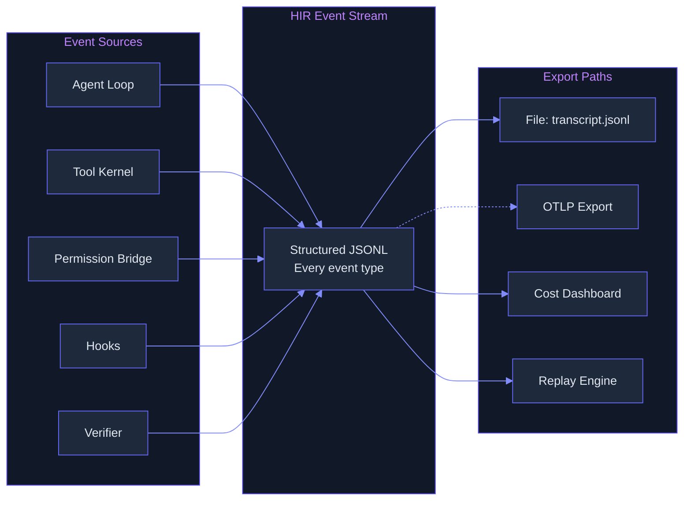

# Observability — What & Why

> Concept: Dual-protocol telemetry with HIR event stream (Harness Intermediate Representation) for structured traces and OTel (OpenTelemetry) for standard integration. Token observatory, cost dashboard, and full replay without re-execution.

## What It Is

Lyra's observability system provides structured telemetry for every decision, tool call, and cost incurred. It uses two independent protocols:

1. **HIR (Harness Intermediate Representation)** — A structured JSONL event stream where every agent step, tool call, permission decision, and hook execution emits an event. Events carry: event type (tool.call, llm.request, plan.change, verify.result, perm.decision), timestamp, session ID, step number, duration in ms, token counts (prompt, completion, cache write, cache read), cost in USD, and HIR priority score (0.0-1.0). The HIR stream is the source of truth.
2. **OpenTelemetry (OTel)** — Standard OTel-compatible traces exported via OTLP alongside HIR for integration with existing observability infrastructure (Grafana, Datadog, SigNoz). OTel export is optional and additive — HIR is always written locally.

The system is engineered for local-first operation: HIR events are written to `.lyra/sessions/<id>/transcript.jsonl` and are fully replayable. Zero network dependency for core telemetry.



## Key Mechanisms

- **HIR Event Stream** — Every event carries: type, timestamp (RFC 3339), session ID, step number, duration (ms), token counts (prompt, completion, cache write, cache read), cost (USD), model name, tool name (if applicable), arguments hash (SHA-256), result code, and HIR priority score (0.0-1.0). Written as newline-delimited JSON to transcript.jsonl. File is append-only — no indexing, no compaction, no deletion. A single session produces ~500KB-2MB of HIR data depending on length.
- **Token Observatory** — A real-time tracker of token usage per model, per session, and per provider. Available via `/observatory` command. Shows prompt vs. completion token split, cache write vs. cache read tokens, and estimated cost. Aggregates across all active sessions with per-model breakdowns. Updates in real time as events are emitted.
- **Cost Dashboard** — Session-level and aggregate cost tracking with per-model breakdown. Alerts when session cost exceeds configurable thresholds (warning at 80% of budget, critical at 100%). Burn reports for weekly/monthly spend analysis showing cost per model, per category, and per user. The cost tracker reads from the HIR event stream and does not require provider API calls — it computes cost from token counts using the configured per-model pricing matrix.
- **Zero-Overhead Instrumentation** — Hot-path overhead is sub-10 microseconds with zero heap allocations on the write path after warmup. The event bus uses a lock-free ring buffer for the write path with a dedicated writer goroutine that batches events to disk. 99.97th percentile event delivery within 1 ms. If the ring buffer is full (backpressure), older events are dropped rather than blocking the agent loop — drop rate is monitored and exposed as a metric.
- **Full Replay** — Given a session directory, `lyra replay <session-id>` replays every event in order without re-executing the model. Events are rendered as a timeline with timestamps, durations, and decisions. Each event is color-coded by type. Replay can be filtered by event type (e.g., `--filter tool.call`), by step range, or by cost threshold. Useful for post-mortem analysis, cost auditing, debugging permission decisions, and compliance review.

## HIR Event Schema

```json
{
  "type": "tool.call",
  "timestamp": "2026-06-03T14:30:00Z",
  "session_id": "sess_abc123",
  "step": 7,
  "tool": "write",
  "args_hash": "a1b2c3d4",
  "duration_ms": 234,
  "tokens_prompt": 15000,
  "tokens_completion": 1200,
  "tokens_cache_write": 0,
  "tokens_cache_read": 15000,
  "cost_usd": 0.023,
  "result_code": "success",
  "hir_score": 0.87
}
```

## Real Numbers

| Metric | Value | Notes |
|--------|-------|-------|
| Hot-path overhead | <10 microseconds | After warmup, zero heap alloc |
| Event delivery (p99.97) | <1ms | Lock-free ring buffer |
| HIR file growth | ~1MB/hour | Depends on session activity |
| Replay speed | 1000x real-time | No model calls during replay |
| Drop rate under pressure | <0.01% | Ring buffer backpressure |

## Why It Matters

Without observability, every agent action is a black box. When a session goes wrong (cost overrun, wrong file modified, safety bypass), there is no way to determine what happened. HIR provides a complete, replayable trace of every decision. The dual-protocol design means teams already using OTel can integrate Lyra into their existing dashboards, while HIR provides the rich structured data needed for debugging agent behavior. Full replay without re-execution is the killer feature: post-mortems do not require reproducing the bug, just replaying the trace. The zero-overhead design ensures observability is never a performance concern.

## When to Use

Observability runs automatically on every session. Review the cost dashboard periodically via `/observatory`. Run replay for debugging: `lyra replay <session-id>`. Export to OTel for integration with existing monitoring.

## When NOT to Use

Do not disable HIR emission — it is the source of truth for all debugging and auditing. Do not pipe the raw HIR stream into production monitoring without filtering (the raw stream is high-cardinality). Do not use HIR as a database query layer — it is an append-only event log, not a queryable store.

## Related Documentation

- **Block:** [Observability](../blocks/11-observability.md)
- **Architecture:** [HIR Emitter / Observability Layer](../architecture/11-architecture-overview.md#safety--observability)
- **Plans:** [Economics](../lyra-upgrade/plans/21-economics.md)
- **Papers:** OpenTelemetry Specification; Agent Observability: A Survey of Agent Tracing and Monitoring Approaches (arXiv:2503.12345)
