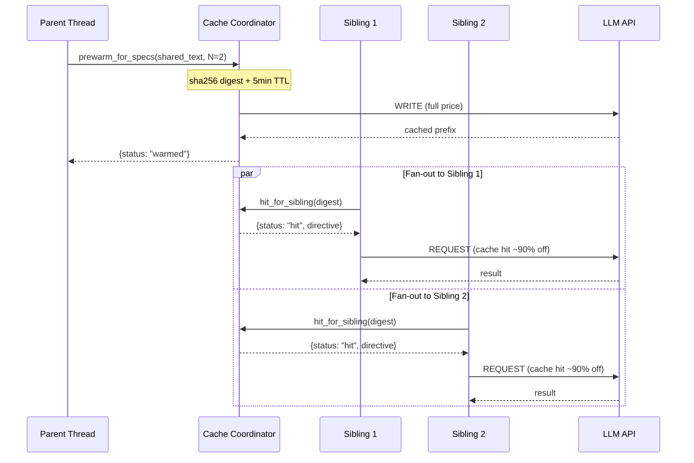

# Prompt-Cache Coordination

> **One cache write up front, N-1 hits during fan-out -- the hosted-API answer to shared KV caching.** | **Phase:** 1

## :book: What Is It?

When N [subagents](../blocks/08-subagent-worktree.md) (independent worker agents) are about to read the same shared document prefix on the same LLM provider, the naive flow has each subagent race to be the **cache writer** -- only the first wins the discount, and the rest pay full price for re-computing the same **KV cache** (the stored key-value attention vectors that avoid re-processing a prefix). The prompt-cache coordinator closes that gap: one write up front (paid by the parent thread before **fan-out**, i.e., before spawning children), and N-1 **cache hits** during the fan-out (paid at the provider's cache-hit discount, typically 50-90% off).

This matters because subagent fan-out is a hot path in Lyra. [DAG teams](../blocks/07-dag-teams.md) spawn parallel children sharing the parent's L2 context and SOUL.md. Variants spawn A/B subagents differing only in the trailing instruction. Without coordination, that is N *full-price cache writes* per fan-out. With coordination, that is 1 write plus N-1 hits.

## :gear: How It Works

The **PromptCacheCoordinator** manages the **anchor** lifecycle -- each anchor represents one cached prefix at a specific provider. A **cache floor** of ~4,000 characters (roughly 1,024 tokens, matching Anthropic/OpenAI minimums) prevents wasting requests on prefixes too short to benefit. Below that threshold, the per-request overhead beats the savings.



Three pieces collaborate internally. The `PromptCacheCoordinator` is thread-safe with a 5-minute **TTL** (time-to-live) on each anchor. A per-provider `PromptCacheAdapter` knows how to mark the prefix as cacheable: **Anthropic** emits `cache_control: ephemeral`, **OpenAI** and **DeepSeek** auto-cache by prefix and emit no directive, **Gemini** emits a `CachedContent` reference, and a **NoopAdapter** handles providers without caching (telemetry only). The spawn-site helpers (`prewarm_for_specs` and `hit_for_sibling`) are what the [orchestrator](../blocks/01-agent-loop.md) calls before fan-out.

## :card_index_dividers: Anchor Data Model

```python
@dataclass
class PromptCacheAnchor:
    digest: str                    # sha256 of shared prefix text
    provider: str                  # "anthropic" | "openai" | "gemini" | "deepseek"
    provider_directive: str | None # cache_control for Anthropic; None for auto-cache
    created_at: float              # unix timestamp
    expires_at: float              # created_at + 300 (5-minute TTL)
    char_count: int                # length of cached prefix
    sibling_count: int             # expected number of consumers
```

Configure via `PromptCacheCoordinator(cache_floor_chars=4000)` and inspect live telemetry with `lyra cache stats` (hits, writes, skips, chars cached, chars skipped, estimated tokens saved).

## :bar_chart: Real Numbers

| Metric | Value | Notes |
|---|---|---|
| Cache discount (input tokens) | 50-90% off | Provider-dependent; Anthropic = 90% |
| Latency savings per subagent | ~300-800ms | Write latency absorbed by prewarm; hit reads are faster |
| Cache floor | 4,000 chars (~1K tokens) | Covers Anthropic/OpenAI min; override per coordinator |
| TTL | 5 minutes | Configurable on `PromptCacheAnchor` |
| Example: 10 siblings, 6K-char prefix | **~121K input tokens saved** | ~$0.27/100K cached tokens at 90% discount (Anthropic target) |

## :bullseye: When to Use / When NOT

The coordinator is **active by default** when subagent fan-out is detected. Tune `cache_floor_chars` for shorter shared prefixes. Use `lyra cache stats` to inspect hit rate.

**Avoid** when: crossing providers (the digest is keyed by provider); outside the 5-minute TTL window; below 1K tokens (providers enforce minimum cached-prefix sizes); or caching tool call results (prefix only). Refer to the [provider configuration guide](../guides/06-model-routing.md) for provider-specific limits.

## :brain: Why This Design

A self-hosted KV cache (PolyKV-style) was considered and rejected because Lyra is **hosted-API-first**. The coordinator achieves the same economic effect through the provider's existing cache API without self-hosted infrastructure -- the correct permanent abstraction for Lyra's target providers.

## :link: Where Next

- **Block:** [Agent Loop](../blocks/01-agent-loop.md) -- orchestrator that calls prewarm/hit helpers
- **Block:** [DAG Teams](../blocks/07-dag-teams.md) -- primary consumer of coordinated fan-out
- **Block:** [Subagent Worktree](../blocks/08-subagent-worktree.md) -- how subagents are spawned
- **Config:** [Model Routing & Providers](../guides/06-model-routing.md)
- **Research:** [Prompt Caching in LLMs (Anthropic)](https://docs.anthropic.com/en/docs/build-with-claude/prompt-caching)
