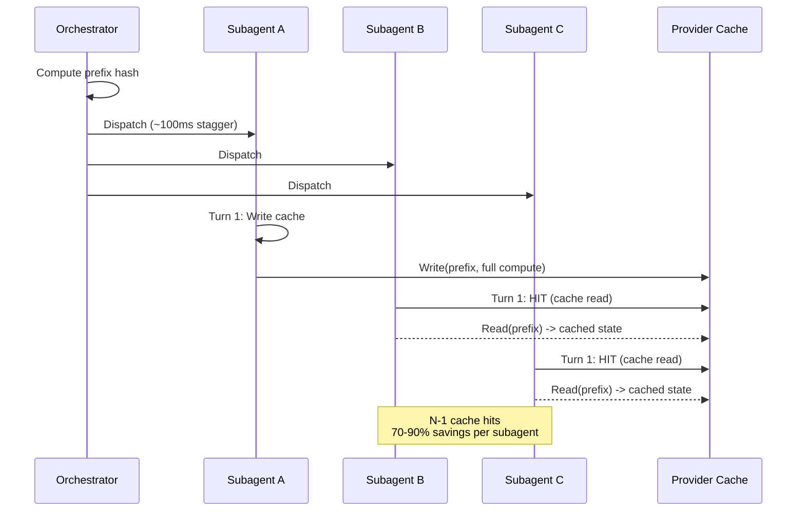

# Prompt Cache Coordination — What & Why

> Concept: A static prefix design with a single write, N-1 hit pattern for subagent fan-outs, 5-minute TTL alignment, and fleet-level coordination to maximize cache reuse across parallel agents.

## What It Is

Prompt caching allows the LLM provider to reuse previously computed attention states for a prefix of the prompt, avoiding recomputation on every turn. Lyra's prompt cache coordination system is designed to maximize cache hit rate across the entire fleet — not just within a single session, but across subagents and parallel workers.

The key insight: the static prefix (SOUL.md + system prompt + project context) is the same for all agents in a session. If one agent writes the cache, all other agents can read it — provided they use the exact same prefix within the cache TTL (typically 5 minutes with Anthropic, varies by provider).

The coordination system has three scopes:
- **Intra-session:** Same prefix across consecutive turns in the same session. This is the primary optimization target, accounting for >80% of cache savings.
- **Intra-fleet:** Same prefix across parallel subagents in the same wave. Each subagent after the first gets a cache hit on turn 1.
- **Cross-session (planned):** Same prefix across different sessions of the same project. Requires a shared prefix registry across sessions.

## Key Mechanisms

- **Static Prefix Design** — The Context Engine designs the first three layers (SOUL + project + session state) to change as infrequently as possible. Between turns in the same session, the prefix is identical. Layer 0 (SOUL) never changes. Layer 1 changes only on project switch. Layer 2 changes on step boundaries but remains stable across consecutive turns. This gives 70-90% cache hit rates sustained after turn 2. The HIR event stream includes cache hit statistics per event for monitoring.
- **5-Minute TTL Alignment** — Provider-side cache TTL is 5 minutes for Anthropic, up to 10 minutes for other providers. Lyra schedules cache writes so that a single prefix write occurs just before a subagent fan-out. The orchestrator computes when the fan-out will happen and ensures a prefix write occurs within the TTL window. If the TTL expires mid-wave, the orchestrator waits for the next subagent to write the cache rather than writing it redundantly from the orchestrator.
- **Fleet Coordination** — When dispatching N subagents, the orchestrator ensures all subagents receive the same prefix before their first model call. Subagent A writes the cache on its first turn; subagents B through N hit the cache. The orchestrator inserts a deliberate ~100ms stagger between dispatches to let the first subagent complete its cache write before the others make their first model call. For very large waves (N > 10), subagents are dispatched in batches of 5 to avoid overwhelming the provider cache write throughput.
- **Prefix Stability Tracking** — The system tracks which prefix hashes have been written to cache and which are stale. When a prefix changes (e.g., a memory update or a new plan artifact), the cache is considered invalidated for all sessions using that prefix. The tracker is in-memory and per-machine; there is no cross-machine cache invalidation in the current design.
- **Model Consistency** — The router prefers keeping the same model for consecutive turns because switching models invalidates the prompt cache (different model, different cache key). If a model switch is necessary, the router factors the cost of cache invalidation (~1 full turn of recomputation, ~$0.03-0.15) into its routing decision. The router may choose to complete a task on the current model even if a better model exists, because the cache savings outweigh the model capability difference for that particular task.

## Real Numbers

| Metric | Estimate | Notes |
|--------|----------|-------|
| Cache hit rate (intra-session, turn 3+) | 70-90% | Sustained after initial cache write |
| Cache hit rate (subagent fan-out) | ~N-1 of N | One write, rest read |
| Stagger overhead | ~100ms per subagent | Between dispatches |
| Cache invalidation cost | ~1 full turn | ~$0.03-0.15 depending on model |
| Intra-session savings vs no cache | ~40-50% of total cost | Depends on session length |

## Why It Matters

Prompt caching is the single largest cost optimization available to agent systems. A 70-90% cache hit rate means the provider recomputes only 10-30% of the attention on each turn. For a session of 50 turns, this is the difference between $0.50 and $0.05 per session. Without coordination, each agent independently writes its own cache, wasting writes on redundant prefixes. The fleet coordination pattern (one write, N-1 hits) amplifies savings as the fleet scales: for a wave of 8 subagents, the orchestrator saves 7 full cache writes — $0.21 saved per wave at Sonnet pricing. Over a day of operation this compounds significantly.

## When to Use

Cache coordination runs automatically. Tune the stagger interval for your subagent dispatch pattern if you observe cache misses on the second subagent. The prefix stability tracker is automatic.

## When NOT to Use

Do not disable prompt caching — it is the highest-ROI optimization. Do not override the prefix stability tracker unless you understand the cache invalidation implications. Do not set stagger intervals longer than 500ms — the cache write completes in <50ms and the stagger exists only to ensure ordering.

## Related Documentation

- **Block:** [Context Engine](../blocks/02-context-engine.md)
- **Architecture:** [Data Flow / Context Assembly](../architecture/11-architecture-overview.md#data-flow)
- **Plans:** [MCP](../lyra-upgrade/plans/08-mcp.md)
- **Papers:** Prompt Cache: Modular Attention Reuse for Low-Latency Inference (2024, arXiv:2311.04934); Anthropic Prompt Caching Technical Report; Cache-Aware Routing for Multi-Modal LLM Systems
