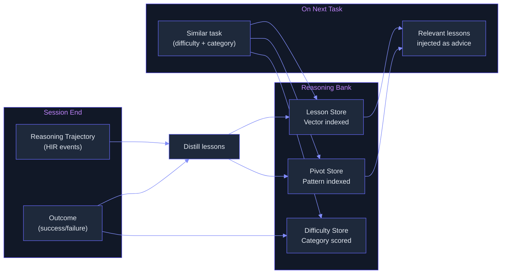

# Reasoning Bank — What & Why

> Concept: A cross-session repository of reasoning lessons distilled from both successes and failures, with difficulty estimation per task, allowing the system to learn from past mistakes without repeating them.

## What It Is

The Reasoning Bank is Lyra's meta-cognitive learning system. After every session, the system distills the session's reasoning trajectory into structured lessons — what worked, what failed, and why. These lessons are stored in a lightweight vector index and retrieved on future tasks that match the same difficulty profile.

Unlike skills (which store procedures: "how to do X"), the Reasoning Bank stores _reasoning patterns_: decision points ("choose between two API designs"), alternative paths considered ("considered REST, settled on GraphQL"), pivot triggers ("tests failed because of schema mismatch"), and failure mode signatures ("this error pattern indicates a race condition, not a logic bug"). The bank is consulted during the Plan phase and during Pivot/Refine recovery in the Agent Loop.

The bank comprises three stores:
- **Lesson Store** — Success and failure narratives. "When doing X, approach Y works better because Z."
- **Pivot Store** — Pivot triggers and their resolutions. "Error pattern E means approach A is wrong, switch to approach B."
- **Difficulty Store** — Estimated difficulty per task category, calibrated via Verifier outcomes.



## Key Mechanisms

- **Success/Failure Distillation** — At session end, the consolidation pipeline extracts reasoning lessons from the HIR event stream and Verifier outcomes. Each lesson is scored by three criteria: **correctness** (was the reasoning path sound, regardless of outcome?), **generality** (does the lesson apply beyond this specific case? 0.0-1.0), and **novelty** (is this already in the bank? computed by embedding similarity to existing lessons). Only lessons scoring >0.6 on all three are admitted.
- **Difficulty Estimation** — Every task is scored 1-10 by the BEST-Route complexity estimator (see [Model Routing](10-two-tier-routing.md)). This score is stored in the Difficulty Store along with actual cost, actual turns, and Verifier outcome. Lessons are tagged with the difficulty score of the originating task. A lesson from a difficulty-8 task is weighted more heavily than one from a difficulty-2 task during retrieval.
- **Cross-Session Learning** — The Lesson Store is indexed by (task_category, difficulty_range, failure_mode). When a new task arrives, the system queries for lessons from similar past tasks within the same category and difficulty range (plus or minus 2 points). Up to 3 relevant lessons are injected into the context as "advice from past experience" in the Plan phase.
- **Test-Time Scaling** — When the agent encounters a failure (tool error returned by the permission bridge, Verifier failure, user rejection, step failure), the Pivot/Refine loop immediately queries the Pivot Store for similar past failures and their resolutions. This provides instant "what worked last time" guidance without retraining or human intervention.
- **Pivot/Refine Integration** — The Pivot/Refine loop (failure analysis, alternative generation, retry) consults the Reasoning Bank before generating alternatives. If the bank contains a lesson matching the failure signature, the Pivot/Refine loop skips alternatives that were tried and failed before. This prevents repeating known bad strategies.

## Lesson Store Schema

```json
{
  "id": "uuid",
  "task_category": "refactoring",
  "difficulty": 6,
  "lesson": "When renaming a function used across multiple modules, first identify all call sites with grep, then rename in a single commit rather than one module at a time. Renaming incrementally causes intermediate broken states that confuse tests.",
  "correctness": 0.9,
  "generality": 0.7,
  "novelty": 0.8,
  "source_session": "session_uuid",
  "source_step": 12,
  "created_at": "timestamp"
}
```

## Why It Matters

Without a Reasoning Bank, every session is isolated. An agent that learns "don't modify requirements.txt without checking the dependency tree" in session A will repeat the same mistake in session B, C, and D. The bank converts one-time lessons into reusable wisdom. The difficulty estimation ensures that lessons from hard problems are weighted appropriately. The cross-session index means that even infrequent failure modes are caught if they match a stored pattern from a different task. The Pivot/Refine integration is the key real-time benefit: when the agent hits a failure, it can immediately query "what worked last time for this exact error?" rather than retrying the same failed approach.

## When to Use

The Reasoning Bank runs automatically at session end and is consulted during Plan and Pivot/Refine phases. Review the bank periodically via `/bank stats` to see which lessons are most frequently retrieved.

## When NOT to Use

Do not manually edit the lesson store — lessons are structured data with embedding vectors. Do not disable the bank for sessions that involve exploratory work; those sessions produce the most novel lessons. Do not rely on the bank as the sole source of truth for critical decisions — it is advisory, not authoritative.

## Related Documentation

- **Block:** [Verifier](../blocks/10-verifier.md) (failure signal input for distillation)
- **Architecture:** [Self-Evolving Pipeline](../architecture/11-architecture-overview.md#self-evolving-harness-pipeline)
- **Plans:** [RL Optimizer](../lyra-upgrade/plans/27-rl-optimizer.md), [Dreaming](../lyra-upgrade/plans/24-dreaming.md)
- **Papers:** ReasoningBank (Google 2025, arXiv:2509.25140); Test-Time Compute Scaling (Meta 2026, arXiv:2604.16529); Reflexion (NeurIPS 2023, arXiv:2303.11366)
