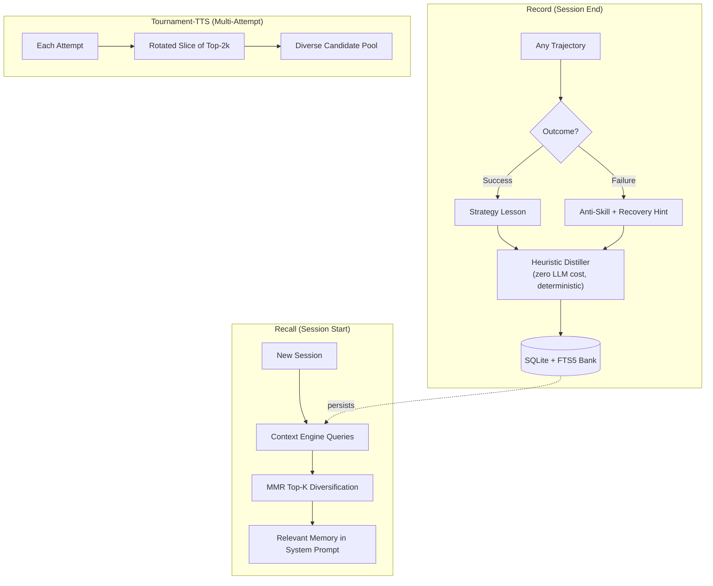

# ReasoningBank

> **Cross-session lessons from both success and failure -- banked, searchable, and injected into future sessions.** | **Phase:** 2

##  Lifecycle



##  Lesson Record

Every lesson is idempotent: the ID is a content hash (SHA-256) of the trajectory, so the same (distiller, trajectory) pair always produces the same ID. This makes snapshot tests stable and replays deterministic.

```python
@dataclass
class Lesson:
    id: str                     # Stable content hash (SHA-256)
    polarity: str               # "strategy" (success) | "anti_skill" (failure)
    title: str                  # One-line summary, token-dense format
    body: str                   # ~280 characters -- the meat
    task_signatures: list[str]  # What triggers recall of this lesson
    source_trajectory_ids: list[str]  # Audit trail to source traces
```

The **heuristic distiller** runs at session end with zero LLM cost. It always emits at least one lesson per failure -- even an empty failure produces an anti-skill: *"agent could not act on task -- consider different decomposition."* An optional **LLM distiller** runs off the hot path on a batch schedule, silently falling back to the heuristic on transient provider errors. Manual recall: `lyra memory recall "<query>" --k 5 --diversify`.

##  Estimated Performance

| Metric | Value | Notes |
|--------|-------|-------|
| Record latency | <2 ms per lesson | Heuristic distiller, no LLM |
| Recall latency | ~15 ms per query | FTS5 BM25 + MMR re-rank |
| Lesson diversity (MMR) | +35% unique | Target vs. naive top-k |
| Tournament-TTS diversity | ~2.1x more diverse candidates | Target vs. no slicing |
| LLM distiller cost | ~0.02 cents per lesson | Batch schedule, off hot path |

##  Key Concepts

**Polarity.** Success trajectories become *strategy lessons* ("how to reproduce this win"). Failure trajectories become *anti-skills* ("don't do this") paired with a *recovery hint* ("what could fix it"). Both are first-class citizens -- failures are not discarded, they are banked.

**Recall.** At session start, the context engine queries the bank by task signature and retrieves top-k via **maximal marginal relevance (MMR)** to avoid near-duplicate lessons. The results are injected as a "Relevant Memory" block in the system prompt alongside procedural memory (skills). Optional **Tournament-TTS** integration rotates different slices of the top-2k recalled lessons to each tournament attempt, diversifying the candidate pool and breaking structural coupling.

**Design origin.** Follows the *ReasoningBank* paper from Google Research (2025). Lyra adds a deterministic heuristic distiller (zero LLM cost), SQLite + FTS5 persistence with BM25 ranking (or `LIKE` substring fallback), and MMR diversification.

##  Caveats

- Heuristic lessons are less semantically rich than LLM-generated ones; use the batch LLM distiller for depth.
- Without periodic pruning, noise accumulates from low-quality trajectories.
- Older SQLite builds (no FTS5) fall back to slower `LIKE` scans.
- The bank holds *heuristics and gotchas*, not procedures -- pair with skills for full learn-by-doing.

##  References

- **Block:** [Skill Engine & Extractor](../blocks/09-skill-engine-and-extractor.md) -- procedural memory for how-to
- **Block:** [Context Engine](../blocks/02-context-engine.md) -- how memory blocks assemble into the system prompt
- **Plan:** [Memory Architecture](../lyra-upgrade/memory-architecture.md) -- full three-tier memory design
- **Paper:** *ReasoningBank: Heuristic Lessons from Agent Failures* (Google Research, 2025)
