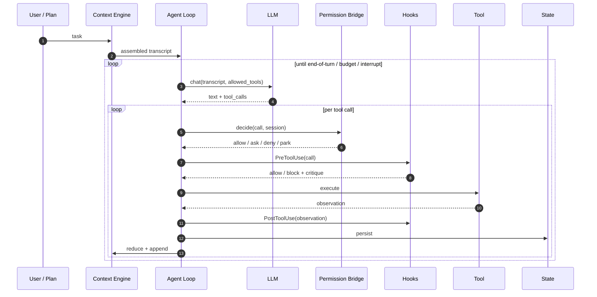

# The agent loop <span class="lyra-badge intermediate">intermediate</span>

The agent loop is Lyra's **kernel**. It's deliberately small — under
200 lines in `lyra_core.loop` — so its semantics fit in a reviewer's
head. If you understand this page, you understand 80% of Lyra.

Source: [`lyra_core/loop/`](https://github.com/lyra-contributors/lyra/tree/main/packages/lyra-core/src/lyra_core/loop) ·
canonical spec: [`docs/blocks/01-agent-loop.md`](../blocks/01-agent-loop.md).

## What it does

1. **Assemble** the transcript from `SOUL.md` + plan + recent context.
2. **Call** the model with the tools allowed by the current permission mode.
3. For each tool call: **decide** (PermissionBridge) → **pre-hook** →
   **execute** → **post-hook** → **reduce** the observation → **append**.
4. **Detect termination**: end-of-turn, budget exhausted, safety flag,
   user interrupt, or stalemate.
5. **Persist** session state on every step (STATE.md, recent.jsonl, OTel
   spans, JSONL trace).

Everything else — planning, verification, memory writes, skill
extraction — runs **outside** the loop, at turn or session boundaries.

## One picture



## The pseudo-code

This is a faithful sketch of `lyra_core.loop.AgentLoop.run`:

```python title="agent_loop.py"
def agent_loop(session: Session, task: str, *, plan: Plan | None = None) -> LoopResult:
    transcript = context_engine.assemble(session, task, plan)
    repeat_guard = RepeatDetector(window=16, threshold=3)

    with tracer.span("agent.run", session=session.id) as run_span:
        for step in range(session.budgets.max_steps):

            # ── Preflight (compaction, budget, interrupt) ────────────
            if transcript.tokens > session.budgets.max_tokens * 0.85:
                transcript = context_engine.compact(transcript, session)  # (1)
            if session.cost_usd >= session.budgets.max_cost_usd:
                return LoopResult.cost_exhausted(session, transcript, step)
            if session.interrupted:
                return LoopResult.user_interrupt(session, transcript, step)

            # ── Think (model call) ───────────────────────────────────
            resp = model.chat(transcript, tools=session.allowed_tools)
            transcript.append_assistant(resp)

            # ── Act (tool calls) ─────────────────────────────────────
            for call in resp.tool_calls:
                decision = permission_bridge.decide(call, session)        # (2)
                if decision.is_block:
                    transcript.append_tool_block(call, decision.reason)
                    continue

                pre = hooks.dispatch(HookEvent.PRE_TOOL_USE, call, session) # (3)
                if pre.block:
                    transcript.append_tool_block(call, pre.reason)
                    continue

                obs = tool_pool.invoke(call)                              # (4)

                post = hooks.dispatch(HookEvent.POST_TOOL_USE, obs, session)
                obs = obs.with_critique(post.annotation)

                transcript.append_tool_observation(call, obs)             # (5)
                state_store.persist(session, transcript)

            # ── Termination check ────────────────────────────────────
            if resp.is_end_of_turn:
                hooks.dispatch(HookEvent.STOP, session)                   # (6)
                return LoopResult.complete(session, transcript, step)

            if repeat_guard.is_stalemate(transcript):
                return LoopResult.stalemate(session, transcript, step)

        return LoopResult.steps_exhausted(session, transcript, step)
```

1. **Compaction** lives in the [Context Engine](context-engine.md) and
   replaces older turns with a summary while preserving SOUL, plan,
   and the keep-window.
2. **Permission Bridge** is the [runtime authorization
   primitive](permission-bridge.md). It returns one of `allow`, `ask`,
   `deny`, or `park`. The LLM never holds the keys.
3. **Pre-hooks** are deterministic Python that can block before
   execution — secret scanner, TDD gate, destructive-pattern check.
4. The **tool pool** is just a registered catalogue; built-ins
   (`read`, `write`, `bash`, `grep`, …) and MCP-provided tools are
   indistinguishable to the loop.
5. The observation is **reduced** to fit the transcript. Big payloads
   (`Read` of a 500-line file) are stored as artifacts and the
   observation carries the reference, not the bytes.
6. The **`STOP` hook** is your last chance — that's where the TDD gate
   blocks session completion if the test gate is on and tests are red.

## Termination conditions

There are five ways a turn ends. All of them are deterministic:

| Reason | Trigger |
|---|---|
| `complete` | Model emits `is_end_of_turn=True` and `STOP` hook didn't block |
| `cost_exhausted` | `session.cost_usd >= max_cost_usd` |
| `steps_exhausted` | `step >= max_steps` |
| `user_interrupt` | `Ctrl-C` set `session.interrupted` |
| `stalemate` | RepeatDetector saw the same tool-call signature 3 times in a 16-call window |

`stalemate` is the most surprising one — it exists because LLMs
sometimes fall into a "read-the-same-file-forever" loop. The detector
hashes `(tool_name, args_normalized)` and bails when it sees the same
signature too often.

## What runs *outside* the loop

These deliberately don't live in the kernel — they run at boundaries
so the loop stays small:

| Concern | When |
|---|---|
| Planning | Before first turn, in [`plan_mode`](../start/four-modes.md#plan_mode-design-before-code) |
| Verification (test runs) | Driven by the TDD gate hook on `POST_TOOL_USE` and `STOP` |
| Memory writes (observations, summaries) | On compaction and on `SESSION_END` |
| Skill extraction | After `SESSION_END`, in a background process |
| Trace export (HIR / OTel) | Streamed during the loop, finalized on `SESSION_END` |

This is the **load-bearing design choice** of Lyra: keep the kernel
small, push everything else to hooks and boundaries.

## Upcoming: autonomy escalation ladder

The v3.0 plan adds an **autonomy escalation ladder** that lets the loop operate in progressively less supervised modes (see [lyra-upgrade/MASTER-PLAN.md](../lyra-upgrade/MASTER-PLAN.md), Phase 3):

| Level | Name | Agent View | Model | Human role |
|---|---|---|---|---|
| L0 | Hand-hold | on | smart | Approves every tool call |
| L1 | Supervised | on | smart | Approves writes, batch reviews |
| L2 | Steer-by-exception | off except peek | smart/fast | Only sees alerts |
| L3 | Unattended | daemon-only | fast on cheap model | Reviews row summaries |
| L4 | Autonomous | daemon-only + report | cheap model | Periodic briefing only |

Each level shifts the loop's permission mode and sampling rate. At L3, the loop runs in a **background session** managed by a **supervisor daemon** — no user at the terminal, tool calls limited to a restricted subset, cost capped per session.

## Upcoming: IdleSpec speculative planning

When the loop is waiting for a tool result (a long `bash` compile, a `web_fetch`), it currently idles. **IdleSpec** (Phase 3) uses that wait time to speculatively plan the next 2-3 turns in an isolated context:

```python
async def agent_loop_with_idlespec(session, task):
    transcript = context_engine.assemble(session, task)
    for step in range(session.budgets.max_steps):
        # Normal preflight
        resp = await model.chat(transcript, tools=session.allowed_tools)

        for call in resp.tool_calls:
            # Start speculative plan WHILE tool executes
            idle_future = asyncio.create_task(
                idlespec.speculate(transcript, call, horizon=3)
            )
            obs = await tool_pool.invoke(call)
            speculation = await idle_future

            if speculation.confidence > 0.7:
                transcript.cache_next_turn_hint(speculation.suggested_action)
            transcript.append_tool_observation(call, obs)
        ...
```

The speculation is **thrown away** if the actual tool result mismatches the assumption — zero risk, pure latency win.

## Upcoming: checkpoint / resume with selective restore

Every N steps (configurable, default 10), the loop snapshots a **checkpoint** — the full transcript hash, tool-call state, permission overrides, and budget remaining:

- Checkpoints are stored in `.lyra/checkpoints/<session-id>/<step>.checkpoint`
- On resume, the loop loads the latest checkpoint and skips re-execution of confirmed tool results
- Selective restore: if a later tool call failed, the loop can roll back to the checkpoint before that call, keeping all earlier tool results intact

## Why the agent loop

The agent loop exists because an agent without a structured loop cannot be made predictable, observable, or safe. By centralising assembly, tool execution, permission checking, and persistence into a single small kernel, Lyra guarantees that every model interaction follows the same safety path (permission bridge, pre-hooks, post-hooks) and that every decision is recorded in the same trace format. The loop is the single point where determinism meets the model's non-deterministic output.

## When to use the agent loop

- Every Lyra session, by definition, runs through the agent loop. There is no mode of operation that bypasses it.
- Use the loop as is for standard interactive coding sessions. Extend it via hooks for custom safety policies (see [Tools and hooks](tools-and-hooks.md)).
- For multi-turn tasks that require planning, enter through plan mode, which feeds its output into the loop.

## When NOT to use the agent loop

- Do not modify the loop's internal assembly or termination logic directly. Customisation belongs in hooks, not in loop rewrites.
- Do not run the loop without the permission bridge enabled — that is Lyra's load-bearing safety primitive.
- The loop is not designed for real-time or low-latency agent responses. Each turn requires at least one model round-trip.

## Upcoming: unattended operation mode

In Phase 3, the agent loop supports a **continuous-operation loop** for fleet sessions:

- No user prompt — the loop cycles through a task queue
- Turn summaries are generated by the cheap model (fast slot) and logged as row summaries
- The supervisor daemon emits a `heartbeat` span every M turns
- On cost-exhaustion or stalemate, the session is paused (not terminated) and queued for review
- Human intervention via `peek / reply / attach` from the fleet view

See [lyra-upgrade/plans/14-autonomy.md](../lyra-upgrade/plans/14-autonomy.md) for the full unattended operation spec.

## Where to look in the source

| File | What lives there |
|---|---|
| `lyra_core/loop/agent_loop.py` | `AgentLoop.run` — the function above |
| `lyra_core/loop/repeat_detector.py` | Stalemate detection |
| `lyra_core/loop/result.py` | `LoopResult` dataclass and termination classifiers |
| `lyra_core/state/store.py` | Per-step persistence to disk |
| `lyra_core/loop/idlespec.py` | IdleSpec speculative planning *(Phase 3)* |
| `lyra_core/supervisor/` | Supervisor daemon for unattended sessions *(Phase 3)* |

## Next steps

1. Read [Tools and hooks](tools-and-hooks.md) to understand the two extension points that sit inside the loop.
2. Read [Permission bridge](permission-bridge.md) to understand how every tool call is authorised.
3. Explore the loop source in `lyra_core/loop/agent_loop.py` and the repeat detector in `lyra_core/loop/repeat_detector.py`.
4. For implementation details, see the canonical block spec at [`docs/blocks/01-agent-loop.md`](../blocks/01-agent-loop.md).
5. For the build plan behind unattended operation, see [lyra-upgrade/plans/14-autonomy.md](../lyra-upgrade/plans/14-autonomy.md).

[← Concepts overview](index.md){ .md-button }
[Continue to Tools and hooks →](tools-and-hooks.md){ .md-button .md-button--primary }
