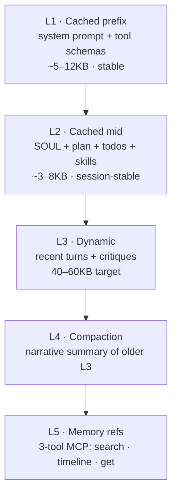

# Context engine <span class="lyra-badge intermediate">intermediate</span>

## What is the context engine

The context engine is responsible for **what the model sees** each
turn. It implements a five-layer pipeline that maximises prompt cache
hits, never compacts the persona, and falls back to memory references
when the working set spills over.

Source: [`lyra_core/context/`](https://github.com/lyra-contributors/lyra/tree/main/packages/lyra-core/src/lyra_core/context) ·
canonical spec: [`docs/blocks/06-context-engine.md`](../blocks/06-context-engine.md).

## The five layers



| Layer | Volatility | Cache breakpoint | Contents |
|---|---|---|---|
| **L1** prefix | Across sessions | `after L1` | System prompt, tool schemas, global constants |
| **L2** mid | Per session | `after L2` | `SOUL.md`, plan summary, todos, skill descriptions, MCP descriptions |
| **L3** dynamic | Per turn | none | Recent turns, current critique, current user message |
| **L4** compaction | Triggered | none | Narrative summary that *replaces* old L3 turns |
| **L5** memory refs | On demand | none | Reference handles into [three-tier memory](memory-tiers.md) |

The cache breakpoints are explicit for Anthropic (90%+ hit rate
typical) and implicit for OpenAI / Gemini (best-effort).

## Assembly

```python title="context/assemble.py"
def assemble(session: Session, task: str, plan: Plan | None) -> Transcript:
    msgs = []
    msgs.append(Message.system(session.system_prompt()))                # L1
    msgs.append(Message.system(soul.read(session)))                      # L2: SOUL
    if plan:
        msgs.append(Message.system(plan.summary_for_context()))          # L2: plan
    msgs.append(Message.system(todo.render(session)))                    # L2: todo
    msgs.append(Message.system(skills.scope_descriptions(session)))      # L2: skills
    msgs.append(Message.system(mcp.registered_descriptions(session)))    # L2: mcp
    msgs.append(Message.user(task))                                       # L3 seed
    return Transcript(msgs, cache_breakpoints=[after=L1_idx, after=L2_idx])
```

Order is **fixed** so prompt caching works across turns. If you reorder
even one L2 line, the cache misses and your bill goes up.

## SOUL.md is never compacted

`SOUL.md` is the agent's persona — values, tone, hard constraints
about *who it is with this user*. SemaClaw's research showed persona
drift is the dominant long-session failure mode, so:

- SOUL lives in L2 (cached, sessionwide).
- Compaction never touches it.
- Hard size cap (~2 KB default) keeps it from creeping.

If you want to see what's in SOUL right now, run `/soul show`. To edit
it, `/soul edit`.

## Compaction

```mermaid
%%{init: {'theme': 'dark', 'themeVariables': { 'primaryColor': '#8b5cf6', 'primaryTextColor': '#e2e8f0', 'primaryBorderColor': '#a78bfa', 'lineColor': '#94a3b8', 'secondaryColor': '#1e293b', 'tertiaryColor': '#0d1117', 'background': '#0d1117', 'mainBkg': '#1e293b', 'nodeBorder': '#a78bfa', 'clusterBkg': '#1e293b', 'clusterBorder': '#8b5cf6', 'titleColor': '#c084fc', 'edgeLabelBackground': '#1e293b' }}%%
sequenceDiagram
    participant Loop
    participant CE as Context Engine
    participant LLM
    participant Store as Artifact Store

    Loop->>CE: tokens > 0.85 × max_tokens?
    CE->>CE: identify keep-window (last K turns)
    CE->>CE: identify compact-window (older turns)
    CE->>LLM: summarize(compact_window) using cheap model
    LLM-->>CE: narrative summary
    CE->>Store: archive raw bodies (hash-addressed)
    CE->>Loop: new transcript = L1 + L2 + summary + keep-window
```

The summary preserves:

- File:line anchors that were referenced
- Failing test names
- Unresolved questions
- Tool-call counts

It discards:

- Raw output bodies (now in the artifact store, retrievable by `view <hash>`)
- Repetitive confirmations

If compaction itself fails, Lyra drops the middle third of L3 and
appends a `[compaction-truncated]` annotation. The transcript stays
runnable.

## Layer 5: progressive disclosure

When the model suspects an answer lives in **memory** but isn't sure,
it doesn't pre-load — it uses three small tools:

```
MemorySearch(query, limit=5)   → list of {id, title, snippet, score}
MemoryTimeline(tag|date_range) → list of {id, ts, kind, title}
MemoryGet(id)                   → full content (cited)
```

This is the [claude-mem](https://github.com/withseismic/claude-mem)
pattern: cheap recall, expensive load only when warranted. The full
contract is on the [memory tiers page](memory-tiers.md).

## Observation reduction

Big tool outputs (a `read` of a 500-line file, a `bash` log of 10 KB)
would blow the transcript instantly. Reduction shrinks them:

| Tool | Reduced form |
|---|---|
| `read` (large file) | First 50 + last 20 lines + `[truncated, view <hash> for full]` |
| `bash` (long log) | Last 80 lines + exit code + duration; full log artifact-stored |
| `web_fetch` | Title + first 500 words + `[view <hash> for full]` |
| `grep` (many matches) | First 20 hits + total count + `[view <hash>]` |

The full payload is always available as an artifact; the model can
pull it back with `view <hash>` if the reduction lost something it
needs.

## Upcoming: Anthropic 3-strategy framework (Phase 2)

The v3.0 upgrade adopts Anthropic's **3-strategy context engineering
cookbook** — three complementary strategies that replace the current
ad-hoc compaction:

| Strategy | When | What it does |
|---|---|---|
| **Compaction** | Approaching token limit | Summarise older turns into a dense narrative (existing, enhanced) |
| **Structured note-taking** | On every turn | Extract decisions, open questions, and file references into a
  structured "session notes" section maintained in L2 |
| **Sub-agent architecture** | When context is irreducibly large | Isolate a sub-task to a subagent; its context doesn't burden
  the parent |

The cookbook's core insight: **less is more**. Anthropic found that
reducing a 400-line prompt to 15 lines and 12 tools to 3 improved pass
rate from 83% to 92%. Lyra applies this principle to the context engine:
the keeper-window shrinks, note-taking replaces raw transcript preservation,
and subagent isolation becomes a first-class strategy.

**"Less is more" guideline for the context engine:**
- Keep the agent's working context at 40-60 KB target (L3), not 100+ KB
- Reduce tool descriptions to essentials (3-5 per phase, not the full registry)
- Prefer 3 specific instructions over 12 general ones
- The session notes section (L2-resident) tracks: decisions made, open
  questions, files touched, and next steps — replaces raw turn dump

## Upcoming: lean-ctx Token Dense Dialect (Phase 2)

The lean-ctx pattern (89-99% token reduction on tool output) operates
at the observation reduction layer:

```python
# lean-ctx / Token Dense Dialect: compress CLI output BEFORE it reaches the LLM
@tool(name="bash", writes=True, risk="medium")
def bash_with_lean_ctx(call: ToolCall) -> ToolResult:
    raw = run_shell(call.args["command"])
    # lean-ctx pipeline: filter → group → truncate → dedup per command type
    compressed = lean_ctx.compress(
        raw,
        command_type=classify_command(call.args["command"]),
        dialect="token-dense",       # abbreviated field names, no filler
        max_tokens=call.args.get("max_output_tokens", 500),
    )
    return ToolResult.text(compressed)
```

The **Token Dense Dialect** uses abbreviated keys, removes boilerplate,
and deduplicates repeated error messages. This achieves 89-99% token
reduction on tool output alone without losing signal — provider-agnostic
and zero model cost. See [lyra-upgrade/SYNTHESIS.md](../lyra-upgrade/SYNTHESIS.md)
Theme 2 for the full evaluation.

## Upcoming: COMPASS hierarchical context (Phase 3)

COMPASS (2510.08790) introduces a **three-role hierarchy** for context
management that Lyra will adopt in Phase 3:

| Role | Responsibility | Context scope |
|---|---|---|
| **Main Agent** | Tactical execution | Current step only |
| **Meta-Thinker** | Strategic interventions every K steps | Concise progress briefs |
| **Context Manager** | Maintains the big picture | Compressed narrative only |

The Meta-Thinker runs on the smart slot every 5-10 steps, generating
a concise progress brief that the Context Manager appends to the
session notes. The Main Agent sees only its immediate context (L3)
plus the brief (L2). This prevents the agent from "losing the plot"
in long sessions — the strategic view is maintained by a separate role
that doesn't bear the execution burden.

COMPASS is gated behind the Phase 2 compaction upgrade — the
3-strategy framework must be stable before adding the Meta-Thinker role.

See [lyra-upgrade/plans/03-context-compaction.md](../lyra-upgrade/plans/03-context-compaction.md)
for the full implementation plan.

## Cache hit metrics

`/cost` shows you the cache hit ratio. A healthy session sits around
**80%+ L1+L2 hit rate**. If you see it drop:

- You probably edited SOUL or plan mid-session (expected; cache rebuilds)
- Or you're switching models (caches are model-specific)
- Or you're in a session that's been running so long that compaction
  fires every turn — consider `/save` and starting fresh

## Why the context engine

The context engine is the bridge between Lyra's memory and the model's context window. Without it, every turn would either overflow the window (too much context) or forget critical information (too little). By layering cached stable content (L1, L2), dynamic turns (L3), compressed summaries (L4), and on-demand memory lookups (L5), the engine keeps the model's working context at a manageable 40-60KB while retaining access to the full session history.

## When to use the context engine

- The context engine runs automatically on every turn of the agent loop. No manual action is required.
- Tune caching behaviour by configuring provider-specific cache breakpoints in `~/.lyra/config.toml`.
- Monitor cache hit rate with `/cost`; if it drops below 80%, investigate whether SOUL or plan was edited mid-session.

## When NOT to use the context engine

- Do not reorder the five-layer assembly order. Prompt cache hit rates depend on the fixed order — even a single reordered line costs money.
- Do not attempt to bypass compaction by manually constructing transcripts. The engine's compaction is designed to preserve critical information while discarding noise.
- SOUL.md must never appear outside L2. Putting it in L1 or L3 breaks the never-compact guarantee.

## Next steps

1. Read [Memory tiers](memory-tiers.md) to understand the memory stores the context engine references.
2. Read [Prompt-cache coordination](prompt-cache-coordination.md) to see how cache hits are coordinated across subagents.
3. Explore the canonical block spec at [`docs/blocks/06-context-engine.md`](../blocks/06-context-engine.md).
4. For the context compaction upgrade plan, see [lyra-upgrade/plans/03-context-compaction.md](../lyra-upgrade/plans/03-context-compaction.md).

## Where to look in the source

| File | What lives there |
|---|---|
| `lyra_core/context/assemble.py` | `assemble` — the function above |
| `lyra_core/context/compact.py` | Compaction algorithm and keep-window logic |
| `lyra_core/context/reduce.py` | Per-tool observation reducers |
| `lyra_core/context/cache.py` | Provider-specific cache breakpoint emitters |
| `lyra_core/context/strategies.py` | 3-strategy framework dispatcher *(Phase 2)* |
| `lyra_core/context/lean_ctx.py` | Token Dense Dialect output compressor *(Phase 2)* |
| `lyra_core/context/meta_thinker.py` | COMPASS Meta-Thinker role *(Phase 3)* |

[← Permission bridge](permission-bridge.md){ .md-button }
[Continue to Three-tier memory →](memory-tiers.md){ .md-button .md-button--primary }
