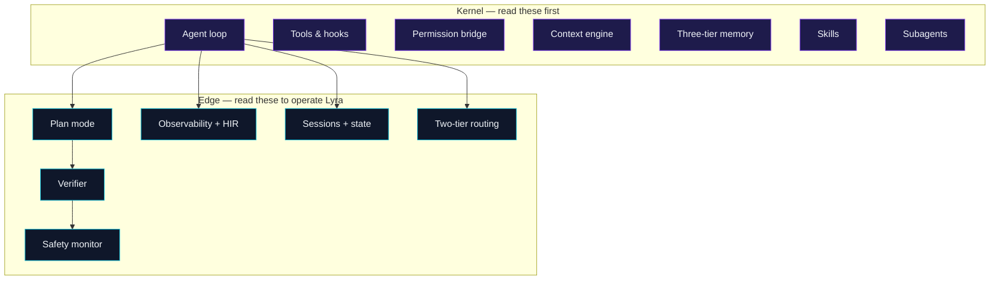

# Core Concepts

> **Status note:** These concept docs describe the TARGET architecture (what Lyra is being built to become). For what is actually implemented today, see [lyra-upgrade/BASELINE.md](../lyra-upgrade/BASELINE.md). For implementation plans, see [lyra-upgrade/plans/](../lyra-upgrade/plans/).

If [Get Started](../start/index.md) showed you **how to drive** Lyra, this
section explains **what is actually happening** inside it. Read this if
you want to extend the kernel, write a serious skill, or just read the
source confidently.

## Learning Tracks

Choose your starting point based on your experience level. Each track builds on the
previous one.

### Beginner — Core mental models

*Start here if you are new to Lyra. These explain what Lyra fundamentally is and how it thinks.*

| # | Concept | What you will learn |
|---|---------|---------------------|
| 1 | [The agent loop](agent-loop.md) | The core loop that drives every Lyra session — assemble, think, act, persist. |
| 2 | [Tools and hooks](tools-and-hooks.md) | How the model interacts with the world (tools) and how deterministic safety gates fire (hooks). |
| 3 | [Skills](skills.md) | Reusable capabilities shipped as `SKILL.md` files — loaded, routed, and curated automatically. |
| 4 | [Subagents](subagents.md) | Scoped, isolated agent instances in git worktrees for parallel work. |
| 5 | [Plan mode](plan-mode.md) | How non-trivial tasks become human-readable plan artifacts before execution. |

**Start here:** [The agent loop](agent-loop.md)

### Intermediate — How the system works

*Once you understand the loop, learn how Lyra manages state, memory, permissions, and context.*

| # | Concept | What you will learn |
|---|---------|---------------------|
| 6 | [Memory tiers](memory-tiers.md) | Four tiers of recall (working, episodic, semantic, procedural) plus SOUL persona. |
| 7 | [Context engine](context-engine.md) | Five-layer assembly pipeline that maximises prompt cache hits and protects persona. |
| 8 | [Sessions and state](sessions-and-state.md) | Human-readable `STATE.md`, resumable sessions, and the filesystem layout. |
| 9 | [Permission bridge](permission-bridge.md) | Runtime authorization primitive — the model never holds the keys. |
| 10 | [Two-tier routing](two-tier-routing.md) | Fast slot for loop turns, smart slot for reasoning, with controlled cascade. |

**Start here:** [Memory tiers](memory-tiers.md)

### Advanced — Production operations

*For operators extending or deploying Lyra at scale. These concepts keep the system safe, observable, and continuously learning.*

| # | Concept | What you will learn |
|---|---------|---------------------|
| 11 | [Safety monitor](safety-monitor.md) | Continuous nano-model observer that votes alongside hooks. |
| 12 | [Verifier](verifier.md) | Two-phase verification with cross-channel evidence against fabricated success. |
| 13 | [Observability and HIR](observability.md) | Every span, cost, and decision — OTel-compatible with HIR tagging. |
| 14 | [Prompt-cache coordination](prompt-cache-coordination.md) | One cache write up front, N-1 hits per fan-out across subagents. |
| 15 | [ReasoningBank](reasoning-bank.md) | Cross-session lessons from both success and failure, with MaTTS test-time scaling. |

**Start here:** [Safety monitor](safety-monitor.md)

## The big picture

Lyra is the composition of seven **kernel** concepts plus eight **edge**
concepts. Each one is small enough to fit in one diagram and one page.

## Kernel concepts

These are the seven mental models the rest of the system rests on.
If you only have time for half a day with Lyra, read these.

| # | Concept | One-line read |
|---|---------|---------------|
| 1 | [The agent loop](agent-loop.md) | The kernel: assemble, think, tool, reduce, repeat. |
| 2 | [Tools and hooks](tools-and-hooks.md) | Tools = typed actions. Hooks = deterministic Python on lifecycle events. |
| 3 | [Permission bridge](permission-bridge.md) | Authorization is a runtime primitive, not an LLM decision. |
| 4 | [Context engine](context-engine.md) | Five layers, prompt-cache aware, never compacts SOUL. |
| 5 | [Three-tier memory](memory-tiers.md) | Procedural (skills) + episodic (traces) + semantic (facts). |
| 6 | [Skills](skills.md) | `SKILL.md` files, loaded by description, curated in the background. |
| 7 | [Subagents](subagents.md) | Scoped agents in git worktrees with structured returns. |

## Edge concepts

These are the *operational* concepts — the pieces that make Lyra
predictable, observable, and safe in real workflows.

| # | Concept | One-line read |
|---|---------|---------------|
| 8 | [Plan mode](plan-mode.md) | Non-trivial tasks become an approvable plan artifact first. |
| 9 | [Verifier](verifier.md) | Two-phase verification with cross-channel evidence; catches fabricated success. |
| 10 | [Safety monitor](safety-monitor.md) | Continuous nano-model monitor that votes alongside hooks. |
| 11 | [Observability and HIR](observability.md) | Every span, every cost, every replay — OTel-compatible. |
| 12 | [Sessions and state](sessions-and-state.md) | `STATE.md` is human-readable, load-bearing, and resumable. |
| 13 | [Two-tier routing](two-tier-routing.md) | Fast slot for loops, smart slot for planning, cascade in between. |
| 14 | [ReasoningBank](reasoning-bank.md) | Lyra learns from both success and failure — distilled lessons + MaTTS test-time scaling. |
| 15 | [Prompt-cache coordination](prompt-cache-coordination.md) | One cache write up front, N-1 hits per fan-out — the hosted-API absorption of PolyKV. |

## Reading order

Pages are written so each one assumes the previous. If you only read
three, read **agent-loop**, **permission-bridge**, and **skills** —
they are the load-bearing concepts the others rest on. After that,
**plan-mode** + **verifier** explain the operational discipline that
keeps Lyra honest.

## Going deeper

Each concept has a corresponding **block** (implementation details in [docs/blocks/](../blocks/)) and an **upgrade plan** (build spec in [docs/lyra-upgrade/plans/](../lyra-upgrade/plans/)):

| Concept | Block | Upgrade Plan |
|---------|-------|-------------|
| Agent loop | [blocks/agent-loop](../blocks/agent-loop/) | [plans/14-autonomy.md](../lyra-upgrade/plans/14-autonomy.md) |
| Memory tiers | [blocks/memory](../blocks/memory/) | [plans/02-memory-architecture.md](../lyra-upgrade/plans/02-memory-architecture.md) |
| Context engine | [blocks/context-engine](../blocks/context-engine/) | [plans/03-context-compaction.md](../lyra-upgrade/plans/03-context-compaction.md) |
| Skills | — | [plans/04-skills-system.md](../lyra-upgrade/plans/04-skills-system.md) |
| Subagents | [blocks/subagent-worktree](../blocks/subagent-worktree/) | [plans/13-swarm-fleet.md](../lyra-upgrade/plans/13-swarm-fleet.md) |
| Permission bridge | [blocks/permission-bridge](../blocks/permission-bridge/) | [plans/12-permissions.md](../lyra-upgrade/plans/12-permissions.md) |
| Plan mode | [blocks/plan-mode](../blocks/plan-mode/) | [plans/20-planning.md](../lyra-upgrade/plans/20-planning.md) |
| Verifier | [blocks/verifier](../blocks/verifier/) | [plans/25-adversarial-panel.md](../lyra-upgrade/plans/25-adversarial-panel.md) |
| Safety monitor | [blocks/safety-monitor](../blocks/safety-monitor/) | [plans/17-safety.md](../lyra-upgrade/plans/17-safety.md) |
| Two-tier routing | — | [plans/05-model-router.md](../lyra-upgrade/plans/05-model-router.md) |
| Tools & hooks | [blocks/hooks-tdd](../blocks/hooks-tdd/) | [plans/06-tools.md](../lyra-upgrade/plans/06-tools.md), [plans/10-hooks.md](../lyra-upgrade/plans/10-hooks.md) |
| Observability | [blocks/observability](../blocks/observability/) | [plans/16-reliability.md](../lyra-upgrade/plans/16-reliability.md) |

[Start with the agent loop](agent-loop.md)
