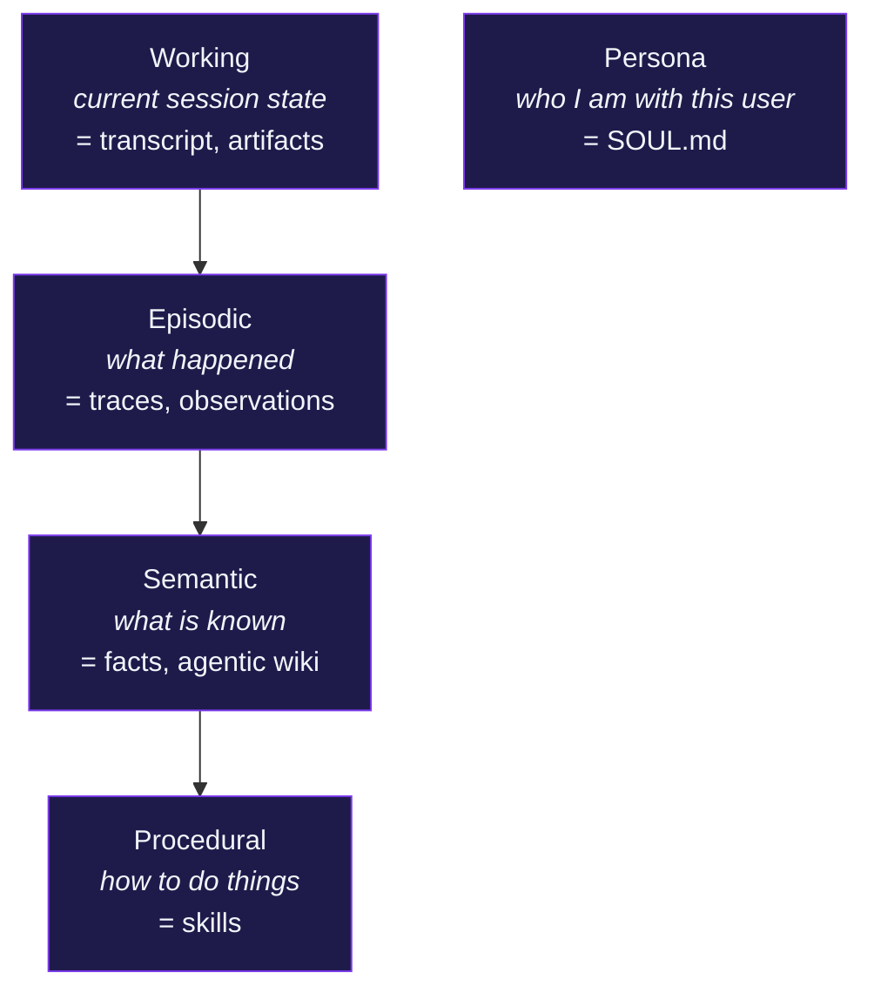
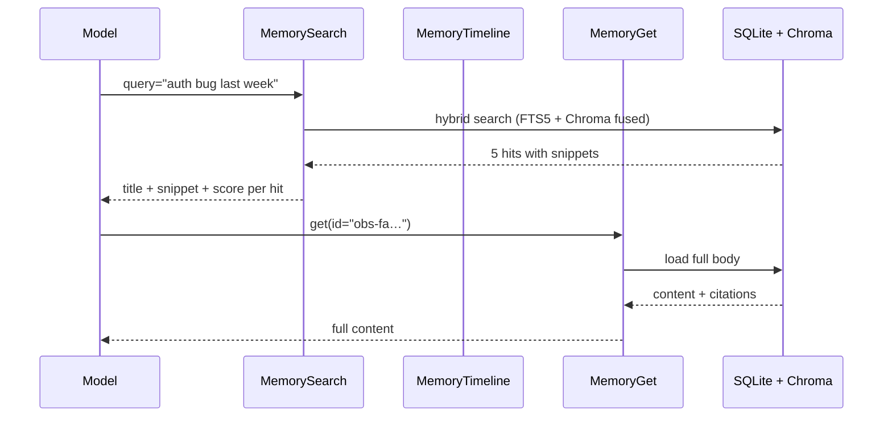

# Four-tier memory <span class="lyra-badge intermediate">intermediate</span>

## What is memory

Lyra remembers across sessions. It does so with a **hybrid memory
store** (SQLite FTS5 + Chroma + Zettelkasten graph) partitioned across
four semantic tiers plus a separate persona partition. Each tier serves
a different retention and retrieval purpose: working state is ephemeral,
episodic traces persist per session, semantic facts are durable across
sessions, and procedural skills encode reusable capabilities.

Source: [`lyra_core/memory/`](https://github.com/lyra-contributors/lyra/tree/main/packages/lyra-core/src/lyra_core/memory) ·
canonical spec: [`docs/blocks/07-memory-three-tier.md`](../blocks/07-memory-three-tier.md).

## The four tiers



| Tier | What lives there | Update path |
|---|---|---|
| **Working** | Current session transcript, artifact refs, active plan | Per-step by the agent loop; compacted when >85% max tokens |
| **Episodic** | Per-turn observations, trace summaries, artifact refs | Auto on compaction + `SESSION_END`; explicit `memory.write` |
| **Semantic** | Durable facts, agentic-wiki entries, Zettelkasten notes | Wiki skill + user-edited `MEMORY.md` + dream consolidation |
| **Procedural** | `SKILL.md` files (full bodies) | [Skill extractor](skills.md#the-extractor) writes / refines; dream may reorganise |
| **Persona** | `SOUL.md` | Hand-edited; lives in L2 forever, never compacted |
| **Prompt cache** *(per-call optimisation, not a tier)* | Hashed shared-prefix anchor per `(provider, digest)` | [`PromptCacheCoordinator`](prompt-cache-coordination.md); 5-min TTL; sibling subagents hit |

## Storage

| Backend | Stores |
|---|---|
| `lyra.db` (SQLite) | sessions, observations, summaries, wiki metadata, extraction provenance |
| SQLite **FTS5** virtual tables | full-text search over observations / wiki entries |
| **Chroma** (on-disk) | semantic embeddings of the same content |
| Files (`.md`) | `SOUL.md`, `MEMORY.md`, `wiki/*.md`, `feedback/*.md`, `skills/*/SKILL.md` |

Consistency: writes go to SQLite first (atomic), then Chroma
(best-effort with retry). A daily reconciler reconciles drift between
the two indexes.

## Schema (SQLite)

```sql
CREATE TABLE sessions (
  id TEXT PRIMARY KEY, repo_root TEXT,
  created_at TEXT, ended_at TEXT, status TEXT
);

CREATE TABLE observations (
  id TEXT PRIMARY KEY, session_id TEXT,
  ts TEXT, kind TEXT,        -- fact | decision | mistake | preference
  content TEXT, citations TEXT,
  is_private INTEGER DEFAULT 0,
  tags TEXT
);

CREATE VIRTUAL TABLE observations_fts USING fts5(
  content, tags, tokenize='porter unicode61'
);

CREATE TABLE wiki_entries (
  id TEXT PRIMARY KEY, title TEXT, body_path TEXT,
  tags TEXT, created_at TEXT, updated_at TEXT,
  ttl_days INTEGER, confidence REAL
);
```

A trigger keeps `observations_fts` in sync with the base table.

## Embedding

Default: **BGE-small-en-v1.5** (33M params), running on CPU. Chroma
stores 384-dim vectors. Configurable in `~/.lyra/config.toml`:

```toml
[memory.embedding]
provider = "local"     # local | openai | cohere | voyage
model = "BAAI/bge-small-en-v1.5"
batch_size = 32
```

If you switch providers, run `lyra memory reembed` to rebuild Chroma
from the SQLite source of truth.

## The 3-tool MCP surface (progressive disclosure)



The model **never preloads** memory. It searches when it suspects an
answer exists, gets the snippet, and only fetches the full body if the
snippet looks promising. This pattern keeps L3 small and bills low.

## Hybrid search ranking

`MemorySearch` runs FTS5 and Chroma in parallel and fuses with
**reciprocal rank fusion** (RRF):

```
score(item) = sum over engines of 1 / (k + rank_in_that_engine)
```

with `k=60` (default). The fused list is the result. RRF is
parameter-cheap and resilient to either engine returning garbage.

## Privacy

Any observation written with `is_private=1` is:

- excluded from any provider that isn't allowlisted as
  `privacy_allowed`
- redacted in the trace export
- visible to the agent in-session, but never reflected into the model
  call's full prompt unless the user explicitly approves

`<private>` markers in `MEMORY.md` and wiki files create the same
behaviour without touching SQL.

## Pruner

Memory grows. The background pruner runs every N completed sessions
(default 15) and tiers entries by:

| Tier | Retention |
|---|---|
| `keep` | High utility, recent | Keep indefinitely |
| `watch` | Lower utility | Keep, mark stale-after = 30d |
| `archive` | Stale, low utility | Move to `~/.lyra/memory/archive/` |
| `delete` | Garbage / superseded | Hard delete (after dry-run report) |

The first run on each machine is **dry-run** by default. Inspect with
`/memory prune --dry-run` and approve with `/memory prune --apply`.

## Upcoming: Zettelkasten graph linking (Phase 2)

Building on the A-MEM pattern (ICLR 2026 MemAgent Workshop), Phase 2 adds
a **Zettelkasten graph** overlay on top of SQLite + Chroma:

- Each observation is a **node** with bidirectional typed links (`supports`,
  `contradicts`, `extends`, `supersedes`, `example-of`)
- The `GraphMemory` store maintains adjacency in a dedicated SQLite table
- **Auto-linking** on write: the system suggests links to semantically
  similar nodes (cosine > 0.85) and creates `related-to` edges
- **Hebbian decay**: links weaken over time without reinforcement; decays
  below threshold are pruned weekly
- **BFS traversal**: retrieval can expand from a hit's neighbours —
  `MemorySearch` + `BFS(depth=2)` recovers related facts the vector
  search missed
- **LP-RAG link prediction**: a lightweight GNN predicts which links are
  missing; queries that find few results trigger link recommendation

Expected impact: 85-93% token reduction vs flat memory on cross-session
recall tasks (per A-MEM benchmarks). See
[lyra-upgrade/brainstorm/02-memory.md](../lyra-upgrade/brainstorm/02-memory.md).

## Upcoming: cost-sensitive retrieval cascade (Phase 2)

When the agent queries memory, the retrieval engine walks a
**5-tier cost cascade** — cheapest first, escalating only when needed:

| Tier | Backend | Cost | Latency |
|---|---|---|---|
| 1 — Working | In-process dict | $0 | <1ms |
| 2 — Episodic | SQLite FTS5 (exact match) | $0 | <5ms |
| 3 — Semantic | Chroma vector (top-5) | $0 (local) | <20ms |
| 4 — Archive | SQLite BLOB with LZ4 | $0 | <50ms |
| 5 — LLM recall | Generator model "guess" | Model cost | 500-2000ms |

The router tries tier 1-4 first. Only if all return empty or confidence
< threshold does it fall through to tier 5 (asking the LLM to recall).
This mirrors Gaikwad et al.'s cost-sensitive store routing: 62% token
reduction, 38.4% F1 improvement over single-store baselines.

```toml
[memory.retrieval.cascade]
enabled = true
confidence_threshold = 0.6
max_tiers = 4           # set to 5 to include LLM recall
```

## Upcoming: field-theoretic dreaming (Phase 4)

During idle (no active sessions), the **dreaming engine** consolidates
memories using a field-theoretic formulation borrowed from Mitra
(2602.21220):

- Memory entries are treated as **fields** on a latent manifold,
  governed by a partial differential equation: diffusion + decay +
  coupling between related entries
- The PDE runs for a fixed number of timesteps during idle, producing
  consolidated representations: redundant entries merge, weak entries
  decay, and cross-session patterns emerge
- Result: +116% F1 on LongMemEval in the paper; Lyra aims to replicate
  this on its own cross-session recall benchmarks

The dreaming engine has three phases, adapted from Anthropic's
"Dreaming" pattern and LightMem:

1. **Orient** — Collect working and episodic entries since last dream
2. **Consolidate** — Run PDE field dynamics; merge duplicates, reinforce
   patterns, decay noise
3. **Prune** — Remove entries below retention threshold, update Zettelkasten
   link weights

The PDE approach is gated behind a **bake-off vs LLM-based dreaming**
(deduplicate + summarize using a cheap model). Only the winner graduates
to production. See [lyra-upgrade/MASTER-PLAN.md](../lyra-upgrade/MASTER-PLAN.md)
§4.24.

## Why memory tiers

Memory tiers exist because different kinds of agent memory have drastically different retention, latency, and cost requirements. Working memory must be instant and zero-cost but can be discarded between turns. Semantic facts must persist for months and survive context compaction. Separating concerns into tiers means each can be optimised independently — Chroma for semantic embedding, SQLite FTS5 for keyword search, markdown files for human-editable persona, and a cost-sensitive cascade that prefers the cheapest tier first.

## When to use memory tiers

- Memory is used automatically by the agent loop on compaction and by the context engine on assembly. No manual action is needed.
- Use the `MemorySearch`, `MemoryTimeline`, and `MemoryGet` tools directly when you suspect an answer is in memory but the model has not recalled it.
- Use `MEMORY.md` for durable facts you want to persist across sessions and share with the agent.
- Run `/memory prune --dry-run` periodically and `/memory prune --apply` to keep the store healthy.

## When NOT to use memory tiers

- Do not use episodic memory for data that must be preserved across sessions unconditionally — that belongs in semantic tier or `MEMORY.md`.
- Do not store sensitive secrets in memory without `is_private=1`, and even then, prefer a secret manager.
- The dream consolidation engine (Phase 4) is a background process; do not rely on it for real-time memory updates.
- Avoid over-reliance on the LLM recall tier (tier 5 of the cost cascade) — it is expensive and should only fire when all cheaper tiers return empty.

## Next steps

1. Read [Context engine](context-engine.md) to see how memory feeds into the transcript assembly.
2. Read [Skills](skills.md) to understand the procedural tier of memory.
3. Explore the canonical block spec at [`docs/blocks/07-memory-three-tier.md`](../blocks/07-memory-three-tier.md).
4. For the full memory-architecture upgrade plan, see [lyra-upgrade/plans/02-memory-architecture.md](../lyra-upgrade/plans/02-memory-architecture.md).

## Where to look in the source

| File | What lives there |
|---|---|
| `lyra_core/memory/store.py` | SQLite + Chroma client, hybrid search, RRF fuser |
| `lyra_core/memory/observations.py` | Observation schema and writers |
| `lyra_core/memory/wiki.py` | Agentic-wiki entries with TTL |
| `lyra_core/memory/pruner.py` | The tiered pruner |
| `lyra_core/memory/graph.py` | Zettelkasten graph store with typed links *(Phase 2)* |
| `lyra_core/memory/cascade.py` | Cost-sensitive retrieval cascade *(Phase 2)* |
| `lyra_core/memory/dream.py` | Field-theoretic dreaming engine *(Phase 4)* |

[← Context engine](context-engine.md){ .md-button }
[Continue to Skills →](skills.md){ .md-button .md-button--primary }
