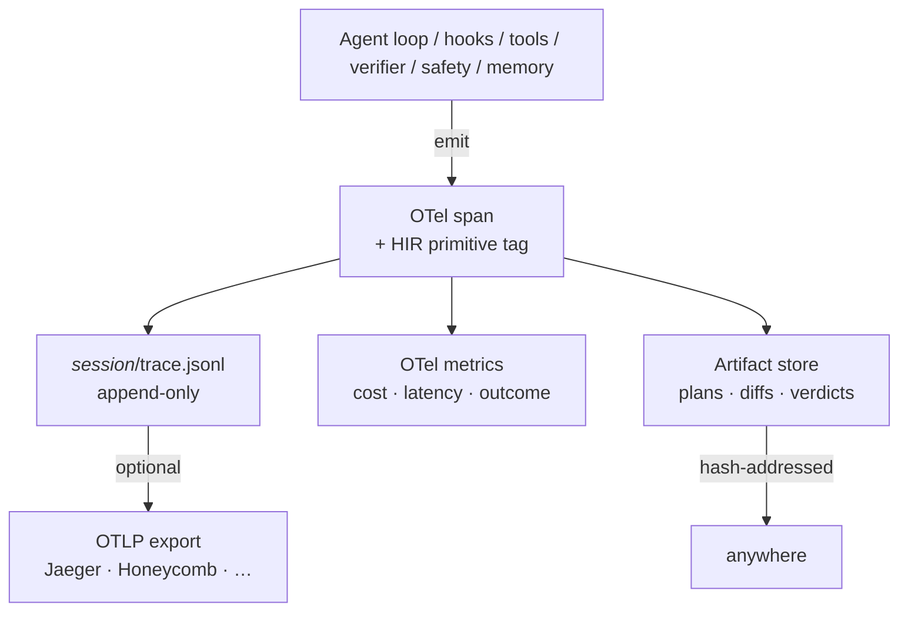

# Observability and HIR <span class="lyra-badge advanced">advanced</span>

## What is observability

Observability is a first-class pillar in Lyra, not an afterthought.
Every model call, every tool, every hook, every permission decision,
every memory write emits a structured event. The events are
**OpenTelemetry-compatible** for generic backends (Jaeger, Honeycomb,
Datadog) and **HIR-compatible** (Harness Intermediate Representation)
for agent-specific tooling like HAFC, SHP, and autogenesis.

Source: [`lyra_core/observability/`](https://github.com/lyra-contributors/lyra/tree/main/packages/lyra-core/src/lyra_core/observability) ·
[`lyra_core/hir/`](https://github.com/lyra-contributors/lyra/tree/main/packages/lyra-core/src/lyra_core/hir) ·
canonical spec: [`docs/blocks/13-observability-hir.md`](../blocks/13-observability-hir.md).

## Three outputs



| Output | Where it goes | What's in it |
|---|---|---|
| **Spans** | `.lyra/sessions/<id>/trace.jsonl` (always) + OTLP (optional) | Tool calls, model calls, hooks, decisions |
| **Metrics** | `.lyra/sessions/<id>/metrics.jsonl` + Prometheus-shape gauge | Cost, latency, outcome, p95 budgets |
| **Artifacts** | `.lyra/sessions/<id>/artifacts/<hash>` | Plans, diffs, evaluator verdicts, large tool outputs |

## HIR — the IR everyone agrees on

[Gnomon's HIR](https://github.com/lyra-contributors/gnomon-hir) is a
framework-neutral schema for agent traces. Lyra adopts the schema and
extends it with harness-specific event types so the same trace runs
through:

- HAFC (Harness Agreement Failure Classifier)
- SHP (Step-level Harness Profiler)
- autogenesis (curriculum miner)

without an adapter.

### The event shapes

Source: [`lyra_core/hir/events.py`](https://github.com/lyra-contributors/lyra/tree/main/packages/lyra-core/src/lyra_core/hir/events.py).

```python
AgentLoop.start(session_id, task, soul_hash, plan_hash)
AgentLoop.step(step_no, think_text_ref, model, usage)
AgentLoop.end(status, cost_usd, steps, final_text_ref)

PermissionBridge.decision(tool, args_digest, mode, policy_ref, decision, risk, reason)

Hook.start(event, hook_name)
Hook.end(decision, duration_ms)

Tool.call(tool, args_ref)
Tool.result(result_ref, exit_code, duration_ms)

Subagent.spawn(id, purpose, scope, budget)
Subagent.result(id, outcome, summary_ref)

Context.compaction(strategy, tokens_before, tokens_after, preservation_refs)

Memory.read(tier, query, result_ref)
Memory.write(tier, artifact_ref)

Evaluator.verdict(verdict, rubric_scores, evidence_refs)
Safety.check(verdict, confidence, evidence_refs)
TDD.state_change(from_phase, to_phase, reason, evidence_ref)
```

Every event carries `trace_id`, `span_id`, `parent_span_id`, `ts`,
`session_id`, and `actor` (`generator` / `evaluator` / `monitor` /
`scheduler`).

## OTel export

Source: [`lyra_core/observability/otel_export.py`](https://github.com/lyra-contributors/lyra/tree/main/packages/lyra-core/src/lyra_core/observability/otel_export.py).

When `[observability.otel] endpoint` is set, Lyra streams spans over
OTLP (gRPC by default, HTTP if configured) **in parallel** to writing
the JSONL trace. The two outputs are designed to stay in sync: the
JSONL is the source of truth, the OTel export is best-effort.

```toml title="~/.lyra/config.toml"
[observability.otel]
endpoint = "http://localhost:4317"     # gRPC
service_name = "lyra"
resource_attrs = { env = "dev" }
```

Spans use the **OTel GenAI semantic conventions** (model, usage,
prompt category, etc.) so generic OTel viewers render them sensibly.

## Replay

Source: [`lyra_core/observability/retro.py`](https://github.com/lyra-contributors/lyra/tree/main/packages/lyra-core/src/lyra_core/observability/retro.py).

A trace is **replayable** without re-calling the LLM. The `retro`
module walks the JSONL stream and reconstructs:

- The transcript at any step
- The tool call inputs and outputs (from artifact refs)
- The hook decisions and their reasons
- The cost / token usage timeline

This is what the [debug mode](../howto/debug-mode.md)
`time_travel_replay` tool surfaces interactively. From the CLI:

```bash
lyra trace show <session-id> --step 12
lyra trace timeline <session-id>
lyra trace cost <session-id> --by tool
lyra trace export <session-id> --format otlp > trace.otlp
```

## Cost attribution

Cost is recorded **per actor and per role** so you can answer:

- "How much did the planner cost vs. the generator?"
- "How much did MCP-tool calls cost vs. built-in tools?"
- "Which subagent burned the most tokens?"

`/cost` in a session shows the live attribution table:

```
attribute              cost_usd     %
generator (fast)         0.034    27%
generator (smart)        0.067    54%
evaluator (different)    0.018    14%
safety monitor (nano)    0.005     4%
                        ------
total                    0.124   100%
```

## Upcoming: OpenTelemetry tracing with Langfuse / Phoenix (Phase 2)

The v3.0 upgrade adds first-class integration with **Langfuse** and
**Phoenix** for agent-specific observability:

```toml
[observability.agent_tracing]
backend = "langfuse"          # langfuse | phoenix | custom_otlp
endpoint = "http://localhost:3000"
project = "lyra-dev"
```

Both backends receive the full HIR event stream and render:
- **Trace timelines**: per-session waterfall of model calls, tool calls,
  hooks, permission decisions
- **Token usage**: per-step token counts with prompt cache breakdown
- **Cost attribution**: per-role cost (generator vs evaluator vs monitor)
- **Lateny profiles**: slowest tool calls, model response times
- **Session outcomes**: success/failure/aborted with classification

Langfuse is the default (richer agent-specific dashboards). Phoenix is
the fallback for teams already in the Arize ecosystem.

## Upcoming: token observatory (Phase 2)

The **token observatory** extends the existing TokenObservatory with
real-time monitoring of token waste patterns:

| Waste pattern | Detector | Action |
|---|---|---|
| Long repetitive tool output | `bash` output ≥ 1000 tokens with >80% repetition | Auto-truncate, flag in HUD |
| Model re-reading its own text | Transcript shows read of a file the model just wrote | Warn in HUD |
| Prompt cache miss cascade | L1+L2 hit rate drops below 50% for 3+ consecutive turns | Log investigation event |
| Cost-per-step anomaly | Step cost exceeds rolling 95th percentile by 5x | Soft-stop, surface to user |
| Over-long tool names | Tool descriptions exceed 200 tokens in aggregated schema | Suggest tool trimming |

The observatory runs as a lightweight background process, emitting
events into the HIR stream. See
[lyra-upgrade/plans/16-reliability.md](../lyra-upgrade/plans/16-reliability.md).

## Upcoming: pass^k metrics (Phase 2)

The eval harness adds **pass^k** metrics (pass@1, pass@5, pass@K)
aligned with τ-bench and SWE-bench standards:

- `pass@1`: fraction of tasks the agent completes in one attempt
- `pass@5`: fraction where at least one of 5 attempts succeeds
- `pass@K` with budget: pass rate at specified cost budget (e.g.,
  pass@5 with ≤ $2.00/session)

These are computed by the **benchmark scoreboard** — a persistent
SQLite database that tracks all eval runs:

```bash
lyra eval run --benchmark swe-bench --suite lite
lyra eval scoreboard --benchmark swe-bench
```

Example scoreboard output:
```
benchmark        pass@1   pass@5   avg_cost   runs
swe-bench-lite    0.38     0.52     $1.24      47
τ-bench           0.71     0.83     $0.89      32
lyra-int-mem      0.64     0.78     $0.42      18
```

## Upcoming: benchmark scoreboard tracking (Phase 2)

All eval results are logged to the **Benchmark Scoreboard** — a
persistent table in `lyra.db`:

```sql
CREATE TABLE benchmark_runs (
  id TEXT PRIMARY KEY,
  benchmark TEXT NOT NULL,      -- "swe-bench-lite", "tau-bench", "lyra-int-mem"
  run_date TEXT NOT NULL,
  model_config TEXT NOT NULL,   -- JSON of the model configuration used
  pass_at_1 REAL,
  pass_at_5 REAL,
  pass_at_k INTEGER,
  total_cost REAL,
  total_tokens INTEGER,
  trajectory_path TEXT,         -- link to full trace export
  git_sha TEXT                  -- Lyra version at time of run
);
```

This enables **regression tracking** across Lyra versions —
./lyra-upgrade/BASELINE.md defines the current baselines, and each
eval run updates the scoreboard.

## What you can do with the trace

| Use case | How |
|---|---|
| Debug a flaky run | `lyra trace show <id>` step-by-step |
| Compare two runs | `lyra trace diff <id1> <id2>` |
| Compute eval metrics | Pipe JSONL through `lyra-evals` scorers |
| Reconstruct lost context | `retro.assemble_at(session, step)` |
| Replay against new model | `lyra trace replay <id> --replay-model openai:gpt-5` |
| Privacy redaction | `lyra trace redact <id> --policy default` |

## Why observability

Observability is what makes Lyra's agent loop auditable. Without structured traces, diagnosing why an agent took a particular action — or why a session failed — requires reconstructing the entire model conversation from ephemeral prompts. With OTel-compatible spans and HIR-tagged events, every decision (tool call, hook verdict, permission decision, cost attribution) is logged in machine-parseable format, replayable without re-calling the LLM.

## When to use observability

- Every Lyra session emits traces, metrics, and artifacts by default. No configuration is needed for basic observability.
- Enable OTel export in `~/.lyra/config.toml` (`[observability.otel] endpoint = "..."`) for streaming to Jaeger, Honeycomb, or Datadog.
- Use `lyra trace show <id>` for step-by-step replay of a session, and `lyra trace diff <id1> <id2>` to compare two runs.
- Use `/cost` in a live session to see per-actor attribution.

## When NOT to use observability

- OTel export is best-effort; the JSONL trace file is the source of truth. Do not rely on OTel for critical audit trails without validating the JSONL side.
- Metrics artifacts can grow large. Prune old session traces periodically with `lyra sessions prune`.
- Do not emit sensitive file contents into the trace stream. Use `is_private=1` markers for private observations.

## Next steps

1. Read [Sessions and state](sessions-and-state.md) to see how traces map to the session directory.
2. Explore the canonical block spec at [`docs/blocks/13-observability-hir.md`](../blocks/13-observability-hir.md).
3. For agent-specific tracing with Langfuse/Phoenix (Phase 2), see [lyra-upgrade/plans/16-reliability.md](../lyra-upgrade/plans/16-reliability.md).
4. For benchmark scoreboard and pass^k metrics (Phase 2), see the same plan.

## Where to look in the source

| File | What lives there |
|---|---|
| `lyra_core/hir/events.py` | The event schema |
| `lyra_core/observability/hir.py` | Span emission helpers |
| `lyra_core/observability/otel_export.py` | OTLP export |
| `lyra_core/observability/retro.py` | Trace replay / reconstruction |
| `lyra_core/observability/agent_tracing.py` | Langfuse / Phoenix integration *(Phase 2)* |
| `lyra_core/observability/token_observatory.py` | Token waste pattern detection *(Phase 2)* |
| `lyra_core/eval/scoreboard.py` | Benchmark scoreboard database and queries *(Phase 2)* |

[← Safety monitor](safety-monitor.md){ .md-button }
[Continue to Sessions and state →](sessions-and-state.md){ .md-button .md-button--primary }
