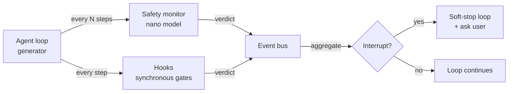

# Safety monitor <span class="lyra-badge advanced">advanced</span>

## What is the safety monitor

The safety monitor is **continuous**, **cheap**, and **runs in
parallel** to the agent loop. It samples every Nth step, asks a
nano-model "is this agent still doing what it was asked to do?", and
votes alongside hooks on whether to interrupt.

Where hooks are **synchronous gates** at lifecycle boundaries, the
safety monitor is an **asynchronous observer** that watches the
trajectory as it accumulates.

Source: [`lyra_core/safety/`](https://github.com/lyra-contributors/lyra/tree/main/packages/lyra-core/src/lyra_core/safety) ·
canonical spec: [`docs/blocks/12-safety-monitor.md`](../blocks/12-safety-monitor.md).

## Where it sits



The monitor and hooks are **independent voters**. Either can
interrupt; together they vote on borderline cases.

## What it watches for

Source: [`lyra_core/safety/monitor.py`](https://github.com/lyra-contributors/lyra/tree/main/packages/lyra-core/src/lyra_core/safety/monitor.py).

A small ruleset combined with a per-step nano-model classification:

| Signal | Detected by | What happens |
|---|---|---|
| **Out of scope** | Nano-model: "the agent is editing files outside the plan's expected_files set" | Soft-stop, ask user |
| **Loop / repetition** | Rule: same `(tool, args_digest)` ≥ 3 times in 16-call window | Soft-stop, summarise the loop |
| **Cost burn** | Rule: `cost_usd / step` exceeds rolling 95th-percentile by 3× | Warn in HUD, ask user at next turn boundary |
| **Hypothesis drift** (debug mode) | Nano-model: "the agent is now investigating something unrelated to the original symptom" | Soft-stop, surface the drift |
| **Adversarial prompt-injection candidate** | Rule + nano-model: observed content matches injection patterns | Strip the content, annotate critique |

## Sampling cadence

The monitor runs every `monitor_every_n_steps` (default 4) steps.
Setting it to 1 makes the monitor synchronous (and expensive); setting
it high (e.g. 16) lets the monitor lag the agent by half a turn but
saves tokens.

```toml title="~/.lyra/config.toml"
[safety.monitor]
enabled = true
model = "anthropic:claude-3-5-haiku-latest"
monitor_every_n_steps = 4
out_of_scope_threshold = 0.7
hypothesis_drift_threshold = 0.6
```

The monitor uses its **own model client** (configured separately from
fast/smart) so the same provider doesn't see both the generator's
context AND the monitor's prompt — a small but real defence against
the generator inferring the monitor's existence and steering output to
hide from it.

## Soft-stop semantics

When the monitor votes interrupt, the loop **does not abort
mid-tool-call**. Instead:

1. Finish the in-flight tool call (don't leave the filesystem in a
   half-edited state).
2. At the next turn boundary, surface the verdict to the user.
3. Wait for `/approve-continue` or `/abort`.
4. The verdict is appended to the transcript as a critique so the
   model knows why it was interrupted.

This matters because hard-aborting in the middle of a 2-second `bash`
call is much more dangerous than letting it finish with a flag set.

## Red team

Source: [`lyra_core/safety/redteam.py`](https://github.com/lyra-contributors/lyra/tree/main/packages/lyra-core/src/lyra_core/safety/redteam.py).

The red-team utility runs **adversarial prompts** against the safety
monitor periodically (in CI or on a cron) to verify the monitor still
catches known attacks:

```bash
lyra safety redteam --suite default
```

The default suite includes prompt-injection bait, scope-violation
prompts, loop-induction prompts, and cost-bomb prompts. A regression
shows up in CI as a falling pass rate on the suite.

## Upcoming: 5-layer defense-in-depth (Phase 4)

The v3.0 safety upgrade expands the monitor from 1 layer to **5
defense-in-depth layers**, inspired by Anthropic's and Netflix's
production safety architectures:

| Layer | Guard | What it protects | Cost |
|---|---|---|---|
| 1 — Input Guard | LlamaFirewall / CaMeL dual-LLM | Prompt injection, jailbreak | Nano model per step |
| 2 — Runtime Monitor | Safety monitor (existing, enhanced) | Out-of-scope, loops, cost burn | Nano model per 4 steps |
| 3 — NeMo Guardrails | Policy-enforced guardrails (Colang) | Business rules, compliance | Rule engine (~$0) |
| 4 — Sandbox | OS-level + worktree isolation | Filesystem damage, escape | ~$0 (git-native) |
| 5 — Progent SMT | Symbolic monotonic confinement | Least-privilege guarantee | SMT solver per session |

Each layer can only **deny more**, never allow more — the monotonic
confinement property adapted from Progent (ASR reduction from 39.9%
to 1.0%). The layers are **independently configurable**:

```toml
[safety.layers]
input_guard = { enabled = true, model = "meta-llama/llama-guard-3-8b" }
runtime_monitor = { enabled = true, every_n_steps = 4 }
nemo = { enabled = false }           # opt-in for compliance workflows
sandbox = { enabled = true, type = "worktree" }
progent = { enabled = false }        # opt-in; requires Z3 solver
```

Each layer has an explicit **fail-open** or **fail-closed** setting
(the CRITICAL-3 fix from v7.2.1). Default is fail-closed for all
layers in production. See [lyra-upgrade/MASTER-PLAN.md](../lyra-upgrade/MASTER-PLAN.md)
§4.17.

## Upcoming: collusion detection (Phase 4)

Multi-agent verification panels can be subverted by colluding agents.
**Lying with Truths** (2601.01685) shows that colluding agents can
steal belief using only truthful evidence — no covert communication
needed — achieving 74.4% attack success rate on proprietary models.

The collusion detector monitors:
- **Voting patterns**: agents with identical voting histories triggered
  by different evidence sets
- **Evidence overlap**: suspiciously similar evidence trails across
  agents that shouldn't share sources
- **Cross-agent justification analysis**: a cheap nano-model checks
  whether agent A's justification could plausibly have been written
  independently of agent B's

```toml
[safety.collusion_detection]
enabled = true
vote_history_window = 20
evidence_similarity_threshold = 0.9   # cosine similarity
nano_model = "anthropic:claude-3-5-haiku-latest"
```

## Upcoming: "Misevolve" safety validator (Phase 4)

A dedicated **evolution safety validator** informed by the "Misevolve"
paper (2509.26354), which found that self-evolving agents suffer a
45% refusal rate drop and 76% tool vulnerability rate. The validator
gates all skill/memory evolution:

| Gate | Checks for | Pass condition |
|---|---|---|
| 1 — Refusal stability | Refusal rate on sensitive prompts | Within ±5% of baseline |
| 2 — Tool safety | Tool call patterns don't introduce new vulnerabilities | No new vulnerability patterns |
| 3 — Prompt injection | Evolution doesn't make the skill more injectable | Passes standard attack suite |
| 4 — Alignment drift | Model values haven't shifted | SOUL-consistent responses |
| 5 — Checkpoint restore | Can roll back without data loss | Full checkpoint verified |

If **any** gate fails, the evolution candidate is rejected and the
event logged to the evolution ledger. See
[lyra-upgrade/brainstorm/17-safety.md](../lyra-upgrade/brainstorm/17-safety.md).

## Upcoming: Agent View permission guardrail (Phase 3)

When the **supervisor daemon** runs background sessions unattended
(Phase 3), a dedicated permission guardrail ensures that fleet agents
operate with restricted privileges:

- Background sessions default to `bypass` mode with writes restricted
  to the session's worktree only
- Any tool call targeting outside the worktree requires explicit
  permission elevation — elevated to the parent's terminal (peek/reply)
- On permission elevation, the guardrail creates a checkpoint so the
  session can be rolled back if the elevated action causes damage
- Fleet agents cannot spawn subagents (prevents recursive escalation)

See [lyra-upgrade/plans/14-autonomy.md](../lyra-upgrade/plans/14-autonomy.md).

## Configuration trade-offs

| Cadence | Token cost | Detection latency |
|---|---|---|
| `every_n_steps=1` (synchronous) | High (one nano call per step) | 0 steps |
| `every_n_steps=4` (default) | Low (1 nano per 4 generator steps) | up to 3 steps |
| `every_n_steps=16` | Negligible | up to 15 steps |
| Disabled | None | ∞ |

The default is the right balance for most workflows. Bump cadence
when the agent is in `bypass` mode or doing long-horizon DAG work.

## Why the safety monitor

The safety monitor exists because deterministic hooks alone cannot catch every failure mode. An agent can stay strictly within its allowed tool set while drifting far from the original task — editing files outside the plan's scope, chasing unrelated hypotheses, or burning budget on loops. The nano-model adds a semantic layer that detects these drifts where no tool-level rule would trigger.

## When to use the safety monitor

- The safety monitor runs by default every 4 steps. Configure cadence via `monitor_every_n_steps` in `~/.lyra/config.toml`.
- Bump cadence to `1` (synchronous) for high-risk sessions involving write operations or bypass mode.
- Run `lyra safety redteam --suite default` periodically to verify the monitor still catches known attack patterns.

## When NOT to use the safety monitor

- Disabling the monitor entirely is only advisable in deterministic CI runs with short, well-understood tasks.
- The monitor's nano-model can produce false positives on unusual workflows. Review and dismiss with `/approve-continue`.
- Do not rely on the monitor as the only safety layer. Hooks, the permission bridge, and worktree isolation are the primary safety surface; the monitor is an additional observer.

## Next steps

1. Read [Observability](observability.md) to see how safety verdicts are traced.
2. Explore the canonical block spec at [`docs/blocks/12-safety-monitor.md`](../blocks/12-safety-monitor.md).
3. For the 5-layer defense-in-depth upgrade (Phase 4), see [lyra-upgrade/plans/17-safety.md](../lyra-upgrade/plans/17-safety.md).
4. For evolution safety (Misevolve), see [lyra-upgrade/brainstorm/17-safety.md](../lyra-upgrade/brainstorm/17-safety.md).

## Where to look in the source

| File | What lives there |
|---|---|
| `lyra_core/safety/monitor.py` | The monitor loop and voting |
| `lyra_core/safety/redteam.py` | Adversarial test suite |
| `lyra_safety/layers/` | 5-layer defense-in-depth guards *(Phase 4)* |
| `lyra_safety/collusion.py` | Collusion detector for multi-agent panels *(Phase 4)* |
| `lyra_safety/evolution_gate.py` | "Misevolve"-informed evolution safety validator *(Phase 4)* |
| `lyra_safety/fleet_guard.py` | Agent View permission guardrail for background sessions *(Phase 3)* |

[← Verifier](verifier.md){ .md-button }
[Continue to Observability →](observability.md){ .md-button .md-button--primary }
