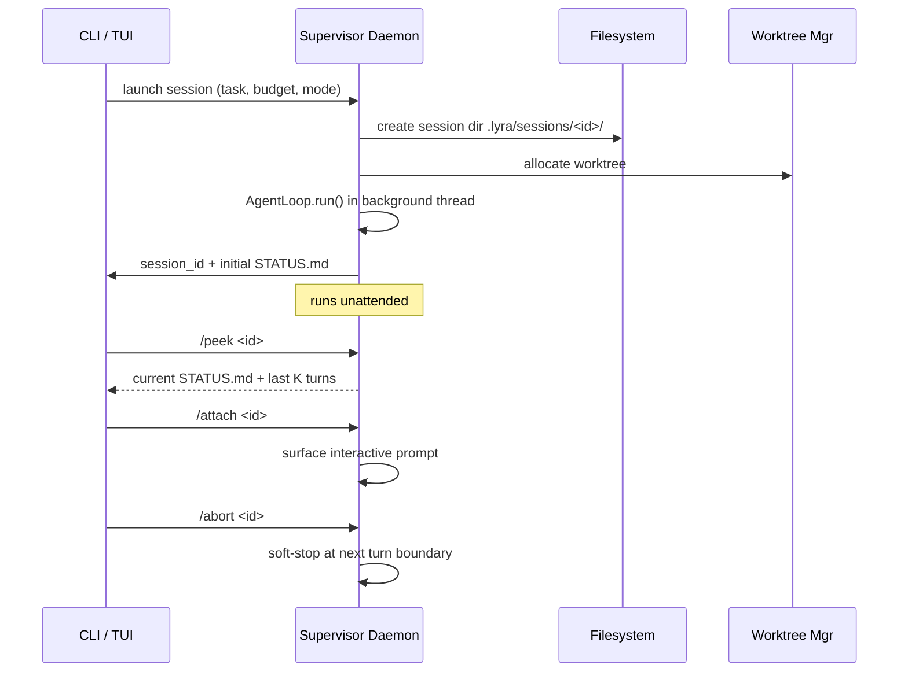

<!-- lyra-legacy-aware: page documents migration of pre-v3.0 sessions written by open-coding / open-harness, so the legacy brand names appear by design. -->


# Sessions and state <span class="lyra-badge intermediate">intermediate</span>

## What are sessions and state

Lyra's session is the unit of work. Everything about it — transcript,
plan, tool calls, hooks, decisions, costs — persists to a directory
you can `ls` and `cat`. There is no binary pickle. Resume reads the
same files anyone else would read.

This is [Commitment 9](../architecture/commitments.md#9-session-continuity-via-human-readable-statemd)
realised: ungreppable state is a non-starter.

Source: [`lyra_core/sessions/`](https://github.com/lyra-contributors/lyra/tree/main/packages/lyra-core/src/lyra_core/sessions) ·
[`lyra_core/store/`](https://github.com/lyra-contributors/lyra/tree/main/packages/lyra-core/src/lyra_core/store).

## What's in a session directory

```
.lyra/sessions/sess-20260501-abcd/
├── STATE.md                # human-readable; load-bearing
├── recent.jsonl            # last N turns of transcript
├── trace.jsonl             # full HIR span stream
├── metrics.jsonl           # cost / latency / outcome timeseries
├── todo.json               # current todo list
├── artifacts/              # hash-addressed; immutable
│   ├── 8af1…d4f2           # a plan, a diff, a tool result, etc.
│   └── …
└── hooks/                  # per-hook last-result for /review
    ├── tdd-gate.json
    └── secret-redactor.json
```

Two layers of persistence:

| Layer | Where | Mutability |
|---|---|---|
| **State** | `STATE.md`, `todo.json`, `recent.jsonl` | Updated every step |
| **Trace** | `trace.jsonl`, `metrics.jsonl`, `artifacts/*` | Append-only |

State is small and live. Trace is large and immutable.

## STATE.md (the load-bearing file)

```markdown
---
session_id: sess-20260501-abcd
started_at: 2026-05-01T10:23:00Z
last_step_at: 2026-05-01T10:47:00Z
status: active             # active | paused | complete | aborted
mode: agent
plan: .lyra/plans/sess-20260501-abcd.md
plan_status: in-progress
fast_model: deepseek:deepseek-chat
smart_model: deepseek:deepseek-reasoner
cost_usd: 0.124
steps: 27
---

# Session sess-20260501-abcd

## Goal

Add dark mode toggle that persists across reloads.

## Status

- Plan approved at 10:24:12 UTC
- 3 of 4 plan steps complete
- TDD phase: green (3 of 3 acceptance tests passing)

## Open questions

- (none)

## Last 3 tool calls
1. write src/settings/ThemeToggle.tsx ✓
2. write src/settings/__tests__/useTheme.test.ts ✓
3. bash pytest tests/settings -k toggle ✓

## Next

- Mount ThemeToggle in src/App.tsx
```

This file is what `/resume` reads first. A human can read it. A `cat`
in CI can read it. A grep across `.lyra/sessions/` finds it. **No
binary format, ever.**

## Resume

```bash
lyra resume sess-20260501-abcd
# or pick interactively:
lyra sessions
```

The resume sequence:

```mermaid
%%{init: {'theme': 'dark', 'themeVariables': { 'primaryColor': '#8b5cf6', 'primaryTextColor': '#e2e8f0', 'primaryBorderColor': '#a78bfa', 'lineColor': '#94a3b8', 'secondaryColor': '#1e293b', 'tertiaryColor': '#0d1117', 'background': '#0d1117', 'mainBkg': '#1e293b', 'nodeBorder': '#a78bfa', 'clusterBkg': '#1e293b', 'clusterBorder': '#8b5cf6', 'titleColor': '#c084fc', 'edgeLabelBackground': '#1e293b' }}%%
sequenceDiagram
    participant CLI
    participant Store as sessions/store.py
    participant CE as Context Engine
    participant Loop as Agent Loop

    CLI->>Store: load(sess-20260501-abcd)
    Store->>Store: read STATE.md  → SessionMeta
    Store->>Store: read recent.jsonl  → last K turns
    Store->>Store: read todo.json
    Store->>Store: read plan-artifact ref
    Store-->>CLI: Session object
    CLI->>CE: assemble(session, task=continue, plan=loaded)
    CE-->>Loop: Transcript with SOUL, plan, todos, recent turns
    Loop->>Loop: AgentLoop.run() at next step
```

What survives resume:

| Survives | Why |
|---|---|
| Goal, mode, model | STATE.md frontmatter |
| Plan + plan status | Plan artifact ref |
| Todos | `todo.json` |
| Last K turns | `recent.jsonl` (default K=10) |
| Permission overrides | STATE.md "policy_overrides" section |
| Cost + budget remaining | STATE.md frontmatter |

What doesn't:

- Transient tool buffers (anything not in artifacts)
- Tool-call args older than the keep-window (compacted out)
- Per-tool counter state (re-initialised; not session-state)

## Migration: JSONL formats

Source: [`lyra_core/sessions/jsonl_migration.py`](https://github.com/lyra-contributors/lyra/tree/main/packages/lyra-core/src/lyra_core/sessions/jsonl_migration.py).

Older sessions (pre-v3.0 written by `open-coding` and `open-harness`)
use slightly different JSONL shapes. The migration helper rewrites
them in place on first resume:

```bash
lyra sessions migrate ~/.opencoding/sessions/   # one-shot import
```

The original files are kept in `<dir>.bak.<ts>` until you delete them.

## Upcoming: supervisor daemon session lifecycle (Phase 3)

The v3.0 upgrade introduces a **supervisor daemon** that manages
session lifecycles for the fleet:



The daemon:
- Tracks all active sessions in `.lyra/daemon/sessions.json`
- Emits a **heartbeat** span every M turns to confirm liveness
- Runs cost-gated: if a session exceeds budget, it's paused (not killed)
- Cleans up sessions on graceful shutdown; on crash, sessions are
  discovered and restarted on next daemon start
- Fleet view TUI (built on Ink/React) shows state-grouped rows:
  active / paused / complete / failed

See [lyra-upgrade/plans/13-swarm-fleet.md](../lyra-upgrade/plans/13-swarm-fleet.md).

## Upcoming: two-axis state model (Phase 3)

Each session in the fleet has a **two-axis state model**:

| Axis | Values | Meaning |
|---|---|---|
| **Status** | `active` / `paused` / `complete` / `failed` / `orphaned` | Session lifecycle |
| **Autonomy** | `hand-hold` / `supervised` / `steer-xcp` / `unattended` / `autonomous` | Human-involvement level |

The autonomy axis determines:
- How often the supervisor surfaces row summaries
- Whether tool calls require approval
- Which permission mode the session runs in
- Whether the session can spawn subagents

Transitions are logged in the daemon's event stream. See
[lyra-upgrade/plans/14-autonomy.md](../lyra-upgrade/plans/14-autonomy.md).

## Upcoming: checkpointing with selective restore (Phase 3)

Building on the existing resume mechanism, Phase 3 adds explicit
**checkpoints**:

- The daemon snapshots a checkpoint every N steps (default 10)
- A checkpoint captures: transcript hash, tool-call results, permission
  overrides, budget remaining, worktree state
- Checkpoints are stored in `.lyra/checkpoints/<session-id>/<step>.checkpoint`
- **Selective restore**: if a late tool call fails, the session can
  roll back to the checkpoint before that call while keeping earlier
  results

```bash
lyra session checkpoint list <id>
lyra session checkpoint restore <id> --step 15
```

Checkpoints enable safe "undo" for autonomous sessions — a key
capability for unattended fleet operation.

## Upcoming: worktree isolation per session (Phase 3)

Each active session in the fleet runs in its **own git worktree**,
allocated by the worktree manager:

```bash
git worktree add -b <session-id> .lyra/worktrees/<session-id> main
```

This provides:
- **Filesystem isolation**: concurrent sessions can edit the same
  repository without conflict
- **Safe cleanup**: on session end, the worktree is deleted; dirty
  files are stashed (not destroyed)
- **Non-destructive default**: Claude Code's silent-destroy behaviour
  is inverted — Lyra defaults to safe cleanup with user confirmation

The daemon enforces a worktree quota (default 10 concurrent) and
reclaims the oldest paused session when the pool is exhausted.

## The store API

If you want to programmatically inspect or operate on sessions:

```python
from lyra_core.sessions import SessionStore

store = SessionStore.user()                    # ~/.lyra/sessions/
store = SessionStore.repo()                    # .lyra/sessions/

for sess in store.list(status="active"):
    print(sess.id, sess.cost_usd, sess.steps)

sess = store.load("sess-20260501-abcd")
print(sess.state_md.next)                      # the parsed STATE.md
print(sess.replay_at_step(12).transcript)      # rebuilt transcript
```

Store is split into `repo`-scoped (`.lyra/sessions/`) and `user`-
scoped (`~/.lyra/sessions/`). They're separate; `lyra sessions` lists
both.

## Why sessions and state

Session state exists because an agent that forgets its own progress is unreliable. By persisting every step to human-readable files, Lyra makes session continuity a first-class capability — you can resume a session days later, a CI pipeline can inspect the state file, and the trace is always available for replay. The design choice against binary formats means no special tooling is ever needed to read session state.

## When to use sessions and state

- Sessions are created automatically every time you run Lyra. Use `lyra sessions` to list active sessions.
- Use `/resume <session-id>` to pick up where you left off after a break or crash.
- Use `lyra trace show <session-id>` to inspect a session's step-by-step trace.
- Commit plan artifacts (`git add .lyra/plans/`) so PR reviewers can see the brief before the diff.

## When NOT to use sessions and state

- Do not hand-edit STATE.md while a session is active — the loop writes to it every step and edits may be overwritten.
- Do not rely on sessions for data that must outlast the session lifecycle; move important facts to `MEMORY.md` or wiki entries.
- Trace files and JSONL artifacts can grow large; prune old sessions periodically with `lyra sessions prune --keep 30`.

## Next steps

1. Read [Two-tier routing](two-tier-routing.md) to see how fast and smart slots interact with session state.
2. Read [Observability and HIR](observability.md) to understand the trace stream emitted during a session.
3. For the supervisor daemon session lifecycle (Phase 3), see [lyra-upgrade/plans/13-swarm-fleet.md](../lyra-upgrade/plans/13-swarm-fleet.md).
4. For the autonomy escalation ladder, see [lyra-upgrade/plans/14-autonomy.md](../lyra-upgrade/plans/14-autonomy.md).

## Where to look in the source

| File | What lives there |
|---|---|
| `lyra_core/sessions/store.py` | `SessionStore`, `Session` dataclass |
| `lyra_core/sessions/jsonl_migration.py` | Pre-v3 → v3+ JSONL upgrade |
| `lyra_core/store/todo_store.py` | Todos persistence |
| `lyra_core/supervisor/daemon.py` | Supervisor daemon — session lifecycle, heartbeat *(Phase 3)* |
| `lyra_core/supervisor/fleet_view.py` | Fleet view TUI with state-grouped rows *(Phase 3)* |
| `lyra_core/sessions/checkpoint.py` | Checkpoint snapshots and selective restore *(Phase 3)* |
| `lyra_core/supervisor/worktree_pool.py` | Worktree allocation, quota, and cleanup *(Phase 3)* |

[← Observability and HIR](observability.md){ .md-button }
[Continue to Two-tier routing →](two-tier-routing.md){ .md-button .md-button--primary }
