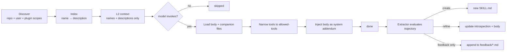

# Skills <span class="lyra-badge intermediate">intermediate</span>

## What is a skill

A **skill** is a capability shipped as a folder with a `SKILL.md` file.
Lyra's skill engine has three roles: **Loader** (discover and index),
**Router** (select by description), and **Extractor** (mint new skills
from successful trajectories). A background **Curator** grades the
catalogue and tiers each skill `keep` / `watch` / `rewrite` / `retire`
/ `promote`.

Skills are how Lyra learns from past work and reuses effective procedures across sessions. They are the procedural tier of Lyra's [memory hierarchy](memory-tiers.md).

## How skills work

Source: [`lyra_skills/`](https://github.com/lyra-contributors/lyra/tree/main/packages/lyra-skills/src/lyra_skills) ·
canonical spec: [`docs/blocks/09-skill-engine-and-extractor.md`](../blocks/09-skill-engine-and-extractor.md).

## Skill format

```markdown title="skills/test-gen/SKILL.md"
---
name: test-gen
description: |
  Use when the user or plan asks to generate unit tests, integration
  tests, or acceptance tests for an existing function/module/component.
allowed-tools: [read, grep, glob, write, bash]
author: lyra-atomic
version: 1.2.0
languages: [python, typescript, go]
introspection:
  examples: 22
  success_rate: 0.88
  last_refined: 2026-04-18
disable-model-invocation: false
---

# Steps

1. Read the target function/module; confirm signature and side effects.
2. Identify the testing framework in use.
3. Draft 3–7 tests covering happy path, edges, errors, idempotency.
4. Write tests to `tests/` mirroring the source structure.
5. Run the focused subset; on unexpected failures, report and stop.

## Anti-patterns
- Do not disable existing tests to make new ones pass.
- Do not add dependencies without asking.
- Do not over-mock; prefer real integration where cheap.

## Cross-references
- See SOUL: Simplicity First.
- Failed attempts: ../feedback/test-gen.md (entries #3, #7)
```

The frontmatter is a **contract**:

| Field | Required | What it does |
|---|---|---|
| `name` | yes | Identifier; collisions are resolved narrower-scope-wins |
| `description` | yes | What the Router uses to match user intent |
| `allowed-tools` | yes | Tool subset narrowed for the duration of invocation |
| `version`, `author`, `languages` | optional | Catalogue metadata |
| `introspection` | auto-maintained | Curator writes here; do not hand-edit |
| `disable-model-invocation` | optional | Force user-only invocation |

## Lifecycle



### Discovery scopes (precedence: narrowest wins)

1. Repo: `.lyra/skills/*/SKILL.md`
2. User-global: `~/.lyra/skills/*/SKILL.md`
3. Plugin-bundled: `lyra_plugins/*/*/SKILL.md`

### What's in the model's context

Only the **name and description** of each in-scope skill, in L2. The
body is loaded only if the model decides to invoke. This keeps L2 small
and stable so prompt caching works.

### Invocation

```python
@tool(name="skill", writes=False, risk="low")
def invoke_skill(name: str, args: dict = {}) -> str: ...
```

When invoked:

1. Loader fetches the body + companion files.
2. PermissionBridge **narrows the tool allowlist** to `allowed-tools`
   for the duration.
3. Body is injected as a system message addendum.
4. Agent reasoning resumes within that narrowed scope.
5. On scope exit, the original tool list is restored.

## The extractor

After every completed task, the **Skill Extractor** evaluates the
trajectory:

```python title="lyra_skills.extractor"
def extract_candidate(input: ExtractorInput) -> ExtractorOutput:
    rubric = run_rubric(input)            # (1) min tool calls, distinct
                                          #     tools, unique slug, headers,
                                          #     no leaked secrets, body length
    if not rubric.all_pass:
        return ExtractorOutput.feedback_only(rubric)

    if input.existing_skill_ids and slug in input.existing_skill_ids:
        return ExtractorOutput.refinement_proposal(slug, input)  # (2)

    return ExtractorOutput.new_skill_proposal(slug, input)
```

1. The rubric is a **deterministic check** — no LLM call. Six
   conditions must hold or the candidate downgrades to a feedback-only
   entry.
2. **Active-update bias**: if a skill with the proposed slug already
   exists, refine it instead of creating a duplicate. (This is the
   Hermes pattern.)

The extractor never auto-publishes. Proposals land in
`~/.lyra/skills/_proposals/` for you to review with `/skill review`.

## The curator

The Curator is a **deterministic, no-LLM background grader**. It runs
on a cron (or manually with `lyra skill curate`), reads the skill
ledger, and tiers each skill:

| Tier | Trigger | Suggested action |
|---|---|---|
| `promote` | High utility, ≥10 activations, ≤1 failure | Promote scope (repo → user → plugin) |
| `keep` | Healthy utility, recent | None |
| `watch` | Marginal utility | Watch; rerun in N days |
| `rewrite` | Activations but low success rate | Open for hand-rewrite |
| `retire` | Stale + unused | Move to `~/.lyra/skills/archive/` |

Output is a markdown report under `~/.lyra/skill-curator/`. Open it
with `/skill curator-report` and act on suggestions explicitly. The
curator never modifies skills on its own.

??? example "Sample report row"
    ```
    ### test-gen   tier=keep   score=0.78
    activations: 22  · failures: 3  · stale_days: 4  · size: 87 lines
    rationale:
      - utility = (s − f) / (s + f) = 0.84 above keep threshold (0.65)
      - recency boost +0.05 (last used <7d)
    suggested_action: none
    ```

## Upcoming: progressive disclosure at 3 levels (Phase 1)

The v3.0 upgrade adds **progressive disclosure** — the skill body is
loaded in stages rather than all at once:

| Level | What the model sees | When loaded |
|---|---|---|
| **L2** (context) | Name + 1-line description | Always, in the skill registry |
| **L3** (on invoke) | Full SKILL.md body + companion files | Only when the model invokes `/skill` |
| **On-demand** | Example trajectories, feedback files | Only if the model requests via tool |
| **Meta** | Evolution metadata (version, success rate, variants) | Only during curator review |

This avoids wasting context on skills the model doesn't end up using.
With 330+ skills in the library, loading all bodies into L2 would exceed
most context windows. Progressive disclosure keeps the surface small
while making the full depth available.

## Upcoming: provider-aware degradation (Phase 1)

Different providers have different capability surfaces. A skill that
works on Anthropic (tool use, vision, extended thinking) may not work
on DeepSeek or open-weights models. The **provider-aware degradation**
layer checks the skill's `capabilities_required` frontmatter against
the active provider's `CapabilityMatrix`:

```yaml
name: vision-analyze
capabilities_required: [vision]    # falls back if provider has no vision
fallback_skill: describe-image     # alternative skill for non-vision providers
```

If the current provider lacks a required capability, the loader either
selects the `fallback_skill` or degrades gracefully (e.g., drops the
vision-specific instructions, keeps the general analysis prompt).

## Upcoming: GEPA self-evolution (Phase 4)

Skills evolve through **Gradient-free Evolutionary Prompt Algorithm**
(GEPA, ICLR 2026 Oral), adapted from Lyra's existing GEPA module:

1. For each skill the curator marks as `watch` or `rewrite`, a
   candidate is generated by a dedicated optimizer model
2. The candidate is run through a **safety validator** (informed by
   "Misevolve" findings — 2509.26354) that checks for:
   - Refusal rate regression (must not drop >5%)
   - Tool vulnerability introduction
   - Prompt injection susceptibility
3. A/B tested against the current version in a sandboxed trajectory
4. If the safety validator **and** A/B test pass, promoted to production;
   the old version is archived with a revert hash

The evolution loop is **always gated by the safety validator** — no
skill changes without it. See [lyra-upgrade/MASTER-PLAN.md](../lyra-upgrade/MASTER-PLAN.md)
§4.27 and [lyra-upgrade/brainstorm/04-skills.md](../lyra-upgrade/brainstorm/04-skills.md).

## Upcoming: SkillNet integration (Phase 2)

Skills are not islands — they reference and compose each other. The
**SkillNet** is a lightweight dependency graph that maps:

- `depends_on`: skill A must run before skill B (for pipelines)
- `conflicts_with`: skill A and B should never activate together
- `extends`: skill B is a specialised version of skill A
- `alternative_to`: skill A and B solve the same problem for different
  providers (used by provider-aware degradation)

The SkillNet is stored as a YAML manifest under
`.lyra/skillnet/manifest.yaml` and loaded on session start. It enables
the router to pick the right skill for the current provider and task.

## Why skills

Skills convert successful trajectories into reusable procedures and failed trajectories into anti-skills. Without the skill system, every session starts from scratch — the model has no memory of what worked before. With skills, Lyra builds a growing library of curated capabilities that the model can invoke by name, keeping context small and results consistent.

## When to use skills

- The model already uses skills automatically when the description matches the user's intent. No manual intervention is needed.
- Use `/skill invoke <name>` to call a skill explicitly when you know the right capability.
- The extractor runs automatically after completed tasks; review proposals in `~/.lyra/skills/_proposals/`.
- Run `/skill curate` periodically to review the curator's tiering report.

## When NOT to use skills

- Do not hand-edit the `introspection` frontmatter fields — those are auto-maintained by the curator.
- Skills are not suitable for one-shot tasks; the extractor may produce false positives from noisy trajectories.
- Do not bypass the safety validator for skill evolution (Phase 4). The "Misevolve" findings show significant risks from self-evolving agents without safety gates.
- Avoid creating skills that are too narrow (single-line commands) or too broad ("do everything").

## Next steps

1. Read [Subagents](subagents.md) to see how skills compose with parallel agent execution.
2. Explore the canonical block spec at [`docs/blocks/09-skill-engine-and-extractor.md`](../blocks/09-skill-engine-and-extractor.md).
3. Review the skill system build plan in [lyra-upgrade/brainstorm/04-skills.md](../lyra-upgrade/brainstorm/04-skills.md).
4. For the self-evolution roadmap, see [lyra-upgrade/MASTER-PLAN.md](../lyra-upgrade/MASTER-PLAN.md) section 4.27.

## Where to look in the source

| File | What lives there |
|---|---|
| `lyra_skills/loader.py` | Discover + index by description |
| `lyra_skills/router.py` | Select-by-description matcher |
| `lyra_skills/extractor.py` | Post-task candidate generation + rubric |
| `lyra_skills/curator.py` | Background tiering + markdown report |
| `lyra_skills/ledger.py` | Per-skill stats: successes, failures, last_used |
| `lyra_skills/evolution.py` | GEPA self-evolution loop with safety validator *(Phase 4)* |
| `lyra_skills/skillnet.py` | Skill dependency graph and conflict resolver *(Phase 2)* |
| `lyra_skills/degrade.py` | Provider-aware degradation dispatcher *(Phase 1)* |

[← Three-tier memory](memory-tiers.md){ .md-button }
[Continue to Subagents →](subagents.md){ .md-button .md-button--primary }
