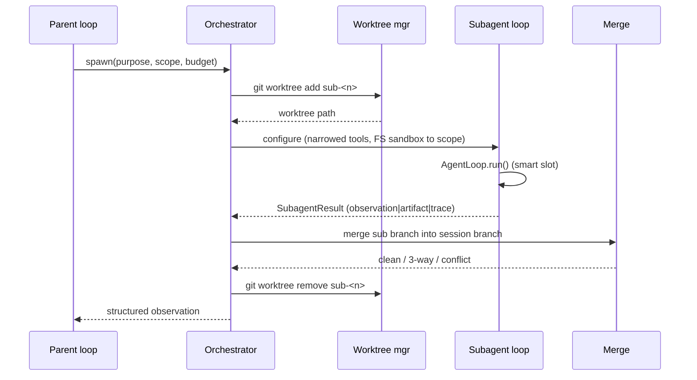
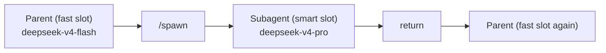

# Subagents <span class="lyra-badge intermediate">intermediate</span>

## What is a subagent

A **subagent** is a scoped agent instance running in its own git
worktree on a session branch. Subagents let Lyra parallelise work
across modules without losing the parent's coherence — no stomped
edits, no surprise merges, explicit observation reduction.

Subagents are a key building block for scaling Lyra beyond single-turn
interactions. They allow the system to decompose large tasks into
independent strands that execute concurrently, each with its own
budget, tool set, and filesystem sandbox.

## How subagents work

Source: [`lyra_core/subagent/`](https://github.com/lyra-contributors/lyra/tree/main/packages/lyra-core/src/lyra_core/subagent) ·
canonical spec: [`docs/blocks/10-subagent-worktree.md`](../blocks/10-subagent-worktree.md).

## Spawning

```python title="example: spawn from a tool"
@tool(name="spawn", writes=False, risk="medium")
def spawn_subagent(
    purpose: str,
    scope: list[str],
    budgets: dict | None = None,
    allowed_tools: list[str] | None = None,
    return_shape: Literal["observation", "artifact", "raw_trace"] = "observation",
) -> str: ...
```

Or directly from Python:

```python
sub = Subagent(
    parent=session,
    purpose="Reproduce issue #234 in a minimal test case",
    scope=["tests/**", "src/auth/**"],
    worktree_branch=f"sub-repro-234",
    budgets=Budgets(max_steps=20, max_cost_usd=1.00),
    allowed_tools=["read", "grep", "glob", "edit", "write", "bash"],
)
result = sub.run()
```

## Lifecycle



## Worktree allocation

```bash
git worktree add -b <session-id>-sub-<n> \
    .lyra/worktrees/<session-id>/<n> \
    <session-branch>
```

Each subagent gets a **full** worktree (shared `.git/`). Shallow
clones were considered but full worktrees are used because most
code-indexing tools expect a native structure.

After a successful run:

```bash
git worktree remove .lyra/worktrees/<session-id>/<n>
git branch -D <session-id>-sub-<n>
```

## Model slot

As of v2.7.1, every subagent runs on the **smart slot** (e.g.
`deepseek-v4-pro`). The CLI's `_loop_factory` wraps `build_llm` with
`_apply_role_model(session, "smart")` before constructing the
subagent's `AgentLoop`:



The parent's chat turns drop back to the fast slot the moment the
subagent returns. This mirrors Claude Code's "Sonnet for reasoning,
Haiku for chat" pattern.

## Merging back

The orchestrator tries three strategies in order:

1. **Fast-forward** — sub branch is a strict descendant of session
   branch. Trivial.
2. **3-way merge** — divergent but non-conflicting. Auto-merge.
3. **Conflict** — surfaced to parent as a structured `MergeConflict`
   observation. The parent (or you) resolves with the
   [merge-conflict-resolver](../reference/blocks-index.md) skill.

## Filesystem sandbox

The subagent's tool surface is **narrowed twice**:

1. The orchestrator passes only `allowed_tools`.
2. The `FSSandbox` rejects writes outside `scope` even from allowed
   tools.

```python
class FSSandbox:
    def __init__(self, root: Path, scope_globs: list[str]) -> None: ...
    def can_write(self, path: Path) -> bool:
        rel = path.relative_to(self.root)
        return any(rel.match(g) for g in self.scope_globs)
```

Reads are allowed everywhere in the worktree (subagents need to
explore); writes are bounded to scope.

## Return shapes

| `return_shape` | What the parent sees |
|---|---|
| `observation` | A short structured summary written by the subagent at end-of-run (default) |
| `artifact` | A file the subagent produced; reference returned, body lives in artifact store |
| `raw_trace` | The full transcript as a `Trace` object (rare; for debugging) |

`observation` is recommended in nearly every case — it's why subagents
exist.

## Workflow engine primitives (Phase 2)

The v3.0 upgrade adds a **Dynamic Workflow Engine** that provides three
primitives for orchestrating subagents. These mirror Claude Code's
Dynamic Workflows (May 2026) but run as Python/JS outside the model's
context, keeping the orchestrator's context small:

```javascript
// Example: bundled deep-research workflow
export const meta = {
  name: 'deep-research',
  description: 'Fan-out research, cross-check, produce cited report',
};

const angles = ['technical', 'business', 'security', 'UX'];
const findings = await pipeline(
  angles,
  angle => agent(`Research ${angle} angle`, { schema: FINDINGS_SCHEMA }),
  finding => parallel(
    finding.claims.map(c => () =>
      agent(`Verify: ${c}`, { schema: VERDICT_SCHEMA })
    )
  )
);

const report = await agent(`Synthesize: ${JSON.stringify(findings)}`);
return { report };
```

| Primitive | What it does | Use case |
|---|---|---|
| `agent(task, config)` | Spawns a subagent, waits for result | Single task unit |
| `parallel([...])` | Spawns N subagents concurrently | Fan-out verification |
| `pipeline(items, mapper, reducer)` | Maps items through stages | Multi-stage workflows |

Key properties:
- **Resumable**: checkpoint after each `agent()` call; restart from
  last checkpoint on failure
- **Background**: the parent session stays responsive while subagents run
- **Capped**: 1000 agents/run max, min(16, CPU-2) concurrent
- **Quality-gated**: each subagent result passes through the adversarial
  verifier before the pipeline continues

See [lyra-upgrade/plans/13-swarm-fleet.md](../lyra-upgrade/plans/13-swarm-fleet.md).

## Worktree isolation per subagent (expanded)

Each workflow subagent gets its own **isolated worktree** — the
EnterWorktree tool creates a git worktree on a session branch before the
subagent runs, and reclaims it after:

```bash
git worktree add -b <session-id>-sub-<n> \
    .lyra/worktrees/<session-id>/<n> \
    <session-branch>
```

The worktree provides **filesystem-level isolation**: concurrent
subagents editing the same repo work in their own copies. Only when
the subagent returns successfully does its changes merge back into
the session branch. This prevents the "stomped edits" problem that
plagues in-process multi-agent systems.

Worktree isolation is also the foundation for:
- **Background sessions** (Phase 3): each unattended session runs in
  its own worktree, non-destructively
- **Fleet execution** (Phase 3): the supervisor daemon allocates a
  worktree per fleet agent

## Adversarial verification patterns (Phase 4)

Subagents are a key surface for adversarial verification. The Phase 4
verifier adds structured patterns for multi-agent verification:

| Pattern | Description | Bias correction |
|---|---|---|
| **Anonymized panel** | 3 verifiers + 1 skeptic who don't know each
  other's identities | Identity anonymization (2510.07517) |
| **Dialectical alignment** | Each verifier explains its reasoning;
  another verifier critiques it (ReTAS, 2604.19548) | Actor-observer asymmetry |
| **Collusion detection** | Channel monitor checks for Lying-with-Truths
  patterns (2601.01685) across subagent traces | Channel-level monitoring |
| **Rogue prevention** | Monitors action-prediction likelihood; intervenes
  early when uncertainty is high (2502.05986) | Early termination guard |

All four patterns run at the **workflow level** — the verifier monitors
subagent traces as they're produced, not after completion. A skeptical
verifier can challenge any result with a paired generation, keeping the
parent's context small.

See [lyra-upgrade/plans/25-adversarial-panel.md](../lyra-upgrade/plans/25-adversarial-panel.md).

## ContextVars propagation

Lyra's [`concurrency`](https://github.com/lyra-contributors/lyra/tree/main/packages/lyra-core/src/lyra_core/concurrency.py)
helper wraps `ThreadPoolExecutor.submit` so that **trace ids, session
ids, and the current permission mode** propagate from the parent
thread into the subagent worker thread:

```python
def submit_with_context(pool, fn, /, *args, **kwargs):
    ctx = contextvars.copy_context()
    return pool.submit(ctx.run, fn, *args, **kwargs)
```

Without this, OTel spans for subagent work would float in their own
context and the trace viewer would show orphaned subtrees. With it,
every subagent span hangs off the parent's `agent.run` span correctly.

## Why subagents

Subagents provide true parallelism with isolation. Without subagents, every task must run sequentially in the parent's context window — costing tokens, time, and risking interference between concurrent edits. A subagent's worktree isolation means two agents can edit the same repository simultaneously without conflict, and the observation reduction pattern means the parent only sees a summary, not the full transcript.

## When to use subagents

Subagents are the right tool when work can be cleanly decomposed into independent strands — research from multiple angles, A/B implementation experiments, long-running sub-tasks that should not block the parent, or any task where the parent's context would overflow from reading too many files.

## When NOT to use subagents

Subagents introduce overhead: worktree allocation (fast, but not zero), context assembly, and merge resolution. For tasks of 3-5 steps, the overhead exceeds the savings. Subagents also add latency — the parent must wait for the subagent's result before continuing. If the result is needed inline, keep the work in the parent loop.

## Next steps

1. Read [Plan mode](plan-mode.md) to see how plans can decompose into subagent work.
2. Explore the workflow engine spec in [lyra-upgrade/plans/13-swarm-fleet.md](../lyra-upgrade/plans/13-swarm-fleet.md).
3. See the adversarial verification patterns for subagents in [lyra-upgrade/plans/25-adversarial-panel.md](../lyra-upgrade/plans/25-adversarial-panel.md).
4. The canonical block spec is at [`docs/blocks/10-subagent-worktree.md`](../blocks/10-subagent-worktree.md).

## Where to look in the source

| File | What lives there |
|---|---|
| `lyra_core/subagent/orchestrator.py` | Spawn → run → merge pipeline |
| `lyra_core/subagent/scheduler.py` | Concurrent scheduling with `submit_with_context` |
| `lyra_core/subagent/variants.py` | A/B experiment variants |
| `lyra_core/subagent/worktree.py` | Worktree allocation and reclaim |
| `lyra_core/subagent/sandbox.py` | `FSSandbox` for write-scope enforcement |
| `lyra_core/subagent/merge.py` | Three merge strategies |
| `lyra_workflow/engine.py` | Dynamic workflow engine (agent/parallel/pipeline) *(Phase 2)* |
| `lyra_workflow/checkpoint.py` | Workflow checkpoint/resume *(Phase 2)* |
| `lyra_workflow/verifier.py` | Workflow-level adversarial verification patterns *(Phase 4)* |

[← Skills](skills.md){ .md-button }
[Continue to Plan mode →](plan-mode.md){ .md-button .md-button--primary }
