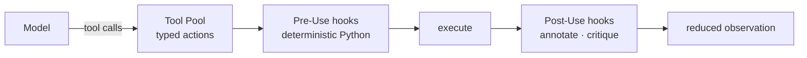

# Tools and hooks <span class="lyra-badge intermediate">intermediate</span>

## What are tools and hooks

These are the two extension points of Lyra. Almost every customisation
you will ever do lands as a tool, a hook, or a skill (which is just a
named bundle of the first two).

A **tool** is a typed function the model can call to interact with the outside world — reading files, running shell commands, searching the web. A **hook** is deterministic Python (or a shell script) that runs on a lifecycle event to enforce rules that prompts cannot reliably enforce.

## How they work



## Tools

A **tool** is a typed function the model can call. Lyra tools are
ordinary Python callables decorated with `@tool`:

```python title="tools/example.py"
from lyra import tool, ToolCall, ToolResult

@tool(
    name="git_diff",
    description="Show the diff for a path or for the whole repo if path is empty.",
    writes=False,        # (1)
    risk="low",          # (2)
    args_schema={
        "path": {"type": "string", "default": ""},
        "staged": {"type": "boolean", "default": False},
    },
)
def git_diff(call: ToolCall) -> ToolResult:
    cmd = ["git", "diff"]
    if call.args.get("staged"):
        cmd.append("--staged")
    if call.args.get("path"):
        cmd.append(call.args["path"])
    return ToolResult.text(run(cmd))
```

1. **`writes`** is read by the [Permission Bridge](permission-bridge.md)
   to decide whether the tool needs an `ask`/`allow` vote in the current
   mode.
2. **`risk`** is a coarse classifier (`low` / `medium` / `high`) that
   the bridge weighs against your configured `risk_ask_threshold`.

### Built-in tools

The kernel ships these by default:

| Tool | Reads / Writes | One-liner |
|---|---|---|
| `read` | Reads | Read a file (with line range slicing) |
| `write` | Writes | Create or overwrite a file |
| `edit` | Writes | String-replace inside an existing file |
| `bash` | Writes (potentially) | Run a shell command |
| `grep` | Reads | ripgrep across the workspace |
| `glob` | Reads | Glob file patterns |
| `read_lints` | Reads | Pull diagnostics from the IDE |
| `web_search` | Reads (network) | Web search |
| `web_fetch` | Reads (network) | Fetch a URL as markdown |
| `spawn` | Writes | Spawn a [subagent](subagents.md) |
| `skill` | Variable | Invoke a [skill](skills.md) by name |

### Upcoming: deferred tool loading — Tool Search (Phase 1)

Instead of loading all tool schemas at session start, **Tool Search**
loads schemas progressively:

- At session start: load only the core tools (read, write, edit, bash, grep, glob)
- On demand: when the model mentions a capability ("search the web"),
  the orchestrator loads the relevant tool schema (web_search, web_fetch)
- **Tool Search** also supports fuzzy matching: the model can ask for
  "a tool that does X" and the system searches the full tool registry
  by description, loading the top-K matches into the tool list

This keeps the model's tool schema small (fewer tokens) and avoids
confusion from irrelevant tool options. The loading mechanism is
transparent to the model — it just sees the tool list grow between turns.

```toml
[tools.search]
enabled = true                 # default for Phase 1+
initial_load = ["read", "write", "edit", "bash", "grep", "glob"]
max_tools_per_turn = 12
```

### MCP tools

[MCP](https://modelcontextprotocol.io/) servers register additional
tools at session start. From the loop's perspective they're
indistinguishable from built-ins. See
[How-To: Add an MCP server](../howto/add-mcp-server.md).

## Hooks

A **hook** is deterministic Python (or a shell script) that runs on a
lifecycle event. Hooks are the discipline layer of Lyra — they enforce
behaviours that prompts can't reliably enforce.

### Lifecycle events — 25+ and growing

The v3.0 upgrade extends the hook surface from 13 to **25+ lifecycle
events**, covering every phase of the agent lifecycle:

```python
class HookEvent(StrEnum):
    # Session lifecycle
    SESSION_START         = "session.start"
    SESSION_END           = "session.end"
    SESSION_PAUSE         = "session.pause"           # new
    SESSION_RESUME        = "session.resume"          # new

    # User interaction
    USER_PROMPT_SUBMIT    = "user.prompt.submit"
    USER_INTERRUPT        = "user.interrupt"          # new
    USER_REPLY            = "user.reply"              # new

    # Model interaction
    PRE_MODEL_CALL        = "pre.model.call"
    POST_MODEL_CALL       = "post.model.call"
    CACHE_READ            = "cache.read"              # new
    CACHE_WRITE           = "cache.write"             # new

    # Tool lifecycle
    PRE_TOOL_USE          = "pre.tool.use"            # most common
    POST_TOOL_USE         = "post.tool.use"           # most common
    PRE_TOOL_SEARCH       = "pre.tool.search"         # new: deferred tool loading
    POST_TOOL_LOAD        = "post.tool.load"          # new

    # Permission
    PRE_PERMISSION        = "pre.permission"
    POST_PERMISSION       = "post.permission"         # new

    # Compaction / memory
    COMPACTION            = "compaction"
    MEMORY_WRITE          = "memory.write"            # new
    DREAM_STEP            = "dream.step"              # new

    # Subagent / workflow
    SUBAGENT_START        = "subagent.start"
    SUBAGENT_END          = "subagent.end"
    WORKFLOW_CHECKPOINT   = "workflow.checkpoint"     # new
    WORKFLOW_RESUME       = "workflow.resume"         # new

    # Termination
    STOP                  = "stop"                    # session completion gate
    PRE_ABORT             = "pre.abort"               # new: before hard abort

    # Observability
    NOTIFICATION          = "notification"
    EVAL_RUN              = "eval.run"                # new
    BENCHMARK_SCORE       = "benchmark.score"         # new
```

### Writing a hook

```python title="hooks/my_secret_redactor.py"
from lyra import Hook, HookEvent, ToolCall, Session, HookDecision

@Hook.register(HookEvent.PRE_TOOL_USE, name="secret-redactor", priority=10)
def redact_secrets(call: ToolCall, session: Session) -> HookDecision:
    if call.name in {"write", "edit"}:
        content = call.args.get("content", "")
        if SECRET_PATTERN.search(content):
            return HookDecision.block_(
                name="secret-redactor",
                reason="content matches secret pattern",
                suggestion="Move the value to an env var or .env (not git-tracked).",
            )
    return HookDecision.allow("secret-redactor")
```

Composition rule for multiple hooks on the same event: **any
`block=True` wins**; annotations concatenate in declaration order.

### Shipped hooks

| Hook | Event | What it does |
|---|---|---|
| `tdd-gate` (off by default) | `PRE_TOOL_USE`, `POST_TOOL_USE`, `STOP` | Require RED proof before edits to `src/**`, run focused tests on writes, block session completion if tests are red |
| `destructive-pattern` | `PRE_TOOL_USE(bash)` | Block `rm -rf /`, `chmod -R 777`, etc. |
| `secrets-scan` | `PRE_TOOL_USE(write|edit)` | Refuse content matching credential patterns |
| `loop-detector` | `POST_TOOL_USE` | Bail on stalemate (same tool args 3× in 16-call window) |
| `injection-guard` | `POST_TOOL_USE(read|web_fetch)` | Strip / flag prompt-injection patterns from observed content |
| `format-on-edit` (opt-in) | `POST_TOOL_USE(write|edit)` | Run formatter against the edited file |

Read the full spec at
[`docs/blocks/05-hooks-and-tdd-gate.md`](../blocks/05-hooks-and-tdd-gate.md) and
see the [lyra-upgrade/MASTER-PLAN.md](../lyra-upgrade/MASTER-PLAN.md) §4.10 for
the Phase 2 hook expansion plan.

### Shell hooks via YAML

If you don't want to write Python:

```yaml title=".lyra/hooks.yaml"
- name: format-on-edit
  event: post.tool.use
  run: scripts/format.sh
  match:
    tool: [edit, write]
    path_glob: "src/**/*.{ts,tsx,py,go}"
  timeout_s: 5
  non_blocking: true
```

`non_blocking: true` means failure logs a warning but doesn't stop the
turn.

## Upcoming: exit code 2 protocol (Phase 2)

Shell-based hooks use a **exit code 2 protocol** for structured
decisions:

| Exit code | Meaning | Hook effect |
|---|---|---|
| 0 | Allow / OK | Hook passes, tool call proceeds |
| 1 | Deny / Fail | Hook blocks, reason printed to stderr |
| 2 | Soft-block with suggestion | Block with machine-parseable fallback suggestion on stderr |
| ≥128 | Timeout or signal | Treat as warning (non-blocking on timeout, block on signal) |

Exit code 2 enables hooks to provide **automated remediation** — the
bridge can retry with the suggested correction:

```bash
# hooks/check_disk_space.sh
if [ "$(df / | tail -1 | awk '{print $5}' | sed 's/%//')" -gt 90 ]; then
  echo "DISK_FULL::Archive ~/lyra-logs/*.jsonl to free 500MB" >&2
  exit 2  # soft-block with suggestion
fi
exit 0  # allow
```

## Upcoming: ANX 3EX decoupling for tool context optimization (Phase 2)

The ANX Protocol's 3EX decoupling (47-66% token reduction vs MCP)
separates tool execution into three concerns:

| Phase | What happens | Where |
|---|---|---|
| **Exchange** | Tool call/result serialisation | In the loop, same as today |
| **Extension** | Tool schema + argument handling | In the tool plugin package |
| **Execution** | The actual work | In a subprocess or container |

By separating Extension from Execution, Lyra can:
- Load tool schemas lazily (Extension only; Execution is a separate process)
- Cache tool schemas across sessions (Extension is stateless)
- Run the tool implementation in a sandboxed subprocess (Execution is
  isolated from the loop)

```toml
[tools.anx_3ex]
enabled = true
extension_cache_ttl = 3600       # cache tool schemas for 1 hour
execution_timeout_s = 30
execution_mode = "subprocess"    # subprocess | container | thread
```

The 3EX decoupling is optional — tools without an `execution_mode`
setting continue to run in-process. MCP tools already follow this
pattern (schema served by the MCP server, execution run by the server).

## Why tools and hooks

Discipline that lives in prompt language can be argued out of by a
sufficiently clever model. Discipline that lives in Python cannot.

| Concern | Wrong place | Right place |
|---|---|---|
| "Don't `rm -rf /`" | System prompt | `destructive-pattern` hook |
| "Write tests first" | "TDD reminder" instructions | `tdd-gate` hook |
| "Don't paste secrets" | Begging text | `secrets-scan` hook |
| "Don't loop forever" | "Be concise!" prompt | `loop-detector` hook |

This is the single most important architectural choice in Lyra. Hooks
are how a kernel that lets the model drive stays *trustable*.

## When to use tools and hooks

- Add a **tool** when the model needs a new way to interact with the environment (a new API, a domain-specific analysis command, a custom MCP server).
- Add a **hook** when you need a deterministic guard that a prompt cannot enforce reliably — secret scanning, destructive-pattern blocking, TDD gate, stalemate detection.
- Use shell hooks (YAML-defined) for simple formatting or linting that runs after every write.

## When NOT to use tools and hooks

- Do not use hooks for business logic that belongs in a skill. Hooks are for safety and discipline, not procedural capability.
- Avoid adding a tool for every possible action. The model's tool schema should stay lean — prefer composing built-in tools over creating new ones.
- Do not block tool calls in pre-hooks based on content that the model needs to complete its task (prefer post-hook annotation over pre-hook blocking for non-safety concerns).
- Shell hooks with `non_blocking: true` should not perform destructive operations — their failures are silently logged, not surfaced.

## Next steps

1. Read [Permission bridge](permission-bridge.md) to understand how tool authorisation works.
2. Read the shipped hooks spec at [`docs/blocks/05-hooks-and-tdd-gate.md`](../blocks/05-hooks-and-tdd-gate.md).
3. Create a custom tool by annotating a Python callable with `@tool`.
4. For the Phase 2 hook expansion plan, see [lyra-upgrade/MASTER-PLAN.md](../lyra-upgrade/MASTER-PLAN.md) section 4.10.
5. For MCP integration, see [How-To: Add an MCP server](../howto/add-mcp-server.md).

[← The agent loop](agent-loop.md){ .md-button }
[Continue to Permission bridge →](permission-bridge.md){ .md-button .md-button--primary }
