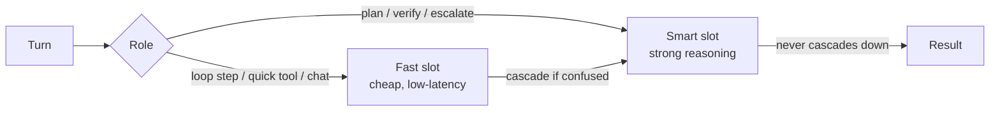

# Two-tier routing <span class="lyra-badge intermediate">intermediate</span>

## What is two-tier routing

Every Lyra session has **two model slots**: `fast` and `smart`. The
fast slot handles the bulk of in-loop turns; the smart slot is
reserved for moments where extra reasoning pays for itself
(planning, hard verification, escalation). This is one of the
most load-bearing cost-shaping patterns in the harness.

Source: [`lyra_core/routing/cascade.py`](https://github.com/lyra-contributors/lyra/tree/main/packages/lyra-core/src/lyra_core/routing/cascade.py) ·
[Commitment 11](../architecture/commitments.md#11-two-tier-routing-with-explicit-fast--smart-slots).

## Why two tiers



The naive alternative — "always use the smart model" — is **5–20×
more expensive** for a daily coding workflow. The other naive
alternative — "always use the fast model" — produces low-quality
plans and weak verification. Two tiers with **explicit role-based
routing** capture the bulk of the quality at a fraction of the cost.

## Default slot configuration

```toml title="~/.lyra/config.toml"
[models.fast]
provider = "deepseek"
model = "deepseek-chat"           # deepseek-v4-flash family
temperature = 0.2
max_tokens = 4096

[models.smart]
provider = "deepseek"
model = "deepseek-reasoner"        # deepseek-v4-pro family
temperature = 0.1
max_tokens = 8192
```

A team can pin different families per slot — common pattern is fast
on a cheap open-weights model, smart on a frontier model:

```toml
[models.fast]
provider = "groq"
model = "llama-3.3-70b-versatile"

[models.smart]
provider = "anthropic"
model = "claude-opus-4.5"
```

The verifier (Phase 2 LLM judge) uses a **third** slot — see
[Verifier](verifier.md#phase-2--subjective-different-family-judge).
Family-conflict checks ensure verifier.family ≠ smart.family.

## Role → slot mapping

The mapping is set in `_resolve_model_for_role`:

| Role | Default slot | Why |
|---|---|---|
| `chat` (loop step) | fast | Most steps don't need depth |
| `plan` | smart | Bad plans are expensive downstream |
| `verify-subjective` | dedicated evaluator | Different family rule |
| `summarize` | fast | Compression is forgiving |
| `extract-skill` | smart | Pattern abstraction needs depth |
| `safety-monitor` | dedicated nano | Cheap, frequent |
| `tts` | dedicated nano (if enabled) | Cost shape |

You can override per-role in config:

```toml
[models.roles]
plan = "smart"             # default; can pin to "fast" for tiny tasks
extract-skill = "fast"     # if you trust your fast model for this
```

## Cascade — when fast escalates to smart

Source: [`lyra_core/routing/cascade.py`](https://github.com/lyra-contributors/lyra/tree/main/packages/lyra-core/src/lyra_core/routing/cascade.py).

The cascade is a controlled escalation path: if the fast model
*explicitly signals it can't handle the turn*, the kernel re-runs
the same turn on the smart model. **The escalation is always
detected by signal, never by silent retry.**

Two signals trigger escalation:

```python
class CascadeSignal(StrEnum):
    OUT_OF_DEPTH      = "out_of_depth"      # model emits special token
    LOW_CONFIDENCE    = "low_confidence"    # logprob below threshold
```

| Signal | Source | Default threshold |
|---|---|---|
| `OUT_OF_DEPTH` | Special token in response: `<lyra:escalate reason="…"/>` | n/a (binary) |
| `LOW_CONFIDENCE` | Mean log-prob of action tokens | < -2.5 nats |

When escalated, the **same context** is replayed against the smart
model. The trace shows both calls; cost attribution accounts both.

```mermaid
%%{init: {'theme': 'dark', 'themeVariables': { 'primaryColor': '#8b5cf6', 'primaryTextColor': '#e2e8f0', 'primaryBorderColor': '#a78bfa', 'lineColor': '#94a3b8', 'secondaryColor': '#1e293b', 'tertiaryColor': '#0d1117', 'background': '#0d1117', 'mainBkg': '#1e293b', 'nodeBorder': '#a78bfa', 'clusterBkg': '#1e293b', 'clusterBorder': '#8b5cf6', 'titleColor': '#c084fc', 'edgeLabelBackground': '#1e293b' }}%%
sequenceDiagram
    Loop->>Fast: turn N
    Fast-->>Loop: <lyra:escalate reason="needs algebra">
    Loop->>Smart: turn N (same context)
    Smart-->>Loop: result
    Loop->>Trace: emit cascade-event(N, fast→smart, reason)
```

A `cascade_rate` metric is exported every session. Healthy systems
sit at < 5% — much higher and your fast model is too weak; near 0%
and you may be wasting smart-slot capacity.

## Disabling cascade

```toml
[routing.cascade]
enabled = true             # default
max_per_session = 8        # circuit-breaker; aborts session if exceeded
allowed_roles = ["chat", "plan"]
```

Setting `enabled = false` disables the escalation path entirely;
the fast model handles every turn and never bumps up. Useful for
deterministic CI runs.

## Upcoming: 3-tier task-type router (Phase 1)

The v3.0 upgrade extends from 2 tiers to **3 tiers** with a
task-type-based router that classifies each turn:

| Tier | Models | When selected | Cost ratio |
|---|---|---|---|
| **Cheap** | Haiku, GPT-4o-mini, Llama-3.3-70B | Row summaries, monitoring, trivial tool calls | 1x |
| **Mid** | Sonnet 4.6, GPT-5, DeepSeek-V4 | Chat, coding, debugging | 3-5x |
| **Expensive** | Opus 4.5, o3, DeepSeek-R2 | Planning, verification, escalation | 10-20x |

The 3-tier router replaces the heuristic-based route decision with a
**learned classifier** (or hand-crafted rules until 100K+ examples
accumulate):

```python
class TaskType(StrEnum):
    CHAT        = "chat"         # cheap
    CODE        = "code"         # mid
    DEBUG       = "debug"        # mid
    PLAN        = "plan"         # expensive
    VERIFY      = "verify"       # expensive
    RESEARCH    = "research"     # mid (if simple) or expensive (if deep)
    MONITOR     = "monitor"      # cheap
    SUMMARIZE   = "summarize"    # cheap
```

The router can be configured per session:

```toml
[routing]
strategy = "task-type"          # task-type | cascade | fixed
default_tier = "mid"

[routing.task_type]
chat = "cheap"
code = "mid"
plan = "expensive"
```

## Upcoming: memory-augmented routing — >= 40% cost reduction (Phase 2)

The key insight from "Knowledge Access Beats Model Size" (2603.23013):
**memory caches answers, so cheap models handle repeats**:

```mermaid
sequenceDiagram
    participant Loop
    participant Router
    participant Mem as Memory
    participant Cheap
    participant Smart

    Loop->>Router: turn N
    Router->>Mem: "Has this query been answered before?"
    Mem-->>Router: yes → cached result + confidence=0.92
    Router->>Cheap: verify with cheap model
    Cheap-->>Loop: response ($0.001)
    Note over Loop,Cheap: 92% cost reduction on repeat query

    alt First-time query
        Router->>Smart: route to expensive model
        Smart-->>Loop: response ($0.02)
        Loop->>Mem: cache result for future repeats
    end
```

The router checks memory before every turn:
- **Cache hit + high confidence**: route directly to cheap model
- **Cache hit + medium confidence**: cheap model verifies, expensive model
  is only called if verification fails
- **Cache miss**: route to the tier determined by task-type classifier

Expected impact: >= 40% per-session cost reduction on coding workflows
with repeated queries. See
[lyra-upgrade/brainstorm/05-model-router.md](../lyra-upgrade/brainstorm/05-model-router.md).

## Upcoming: capability-aware degradation (Phase 1)

The 3-tier router also checks provider **capability matrix** before
routing. If a tier's model lacks a required capability (e.g., no tool
use, no vision), the router degrades gracefully:

```python
def route_for_task(task: Task, capabilities: CapabilityMatrix) -> ModelSlot:
    tier = classifier(task)
    model = slot_for_tier(tier)
    if not model.supports(task.required_capabilities):
        # degrade: try mid, then expensive, then error
        for fallback_tier in ["mid", "expensive"]:
            fallback = slot_for_tier(fallback_tier)
            if fallback.supports(task.required_capabilities):
                return fallback
        raise NoCapableModelError(f"No model supports {task.required_capabilities}")
    return model
```

This prevents silent failures where a cheap model without tool-use
capability is assigned a tool-heavy task.

## Upcoming: effort scale mapping per provider (Phase 1)

The effort scale (`low` to `ultracode`) is mapped to provider-specific
parameters through the **ProviderAbstraction**:

| Effort | Anthropic | DeepSeek | GPT | Open-Weights |
|---|---|---|---|---|
| low | thinking: 1024 | prompt: "be concise" | reasoning_effort: low | max_tokens: 512 |
| medium | thinking: 4096 | default | reasoning_effort: medium | max_tokens: 2048 |
| high | thinking: 8192 | extended thinking | reasoning_effort: high | max_tokens: 4096 |
| xhigh | thinking: 16384 | CoT prompting | reasoning_effort: max | max_tokens: 8192 |
| max | thinking: 31999 | CoT + self-critique | reasoning_effort: max | max_tokens: 16384 |
| ultracode | thinking: 16384 + orchestration ON | CoT + orchestration ON | reasoning_effort: max + orch. ON | max_tokens: 8192 + orch. ON |

The mapping is provider-agnostic — [`lyra-effort`](../lyra-upgrade/MASTER-PLAN.md)
implements the per-provider translation table.

## Why explicit slots beat implicit "model picker"

Some agent frameworks pick a model per-turn from a heuristic. Lyra
chose explicit slots because:

- **Predictable cost.** You can budget by role.
- **Predictable quality.** A team can test changes against a fixed
  smart slot, knowing the fast slot won't silently substitute.
- **Trace clarity.** `model.fast` vs `model.smart` is a
  human-readable distinction; "model `gpt-5-mini-2025-something`"
  is not.
- **Family discipline.** Verifier conflict checks need clean role
  separation, not opaque routing.

## Why two-tier routing

Two-tier routing is Lyra's primary cost-shaping mechanism. The naive "always use the smart model" approach is 5-20x more expensive for daily coding; the naive "always use the fast model" produces low-quality plans and weak verification. Two explicit slots with role-based routing capture quality at a fraction of the cost, and the cascade signal lets the fast model escalate when it hits its limits.

## When to use two-tier routing

- Two-tier routing is active by default. Configure fast and smart slots in `~/.lyra/config.toml` under `[models.fast]` and `[models.smart]`.
- Use different provider families per slot for best results (e.g., cheap open-weights for fast, frontier model for smart).
- Monitor `cascade_rate` per session — below 5% is healthy. Much higher means the fast model may be too weak; near 0% means smart capacity is underutilised.

## When NOT to use two-tier routing

- Do not disable cascade entirely in interactive sessions — the fast model will never escalate, and quality may suffer on complex turns.
- In deterministic CI runs where every turn must be reproducible, set `[routing.cascade] enabled = false`.
- Avoid using the same model family for generator and verifier. The family-conflict check ensures evaluation is independent of generation.

## Next steps

1. Read [ReasoningBank](reasoning-bank.md) to see how routing interacts with memory-augmented retrieval.
2. For the 3-tier task-type router upgrade (Phase 1), see [lyra-upgrade/brainstorm/05-model-router.md](../lyra-upgrade/brainstorm/05-model-router.md).
3. For the memory-augmented routing upgrade (Phase 2), see the same brainstorm document.
4. The provider abstraction and slot resolver live in `lyra_core/providers/__init__.py`.

## Where to look in the source

| File | What lives there |
|---|---|
| `lyra_core/routing/cascade.py` | Cascade logic + signals |
| `lyra_core/routing/classifier.py` | 3-tier task-type classifier *(Phase 1)* |
| `lyra_core/routing/memory_augmented.py` | Memory-augmented routing for repeat queries *(Phase 2)* |
| `lyra_core/routing/capability.py` | Capability-aware degradation checker *(Phase 1)* |
| `lyra_effort/mapping.py` | Per-provider effort scale mapping *(Phase 1)* |
| `lyra_core/providers/__init__.py` | Slot resolver `_resolve_model_for_role` |
| `lyra_core/verifier/evaluator_family.py` | Family-conflict guard |

[← Sessions and state](sessions-and-state.md){ .md-button }
[Continue to ReasoningBank →](reasoning-bank.md){ .md-button .md-button--primary }
