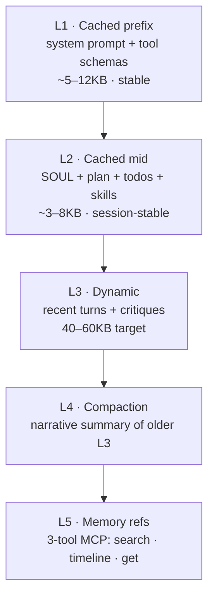

# Context engine <span class="lyra-badge intermediate">intermediate</span>

The context engine is responsible for **what the model sees** each
turn. It implements a five-layer pipeline that maximises prompt cache
hits, never compacts the persona, and falls back to memory references
when the working set spills over.

Source: [`lyra_core/context/`](https://github.com/lyra-contributors/lyra/tree/main/packages/lyra-core/src/lyra_core/context) ·
canonical spec: [`docs/blocks/06-context-engine.md`](../blocks/06-context-engine.md).

## The five layers



| Layer | Volatility | Cache breakpoint | Contents |
|---|---|---|---|
| **L1** prefix | Across sessions | `after L1` | System prompt, tool schemas, global constants |
| **L2** mid | Per session | `after L2` | `SOUL.md`, plan summary, todos, skill descriptions, MCP descriptions |
| **L3** dynamic | Per turn | none | Recent turns, current critique, current user message |
| **L4** compaction | Triggered | none | Narrative summary that *replaces* old L3 turns |
| **L5** memory refs | On demand | none | Reference handles into [three-tier memory](memory-tiers.md) |

The cache breakpoints are explicit for Anthropic (90%+ hit rate
typical) and implicit for OpenAI / Gemini (best-effort).

## Assembly

```python title="context/assemble.py"
def assemble(session: Session, task: str, plan: Plan | None) -> Transcript:
    msgs = []
    msgs.append(Message.system(session.system_prompt()))                # L1
    msgs.append(Message.system(soul.read(session)))                      # L2: SOUL
    if plan:
        msgs.append(Message.system(plan.summary_for_context()))          # L2: plan
    msgs.append(Message.system(todo.render(session)))                    # L2: todo
    msgs.append(Message.system(skills.scope_descriptions(session)))      # L2: skills
    msgs.append(Message.system(mcp.registered_descriptions(session)))    # L2: mcp
    msgs.append(Message.user(task))                                       # L3 seed
    return Transcript(msgs, cache_breakpoints=[after=L1_idx, after=L2_idx])
```

Order is **fixed** so prompt caching works across turns. If you reorder
even one L2 line, the cache misses and your bill goes up.

## SOUL.md is never compacted

`SOUL.md` is the agent's persona — values, tone, hard constraints
about *who it is with this user*. SemaClaw's research showed persona
drift is the dominant long-session failure mode, so:

- SOUL lives in L2 (cached, sessionwide).
- Compaction never touches it.
- Hard size cap (~2 KB default) keeps it from creeping.

If you want to see what's in SOUL right now, run `/soul show`. To edit
it, `/soul edit`.

## Compaction

```mermaid
sequenceDiagram
    participant Loop
    participant CE as Context Engine
    participant LLM
    participant Store as Artifact Store

    Loop->>CE: tokens > 0.85 × max_tokens?
    CE->>CE: identify keep-window (last K turns)
    CE->>CE: identify compact-window (older turns)
    CE->>LLM: summarize(compact_window) using cheap model
    LLM-->>CE: narrative summary
    CE->>Store: archive raw bodies (hash-addressed)
    CE->>Loop: new transcript = L1 + L2 + summary + keep-window
```

The summary preserves:

- File:line anchors that were referenced
- Failing test names
- Unresolved questions
- Tool-call counts

It discards:

- Raw output bodies (now in the artifact store, retrievable by `view <hash>`)
- Repetitive confirmations

If compaction itself fails, Lyra drops the middle third of L3 and
appends a `[compaction-truncated]` annotation. The transcript stays
runnable.

## Layer 5: progressive disclosure

When the model suspects an answer lives in **memory** but isn't sure,
it doesn't pre-load — it uses three small tools:

```
MemorySearch(query, limit=5)   → list of {id, title, snippet, score}
MemoryTimeline(tag|date_range) → list of {id, ts, kind, title}
MemoryGet(id)                   → full content (cited)
```

This is the [claude-mem](https://github.com/withseismic/claude-mem)
pattern: cheap recall, expensive load only when warranted. The full
contract is on the [memory tiers page](memory-tiers.md).

## Observation reduction

Big tool outputs (a `read` of a 500-line file, a `bash` log of 10 KB)
would blow the transcript instantly. Reduction shrinks them:

| Tool | Reduced form |
|---|---|
| `read` (large file) | First 50 + last 20 lines + `[truncated, view <hash> for full]` |
| `bash` (long log) | Last 80 lines + exit code + duration; full log artifact-stored |
| `web_fetch` | Title + first 500 words + `[view <hash> for full]` |
| `grep` (many matches) | First 20 hits + total count + `[view <hash>]` |

The full payload is always available as an artifact; the model can
pull it back with `view <hash>` if the reduction lost something it
needs.

## Cache hit metrics

`/cost` shows you the cache hit ratio. A healthy session sits around
**80%+ L1+L2 hit rate**. If you see it drop:

- You probably edited SOUL or plan mid-session (expected; cache rebuilds)
- Or you're switching models (caches are model-specific)
- Or you're in a session that's been running so long that compaction
  fires every turn — consider `/save` and starting fresh

## Where to look in the source

| File | What lives there |
|---|---|
| `lyra_core/context/assemble.py` | `assemble` — the function above |
| `lyra_core/context/compact.py` | Compaction algorithm and keep-window logic |
| `lyra_core/context/reduce.py` | Per-tool observation reducers |
| `lyra_core/context/cache.py` | Provider-specific cache breakpoint emitters |

[← Permission bridge](permission-bridge.md){ .md-button }
[Continue to Three-tier memory →](memory-tiers.md){ .md-button .md-button--primary }
