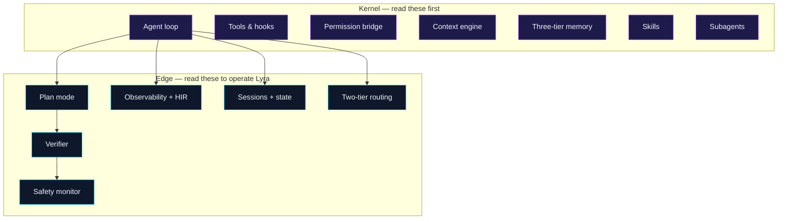

# Core Concepts intermediate

If [Get Started](../start/index.md) showed you **how to drive** Lyra, this
section explains **what's actually happening** inside it. Read this if
you want to extend the kernel, write a serious skill, or just read the
source confidently.

## The big picture

Lyra is the composition of seven **kernel** concepts plus six **edge**
concepts. Each one is small enough to fit in one diagram and one page.

## Kernel concepts

These are the seven mental models the rest of the system rests on.
If you only have time for half a day with Lyra, read these.

| # | Concept | One-line read |
|---|---------|---------------|
| 1 | [The agent loop](agent-loop.md) | The kernel: assemble → think → tool → reduce → repeat. |
| 2 | [Tools and hooks](tools-and-hooks.md) | Tools = typed actions. Hooks = deterministic Python on lifecycle events. |
| 3 | [Permission bridge](permission-bridge.md) | Authorization is a runtime primitive, not an LLM decision. |
| 4 | [Context engine](context-engine.md) | Five layers, prompt-cache aware, never compacts SOUL. |
| 5 | [Three-tier memory](memory-tiers.md) | Procedural (skills) + episodic (traces) + semantic (facts). |
| 6 | [Skills](skills.md) | `SKILL.md` files, loaded by description, curated in the background. |
| 7 | [Subagents](subagents.md) | Scoped agents in git worktrees with structured returns. |

## Edge concepts

These are the *operational* concepts — the pieces that make Lyra
predictable, observable, and safe in real workflows.

| # | Concept | One-line read |
|---|---------|---------------|
| 8 | [Plan mode](plan-mode.md) | Non-trivial tasks become an approvable plan artifact first. |
| 9 | [Verifier](verifier.md) | Two-phase verification with cross-channel evidence; catches fabricated success. |
| 10 | [Safety monitor](safety-monitor.md) | Continuous nano-model monitor that votes alongside hooks. |
| 11 | [Observability and HIR](observability.md) | Every span, every cost, every replay — OTel-compatible. |
| 12 | [Sessions and state](sessions-and-state.md) | `STATE.md` is human-readable, load-bearing, and resumable. |
| 13 | [Two-tier routing](two-tier-routing.md) | Fast slot for loops, smart slot for planning, cascade in between. |
| 14 | [ReasoningBank](reasoning-bank.md) | Lyra learns from both success and failure — distilled lessons + MaTTS test-time scaling. |
| 15 | [Prompt-cache coordination](prompt-cache-coordination.md) | One cache write up front, `N − 1` hits per fan-out — the hosted-API absorption of PolyKV. |

## Reading order

Pages are written so each one assumes the previous. If you only read
three, read **agent-loop**, **permission-bridge**, and **skills** —
they're the load-bearing concepts the others rest on. After that,
**plan-mode** + **verifier** explain the operational discipline that
keeps Lyra honest.

[Start with the agent loop →](agent-loop.md){ .md-button .md-button--primary }
