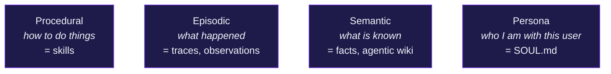
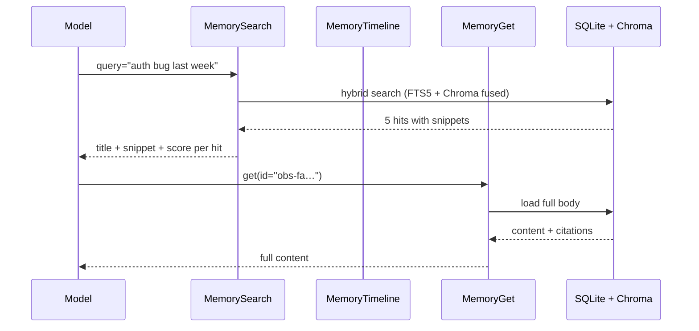

# Three-tier memory <span class="lyra-badge intermediate">intermediate</span>

Lyra remembers across sessions. It does so with a **hybrid memory
store** (SQLite FTS5 + Chroma) partitioned across three semantic tiers
plus a separate persona partition.

Source: [`lyra_core/memory/`](https://github.com/lyra-contributors/lyra/tree/main/packages/lyra-core/src/lyra_core/memory) ·
canonical spec: [`docs/blocks/07-memory-three-tier.md`](../blocks/07-memory-three-tier.md).

## The three tiers



| Tier | What lives there | Update path |
|---|---|---|
| **Procedural** | `SKILL.md` files (full bodies) | [Skill extractor](skills.md#the-extractor) writes / refines |
| **ReasoningBank** | Distilled `Lesson`s (success + anti-skill) | [HeuristicDistiller](reasoning-bank.md#distillers) on every trajectory; persists to SQLite |
| **Episodic** | Per-turn observations, trace summaries, artifact refs | Auto on compaction + `SESSION_END`; explicit `memory.write` |
| **Semantic** | Durable facts, agentic-wiki entries | Wiki skill + user-edited `MEMORY.md` |
| **Persona** | `SOUL.md` | Hand-edited; lives in L2 forever, never compacted |
| **Prompt cache** *(per-call optimisation, not a tier)* | Hashed shared-prefix anchor per `(provider, digest)` | [`PromptCacheCoordinator`](prompt-cache-coordination.md); 5-min TTL; sibling subagents hit |

## Storage

| Backend | Stores |
|---|---|
| `lyra.db` (SQLite) | sessions, observations, summaries, wiki metadata, extraction provenance |
| SQLite **FTS5** virtual tables | full-text search over observations / wiki entries |
| **Chroma** (on-disk) | semantic embeddings of the same content |
| Files (`.md`) | `SOUL.md`, `MEMORY.md`, `wiki/*.md`, `feedback/*.md`, `skills/*/SKILL.md` |

Consistency: writes go to SQLite first (atomic), then Chroma
(best-effort with retry). A daily reconciler reconciles drift between
the two indexes.

## Schema (SQLite)

```sql
CREATE TABLE sessions (
  id TEXT PRIMARY KEY, repo_root TEXT,
  created_at TEXT, ended_at TEXT, status TEXT
);

CREATE TABLE observations (
  id TEXT PRIMARY KEY, session_id TEXT,
  ts TEXT, kind TEXT,        -- fact | decision | mistake | preference
  content TEXT, citations TEXT,
  is_private INTEGER DEFAULT 0,
  tags TEXT
);

CREATE VIRTUAL TABLE observations_fts USING fts5(
  content, tags, tokenize='porter unicode61'
);

CREATE TABLE wiki_entries (
  id TEXT PRIMARY KEY, title TEXT, body_path TEXT,
  tags TEXT, created_at TEXT, updated_at TEXT,
  ttl_days INTEGER, confidence REAL
);
```

A trigger keeps `observations_fts` in sync with the base table.

## Embedding

Default: **BGE-small-en-v1.5** (33M params), running on CPU. Chroma
stores 384-dim vectors. Configurable in `~/.lyra/config.toml`:

```toml
[memory.embedding]
provider = "local"     # local | openai | cohere | voyage
model = "BAAI/bge-small-en-v1.5"
batch_size = 32
```

If you switch providers, run `lyra memory reembed` to rebuild Chroma
from the SQLite source of truth.

## The 3-tool MCP surface (progressive disclosure)



The model **never preloads** memory. It searches when it suspects an
answer exists, gets the snippet, and only fetches the full body if the
snippet looks promising. This pattern keeps L3 small and bills low.

## Hybrid search ranking

`MemorySearch` runs FTS5 and Chroma in parallel and fuses with
**reciprocal rank fusion** (RRF):

```
score(item) = sum over engines of 1 / (k + rank_in_that_engine)
```

with `k=60` (default). The fused list is the result. RRF is
parameter-cheap and resilient to either engine returning garbage.

## Privacy

Any observation written with `is_private=1` is:

- excluded from any provider that isn't allowlisted as
  `privacy_allowed`
- redacted in the trace export
- visible to the agent in-session, but never reflected into the model
  call's full prompt unless the user explicitly approves

`<private>` markers in `MEMORY.md` and wiki files create the same
behaviour without touching SQL.

## Pruner

Memory grows. The background pruner runs every N completed sessions
(default 15) and tiers entries by:

| Tier | Retention |
|---|---|
| `keep` | High utility, recent | Keep indefinitely |
| `watch` | Lower utility | Keep, mark stale-after = 30d |
| `archive` | Stale, low utility | Move to `~/.lyra/memory/archive/` |
| `delete` | Garbage / superseded | Hard delete (after dry-run report) |

The first run on each machine is **dry-run** by default. Inspect with
`/memory prune --dry-run` and approve with `/memory prune --apply`.

## Where to look in the source

| File | What lives there |
|---|---|
| `lyra_core/memory/store.py` | SQLite + Chroma client, hybrid search, RRF fuser |
| `lyra_core/memory/observations.py` | Observation schema and writers |
| `lyra_core/memory/wiki.py` | Agentic-wiki entries with TTL |
| `lyra_core/memory/pruner.py` | The tiered pruner |

[← Context engine](context-engine.md){ .md-button }
[Continue to Skills →](skills.md){ .md-button .md-button--primary }
