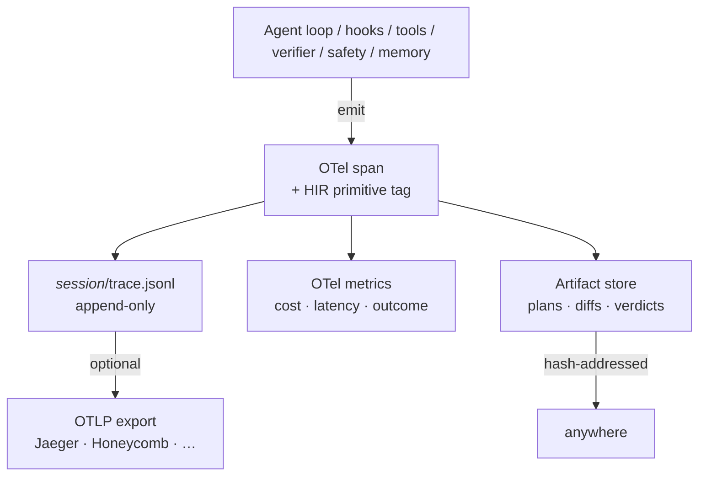

# Observability and HIR <span class="lyra-badge advanced">advanced</span>

Observability is a first-class pillar in Lyra, not an afterthought.
Every model call, every tool, every hook, every permission decision,
every memory write emits a structured event. The events are
**OpenTelemetry-compatible** for generic backends (Jaeger, Honeycomb,
Datadog) and **HIR-compatible** (Harness Intermediate Representation)
for agent-specific tooling like HAFC, SHP, and autogenesis.

Source: [`lyra_core/observability/`](https://github.com/lyra-contributors/lyra/tree/main/packages/lyra-core/src/lyra_core/observability) ·
[`lyra_core/hir/`](https://github.com/lyra-contributors/lyra/tree/main/packages/lyra-core/src/lyra_core/hir) ·
canonical spec: [`docs/blocks/13-observability-hir.md`](../blocks/13-observability-hir.md).

## Three outputs



| Output | Where it goes | What's in it |
|---|---|---|
| **Spans** | `.lyra/sessions/<id>/trace.jsonl` (always) + OTLP (optional) | Tool calls, model calls, hooks, decisions |
| **Metrics** | `.lyra/sessions/<id>/metrics.jsonl` + Prometheus-shape gauge | Cost, latency, outcome, p95 budgets |
| **Artifacts** | `.lyra/sessions/<id>/artifacts/<hash>` | Plans, diffs, evaluator verdicts, large tool outputs |

## HIR — the IR everyone agrees on

[Gnomon's HIR](https://github.com/lyra-contributors/gnomon-hir) is a
framework-neutral schema for agent traces. Lyra adopts the schema and
extends it with harness-specific event types so the same trace runs
through:

- HAFC (Harness Agreement Failure Classifier)
- SHP (Step-level Harness Profiler)
- autogenesis (curriculum miner)

without an adapter.

### The event shapes

Source: [`lyra_core/hir/events.py`](https://github.com/lyra-contributors/lyra/tree/main/packages/lyra-core/src/lyra_core/hir/events.py).

```python
AgentLoop.start(session_id, task, soul_hash, plan_hash)
AgentLoop.step(step_no, think_text_ref, model, usage)
AgentLoop.end(status, cost_usd, steps, final_text_ref)

PermissionBridge.decision(tool, args_digest, mode, policy_ref, decision, risk, reason)

Hook.start(event, hook_name)
Hook.end(decision, duration_ms)

Tool.call(tool, args_ref)
Tool.result(result_ref, exit_code, duration_ms)

Subagent.spawn(id, purpose, scope, budget)
Subagent.result(id, outcome, summary_ref)

Context.compaction(strategy, tokens_before, tokens_after, preservation_refs)

Memory.read(tier, query, result_ref)
Memory.write(tier, artifact_ref)

Evaluator.verdict(verdict, rubric_scores, evidence_refs)
Safety.check(verdict, confidence, evidence_refs)
TDD.state_change(from_phase, to_phase, reason, evidence_ref)
```

Every event carries `trace_id`, `span_id`, `parent_span_id`, `ts`,
`session_id`, and `actor` (`generator` / `evaluator` / `monitor` /
`scheduler`).

## OTel export

Source: [`lyra_core/observability/otel_export.py`](https://github.com/lyra-contributors/lyra/tree/main/packages/lyra-core/src/lyra_core/observability/otel_export.py).

When `[observability.otel] endpoint` is set, Lyra streams spans over
OTLP (gRPC by default, HTTP if configured) **in parallel** to writing
the JSONL trace. The two outputs are designed to stay in sync: the
JSONL is the source of truth, the OTel export is best-effort.

```toml title="~/.lyra/config.toml"
[observability.otel]
endpoint = "http://localhost:4317"     # gRPC
service_name = "lyra"
resource_attrs = { env = "dev" }
```

Spans use the **OTel GenAI semantic conventions** (model, usage,
prompt category, etc.) so generic OTel viewers render them sensibly.

## Replay

Source: [`lyra_core/observability/retro.py`](https://github.com/lyra-contributors/lyra/tree/main/packages/lyra-core/src/lyra_core/observability/retro.py).

A trace is **replayable** without re-calling the LLM. The `retro`
module walks the JSONL stream and reconstructs:

- The transcript at any step
- The tool call inputs and outputs (from artifact refs)
- The hook decisions and their reasons
- The cost / token usage timeline

This is what the [debug mode](../howto/debug-mode.md)
`time_travel_replay` tool surfaces interactively. From the CLI:

```bash
lyra trace show <session-id> --step 12
lyra trace timeline <session-id>
lyra trace cost <session-id> --by tool
lyra trace export <session-id> --format otlp > trace.otlp
```

## Cost attribution

Cost is recorded **per actor and per role** so you can answer:

- "How much did the planner cost vs. the generator?"
- "How much did MCP-tool calls cost vs. built-in tools?"
- "Which subagent burned the most tokens?"

`/cost` in a session shows the live attribution table:

```
attribute              cost_usd     %
generator (fast)         0.034    27%
generator (smart)        0.067    54%
evaluator (different)    0.018    14%
safety monitor (nano)    0.005     4%
                        ------
total                    0.124   100%
```

## What you can do with the trace

| Use case | How |
|---|---|
| Debug a flaky run | `lyra trace show <id>` step-by-step |
| Compare two runs | `lyra trace diff <id1> <id2>` |
| Compute eval metrics | Pipe JSONL through `lyra-evals` scorers |
| Reconstruct lost context | `retro.assemble_at(session, step)` |
| Replay against new model | `lyra trace replay <id> --replay-model openai:gpt-5` |
| Privacy redaction | `lyra trace redact <id> --policy default` |

## Where to look in the source

| File | What lives there |
|---|---|
| `lyra_core/hir/events.py` | The event schema |
| `lyra_core/observability/hir.py` | Span emission helpers |
| `lyra_core/observability/otel_export.py` | OTLP export |
| `lyra_core/observability/retro.py` | Trace replay / reconstruction |

[← Safety monitor](safety-monitor.md){ .md-button }
[Continue to Sessions and state →](sessions-and-state.md){ .md-button .md-button--primary }
