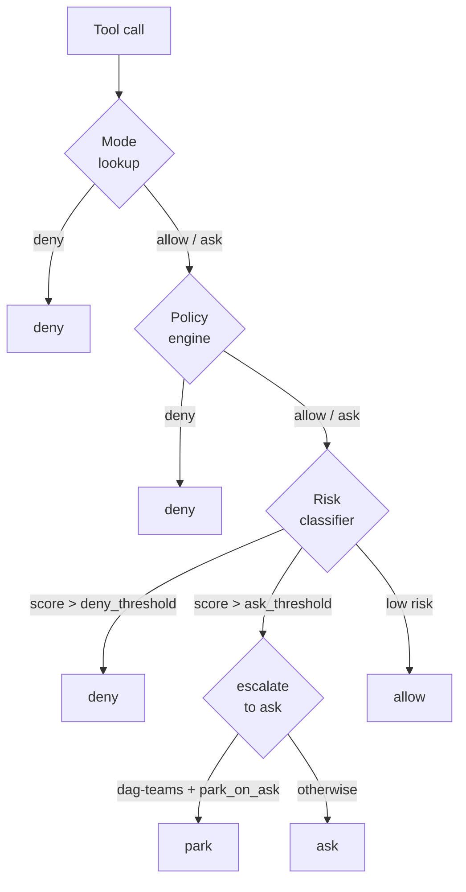
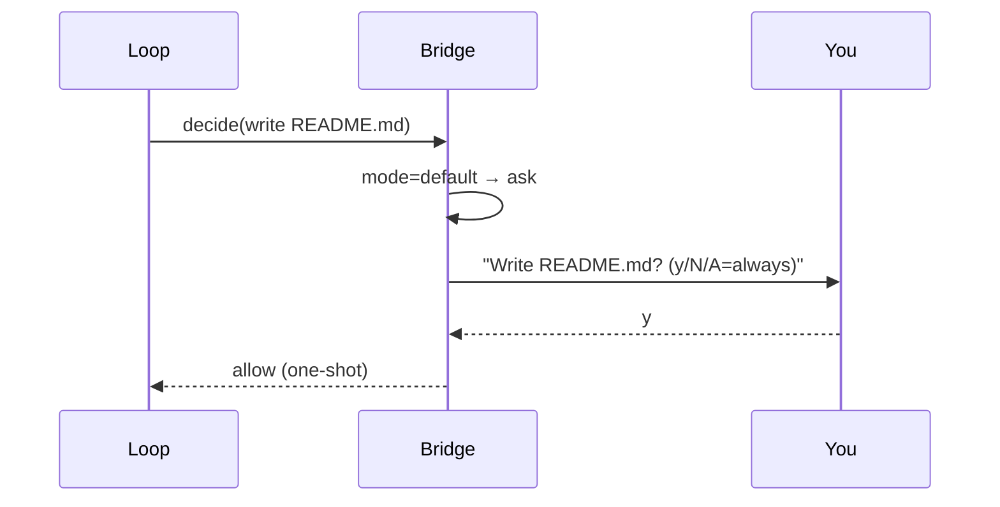
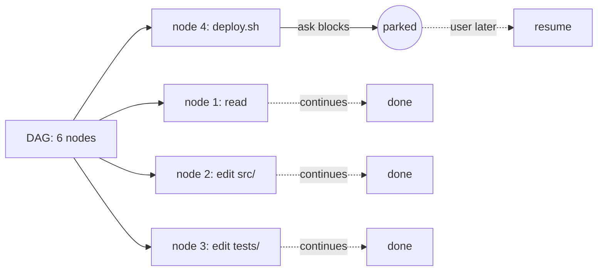

# Permission bridge <span class="lyra-badge intermediate">intermediate</span>

Every tool call in Lyra — every single one, no matter the mode — flows
through one function: `PermissionBridge.decide(call, session) →
Decision`. The model never holds the keys.

This is the **load-bearing safety primitive**. It makes Lyra robust
against prompt injection, against runaway agents, and against the model
arguing itself into a destructive shell command.

Source: [`lyra_core/permissions/`](https://github.com/lyra-contributors/lyra/tree/main/packages/lyra-core/src/lyra_core/permissions) ·
canonical spec: [`docs/blocks/04-permission-bridge.md`](../blocks/04-permission-bridge.md).

## The decision pipeline



The order is **mode → policy → risk → parking**. Each layer can only
*deny more*, never *allow more*. This is what makes the bridge
auditable.

## The four decisions

```python
class Decision(StrEnum):
    ALLOW = "allow"   # proceed silently
    ASK   = "ask"     # block on user approval
    DENY  = "deny"    # do not proceed
    PARK  = "park"    # defer; downstream DAG nodes may proceed
```

`PARK` is the SemaClaw contribution: in `dag-teams` mode, an `ask`
decision on one DAG node would normally stall the entire team. Parking
lets the rest of the DAG continue while that one node waits for human
input.

## The eight permission modes

Modes are coarse-grained policies. The Bridge looks the call up in a
**mode × tool table** before running the rest of the pipeline.

| Mode | Reads | Writes (worktree) | Writes (outside) | Bash | Network | Use |
|---|---|---|---|---|---|---|
| `plan` | yes | **deny** | **deny** | **deny** | allowlist only | Planner / explore |
| `triage` | yes | ask | deny | ask | ask | Initial investigation |
| `default` | yes | ask | deny | ask | ask | Normal interactive |
| `acceptEdits` | yes | yes | deny | ask (risk-classified) | ask | Steady execution |
| `red` | yes | tests only | deny | ask | deny | TDD RED phase |
| `green` | yes | tests + src | deny | ask | deny | TDD GREEN phase |
| `refactor` | yes | src (coverage-guarded) | deny | ask | deny | Refactor phase |
| `bypass` | yes | yes | ask | ask | ask | Power user (friction prompt) |

`bypass` is **not** a silent allow-all. Destructive patterns still
deny, secrets still get scanned, the `STOP` hook still runs. It just
removes the per-tool ask prompt for routine writes.

## How a mode actually changes behaviour

The mode lookup is a static table — concrete slice:

```yaml title="permissions/modes.py (excerpt)"
plan:
  read: allow
  grep: allow
  glob: allow
  edit: deny
  write: deny
  bash: deny

acceptEdits:
  read: allow
  grep: allow
  edit: allow
  write: allow
  bash: ask        # falls into the risk classifier
```

When you flip mode with `/mode plan_mode`, the bridge picks up the new mode
on the very next tool call. There is no model round-trip required.

## Mode transitions

The model **cannot** change modes unilaterally. Transitions happen via:

| Trigger | Example |
|---|---|
| CLI flag | `lyra --mode plan` |
| In-session command | `/mode plan_mode` |
| Plan approval | Approving a plan flips `plan` → `default` automatically |
| Phase progression | TDD plugin flips `red` → `green` → `refactor` after each phase proof |

Every transition emits a `permission.mode_change` trace event with
before / after / reason — so a transcript replay always shows *why* a
write was suddenly allowed.

## What an `ask` looks like



The CLI surfaces an inline prompt with three options:

- **y** — allow this one call
- **N** — deny this one call (the loop appends a denial observation)
- **A** — allow forever for this `(tool, path-pattern)` combination
  in this session

Per-session `A` decisions live in `session.policy_overrides`; they
do not persist across sessions.

## The risk classifier

A small rules engine + an optional ML model. It scores each call
0.0–1.0:

```python
risk = risk_classifier.score(call, session)

if risk.score > session.config.risk_deny_threshold:
    return PermissionDecision(Decision.DENY, reason=f"risk: {risk.label}")

if risk.score > session.config.risk_ask_threshold and mode_decision.allow:
    mode_decision = PermissionDecision(Decision.ASK, reason=f"risk: {risk.label}")
```

Default thresholds: `risk_ask_threshold = 0.4`, `risk_deny_threshold =
0.85`. Tune in `~/.lyra/config.toml`:

```toml
[permissions]
risk_ask_threshold = 0.4
risk_deny_threshold = 0.85
```

## Parking (DAG teams)

When the harness is `dag-teams`, an `ask` would normally block the
entire team. Parking sidesteps this:



Parked decisions stay in the bridge's parking lot; you resolve them
with `/park list` and `/park resume <id>`.

## Tracing

Every decision emits a `permission.decide` span tagged with `HIR =
permission_decision`. Replays of a session always show the full
"what was asked → who said yes → what was the reason" chain.

## Where to look in the source

| File | What lives there |
|---|---|
| `lyra_core/permissions/bridge.py` | `PermissionBridge.decide` — the pipeline above |
| `lyra_core/permissions/modes.py` | The mode × tool lookup table |
| `lyra_core/permissions/risk.py` | Risk classifier (rules + ML) |
| `lyra_core/permissions/parking.py` | Park / resume |

[← Tools and hooks](tools-and-hooks.md){ .md-button }
[Continue to Context engine →](context-engine.md){ .md-button .md-button--primary }
