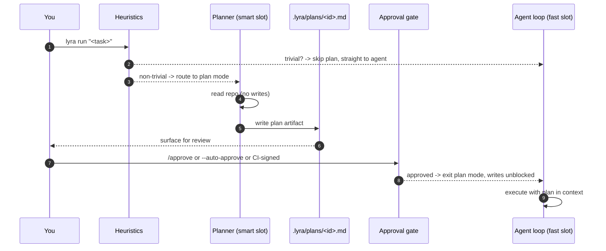
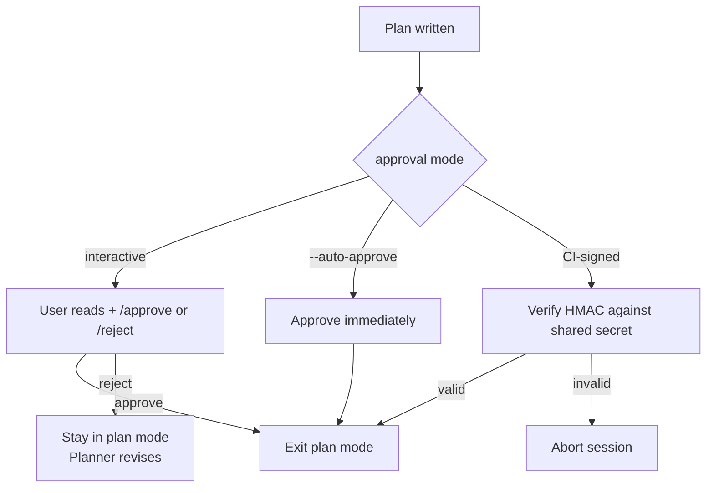

# Plan mode <span class="lyra-badge intermediate">intermediate</span>

Plan mode is Lyra's default entry point for non-trivial tasks. Rather
than letting the model start editing immediately, Lyra produces a
**human-readable plan artifact** under `.lyra/plans/<session-id>.md`
and holds execution until you approve. This front-loads
misunderstandings and creates the contract used by the
[verifier](verifier.md), the [skill extractor](skills.md#the-extractor),
and cross-session continuity.

Source: [`lyra_core/plan/`](https://github.com/lyra-contributors/lyra/tree/main/packages/lyra-core/src/lyra_core/plan) ·
canonical spec: [`docs/blocks/02-plan-mode.md`](../blocks/02-plan-mode.md).

## What plan mode does



Five responsibilities, three big design choices:

1. **Read-only Planner.** All write tools are denied during plan mode.
2. **Smart slot for planning.** The planner uses the *smart* model
   (default `deepseek-v4-pro` → `deepseek-reasoner`); the loop drops
   back to the *fast* slot once execution starts. See
   [Two-tier routing](two-tier-routing.md).
3. **Plan artifact is the contract.** It's the input the verifier
   checks against, not the original prompt.

## Heuristics: when plan mode kicks in

`lyra_core/plan/heuristics.py` decides whether a task is "non-trivial":

| Signal | Weight |
|---|---|
| Task mentions multiple files / subsystems | high |
| Task says "design", "refactor", "architecture", "migrate" | high |
| Token count of task > 200 | medium |
| Repo has > 1,000 files | low |
| Previous task in this session needed > 5 tool calls | low |

Above the trigger threshold, plan mode runs. Skip with `--no-plan`
for explicitly trivial tasks ("rename `getCwd` to `getCurrentWorkingDirectory`").

## The plan artifact (schema)

```markdown
---
session_id: 01HXK2N…
created_at: 2026-04-22T14:23:00Z
planner_model: deepseek-v4-pro
estimated_cost_usd: 1.20
goal_hash: sha256:abcdef…
---

# Plan: Add dark mode toggle that persists across reloads

## Acceptance tests
- tests/settings/test_theme_toggle.py::test_toggle_visible
- tests/settings/test_theme_toggle.py::test_persists_across_reload
- e2e/test_theme_persistence.spec.ts::persists_in_localStorage

## Expected files
- src/settings/ThemeToggle.tsx
- src/settings/useTheme.ts
- src/settings/__tests__/useTheme.test.ts
- src/App.tsx (1 import, 1 mount)

## Forbidden files
- package.json      # no new deps needed

## Steps
1. Add `useTheme` hook with localStorage persistence …
2. Create `ThemeToggle` component …
3. Mount in App.tsx …
4. Write the three tests …
```

The five sections are **load-bearing**: every block of the verifier
checks one of them.

| Section | Used by |
|---|---|
| Acceptance tests | Verifier objective phase (must pass) |
| Expected files | Verifier objective phase (must exist with expected role) |
| Forbidden files | Verifier objective phase (must NOT be modified) |
| Steps | Skill extractor (turns into procedure) |
| Goal hash | Cross-session resume (proves plan continuity) |

## Approval

Three approval paths:



`--auto-approve` is fine for trusted CI; for human-in-the-loop the
default is interactive `/approve`.

CI-signed approval verifies an HMAC of `(plan_path, goal_hash,
session_id)` against `LYRA_APPROVAL_SECRET`. This lets a planning
job in CI commit a signed plan that a downstream execution job can
trust without a human in the loop.

## What's in scope when the plan executes

The agent loop receives the plan **summarized into L2** (just the
acceptance tests + expected files + step list). The full plan is in
the artifact store; the agent can `view <plan-hash>` to read it again.

Permission mode auto-flips on approval based on the plan's risk:

| Plan risk | Mode after approval |
|---|---|
| Low | `default` |
| Medium | `acceptEdits` |
| High (touches > 10 files or has Bash steps) | stay `default` (more asks) |

## Inspecting and resuming a plan

```bash
lyra plans list
lyra plans show <session-id>
lyra plans resume <session-id>     # resumes the session with the plan loaded
```

Plans are git-trackable (`git add .lyra/plans/`). Many teams commit
plans for big features so PR reviewers can see the brief before the
diff.

## Where to look in the source

| File | What lives there |
|---|---|
| `lyra_core/plan/planner.py` | Planner agent (smart-slot model client) |
| `lyra_core/plan/artifact.py` | Plan artifact schema + writer |
| `lyra_core/plan/heuristics.py` | "Is this non-trivial?" decision |
| `lyra_core/plan/approval.py` | Interactive / auto / HMAC approval paths |

[← Subagents](subagents.md){ .md-button }
[Continue to Verifier →](verifier.md){ .md-button .md-button--primary }
