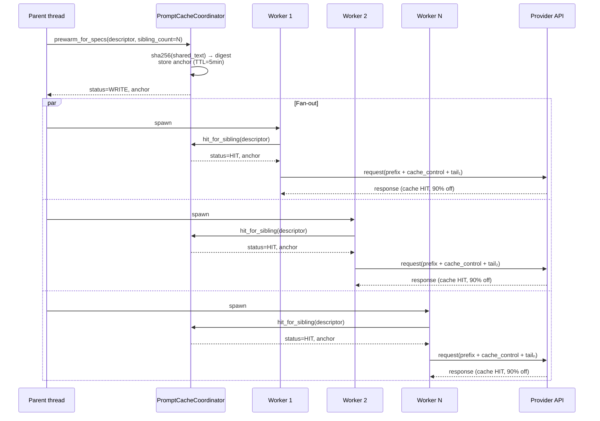

# Prompt-cache coordination <span class="lyra-badge concept">concept</span>

When **`N` Lyra subagents are about to read the same shared document
prefix on the same provider**, the naive flow has each subagent
race to be the cache *write*: only the first wins the discount, the
rest pay full price for the prefix until the second turn.

The **prompt-cache coordinator** closes that gap. One write up
front (paid by the parent thread before fan-out), `N − 1` hits
during the fan-out (paid at the provider's cache-hit discount —
typically 50–90% off). The shape matches PolyKV's
"one prefill, many reads" guarantee from
[arXiv:2604.24971](https://arxiv.org/abs/2604.24971), but expressed
in **token cost** rather than **RAM**, since hosted providers don't
expose KV cache.

For the full evaluation of why this is *the* hosted-API absorption
of PolyKV (and what we deliberately did *not* port), see the
[PolyKV evaluation memo](../research/polykv-evaluation.md).

## Why this matters

Subagent fan-out is a hot path in Lyra:

- **DAG teams** spawn parallel children that all share the parent's
  L2 context and SOUL.md.
- **Tournament-TTS** runs `K` attempts of the same prompt
  byte-identically — a perfect cache target.
- **Variants** spawn A/B subagents that differ only in the trailing
  instruction.
- **`Three-Agent` topology** runs generator + evaluator + monitor
  on the same upstream context.

Without coordination, that's `N` cache writes per fan-out (one per
child, racing). With coordination, that's `1` write (parent) + `N`
hits (children).

| Provider | Discount on cache hit | Floor for caching |
|---|---|---|
| Anthropic Claude | ≈ 90% read, +25% write | 1024 tokens (model-dependent) |
| OpenAI (GPT-4o, GPT-5) | ≈ 50% on the cached prefix | 1024 tokens |
| DeepSeek | ≈ 90% on identical prefix | none documented |
| Gemini | ≈ 75% on `CachedContent` tokens | 32 768 tokens |

A 6 000-character shared prefix across 10 sibling subagents on
Anthropic — typical for a Lyra plan + SOUL.md fan-out —
corresponds to roughly **15 000 input tokens × 9 hits × 90% off** ≈
121 000 tokens of saved billing per fan-out. The coordinator turns
that into a one-line opt-in.

## How it works



Three pieces collaborate:

1. **`PromptCacheCoordinator`** owns the anchor lifecycle. Keyed by
   `(provider, sha256(shared_text))`. TTL-bounded (5 minutes by
   default, matching most providers' ephemeral defaults).
   Thread-safe.

2. **Per-provider `PromptCacheAdapter`** knows how to mark the
   prefix as cacheable for that specific provider:
    - `AnthropicAdapter` → emits `cache_control: ephemeral`.
    - `OpenAIAdapter` → returns `None` (auto-cache by prefix).
    - `DeepSeekAdapter` → returns `None` (auto-cache).
    - `GeminiAdapter` → emits a `CachedContent` reference.
    - `NoopAdapter` → fallback for providers without caching;
      records "skipped chars" telemetry.

3. **`prewarm_for_specs` / `hit_for_sibling`** in
   [`lyra_core.subagent.cache_prewarm`](../reference/subsystem-map.md#subagent)
   are the helpers the spawn site uses. The orchestrator itself
   stays LLM-domain-free.

## What's stored on the anchor

```python
@dataclass(frozen=True)
class PromptCacheAnchor:
    digest: str                     # sha256(shared_text)
    provider: str                   # "anthropic" | "openai" | …
    provider_directive: dict | None # splice this into the request payload
    created_at: float
    expires_at: float
    chars: int                      # length of the cached prefix
```

`provider_directive` is the value the worker splices into its
request. For Anthropic that's
`{"cache_control": {"type": "ephemeral"}}`. For OpenAI it's
`None` (no payload modification — OpenAI auto-caches by prefix as
long as the worker emits the same prefix bytes).

## Telemetry

`PromptCacheCoordinator.snapshot()` returns a
`CoordinatorMetrics` dataclass:

```python
@dataclass
class CoordinatorMetrics:
    hits: int
    writes: int
    skips: int
    chars_cached: int   # unique cached chars; counted once per write
    chars_skipped: int  # below-floor chars that bypassed the cache
```

The CLI `lyra cache stats` (Wave-E) surfaces this so you can answer
"how much shareable prefix went uncached on provider X?" — the
chars_skipped column is the answer.

## Cache floor — why 4 000 characters?

Below ~4 000 characters (≈ 1 000 tokens), the per-request
cache-write overhead beats the saving. Most hosted providers
explicitly require a minimum cached-prefix size for the discount to
apply (Anthropic 1 024 tokens, OpenAI 1 024 tokens, Gemini 32 768
tokens). The 4 000-char floor is a single conservative number that
clears the smallest of those.

You can override via `PromptCacheCoordinator(cache_floor_chars=…)`
when constructing your own coordinator (tests do this routinely).

## Where it fits in the memory hierarchy

The coordinator is a **per-call optimisation** of one of the four
classical memory tiers — the **shared prompt prefix**:

| Tier | Owner | Coordinator's role |
|---|---|---|
| L0 — system + provider | Lyra core | Drives the cache mark |
| L1 — session SOUL.md | Session manager | Often *is* the shared text |
| L2 — plan + open files | Planner | Often *is* the shared text |
| L3 — turn message | Agent loop | Excluded; changes per turn |
| Procedural — skills | `lyra_core.memory.procedural` | Independent |
| Episodic — ReasoningBank | `lyra_core.memory.reasoning_bank` | Independent |

Read more on [Memory tiers](memory-tiers.md).

## Why no self-hosted PolyKV shim?

Earlier versions of Lyra shipped a `SharedKVPoolProvider` Protocol
intended to seam in a future self-hosted PolyKV adapter (vLLM with
cache hooks, llama.cpp with shared memory). It was deleted in v3.5.5
because it had no possible upstream — Lyra is hosted-API-first, no
self-hosted profile is on the active roadmap, and a Protocol nobody
implements is documentation overhead, not architecture.

If a self-hosted Lyra profile ever ships, the right place to add the
contract is alongside the new transformer adapter, not as a
preemptive seam. The hosted-API coordinator above is the correct
permanent abstraction for the providers Lyra actually targets today.

## Continue to

→ [How-to: use prompt caching across subagents](../howto/use-prompt-cache.md)

→ [PolyKV evaluation memo](../research/polykv-evaluation.md) for the
full landscape of what we ported, what we didn't, and why.
