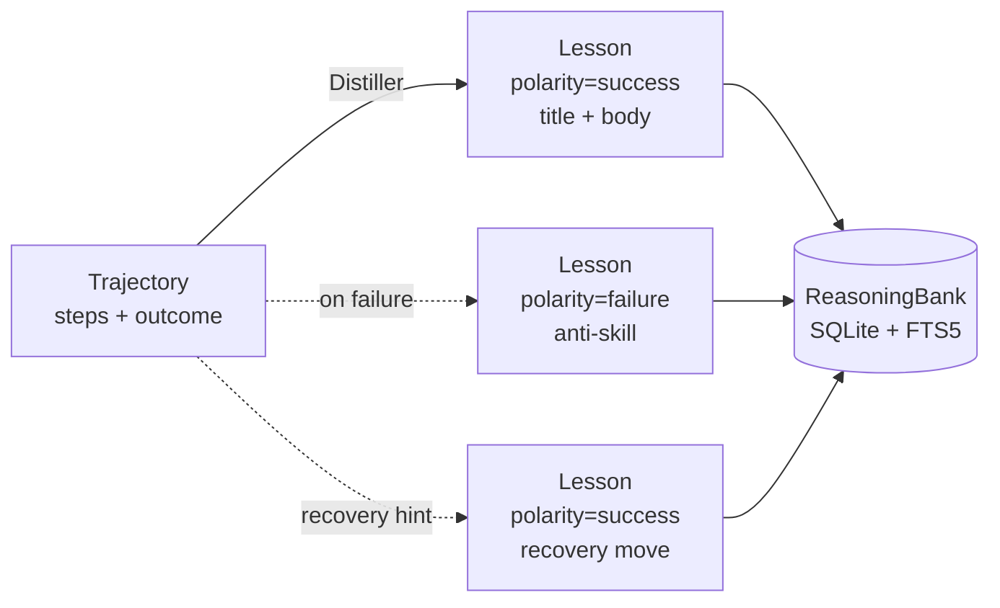
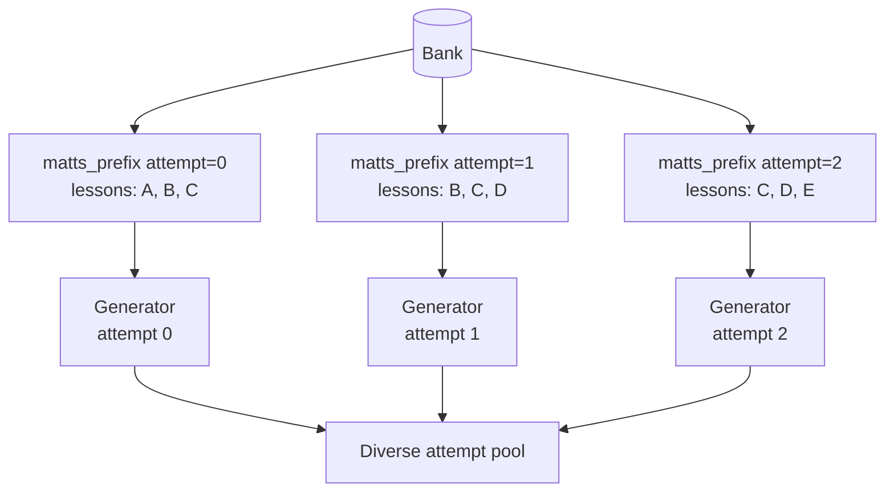
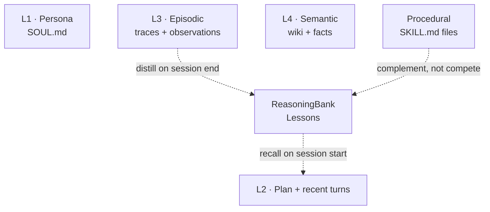

# ReasoningBank <span class="lyra-badge advanced">advanced</span>

Procedural memory ([Skills](skills.md)) holds *how to do things*; the
ReasoningBank holds **what worked, what didn't, and the move that
would have helped**. Every successful trajectory turns into a
*strategy* lesson; every failure turns into an *anti-skill* (with
optional recovery hint). Both are first-class — failures are not
discarded, they're banked.

The design follows
[*ReasoningBank: Scaling Agent Self-Evolving with Reasoning Memory*](https://arxiv.org/abs/2509.25140)
(Google Research, 2025; PDF in
[`papers/reasoningbank-mattS.pdf`](https://github.com/lyra-contributors/lyra/blob/main/projects/lyra/papers/reasoningbank-mattS.pdf)).
Lyra's implementation adds a **deterministic heuristic distiller**
that fills the bank with no LLM call required and a **SQLite + FTS5
persistence** layer so lessons survive restarts.

Source: [`lyra_core/memory/reasoning_bank.py`](https://github.com/lyra-contributors/lyra/tree/main/packages/lyra-core/src/lyra_core/memory/reasoning_bank.py),
[`reasoning_bank_store.py`](https://github.com/lyra-contributors/lyra/tree/main/packages/lyra-core/src/lyra_core/memory/reasoning_bank_store.py),
[`distillers.py`](https://github.com/lyra-contributors/lyra/tree/main/packages/lyra-core/src/lyra_core/memory/distillers.py).

## What gets stored



A `Lesson` carries:

| Field | Meaning |
|---|---|
| `id` | Stable hash; idempotent across re-records |
| `polarity` | `success` (strategy) or `failure` (anti-skill) |
| `title` | One-line summary surfaced first in recall |
| `body` | Up to ~280 chars; the meat of the lesson |
| `task_signatures` | What this lesson is retrievable under |
| `source_trajectory_ids` | Audit trail back to the trace |

## The loop

```mermaid
sequenceDiagram
    participant Loop as Agent loop
    participant Bank as ReasoningBank
    participant Distill as HeuristicDistiller
    participant CE as Context engine

    Note over Loop,CE: Turn N — task arrives
    Loop->>Bank: recall(task_signature, k=4)
    Bank-->>CE: top-k lessons (mixed polarity)
    CE->>Loop: prepend "## Relevant memory" block

    Note over Loop,CE: Turn N — task completes
    Loop->>Distill: trajectory (steps + outcome)
    Distill-->>Bank: 1–2 Lesson objects
    Bank->>Bank: persist (SQLite + FTS5)

    Note over Loop,CE: Next session, same signature
    Loop->>Bank: recall(...)
    Bank-->>CE: lessons from prior runs survive
```

Two contracts the bank enforces:

1. **Failure-distillation contract**: `record(failure_trajectory)`
   *always* yields ≥ 1 anti-skill lesson. Even an empty failure
   trajectory becomes a lesson ("agent could not act on task —
   consider different decomposition"). The bank grows on every
   failure event, not just successes.
2. **Determinism contract**: a fixed `(distiller, trajectory)` pair
   produces identical lesson IDs and bodies — so snapshot tests
   work and replays are stable.

## Distillers

| Distiller | Cost | Use for |
|---|---|---|
| `HeuristicDistiller` | $0 (no LLM) | Default; runs on every session end |
| `LLMDistiller` | smart-slot model call | Periodic batch refinement; off the hot path |

### `HeuristicDistiller` — what it actually emits

```python
from lyra_core.memory import HeuristicDistiller, Trajectory, TrajectoryOutcome, TrajectoryStep

d = HeuristicDistiller()
traj = Trajectory(
    id="t-fail-1",
    task_signature="parse-json",
    outcome=TrajectoryOutcome.FAILURE,
    steps=(
        TrajectoryStep(0, "tool_call", "bash pytest -k parser"),
        TrajectoryStep(1, "message",
            "error: ImportError; retry with the parser_v3 fallback"),
    ),
)
for lesson in d.distill(traj):
    print(f"[{lesson.polarity.value}] {lesson.title}: {lesson.body}")
```

Output:

```
[failure] Anti-skill: parse-json: Sequence that failed: bash pytest -k parser → error: ImportError; retry with the parser_v3 fallback. Symptom: error: ImportError; retry with the parser_v3 fallback.
[success] Recovery hint: parse-json: Trace contained a recovery candidate at step 1: error: ImportError; retry with the parser_v3 fallback.
```

**Two lessons from one failure** — that's the recovery hint at work.

### `LLMDistiller` — when you want richer lessons

```python
from lyra_core.memory import LLMDistiller

def call_llm(prompt: str) -> list[dict]:
    response = your_smart_slot_client.complete(prompt)
    return json.loads(response)   # [{polarity, title, body}, …]

distiller = LLMDistiller(llm=call_llm)
```

If the LLM call throws, the distiller silently falls back to the
heuristic so the bank never goes empty on transient provider
failures.

## Persistence

```python
from lyra_core.memory import SqliteReasoningBank, HeuristicDistiller, default_db_path
from pathlib import Path

bank = SqliteReasoningBank(
    distiller=HeuristicDistiller(),
    db_path=default_db_path(Path.cwd()),    # <repo>/.lyra/memory/reasoning_bank.sqlite
)
```

The store keeps three tables: `lessons`, `lesson_signatures` (M:N to
task signatures), `lesson_trajectories` (M:N to source traces). On
SQLite builds with FTS5, a `lessons_fts` virtual table provides BM25
keyword ranking. On older SQLite, the store falls back to `LIKE`
substring scans transparently.

The schema is forwards-compatible: future fields land via additive
migrations, never destructive ones. Lessons recorded in v3.0 will
read identically in v4.

## MaTTS — Memory-aware Test-Time Scaling

The original ReasoningBank paper pairs the bank with **MaTTS**:
inject a *different slice of memory* into each test-time-scaling
attempt so the candidate pool diversifies *because of* the bank.

In Lyra this is wired into [Tournament-TTS](../research/index.md):

```python
from lyra_core.tts.tournament import TournamentTts, TtsBudget
from lyra_core.memory import HeuristicDistiller, SqliteReasoningBank, default_db_path

bank = SqliteReasoningBank(
    distiller=HeuristicDistiller(),
    db_path=default_db_path(Path.cwd()),
)

tts = TournamentTts(
    generator=my_generator,
    discriminator=my_discriminator,
    budget=TtsBudget(max_attempts=8, max_wall_clock_s=60, max_total_tokens=20_000),
    reasoning_bank=bank,                # <-- enables MaTTS
    matts_prefix_k=3,                   # how many lessons per attempt
)

result = tts.run("parse a malformed config file")
```

Without `reasoning_bank=`, the generator sees the raw task
description for every attempt. With it, attempt N sees the task
prefixed by `bank.matts_prefix(task, attempt_index=N, k=3)` — a
**rotated slice** of the top-2k recalled lessons so each attempt
gets a different combination.



This is the **same diversification mechanism** as the
[diversity-collapse defence](../research/diversity-collapse-analysis.md)
([Chen et al. 2026](https://arxiv.org/abs/2604.18005)) — different
slices of memory at different attempt indices break structural
coupling in the candidate pool.

If the bank raises (FTS5 corruption, locked database), the TTS
catches it and falls through to the raw task description; the loop
never aborts.

## Diversity-weighted recall (MMR)

Plain top-k can return three near-duplicate lessons. Pass
`diversify=True` (or `diversity_weighted=True` programmatically) and
recall is re-ranked through Maximal Marginal Relevance:

```bash
lyra memory recall "parser failure" --k 5 --diversify
```

Cheap, deterministic, and on by default in MaTTS so the per-attempt
prefix slices don't collapse to the same lesson set.

## Where it sits in the memory hierarchy



ReasoningBank is **adjacent** to procedural memory — skills are full
procedures the agent can apply; lessons are short heuristics the
agent should keep in mind while applying procedures. The
[chat memory injector](../howto/use-reasoning-bank.md#how-the-injector-renders-the-block)
surfaces both into the system prompt under one *"## Relevant memory"*
block.

## Trade-offs

| Pro | Con |
|---|---|
| Failures aren't wasted — every loss writes an anti-skill | Bank can accumulate noise if no curation; prune periodically |
| Heuristic distiller is free + deterministic | Less semantically rich than an LLM-distilled lesson |
| FTS5 + signature index → sub-ms recall at 10k lessons | Requires SQLite ≥ 3.9; older builds fall back to `LIKE` |
| MaTTS plumbed into Tournament-TTS for diversification | Without TTS, the bank is "just" a context-engine input |

## Where to look in the source

| File | What lives there |
|---|---|
| `lyra_core/memory/reasoning_bank.py` | In-memory `ReasoningBank` + `Lesson` + `Trajectory` schema |
| `lyra_core/memory/reasoning_bank_store.py` | `SqliteReasoningBank`, FTS5 schema, `default_db_path` |
| `lyra_core/memory/distillers.py` | `HeuristicDistiller`, `LLMDistiller` |
| `lyra_core/tts/tournament.py` | `TournamentTts(reasoning_bank=…)` MaTTS wiring |
| `lyra_cli/commands/memory.py` | `lyra memory recall/list/show/stats/wipe/record` |
| `lyra_cli/interactive/memory_inject.py` | Chat system-prompt injection |

[← Two-tier routing](two-tier-routing.md){ .md-button }
[Continue to Prompt-cache coordination →](prompt-cache-coordination.md){ .md-button .md-button--primary }
[How-to: use the bank →](../howto/use-reasoning-bank.md){ .md-button }
