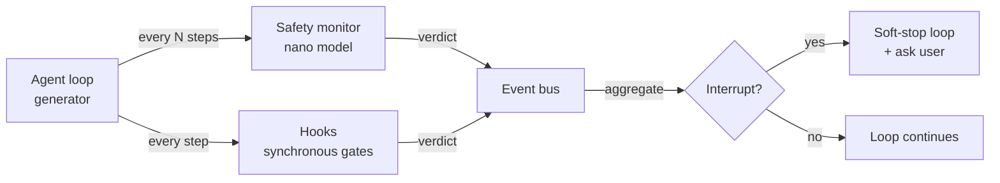

# Safety monitor <span class="lyra-badge advanced">advanced</span>

The safety monitor is **continuous**, **cheap**, and **runs in
parallel** to the agent loop. It samples every Nth step, asks a
nano-model "is this agent still doing what it was asked to do?", and
votes alongside hooks on whether to interrupt.

Where hooks are **synchronous gates** at lifecycle boundaries, the
safety monitor is an **asynchronous observer** that watches the
trajectory as it accumulates.

Source: [`lyra_core/safety/`](https://github.com/lyra-contributors/lyra/tree/main/packages/lyra-core/src/lyra_core/safety) ·
canonical spec: [`docs/blocks/12-safety-monitor.md`](../blocks/12-safety-monitor.md).

## Where it sits



The monitor and hooks are **independent voters**. Either can
interrupt; together they vote on borderline cases.

## What it watches for

Source: [`lyra_core/safety/monitor.py`](https://github.com/lyra-contributors/lyra/tree/main/packages/lyra-core/src/lyra_core/safety/monitor.py).

A small ruleset combined with a per-step nano-model classification:

| Signal | Detected by | What happens |
|---|---|---|
| **Out of scope** | Nano-model: "the agent is editing files outside the plan's expected_files set" | Soft-stop, ask user |
| **Loop / repetition** | Rule: same `(tool, args_digest)` ≥ 3 times in 16-call window | Soft-stop, summarise the loop |
| **Cost burn** | Rule: `cost_usd / step` exceeds rolling 95th-percentile by 3× | Warn in HUD, ask user at next turn boundary |
| **Hypothesis drift** (debug mode) | Nano-model: "the agent is now investigating something unrelated to the original symptom" | Soft-stop, surface the drift |
| **Adversarial prompt-injection candidate** | Rule + nano-model: observed content matches injection patterns | Strip the content, annotate critique |

## Sampling cadence

The monitor runs every `monitor_every_n_steps` (default 4) steps.
Setting it to 1 makes the monitor synchronous (and expensive); setting
it high (e.g. 16) lets the monitor lag the agent by half a turn but
saves tokens.

```toml title="~/.lyra/config.toml"
[safety.monitor]
enabled = true
model = "anthropic:claude-3-5-haiku-latest"
monitor_every_n_steps = 4
out_of_scope_threshold = 0.7
hypothesis_drift_threshold = 0.6
```

The monitor uses its **own model client** (configured separately from
fast/smart) so the same provider doesn't see both the generator's
context AND the monitor's prompt — a small but real defence against
the generator inferring the monitor's existence and steering output to
hide from it.

## Soft-stop semantics

When the monitor votes interrupt, the loop **does not abort
mid-tool-call**. Instead:

1. Finish the in-flight tool call (don't leave the filesystem in a
   half-edited state).
2. At the next turn boundary, surface the verdict to the user.
3. Wait for `/approve-continue` or `/abort`.
4. The verdict is appended to the transcript as a critique so the
   model knows why it was interrupted.

This matters because hard-aborting in the middle of a 2-second `bash`
call is much more dangerous than letting it finish with a flag set.

## Red team

Source: [`lyra_core/safety/redteam.py`](https://github.com/lyra-contributors/lyra/tree/main/packages/lyra-core/src/lyra_core/safety/redteam.py).

The red-team utility runs **adversarial prompts** against the safety
monitor periodically (in CI or on a cron) to verify the monitor still
catches known attacks:

```bash
lyra safety redteam --suite default
```

The default suite includes prompt-injection bait, scope-violation
prompts, loop-induction prompts, and cost-bomb prompts. A regression
shows up in CI as a falling pass rate on the suite.

## Configuration trade-offs

| Cadence | Token cost | Detection latency |
|---|---|---|
| `every_n_steps=1` (synchronous) | High (one nano call per step) | 0 steps |
| `every_n_steps=4` (default) | Low (1 nano per 4 generator steps) | up to 3 steps |
| `every_n_steps=16` | Negligible | up to 15 steps |
| Disabled | None | ∞ |

The default is the right balance for most workflows. Bump cadence
when the agent is in `bypass` mode or doing long-horizon DAG work.

## Where to look in the source

| File | What lives there |
|---|---|
| `lyra_core/safety/monitor.py` | The monitor loop and voting |
| `lyra_core/safety/redteam.py` | Adversarial test suite |

[← Verifier](verifier.md){ .md-button }
[Continue to Observability →](observability.md){ .md-button .md-button--primary }
