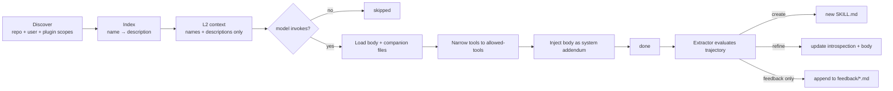

# Skills <span class="lyra-badge intermediate">intermediate</span>

A **skill** is a capability shipped as a folder with a `SKILL.md` file.
Lyra's skill engine has three roles: **Loader** (discover and index),
**Router** (select by description), and **Extractor** (mint new skills
from successful trajectories). A background **Curator** grades the
catalogue and tiers each skill `keep` / `watch` / `rewrite` / `retire`
/ `promote`.

Source: [`lyra_skills/`](https://github.com/lyra-contributors/lyra/tree/main/packages/lyra-skills/src/lyra_skills) ·
canonical spec: [`docs/blocks/09-skill-engine-and-extractor.md`](../blocks/09-skill-engine-and-extractor.md).

## Skill format

```markdown title="skills/test-gen/SKILL.md"
---
name: test-gen
description: |
  Use when the user or plan asks to generate unit tests, integration
  tests, or acceptance tests for an existing function/module/component.
allowed-tools: [read, grep, glob, write, bash]
author: lyra-atomic
version: 1.2.0
languages: [python, typescript, go]
introspection:
  examples: 22
  success_rate: 0.88
  last_refined: 2026-04-18
disable-model-invocation: false
---

# Steps

1. Read the target function/module; confirm signature and side effects.
2. Identify the testing framework in use.
3. Draft 3–7 tests covering happy path, edges, errors, idempotency.
4. Write tests to `tests/` mirroring the source structure.
5. Run the focused subset; on unexpected failures, report and stop.

## Anti-patterns
- Do not disable existing tests to make new ones pass.
- Do not add dependencies without asking.
- Do not over-mock; prefer real integration where cheap.

## Cross-references
- See SOUL: Simplicity First.
- Failed attempts: ../feedback/test-gen.md (entries #3, #7)
```

The frontmatter is a **contract**:

| Field | Required | What it does |
|---|---|---|
| `name` | yes | Identifier; collisions are resolved narrower-scope-wins |
| `description` | yes | What the Router uses to match user intent |
| `allowed-tools` | yes | Tool subset narrowed for the duration of invocation |
| `version`, `author`, `languages` | optional | Catalogue metadata |
| `introspection` | auto-maintained | Curator writes here; do not hand-edit |
| `disable-model-invocation` | optional | Force user-only invocation |

## Lifecycle



### Discovery scopes (precedence: narrowest wins)

1. Repo: `.lyra/skills/*/SKILL.md`
2. User-global: `~/.lyra/skills/*/SKILL.md`
3. Plugin-bundled: `lyra_plugins/*/*/SKILL.md`

### What's in the model's context

Only the **name and description** of each in-scope skill, in L2. The
body is loaded only if the model decides to invoke. This keeps L2 small
and stable so prompt caching works.

### Invocation

```python
@tool(name="skill", writes=False, risk="low")
def invoke_skill(name: str, args: dict = {}) -> str: ...
```

When invoked:

1. Loader fetches the body + companion files.
2. PermissionBridge **narrows the tool allowlist** to `allowed-tools`
   for the duration.
3. Body is injected as a system message addendum.
4. Agent reasoning resumes within that narrowed scope.
5. On scope exit, the original tool list is restored.

## The extractor

After every completed task, the **Skill Extractor** evaluates the
trajectory:

```python title="lyra_skills.extractor"
def extract_candidate(input: ExtractorInput) -> ExtractorOutput:
    rubric = run_rubric(input)            # (1) min tool calls, distinct
                                          #     tools, unique slug, headers,
                                          #     no leaked secrets, body length
    if not rubric.all_pass:
        return ExtractorOutput.feedback_only(rubric)

    if input.existing_skill_ids and slug in input.existing_skill_ids:
        return ExtractorOutput.refinement_proposal(slug, input)  # (2)

    return ExtractorOutput.new_skill_proposal(slug, input)
```

1. The rubric is a **deterministic check** — no LLM call. Six
   conditions must hold or the candidate downgrades to a feedback-only
   entry.
2. **Active-update bias**: if a skill with the proposed slug already
   exists, refine it instead of creating a duplicate. (This is the
   Hermes pattern.)

The extractor never auto-publishes. Proposals land in
`~/.lyra/skills/_proposals/` for you to review with `/skill review`.

## The curator

The Curator is a **deterministic, no-LLM background grader**. It runs
on a cron (or manually with `lyra skill curate`), reads the skill
ledger, and tiers each skill:

| Tier | Trigger | Suggested action |
|---|---|---|
| `promote` | High utility, ≥10 activations, ≤1 failure | Promote scope (repo → user → plugin) |
| `keep` | Healthy utility, recent | None |
| `watch` | Marginal utility | Watch; rerun in N days |
| `rewrite` | Activations but low success rate | Open for hand-rewrite |
| `retire` | Stale + unused | Move to `~/.lyra/skills/archive/` |

Output is a markdown report under `~/.lyra/skill-curator/`. Open it
with `/skill curator-report` and act on suggestions explicitly. The
curator never modifies skills on its own.

??? example "Sample report row"
    ```
    ### test-gen   tier=keep   score=0.78
    activations: 22  · failures: 3  · stale_days: 4  · size: 87 lines
    rationale:
      - utility = (s − f) / (s + f) = 0.84 above keep threshold (0.65)
      - recency boost +0.05 (last used <7d)
    suggested_action: none
    ```

## Where to look in the source

| File | What lives there |
|---|---|
| `lyra_skills/loader.py` | Discover + index by description |
| `lyra_skills/router.py` | Select-by-description matcher |
| `lyra_skills/extractor.py` | Post-task candidate generation + rubric |
| `lyra_skills/curator.py` | Background tiering + markdown report |
| `lyra_skills/ledger.py` | Per-skill stats: successes, failures, last_used |

[← Three-tier memory](memory-tiers.md){ .md-button }
[Continue to Subagents →](subagents.md){ .md-button .md-button--primary }
