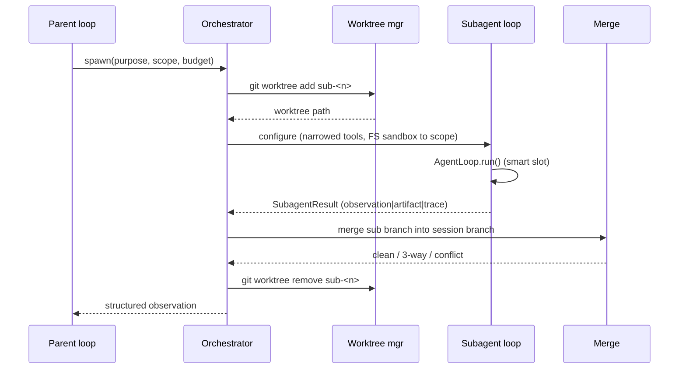
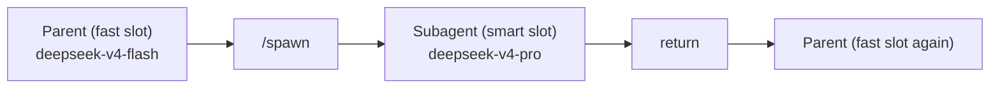

# Subagents <span class="lyra-badge intermediate">intermediate</span>

A **subagent** is a scoped agent instance running in its own git
worktree on a session branch. Subagents let Lyra parallelise work
across modules without losing the parent's coherence — no stomped
edits, no surprise merges, explicit observation reduction.

Source: [`lyra_core/subagent/`](https://github.com/lyra-contributors/lyra/tree/main/packages/lyra-core/src/lyra_core/subagent) ·
canonical spec: [`docs/blocks/10-subagent-worktree.md`](../blocks/10-subagent-worktree.md).

## When to spawn one

| Reason | Why a subagent helps |
|---|---|
| **Large observation reduction** | Subagent reads 40 files, returns a 200-word summary; parent's context stays small |
| **Parallel DAG nodes** | Two independent work strands proceed concurrently |
| **A/B experimentation** | Try two implementation approaches, pick the better one |
| **Long-running sub-task** | Separate budget, separate cost attribution, can be cancelled independently |

## When *not* to

| Anti-reason | Why subagent hurts |
|---|---|
| Work is 3–5 steps | Worktree allocation cost > savings |
| Result needed inline | Subagent is an async barrier |
| Scope overlaps with concurrent edits | Risk of merge conflict |

## Spawning

```python title="example: spawn from a tool"
@tool(name="spawn", writes=False, risk="medium")
def spawn_subagent(
    purpose: str,
    scope: list[str],
    budgets: dict | None = None,
    allowed_tools: list[str] | None = None,
    return_shape: Literal["observation", "artifact", "raw_trace"] = "observation",
) -> str: ...
```

Or directly from Python:

```python
sub = Subagent(
    parent=session,
    purpose="Reproduce issue #234 in a minimal test case",
    scope=["tests/**", "src/auth/**"],
    worktree_branch=f"sub-repro-234",
    budgets=Budgets(max_steps=20, max_cost_usd=1.00),
    allowed_tools=["read", "grep", "glob", "edit", "write", "bash"],
)
result = sub.run()
```

## Lifecycle



## Worktree allocation

```bash
git worktree add -b <session-id>-sub-<n> \
    .lyra/worktrees/<session-id>/<n> \
    <session-branch>
```

Each subagent gets a **full** worktree (shared `.git/`). Shallow
clones were considered but full worktrees are used because most
code-indexing tools expect a native structure.

After a successful run:

```bash
git worktree remove .lyra/worktrees/<session-id>/<n>
git branch -D <session-id>-sub-<n>
```

## Model slot

As of v2.7.1, every subagent runs on the **smart slot** (e.g.
`deepseek-v4-pro`). The CLI's `_loop_factory` wraps `build_llm` with
`_apply_role_model(session, "smart")` before constructing the
subagent's `AgentLoop`:



The parent's chat turns drop back to the fast slot the moment the
subagent returns. This mirrors Claude Code's "Sonnet for reasoning,
Haiku for chat" pattern.

## Merging back

The orchestrator tries three strategies in order:

1. **Fast-forward** — sub branch is a strict descendant of session
   branch. Trivial.
2. **3-way merge** — divergent but non-conflicting. Auto-merge.
3. **Conflict** — surfaced to parent as a structured `MergeConflict`
   observation. The parent (or you) resolves with the
   [merge-conflict-resolver](../reference/blocks-index.md) skill.

## Filesystem sandbox

The subagent's tool surface is **narrowed twice**:

1. The orchestrator passes only `allowed_tools`.
2. The `FSSandbox` rejects writes outside `scope` even from allowed
   tools.

```python
class FSSandbox:
    def __init__(self, root: Path, scope_globs: list[str]) -> None: ...
    def can_write(self, path: Path) -> bool:
        rel = path.relative_to(self.root)
        return any(rel.match(g) for g in self.scope_globs)
```

Reads are allowed everywhere in the worktree (subagents need to
explore); writes are bounded to scope.

## Return shapes

| `return_shape` | What the parent sees |
|---|---|
| `observation` | A short structured summary written by the subagent at end-of-run (default) |
| `artifact` | A file the subagent produced; reference returned, body lives in artifact store |
| `raw_trace` | The full transcript as a `Trace` object (rare; for debugging) |

`observation` is recommended in nearly every case — it's why subagents
exist.

## ContextVars propagation

Lyra's [`concurrency`](https://github.com/lyra-contributors/lyra/tree/main/packages/lyra-core/src/lyra_core/concurrency.py)
helper wraps `ThreadPoolExecutor.submit` so that **trace ids, session
ids, and the current permission mode** propagate from the parent
thread into the subagent worker thread:

```python
def submit_with_context(pool, fn, /, *args, **kwargs):
    ctx = contextvars.copy_context()
    return pool.submit(ctx.run, fn, *args, **kwargs)
```

Without this, OTel spans for subagent work would float in their own
context and the trace viewer would show orphaned subtrees. With it,
every subagent span hangs off the parent's `agent.run` span correctly.

## Where to look in the source

| File | What lives there |
|---|---|
| `lyra_core/subagent/orchestrator.py` | Spawn → run → merge pipeline |
| `lyra_core/subagent/scheduler.py` | Concurrent scheduling with `submit_with_context` |
| `lyra_core/subagent/variants.py` | A/B experiment variants |
| `lyra_core/subagent/worktree.py` | Worktree allocation and reclaim |
| `lyra_core/subagent/sandbox.py` | `FSSandbox` for write-scope enforcement |
| `lyra_core/subagent/merge.py` | Three merge strategies |

[← Skills](skills.md){ .md-button }
[Continue to Plan mode →](plan-mode.md){ .md-button .md-button--primary }
