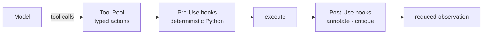

# Tools and hooks <span class="lyra-badge intermediate">intermediate</span>

These are the two extension points of Lyra. Almost every customisation
you'll ever do lands as a tool, a hook, or a skill (which is just a
named bundle of the first two).



## Tools

A **tool** is a typed function the model can call. Lyra tools are
ordinary Python callables decorated with `@tool`:

```python title="tools/example.py"
from lyra import tool, ToolCall, ToolResult

@tool(
    name="git_diff",
    description="Show the diff for a path or for the whole repo if path is empty.",
    writes=False,        # (1)
    risk="low",          # (2)
    args_schema={
        "path": {"type": "string", "default": ""},
        "staged": {"type": "boolean", "default": False},
    },
)
def git_diff(call: ToolCall) -> ToolResult:
    cmd = ["git", "diff"]
    if call.args.get("staged"):
        cmd.append("--staged")
    if call.args.get("path"):
        cmd.append(call.args["path"])
    return ToolResult.text(run(cmd))
```

1. **`writes`** is read by the [Permission Bridge](permission-bridge.md)
   to decide whether the tool needs an `ask`/`allow` vote in the current
   mode.
2. **`risk`** is a coarse classifier (`low` / `medium` / `high`) that
   the bridge weighs against your configured `risk_ask_threshold`.

### Built-in tools

The kernel ships these by default:

| Tool | Reads / Writes | One-liner |
|---|---|---|
| `read` | Reads | Read a file (with line range slicing) |
| `write` | Writes | Create or overwrite a file |
| `edit` | Writes | String-replace inside an existing file |
| `bash` | Writes (potentially) | Run a shell command |
| `grep` | Reads | ripgrep across the workspace |
| `glob` | Reads | Glob file patterns |
| `read_lints` | Reads | Pull diagnostics from the IDE |
| `web_search` | Reads (network) | Web search |
| `web_fetch` | Reads (network) | Fetch a URL as markdown |
| `spawn` | Writes | Spawn a [subagent](subagents.md) |
| `skill` | Variable | Invoke a [skill](skills.md) by name |

### MCP tools

[MCP](https://modelcontextprotocol.io/) servers register additional
tools at session start. From the loop's perspective they're
indistinguishable from built-ins. See
[How-To: Add an MCP server](../howto/add-mcp-server.md).

## Hooks

A **hook** is deterministic Python (or a shell script) that runs on a
lifecycle event. Hooks are the discipline layer of Lyra — they enforce
behaviours that prompts can't reliably enforce.

### Lifecycle events

```python
class HookEvent(StrEnum):
    SESSION_START         = "session.start"
    USER_PROMPT_SUBMIT    = "user.prompt.submit"
    PRE_MODEL_CALL        = "pre.model.call"
    POST_MODEL_CALL       = "post.model.call"
    PRE_TOOL_USE          = "pre.tool.use"          # most common
    POST_TOOL_USE         = "post.tool.use"         # most common
    PRE_PERMISSION        = "pre.permission"
    STOP                  = "stop"                   # session completion gate
    SESSION_END           = "session.end"
    SUBAGENT_START        = "subagent.start"
    SUBAGENT_END          = "subagent.end"
    NOTIFICATION          = "notification"
    COMPACTION            = "compaction"
```

### Writing a hook

```python title="hooks/my_secret_redactor.py"
from lyra import Hook, HookEvent, ToolCall, Session, HookDecision

@Hook.register(HookEvent.PRE_TOOL_USE, name="secret-redactor", priority=10)
def redact_secrets(call: ToolCall, session: Session) -> HookDecision:
    if call.name in {"write", "edit"}:
        content = call.args.get("content", "")
        if SECRET_PATTERN.search(content):
            return HookDecision.block_(
                name="secret-redactor",
                reason="content matches secret pattern",
                suggestion="Move the value to an env var or .env (not git-tracked).",
            )
    return HookDecision.allow("secret-redactor")
```

Composition rule for multiple hooks on the same event: **any
`block=True` wins**; annotations concatenate in declaration order.

### Shipped hooks

| Hook | Event | What it does |
|---|---|---|
| `tdd-gate` (off by default) | `PRE_TOOL_USE`, `POST_TOOL_USE`, `STOP` | Require RED proof before edits to `src/**`, run focused tests on writes, block session completion if tests are red |
| `destructive-pattern` | `PRE_TOOL_USE(bash)` | Block `rm -rf /`, `chmod -R 777`, etc. |
| `secrets-scan` | `PRE_TOOL_USE(write|edit)` | Refuse content matching credential patterns |
| `loop-detector` | `POST_TOOL_USE` | Bail on stalemate (same tool args 3× in 16-call window) |
| `injection-guard` | `POST_TOOL_USE(read|web_fetch)` | Strip / flag prompt-injection patterns from observed content |
| `format-on-edit` (opt-in) | `POST_TOOL_USE(write|edit)` | Run formatter against the edited file |

Read the full spec at
[`docs/blocks/05-hooks-and-tdd-gate.md`](../blocks/05-hooks-and-tdd-gate.md).

### Shell hooks via YAML

If you don't want to write Python:

```yaml title=".lyra/hooks.yaml"
- name: format-on-edit
  event: post.tool.use
  run: scripts/format.sh
  match:
    tool: [edit, write]
    path_glob: "src/**/*.{ts,tsx,py,go}"
  timeout_s: 5
  non_blocking: true
```

`non_blocking: true` means failure logs a warning but doesn't stop the
turn.

## Why "hooks not prompts"

Discipline that lives in prompt language can be argued out of by a
sufficiently clever model. Discipline that lives in Python can't.

| Concern | Wrong place | Right place |
|---|---|---|
| "Don't `rm -rf /`" | System prompt | `destructive-pattern` hook |
| "Write tests first" | "TDD reminder" instructions | `tdd-gate` hook |
| "Don't paste secrets" | Begging text | `secrets-scan` hook |
| "Don't loop forever" | "Be concise!" prompt | `loop-detector` hook |

This is the single most important architectural choice in Lyra. Hooks
are how a kernel that lets the model drive stays *trustable*.

[← The agent loop](agent-loop.md){ .md-button }
[Continue to Permission bridge →](permission-bridge.md){ .md-button .md-button--primary }
