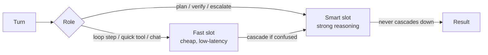

# Two-tier routing <span class="lyra-badge intermediate">intermediate</span>

Every Lyra session has **two model slots**: `fast` and `smart`. The
fast slot handles the bulk of in-loop turns; the smart slot is
reserved for moments where extra reasoning pays for itself
(planning, hard verification, escalation). This is one of the
most load-bearing cost-shaping patterns in the harness.

Source: [`lyra_core/routing/cascade.py`](https://github.com/lyra-contributors/lyra/tree/main/packages/lyra-core/src/lyra_core/routing/cascade.py) ·
[Commitment 11](../architecture/commitments.md#11-two-tier-routing-with-explicit-fast--smart-slots).

## Why two tiers



The naive alternative — "always use the smart model" — is **5–20×
more expensive** for a daily coding workflow. The other naive
alternative — "always use the fast model" — produces low-quality
plans and weak verification. Two tiers with **explicit role-based
routing** capture the bulk of the quality at a fraction of the cost.

## Default slot configuration

```toml title="~/.lyra/config.toml"
[models.fast]
provider = "deepseek"
model = "deepseek-chat"           # deepseek-v4-flash family
temperature = 0.2
max_tokens = 4096

[models.smart]
provider = "deepseek"
model = "deepseek-reasoner"        # deepseek-v4-pro family
temperature = 0.1
max_tokens = 8192
```

A team can pin different families per slot — common pattern is fast
on a cheap open-weights model, smart on a frontier model:

```toml
[models.fast]
provider = "groq"
model = "llama-3.3-70b-versatile"

[models.smart]
provider = "anthropic"
model = "claude-opus-4.5"
```

The verifier (Phase 2 LLM judge) uses a **third** slot — see
[Verifier](verifier.md#phase-2--subjective-different-family-judge).
Family-conflict checks ensure verifier.family ≠ smart.family.

## Role → slot mapping

The mapping is set in `_resolve_model_for_role`:

| Role | Default slot | Why |
|---|---|---|
| `chat` (loop step) | fast | Most steps don't need depth |
| `plan` | smart | Bad plans are expensive downstream |
| `verify-subjective` | dedicated evaluator | Different family rule |
| `summarize` | fast | Compression is forgiving |
| `extract-skill` | smart | Pattern abstraction needs depth |
| `safety-monitor` | dedicated nano | Cheap, frequent |
| `tts` | dedicated nano (if enabled) | Cost shape |

You can override per-role in config:

```toml
[models.roles]
plan = "smart"             # default; can pin to "fast" for tiny tasks
extract-skill = "fast"     # if you trust your fast model for this
```

## Cascade — when fast escalates to smart

Source: [`lyra_core/routing/cascade.py`](https://github.com/lyra-contributors/lyra/tree/main/packages/lyra-core/src/lyra_core/routing/cascade.py).

The cascade is a controlled escalation path: if the fast model
*explicitly signals it can't handle the turn*, the kernel re-runs
the same turn on the smart model. **The escalation is always
detected by signal, never by silent retry.**

Two signals trigger escalation:

```python
class CascadeSignal(StrEnum):
    OUT_OF_DEPTH      = "out_of_depth"      # model emits special token
    LOW_CONFIDENCE    = "low_confidence"    # logprob below threshold
```

| Signal | Source | Default threshold |
|---|---|---|
| `OUT_OF_DEPTH` | Special token in response: `<lyra:escalate reason="…"/>` | n/a (binary) |
| `LOW_CONFIDENCE` | Mean log-prob of action tokens | < -2.5 nats |

When escalated, the **same context** is replayed against the smart
model. The trace shows both calls; cost attribution accounts both.

```mermaid
sequenceDiagram
    Loop->>Fast: turn N
    Fast-->>Loop: <lyra:escalate reason="needs algebra">
    Loop->>Smart: turn N (same context)
    Smart-->>Loop: result
    Loop->>Trace: emit cascade-event(N, fast→smart, reason)
```

A `cascade_rate` metric is exported every session. Healthy systems
sit at < 5% — much higher and your fast model is too weak; near 0%
and you may be wasting smart-slot capacity.

## Disabling cascade

```toml
[routing.cascade]
enabled = true             # default
max_per_session = 8        # circuit-breaker; aborts session if exceeded
allowed_roles = ["chat", "plan"]
```

Setting `enabled = false` disables the escalation path entirely;
the fast model handles every turn and never bumps up. Useful for
deterministic CI runs.

## Why explicit slots beat implicit "model picker"

Some agent frameworks pick a model per-turn from a heuristic. Lyra
chose explicit slots because:

- **Predictable cost.** You can budget by role.
- **Predictable quality.** A team can test changes against a fixed
  smart slot, knowing the fast slot won't silently substitute.
- **Trace clarity.** `model.fast` vs `model.smart` is a
  human-readable distinction; "model `gpt-5-mini-2025-something`"
  is not.
- **Family discipline.** Verifier conflict checks need clean role
  separation, not opaque routing.

## Where to look in the source

| File | What lives there |
|---|---|
| `lyra_core/routing/cascade.py` | Cascade logic + signals |
| `lyra_core/providers/__init__.py` | Slot resolver `_resolve_model_for_role` |
| `lyra_core/verifier/evaluator_family.py` | Family-conflict guard |

[← Sessions and state](sessions-and-state.md){ .md-button }
[Continue to ReasoningBank →](reasoning-bank.md){ .md-button .md-button--primary }
