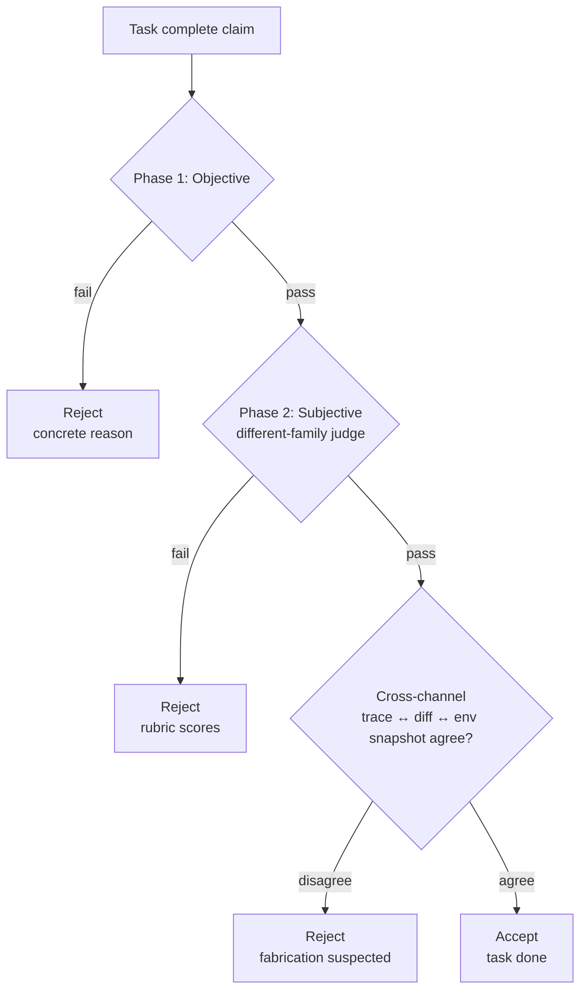
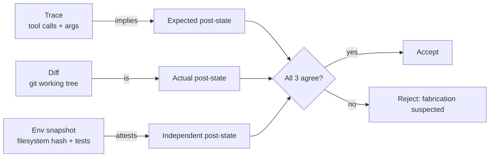

# Verifier <span class="lyra-badge advanced">advanced</span>

The verifier is the discipline that catches **fabricated success** —
the failure mode where an agent confidently reports the task is done
but the tests don't actually pass, the file isn't actually written,
or the diff doesn't match the plan. Lyra's verifier is **two-phase**
with **cross-channel evidence** because each phase, alone, can be
fooled.

Source: [`lyra_core/verifier/`](https://github.com/lyra-contributors/lyra/tree/main/packages/lyra-core/src/lyra_core/verifier) ·
canonical spec: [`docs/blocks/11-verifier-cross-channel.md`](../blocks/11-verifier-cross-channel.md).

## Two phases



| Phase | Cost | What it checks |
|---|---|---|
| **1 · Objective** | Cheap | Tests / types / lint / expected-files exist with correct content roles |
| **2 · Subjective** | Expensive | A different-family LLM judges quality against a rubric |
| **Cross-channel** | ~zero | Trace + diff + environment snapshot must agree on what happened |

## Phase 1 — objective

Source: [`lyra_core/verifier/objective.py`](https://github.com/lyra-contributors/lyra/tree/main/packages/lyra-core/src/lyra_core/verifier/objective.py).

Every check is a **fast, deterministic** Python function that returns
`pass / fail / not-applicable`. Examples:

```python
@check(name="acceptance-tests-pass")
def acceptance_tests_pass(plan: Plan, env: Env) -> Verdict:
    failures = run_pytest(plan.acceptance_tests)
    return Verdict.fail(f"{len(failures)} failures") if failures else Verdict.pass_()

@check(name="expected-files-exist")
def expected_files_exist(plan: Plan, env: Env) -> Verdict:
    missing = [f for f in plan.expected_files if not env.fs.exists(f)]
    return Verdict.fail(f"missing: {missing}") if missing else Verdict.pass_()

@check(name="forbidden-files-untouched")
def forbidden_untouched(plan: Plan, env: Env) -> Verdict:
    touched = env.git.diff_files()
    bad = [f for f in plan.forbidden_files if f in touched]
    return Verdict.fail(f"touched: {bad}") if bad else Verdict.pass_()

@check(name="coverage-non-regressing")
def coverage_non_regressing(plan: Plan, env: Env) -> Verdict:
    delta = env.coverage.delta_since(plan.baseline_ref)
    return Verdict.fail(f"delta={delta:+.2%}") if delta < 0 else Verdict.pass_()
```

Phase 1 is **cheap** — no model calls, just real subprocesses. If any
single check fails, the verifier rejects with a concrete reason and
**Phase 2 doesn't run**. This is the cost-shaping choice that lets
the expensive subjective phase exist at all.

## Phase 2 — subjective (different-family judge)

Source: [`lyra_core/verifier/subjective.py`](https://github.com/lyra-contributors/lyra/tree/main/packages/lyra-core/src/lyra_core/verifier/subjective.py).

Only runs if Phase 1 passes. The evaluator must be a **different
model family** than the generator — this is the load-bearing check
against narrative fluency.

```python
class EvaluatorFamily(StrEnum):
    ANTHROPIC = "anthropic"
    OPENAI = "openai"
    DEEPSEEK = "deepseek"
    GEMINI = "gemini"
    XAI = "xai"
    # …

def must_differ(generator_family: EvaluatorFamily, evaluator_family: EvaluatorFamily) -> None:
    if generator_family == evaluator_family:
        raise FamilyConflictError(
            f"evaluator {evaluator_family} is same family as generator; "
            "configure a different family in [harness.three_agent.evaluator]"
        )
```

The judge gets:

- The plan
- The diff
- The HIR trace (action stream, not text-stream)
- The Phase 1 results

It produces a **rubric-scored verdict**:

```python
@dataclass
class SubjectiveVerdict:
    decision: Literal["accept", "reject", "needs-revision"]
    rubric: dict[str, float]    # 0.0–1.0 per criterion
    rationale: str
    revision_advice: str | None = None
```

Default rubric criteria: `correctness`, `style`, `simplicity`,
`testability`, `does-the-diff-match-the-plan`. Customize in
`~/.lyra/config.toml`.

## Cross-channel evidence

Source: [`lyra_core/verifier/cross_channel.py`](https://github.com/lyra-contributors/lyra/tree/main/packages/lyra-core/src/lyra_core/verifier/cross_channel.py).

Three independent records of "what happened":



If the trace says "wrote 50 lines to `src/foo.py`" but the diff shows
no change to that file, the verifier rejects — the model lied (or the
filesystem lied; either way, don't trust the result).

Cross-channel disagreement is the verifier's most powerful signal
against test-disable tricks and `chmod 000` hacks.

## Process Reward Model (PRM)

Source: [`lyra_core/verifier/prm.py`](https://github.com/lyra-contributors/lyra/tree/main/packages/lyra-core/src/lyra_core/verifier/prm.py).

For long horizons, end-of-task verification is too late. The PRM is
a small reward signal computed every step that estimates "is this
step moving towards the plan?" — used to prune obviously-divergent
trajectories early.

The PRM is **advisory**, not gating: it surfaces in the trace and the
HUD, and a hook can act on it (e.g. abort if PRM stays negative for
N steps), but the kernel doesn't terminate based on it alone.

## TDD reward integration

Source: [`lyra_core/verifier/tdd_reward.py`](https://github.com/lyra-contributors/lyra/tree/main/packages/lyra-core/src/lyra_core/verifier/tdd_reward.py).

When the [TDD gate](../howto/tdd-gate.md) is on, the verifier
incorporates the gate's RED→GREEN→REFACTOR phase signal into the
final accept decision. A task that passes Phase 1 and Phase 2 but
never went through a RED phase is downgraded to `needs-revision`
(with the message "no failing test was ever written; coverage of new
behaviour is suspect").

## Where to look in the source

| File | What lives there |
|---|---|
| `lyra_core/verifier/objective.py` | Phase 1 deterministic checks |
| `lyra_core/verifier/subjective.py` | Phase 2 LLM judge with rubric |
| `lyra_core/verifier/cross_channel.py` | Trace ↔ diff ↔ env-snapshot reconciler |
| `lyra_core/verifier/evaluator_family.py` | Family-conflict guard |
| `lyra_core/verifier/evidence.py` | Evidence collection harness |
| `lyra_core/verifier/prm.py` | Per-step Process Reward Model |
| `lyra_core/verifier/tdd_reward.py` | TDD-phase signal merging |

[← Plan mode](plan-mode.md){ .md-button }
[Continue to Safety monitor →](safety-monitor.md){ .md-button .md-button--primary }
