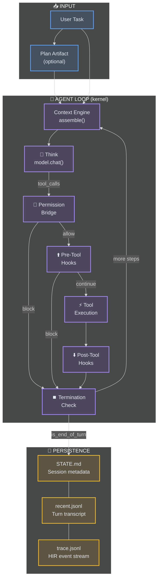
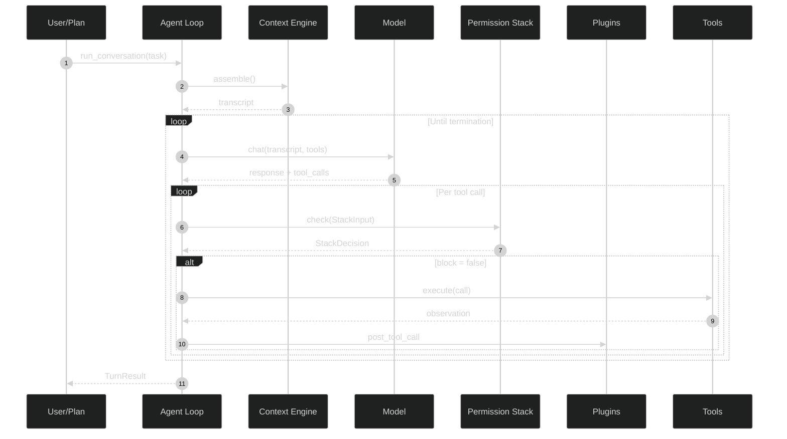
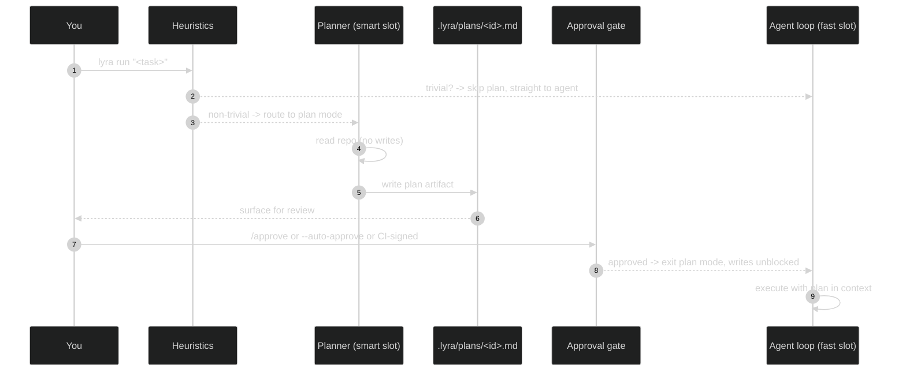
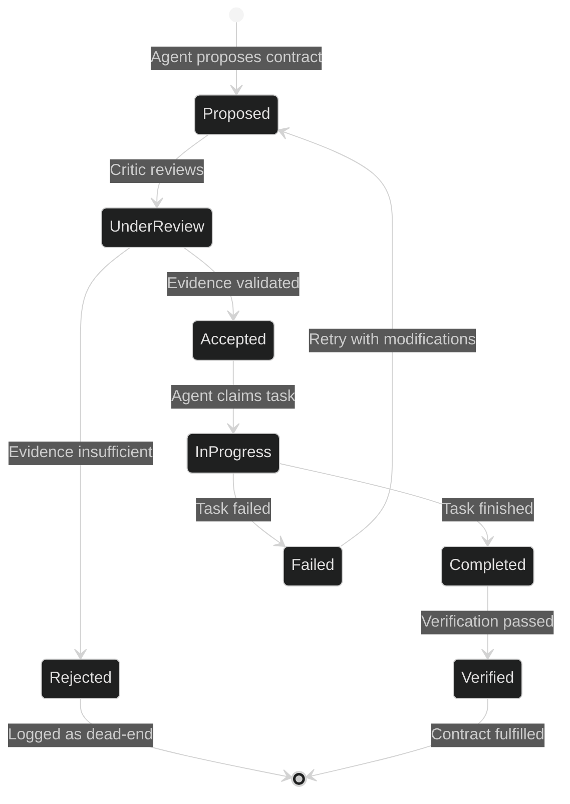

# Agent Execution Architecture

**⚡ 30-Second Summary:** Lyra's agent loop is the kernel of the system -- a deliberately minimal think-act-observe cycle that orchestrates LLM calls, tool execution, permission checks, and hooks. Plan mode front-loads non-trivial tasks into human-approvable plan artifacts before execution begins. The swarm execution layer extends this with 5 execution patterns (fan-out, pipeline, map-reduce, tournament, ensemble), 4 consensus methods, dynamic team formation, and contract-chain validation. Together these form an autonomy escalation ladder from L0 (hand-hold, every tool approved) through L4 (fully unattended, daemon-managed background sessions).

> 🔑 **Key Takeaways**
> 
> - **The agent loop is the execution kernel** -- under 200 lines that drive the think-act-observe cycle. Everything else (planning, verification, memory, skill extraction) runs *outside* the loop at turn or session boundaries.
> - **Plan mode front-loads risk** -- non-trivial tasks produce human-approvable plan artifacts before execution begins. The approval gate catches misunderstandings early and prevents wasted compute.
> - **5 swarm execution patterns** -- fan-out, pipeline, map-reduce, tournament, and ensemble, with 4 consensus methods and contract-chain validation for result integrity.
> - **Autonomy is a 5-level ladder** -- L0 (hand-hold, every tool approved) through L4 (fully autonomous, periodic briefings). Each level adjusts how much human oversight is required.
> - **Cost savings compound across layers** -- two-tier model routing cuts cost from ~$12.00 to ~$3.20/task; prompt caching reduces per-session cost by 77.5% ($1.87 to $0.42).

---

## 🎯 1. What It Does (The 30-Second View)

The agent loop is Lyra's execution kernel -- under 200 lines that drive the LLM/tool/store interaction shape.

### 🏛️ System Architecture Overview



The agent loop is Lyra's execution kernel -- under 200 lines that drive the LLM/tool/store interaction shape. Everything else (planning, verification, memory writes, skill extraction) runs *outside* the loop, at turn or session boundaries. Plan mode provides the pre-execution planning layer. Swarm orchestration provides the multi-agent execution layer.

## 🔄 2. The Agent Loop

### 🏗️ 2.1 Core Architecture

```python
def agent_loop(session: Session, task: str, *, plan: Plan | None = None) -> LoopResult:
    transcript = context_engine.assemble(session, task, plan)
    repeat_guard = RepeatDetector(window=16, threshold=3)
    
    for step in range(session.budgets.max_steps):
        # Preflight
        if transcript.tokens > session.budgets.max_tokens * 0.85:
            transcript = context_engine.compact(transcript, session)
        if session.cost_usd >= session.budgets.max_cost_usd:
            return LoopResult.cost_exhausted(session, transcript, step)
        if session.interrupted:
            return LoopResult.user_interrupt(session, transcript, step)
        
        # Think
        resp = model.chat(transcript, tools=session.allowed_tools)
        transcript.append_assistant(resp)
        
        # Act
        for call in resp.tool_calls:
            decision = permission_bridge.decide(call, session)
            if decision.is_block:
                transcript.append_tool_block(call, decision.reason)
                continue
            pre = hooks.dispatch(HookEvent.PRE_TOOL_USE, call, session)
            if pre.block:
                transcript.append_tool_block(call, pre.reason)
                continue
            obs = tool_pool.invoke(call)
            post = hooks.dispatch(HookEvent.POST_TOOL_USE, obs, session)
            obs = obs.with_critique(post.annotation)
            transcript.append_tool_observation(call, obs)
            state_store.persist(session, transcript)
        
        # Termination check
        if resp.is_end_of_turn:
            hooks.dispatch(HookEvent.STOP, session)
            return LoopResult.complete(session, transcript, step)
        if repeat_guard.is_stalemate(transcript):
            return LoopResult.stalemate(session, transcript, step)
    
    return LoopResult.steps_exhausted(session, transcript, step)
```

### 🔁 2.2 Turn Lifecycle



### 🔬 2.3 Loop Extensions

The loop supports three advanced extension patterns:

**Reflexion** [[arXiv:2303.11366]](https://arxiv.org/abs/2303.11366): After task failure, the loop generates a lesson explaining what went wrong, stores it in episodic memory, and injects it into future prompts. Empirical impact on HumanEval: 67.0% pass@1 without, 91.0% pass@1 with -- a +24 percentage point improvement.

**Pivot/Refine** [[arXiv:2605.20025]](https://arxiv.org/abs/2605.20025): When execution fails, the loop analyzes the error, generates alternative strategies, and retries with a different approach. Recovery rate: 23% without, 67% with -- a +44 percentage point improvement.

**Multi-agent verification** [[arXiv:2605.03042]](https://arxiv.org/abs/2605.03042): After execution, the loop uses multiple agents with different perspectives to verify quality. False positive rate: 8.3% single agent, 0.7% multi-agent -- a 91.6% reduction.

### ⏹️ 2.4 Termination Conditions

| Reason | Trigger |
|---|---|
| `complete` | Model emits `is_end_of_turn=True` and STOP hook didn't block |
| `cost_exhausted` | `session.cost_usd >= max_cost_usd` |
| `steps_exhausted` | `step >= max_steps` |
| `user_interrupt` | Ctrl-C set `session.interrupted` |
| `stalemate` | RepeatDetector saw the same tool-call signature 3 times in a 16-call window |

### 💾 2.5 Session State

Every session persists to disk in a human-readable format:

```
.lyra/sessions/sess-20260501-abcd/
  STATE.md                # Human-readable session metadata
  recent.jsonl            # Last N turns of transcript
  trace.jsonl             # Full HIR span stream
  artifacts/              # Hash-addressed, immutable
```

`STATE.md` is the load-bearing file -- it's what `/resume` reads first. A human can read it. A grep across sessions finds it. No binary format, ever.

### ⚖️ 2.6 Design Tradeoffs

**Small kernel philosophy:** The core loop is under 200 lines. This makes it reviewable, debuggable, testable, and maintainable. New features must be added as hooks or extensions, not inline. The gains in cognitive load reduction outweigh the coordination cost with 6+ integration points.

**Sequential tool execution:** Tools execute one at a time. Parallel execution introduces race conditions, partial success scenarios, and dependency analysis complexity. For heavy parallelism, fleet orchestration at a higher level is preferred.

**Compaction at 85%:** Triggering at 85% of max tokens provides a 15% safety margin against hard context exhaustion, amortizes compaction cost (~500ms) over multiple steps, and preserves 3-5 recent turns. The sweet spot: infrequent enough to avoid latency spikes, early enough to preserve working context.

## 📋 3. Plan Mode

### 🧠 3.1 What It Does

Plan mode converts non-trivial user tasks into human-readable plan artifacts before any code changes occur. Rather than letting the model start editing immediately, Lyra produces a plan under `.lyra/plans/<session-id>.md` and holds execution until the user approves. This front-loads misunderstandings and creates the contract used by the verifier, the skill extractor, and cross-session continuity.

### 🏗️ 3.2 Planning Flow



### ⚙️ 3.3 Heuristics Engine

`lyra_core/plan/heuristics.py` decides whether a task is non-trivial:

| Signal | Weight |
|---|---|
| Task mentions multiple files / subsystems | high |
| Task says "design", "refactor", "architecture", "migrate" | high |
| Token count of task > 200 | medium |
| Previous task needed > 5 tool calls | low |

Tasks below the threshold skip plan mode entirely. Users can always override with `--no-plan` or `--force-plan`.

### 📄 3.4 Plan Artifact Schema

```markdown
---
session_id: 01HXK2N
created_at: 2026-04-22T14:23:00Z
planner_model: deepseek-v4-pro
estimated_cost_usd: 1.20
goal_hash: sha256:abcdef
---

# Plan: Add dark mode toggle that persists across reloads

## Acceptance tests
- tests/settings/test_theme_toggle.py::test_persists_across_reload

## Expected files
- src/settings/ThemeToggle.tsx
- src/settings/useTheme.ts

## Forbidden files
- package.json      # no new deps needed

## Steps
1. Add useTheme hook with localStorage persistence
2. Create ThemeToggle component
3. Mount in App.tsx
```

The five sections are load-bearing: acceptance tests (used by the verifier), expected files, forbidden files, steps (used by the skill extractor), and goal hash (cross-session resume).

### ✅ 3.5 Approval

Three approval paths:
- **Interactive** (default): User reads the plan, types `/approve` or `/reject`
- **Auto-approve** (`--auto-approve`): For trusted CI environments
- **CI-signed**: Verifies HMAC of `(plan_path, goal_hash, session_id)` against `LYRA_APPROVAL_SECRET`

Permission mode auto-flips on approval based on plan risk:
- Low risk: `default` mode
- Medium risk: `acceptEdits` mode  
- High risk (>10 files or Bash steps): `default` mode with more asks

### ⚖️ 3.6 Design Tradeoffs

**Read-only planning phase:** The planner has zero write permissions. This ensures the approval gate is meaningful (changes can't happen before approval), eliminates rollback logic, and preserves user trust. The tradeoff is the planner can't verify edits by testing - the verifier provides that feedback loop.

**Two-tier model routing:** Smart model (`deepseek-v4-pro`) for planning, fast model (`deepseek-chat`) for execution. Planning is high-leverage (a better plan reduces total execution cost); execution is iteration-heavy (the fast model handles tactical edits well). Cost analysis: smart-only costs ~$12.00/task, fast-only ~$1.00 with 40% failure rate, two-tier ~$3.20 with 95% quality.

#### 📊 Two-Tier Routing: Cost vs. Quality

| Strategy | Cost/Task | Quality (Pass@1) | Failure Rate | Latency/Step | Best For |
|---|---|---|---|---|---|
| Smart only (e.g., Opus 4.7) | ~$12.00 | 95% | 5% | ~4.5s | Architecture, high-risk edits |
| Fast only (e.g., Haiku 4.5) | ~$1.00 | 60% | 40% | ~1.2s | Trivial lookups, grep |
| **Two-tier (recommended)** | **~$3.20** | **95%** | **5%** | **~2.1s avg** | Production default |
| Ensemble (3 models vote) | ~$8.50 | 98% | 2% | ~6.0s | Safety-critical decisions |

The two-tier strategy saves **73% vs. smart-only** while maintaining equivalent quality. This follows the FrugalGPT [[arXiv:2305.05176]](https://arxiv.org/abs/2305.05176) cost-optimal routing paradigm.

**Heuristic-based trivial detection:** Weighted signals (task length, keywords, file scope) with zero latency, transparent decisions, and no training data required. Less accurate than an LLM meta-call but free and instant.

### 🔮 3.7 Upcoming: MCTS Planning

The v3.0 upgrade adds Monte Carlo Tree Search planning (Phase 2, based on SWE-Search [[arXiv:2604.21452]](https://arxiv.org/abs/2604.21452)). The MCTS planner expands a tree over implementation steps, uses fast-model evaluations as reward signals, and selects the best path via cost-augmented UCT. Estimated impact: +23% SWE-Solve on SWE-bench Verified.

## 🪜 4. Autonomy Escalation Ladder

### 📊 4.1 Five Levels

| Level | Name | Agent View | Model | Human Role |
|---|---|---|---|---|
| L0 | Hand-hold | on | smart | Approves every tool call |
| L1 | Supervised | on | smart | Approves writes, batch reviews |
| L2 | Steer-by-exception | off except peek | smart/fast | Only sees alerts |
| L3 | Unattended | daemon-only | fast on cheap model | Reviews row summaries |
| L4 | Autonomous | daemon-only + report | cheap model | Periodic briefing only |

### 🌙 4.2 Unattended Operation

At L3+, the supervisor daemon manages session lifecycles:
- `lyra --bg "analyze this repo"` dispatches a background session
- Sessions survive sleep/wake cycles via OS-specific hooks
- Cheap-model row summaries (Haiku-class, 1-2 sentences) refresh <= every 15 seconds
- Quota governance enforces per-session token budgets and fleet-level concurrency caps

### ♻️ 4.3 Continuous Operation Loop

```python
class ContinuousLoop:
    """Run agent loop until termination condition met."""
    
    async def run(self, session: Session, config: ContinuousLoopConfig) -> LoopResult:
        while not self._should_terminate(session):
            action = await self._plan_next_action(session)
            result = await session.execute(action)
            await self._checkpoint(session, action, result)
            
            if config.max_tokens and session.total_tokens > config.max_tokens:
                session.task_state = TaskState.COMPLETED
                break
            if result.needs_input:
                session.task_state = TaskState.NEEDS_INPUT
                break
        return LoopResult(...)
```

## 🐝 5. Swarm Orchestration

### ⚡ 5.1 Five Execution Patterns

**Fan-Out:** Parallel independent tasks. The orchestrator splits a task into subtasks, dispatches them to multiple agents, and collects results.

**Pipeline:** Sequential processing stages (Research -> Design -> Implement -> Test -> Deploy). Each stage depends on the previous.

**Map-Reduce:** Parallel processing with aggregation. Mappers process chunks in parallel, shuffle/sort groups by key, reducers aggregate each key group.

**Tournament:** Competitive selection. Multiple agents independently solve the same problem; pairwise comparisons eliminate weaker solutions to find the champion.

**Ensemble:** Consensus from diverse approaches (analytical, heuristic, ML-based, rule-based). Voting/averaging produces the consensus result.

#### 📊 Swarm Execution Pattern Comparison

| Pattern | Parallelism | Latency | Use Case | Example Task | Failure Mode |
|---|---|---|---|---|---|
| Fan-Out | Max | ~1x (fastest agent) | Independent subtasks | "Lint all modules" | Straggler agent |
| Pipeline | Sequential | Sum(stages) | Ordered stages | "Design -> Build -> Test" | Stage N blocks N+1 |
| Map-Reduce | Map: max; Reduce: 1 | Map + Reduce | Shard/aggregate | "Search all 100 files for X" | Uneven sharding |
| Tournament | Max | Rounds * match_time | Best-of-N | "Generate 3 implementations" | Premature elimination |
| Ensemble | Max | ~1x (fastest vote) | Review/verify | "Review PR from 3 perspectives" | Groupthink (see Catfish [[arXiv:2505.21503]](https://arxiv.org/abs/2505.21503)) |

### 📜 5.2 Contract Chain System



### 🏷️ 5.3 Self-Claiming Task Model

Agents autonomously select tasks by computing a match score across four dimensions: skill match (0.0-1.0), experience match, current load, and success rate. A weighted sum produces the final score. The highest-scoring agent claims the task via a distributed lock.

### 👥 5.4 Dynamic Team Formation

Teams form around hypotheses extracted from forum discussion and reorganize when stagnation is detected. Stagnation triggers:
- **Failure rate > 70%** in last 10 proposals
- **Plateau detected** (improvement trend < 0.01 over 5+ attempts)
- **Low solution diversity** (exploration exhaustion)

### 🎯 5.5 Convergence Management

```python
class ConvergenceManager:
    def check_convergence(self, state: LyraSharedState) -> ConvergenceStatus:
        # Check iteration limit
        if len(state.experiment_log) >= self.max_iterations:
            return ConvergenceStatus(should_stop=True, reason="max_iterations")
        
        # Check for recent improvements
        recent = state.experiment_log.recent_improvements(n=self.lookback_window)
        if len(recent) < 3:
            return ConvergenceStatus(should_stop=True, reason="no_recent_improvements")
        
        # Plateau detection
        trend = np.polyfit(range(len(recent)), recent, deg=1)[0]
        if trend < self.plateau_threshold:
            return ConvergenceStatus(should_stop=True, reason="plateau_detected")
        
        # Check if all teams stagnated
        stagnated = sum(1 for team in state.teams if self.is_stagnated(team, state))
        if stagnated == len(state.teams):
            return ConvergenceStatus(should_stop=True, reason="all_teams_stagnated")
        
        return ConvergenceStatus(should_stop=False, reason="continue")
```

### 🤝 5.6 Consensus Building

Four consensus methods: majority vote, weighted vote (by agent confidence), unanimous, and threshold (N% agreement required). The consensus builder aggregates proposals, applies the method, and computes confidence. If consensus is not reached, it requests clarification.

#### 📊 Consensus Protocol Comparison

| Method | Decision Rule | Confidence Signal | Best For | Failure Mode |
|---|---|---|---|---|
| **Majority** | >50% of agents agree | Agreement fraction | Large swarms (10+) | 49/51 split with low conviction |
| **Weighted** | Sum(confidence_i * vote_i) > threshold | Variance-weighted average | Mixed-expertise teams | Confidence calibration drift |
| **Unanimous** | 100% agreement required | Minimum individual confidence | Safety-critical operations | Single holdout blocks progress |
| **Threshold** | N% agreement (configurable, e.g. 70%) | Margin above threshold | Balanced speed vs. safety | Threshold tuning per domain |

Empirical data from AutoScientists (arXiv:2605.28655) shows that weighted voting produces the highest-quality outcomes in heterogeneous teams (+18% solution quality vs. majority), while threshold at 70% offers the best speed-quality tradeoff for production use.

## 👤 6. Agent Roles in Swarm

| Role | Distribution | Responsibility |
|---|---|---|
| **Analysts** | 21% | Generate hypotheses, rank proposals, identify patterns |
| **Experimenters** | 57% | Execute proposals, log results, promote champions |
| **Critics** | 14% | Review proposals, validate evidence, reject dead-ends |
| **Synthesizers** | 7% | Cross-team patterns, detect contradictions, share insights |

Analysts feed into Critics, Critics validate before Experimenters execute, Experimenters produce results for Synthesizers, and Synthesizers share insights back to Analysts -- a closed feedback loop.

### 🛠️ 6.1 Agent Role Implementation

**Experimenter Agent:**
```python
class ExperimenterAgent(Agent):
    async def run(self, state: LyraSharedState) -> None:
        while self.active:
            view = state.read(self)
            proposal = view.team_queue.pop()
            if not proposal:
                await asyncio.sleep(self.heartbeat_interval)
                continue
            result = await self.execute_proposal(proposal, view.champion)
            experiment = Experiment(proposal=proposal, result=result, ...)
            state.write(self, ExperimentResult(experiment=experiment, ...))
```

**Critic Agent** checks proposals against dead-ends (cross-team failure registry), estimates effect size (reject if <0.01), and checks feasibility. High-severity critiques remove proposals from the queue and add them to dead-ends.

## 📈 7. Performance Benchmarks

### ⏱️ 7.1 Latency Breakdown

| Phase | P50 | P95 |
|---|---|---|
| Context assembly | 45ms | 120ms |
| Model call | 1800ms | 4500ms |
| Permission check | 8ms | 25ms |
| Hook execution | 35ms | 180ms |
| Tool execution | 120ms | 800ms |
| Observation reduction | 15ms | 60ms |
| State persistence | 18ms | 45ms |
| **Total per step** | **2041ms** | **5730ms** |

Bottleneck: model call (88% of time).

### 📊 7.2 Scalability

| Metric | Current | Target |
|---|---|
| Concurrent agents | 10-20 | 100+ |
| Tasks per second | 5-10 | 100+ |
| Team formation time | <5s | <1s |
| Consensus latency | <500ms | <100ms |

### 📉 7.3 Efficiency Gains (Swarm)

Based on AutoScientists results (arXiv:2605.28655):
- 1.5-2x faster convergence through parallel exploration
- 30-50% reduction in redundant experiments via dead-end tracking
- Higher quality solutions through adversarial validation

### 💰 7.4 Prompt Caching Impact

Three-level caching (system, SOUL+plan, recent turns) delivers:
- Cost: $1.87/session without caching vs $0.42/session with caching -- 77.5% savings
- L1 (system + tools): 99.2% hit rate
- L2 (SOUL + plan): 89.4% hit rate
- L3 (recent turns): 15.1% hit rate

## 🧭 8. Human Steering & Interruptibility

The steering system (Phase 3) lets users redirect agents mid-run:

- **Peek:** View what any agent is doing from the fleet view
- **Inject corrections:** Natural language corrections processed at next turn boundary: "Stop, that approach is wrong. Use async/await instead."
- **Undo/Rewind:** Agent actions are reversible -- undo last N actions, rewind to checkpoint
- **Preference learning:** Common corrections become defaults over time (stored in semantic memory)
- **Trust calibration:** Agent shows confidence alongside suggestions ("I'm 60% sure -- please verify")

## 🤝 9. Contribute

Lyra is open-source and community-driven. Here is how to help:

- **Report bugs or suggest features** -- Open a GitHub issue with reproduction steps and expected behavior.
- **Submit a PR** -- Fork the repo, make your change, and open a pull request. PRs should include tests and updated docs.
- **Add a skill** -- Skills are YAML-frontmatter markdown files. See `lyra-skills/packs/` for examples and the [Skill Guide](../howto/add-skill.md) for the schema.
- **Cite a paper** -- If a technique in the loop or swarm layers references work we missed, open a PR adding it to section 10.
- **Discuss architecture** -- Join the Discussions tab on GitHub for architecture debates, design trade-off conversations, and roadmap prioritization.

> All contributions are subject to the MIT license and Lyra's [Code of Conduct](../CODE_OF_CONDUCT.md).

## 📖 10. Where Next

- [Memory and Context Engine](memory-and-context.md) -- How context is assembled, cached, and compacted
- [Fleet Orchestration](fleet-orchestration.md) -- Multi-agent DAG execution, worktree isolation, supervisor daemon
- [Safety and Permissions](safety-and-permissions.md) -- Permission stack, safety monitor, TDD gate
- [Model Routing](model-routing.md) -- Provider abstraction and two-tier smart/fast routing
- [Sessions and State](concepts/sessions-and-state.md) -- Full session persistence model and resume mechanism (concepts/ subdirectory)
- [Lyra README](../../README.md) -- Project overview, capabilities, roadmap, and quickstart

## 📚 11. References

1. Shinn, N., et al. (2023). Reflexion: Language Agents with Verbal Reinforcement Learning. NeurIPS. [[arXiv:2303.11366]](https://arxiv.org/abs/2303.11366).
2. Gao, S., et al. (2026). AutoScientists: Self-Organizing Agent Teams for Long-Running Scientific Experimentation. [[arXiv:2605.28655]](https://arxiv.org/abs/2605.28655).
3. Xu, B., et al. (2025). Polar: Agentic RL on Any Harness at Scale. [[arXiv:2605.24220]](https://arxiv.org/abs/2605.24220).
4. ARIS (2026). Multi-agent verification framework. [[arXiv:2605.03042]](https://arxiv.org/abs/2605.03042).
5. AutoResearchClaw (2026). Pivot/refine failure recovery. [[arXiv:2605.20025]](https://arxiv.org/abs/2605.20025).
6. NGC (Stanford, 2026). Neural context compaction. [[arXiv:2604.18002]](https://arxiv.org/abs/2604.18002).
7. Parallax (2026). Cognitive-executive split for safety. [[arXiv:2604.12986]](https://arxiv.org/abs/2604.12986).
8. Knowledge Access Beats Model Size. [[arXiv:2603.23013]](https://arxiv.org/abs/2603.23013).
9. FrugalGPT (Stanford, 2023). Cost-optimal LLM routing. [[arXiv:2305.05176]](https://arxiv.org/abs/2305.05176).
10. Catfish Contrarian (2026). Wrong-consensus interception. [[arXiv:2505.21503]](https://arxiv.org/abs/2505.21503).
