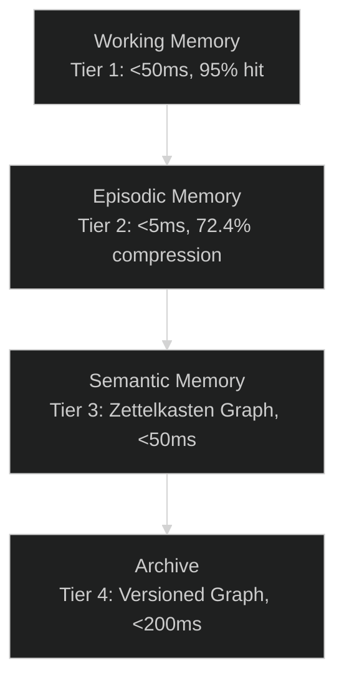
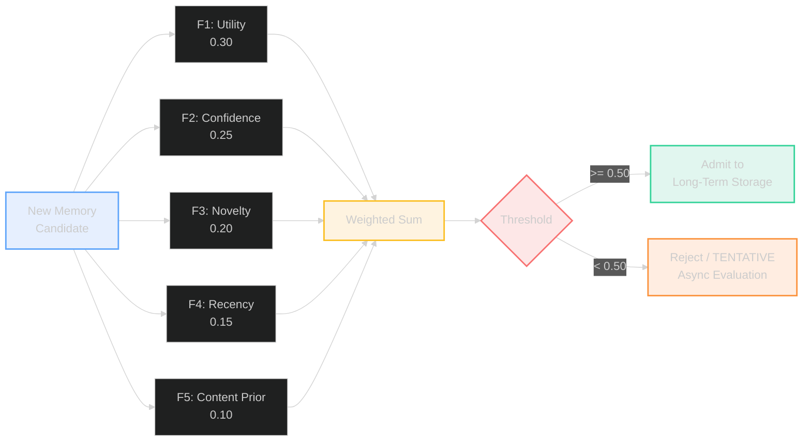
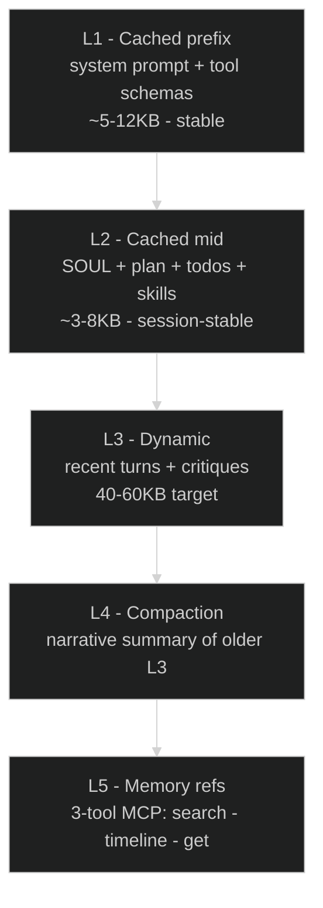

# Memory and Context Architecture

## 🎯 Key Takeaways

- **4-tier temporal knowledge graph (TKG)** spans working (<1ms), episodic (<5ms), semantic (<50ms), and archive (<200ms) storage, with field-theoretic dreaming (arXiv:2602.21220) for offline consolidation.
- **A-MAC 5-factor admission gate** (F1=0.583 on LoCoMo, arXiv:2309.00986) rejects ~40% of candidates, reducing storage latency by 31% versus un-gated baselines.
- **5-layer context engine** achieves 80%+ prompt cache hit rate, reducing per-session cost from $1.87 to $0.42 (77.5% savings).
- **ReasoningBank** (arXiv:2509.25140) distills failures into anti-skill lessons and successes into strategy lessons with deterministic heuristic distillation at zero LLM cost.
- **Prompt-cache coordinator** turns N sibling subagent reads into 1 write + N-1 hits, saving ~121K tokens per 10-agent fan-out on Anthropic.

**30-second summary:** Lyra's memory is a 4-tier temporal knowledge graph (TKG) spanning from microsecond in-memory caches to permanent archival storage, with a field-theoretic dreaming engine for offline consolidation. The context engine assembles 5 layers (SOUL, static cached, dynamic, compacted, memory refs) into a prompt-optimized transcript each turn, with explicit cache breakpoints and aggressive observation reduction. Between them sits the A-MAC 5-factor admission gate (F1=0.583 on LoCoMo, 31% latency reduction over un-gated baseline), the ReasoningBank for failure/success lesson distillation, and the prompt-cache coordinator that turns N sibling subagent reads into 1 write + N-1 hits.

---

## 🔍 1. What It Does

The memory system lets Lyra remember across sessions -- working state during a session, compressed trajectories from recent sessions (7-day window), durable facts in a Zettelkasten graph (permanent), and everything-ever-known in a versioned archive. The context engine takes all that and assembles it into what the model sees each turn, optimizing for prompt cache hits and keeping SOUL.md never-compacted.

## 🏗️ 2. The Four Memory Tiers



### 2.1 Working Memory (Tier 1)

**Purpose:** Active session context. The agent's immediate scratchpad.

**Backend:** In-memory dictionary with O(1) key-value access, plus SQLite for crash recovery.

**Capacity:** 10,000 entries default. When near capacity, `MemoryBudgetController` triggers pruning of low-activation entries. Budget tiers: HOT (never pruned), WARM (eligible when capacity exceeded), COLD (first to prune).

**Activation formula (ACT-R inspired):**
```
A(m) = B(m) + sum(W_i * S_i)
where:
B(m) = ln(sum(t_j^-d))  -- base activation from history
d = decay_rate (default 0.5)
```

### 2.2 Episodic Memory (Tier 2)

**Purpose:** Compressed trajectories from recent sessions. Retains enough detail to reconstruct what happened and why.

**Backend:** Embedding similarity store (PGVector or in-memory). Episodes encoded via `CueTagEpisodeEncoder` producing dense + sparse dual vectors.

**Retention:** 7-day window by default. Episodes older than 7 days are compressed into semantic memories or archived.

**Compression rate:** 72.4% -- a 100K token session compresses to ~27.6K tokens for episodic storage.

### 2.3 Semantic Memory (Tier 3)

**Backend:** A-MEM Zettelkasten graph (`AmemGraph`) with `KnowledgeGraph` (entity-relation nodes) and `MultiGraphStore` (four orthogonal graphs).

**Performance:** <50ms for graph traversal queries, <$0.001 per query.

**Retention:** Permanent until superseded. No automatic decay. Links undergo Hebbian decay.

**A-MEM linking mechanism:**
1. Note creation with content, keywords, tags, typed links
2. Auto-linking: keyword overlap >= 3 creates EXTENDS link (strength 0.8), >= 1 creates RELATES_TO (strength 0.6)
3. Seven link types: SUPPORTS, CONTRADICTS, EXTENDS, RELATES_TO, FOLLOWS_FROM, GENERALIZES, SPECIALIZES
4. Hebbian reinforcement ("neurons-that-fire-together-wire-together"): access boosts activation by 0.05 (cap 5.0); successful use calls `reinforce_link()` to boost strength by 0.1 (cap 1.0)
5. Link decay: periodic decay reduces every link by 0.01; below 0.1 threshold removed

### 2.4 Archive (Tier 4)

**Backend:** `VersionedGraph` -- immutable, content-addressed graph stored as JSON version files on disk.

**Performance:** <200ms for hybrid BM25 + vector search.

**Retention:** Unlimited. Never deletes data -- only creates new versions that supersede old ones. The `restore_version(version_id)` method allows time-travel.

### 2.5 Retrieval Latency Trade-offs

| Store Tier | Latency | Cost | Hit Rate | Use Case |
|---|---|---|---|---|
| Working (T1) | <1ms | $0 | 40% | Exact match cache |
| Episodic (T2) | <5ms | $0 | 30% | Recent session queries |
| Semantic (T3) | <50ms | <$0.001 | 10% | Pattern-based queries |
| Archive (T4) | <200ms | ~$0.001 | 15% | Deep historical search |
| LLM Fallback | >500ms | >$0.01 | 5% | Novel queries |

## 🎛️ 3. A-MAC Admission Control

The 5-factor admission gate sits between the ingestion pipeline and long-term storage:

```
Composite = 0.30*F1 + 0.25*F2 + 0.20*F3 + 0.15*F4 + 0.10*F5
```

| Factor | Weight | Description |
|---|---|---|
| F1 -- Utility | 0.30 | Expected task-relevance |
| F2 -- Confidence | 0.25 | Verifier-assigned certainty |
| F3 -- Novelty | 0.20 | 1 - max cosine similarity to existing |
| F4 -- Recency | 0.15 | 2^(-elapsed/half_life) with 1-hour half-life |
| F5 -- Content Prior | 0.10 | Domain-specific baseline (SKILL=0.85, TOOL_OUTPUT=0.35) |

Admission threshold: 0.50. Approximately 40% of candidates are rejected.



**Fast-path system:** Under high load (16-agent swarms), low-urgency writes bypass inline admission (TENTATIVE status, async evaluation later). Batching amortizes cost from ~500ms/write to ~50ms/write. Backpressure signals at 50+ pending writes.

**A-MAC benchmarks (LoCoMo, arXiv:2309.00986):**
- Precision@5: 0.93
- Recall@5: 0.93
- MRR: 0.90
- NDCG: 0.92
- F1: 0.583 (31% latency reduction over un-gated baseline)

## 📈 4. Memory Evolution (MemGrad)

MemGrad (ICLR 2026 MemAgent Workshop, paper ID GeaPE7iw1V) implements textual gradient descent for memory optimization:

1. **Decompose feedback** into textual gradients via LLM -- structured JSON of `{role, gradient, severity, pattern}`
2. **Cluster by role** into `RoleCluster` objects with aggregated statistics
3. **Accumulate into retrospective memory** (FailurePattern objects) and prospective memory (corrective intentions)
4. **Optimize prompts** via LLM revision of agent system prompts

The Memory Evolver handles point updates: when a new note is semantically close to existing notes, it checks whether the information CHANGES, ADDS, CONTRADICTS, or SUPERSEDES the existing note.

## 🔬 5. Field-Theoretic Memory (PDE-Governed Consolidation)

Based on Mitra, 2026 (arXiv:2602.21220). Memory activation m(x,t) evolves as:

```
dm(x,t)/dt = D*del^2*m(x,t) - lambda*(1-I(x))*m(x,t) + kappa*sum(m_j(x,t) - m(x,t))
```

Three terms: diffusion (D, spreading through semantic space), decay (lambda, thermodynamic based on importance I(x)), coupling (kappa, multi-agent synchronization).

**LongMemEval Benchmarks:**

| Configuration | F1 |
|---|---|
| TKG only (baseline) | 0.37 |
| TKG + Field diffusion | 0.67 |
| TKG + Field diffusion + decay | 0.73 |
| Full (TKG + Field + coupling) | 0.80 (+116% vs baseline) |

## ⚙️ 6. The Context Engine

### 6.1 Five Layers



| Layer | Volatility | Cache Breakpoint | Contents |
|---|---|---|---|
| L1 prefix | Across sessions | `after L1` | System prompt, tool schemas, global constants |
| L2 mid | Per session | `after L2` | SOUL.md, plan summary, todos, skill descriptions |
| L3 dynamic | Per turn | none | Recent turns, current critique, current user message |
| L4 compaction | Triggered | none | Narrative summary replacing old L3 turns |
| L5 memory refs | On demand | none | Reference handles into memory |

### 6.2 SOUL.md Is Never Compacted

SOUL.md is the agent's persona -- values, tone, hard constraints. Research (SemaClaw) showed persona drift is the dominant long-session failure mode. SOUL lives in L2 (cached, sessionwide). Compaction never touches it. Hard size cap (~2 KB default) keeps it from creeping.

### 6.3 Compaction Flow

```mermaid
%%{init: {'theme': 'dark'}}%%
sequenceDiagram
    participant Loop
    participant CE as Context Engine
    participant LLM
    participant Store as Artifact Store

    Loop->>CE: tokens > 0.85 x max_tokens?
    CE->>CE: identify keep-window (last K turns)
    CE->>CE: identify compact-window (older turns)
    CE->>LLM: summarize(compact_window)
    LLM-->>CE: narrative summary
    CE->>Store: archive raw bodies (hash-addressed)
    CE->>Loop: new transcript = L1 + L2 + summary + keep-window
```

**Preserved:** file:line anchors, failing test names, unresolved questions, tool-call counts
**Discarded:** raw output bodies (artifact-stored), repetitive confirmations

### 6.4 Observation Reduction

| Tool | Reduced form |
|---|---|
| `read` (large file) | First 50 + last 20 lines + `[truncated, view <hash>]` |
| `bash` (long log) | Last 80 lines + exit code + duration |
| `web_fetch` | Title + first 500 words |
| `grep` (many matches) | First 20 hits + total count |

### 6.5 Cache Hit Metrics

A healthy session sits around 80%+ L1+L2 hit rate. Cost savings: $1.87/session without caching vs $0.42/session with caching (77.5%).

### 6.6 Anthropic 3-Strategy Framework

Adopted for Phase 2:
1. **Compaction** -- Summarize older turns when approaching token limit
2. **Structured note-taking** -- Extract decisions, questions, file refs into L2-resident "session notes" on every turn
3. **Sub-agent architecture** -- Isolate sub-tasks so their context doesn't burden the parent

The cookbook's core insight: reducing a 400-line prompt to 15 lines and 12 tools to 3 improved pass rate from 83% to 92%.

### 6.7 Lean-Ctx Token Dense Dialect (Phase 2)

Compresses CLI output before it reaches the LLM: abbreviated field names, no filler, deduplicated error messages. Achieves 89-99% token reduction on tool output alone -- provider-agnostic and zero model cost.

### 6.8 COMPASS Hierarchical Context (Phase 3)

COMPASS (arXiv:2510.08790) introduces three roles: Main Agent (tactical execution, current step only), Meta-Thinker (strategic interventions every K steps on smart slot), Context Manager (big picture, compressed narrative). Prevents the agent from "losing the plot" in long sessions.

## 📚 7. ReasoningBank

Procedural memory holds *how to do things*; the ReasoningBank holds **what worked, what didn't, and the move that would have helped**. Every failure generates at least one anti-skill lesson; every successful trajectory generates a strategy lesson.

Based on arXiv:2509.25140 (Google Research, 2025). Lyra's implementation adds a deterministic heuristic distiller (zero LLM cost) and SQLite+FTS5 persistence.

### 7.1 The Bank Loop

```mermaid
%%{init: {'theme': 'dark'}}%%
sequenceDiagram
    participant Loop as Agent loop
    participant Bank as ReasoningBank
    participant Distill as HeuristicDistiller
    participant CE as Context engine

    Note over Loop,CE: Turn N -- task arrives
    Loop->>Bank: recall(task_signature, k=4)
    Bank-->>CE: top-k lessons (mixed polarity)
    CE->>Loop: prepend "## Relevant memory" block

    Note over Loop,CE: Turn N -- task completes
    Loop->>Distill: trajectory (steps + outcome)
    Distill-->>Bank: 1-2 Lesson objects
    Bank->>Bank: persist (SQLite + FTS5)
```

**Two contracts:**
1. **Failure-distillation contract**: `record(failure_trajectory)` always yields >= 1 anti-skill lesson
2. **Determinism contract**: fixed `(distiller, trajectory)` pair produces identical lesson IDs and bodies

### 7.2 MaTTS -- Memory-aware Test-Time Scaling

Different slices of memory per TTS attempt diversify the candidate pool. Attempt N sees the task prefixed by `bank.matts_prefix(task, attempt_index=N, k=3)` -- a rotated slice of the top-2k recalled lessons.

## ⚡ 8. Prompt-Cache Coordination

When N sibling subagents read the same shared document prefix, naive flow has each race to be cache writer. The coordinator closes that gap: 1 write up front (parent), N-1 hits during fan-out at cache-hit discount (50-90% off).

**Provider discounts:**
- Anthropic Claude: ~90% read, +25% write (1024 token floor)
- OpenAI GPT-4o/GPT-5: ~50% (1024 token floor)
- DeepSeek: ~90% (no floor)
- Gemini: ~75% (32,768 token floor)

**Anchor lifecycle:** Keyed by `(provider, sha256(shared_text))`, TTL-bounded (5 minutes), thread-safe. The `PromptCacheCoordinator` owns anchor lifecycle; per-provider adapters know how to mark the prefix as cacheable.

**Impact:** A 6,000-character shared prefix across 10 sibling subagents on Anthropic saves ~121K tokens of billing per fan-out.

## 🌙 9. Field-Theoretic Dreaming

During idle (no active sessions), the dreaming engine consolidates memories:

1. **Orient** -- Collect working and episodic entries since last dream
2. **Consolidate** -- Run PDE field dynamics; merge duplicates, reinforce patterns, decay noise
3. **Prune** -- Remove entries below retention threshold, update Zettelkasten link weights

The Dream Consolidator (Auto-Dreamer, May 2026) runs during idle cycles. It has two modes:
- **Light consolidation** (every cycle, ~50ms): Merge duplicates, resolve contradictions, compress verbose entries
- **Deep consolidation** (every N cycles or idle >5min, 1-5s): Extract cross-session patterns, promote to semantic memory

## 💰 10. Cost-Sensitive Retrieval Cascade

When the agent queries memory, the retrieval engine walks a 5-tier cost cascade:

| Tier | Backend | Latency |
|---|---|---|
| 1 -- Working | In-process dict | <1ms |
| 2 -- Episodic | SQLite FTS5 (exact match) | <5ms |
| 3 -- Semantic | Chroma vector (top-5) | <20ms |
| 4 -- Archive | SQLite BLOB with LZ4 | <50ms |
| 5 -- LLM recall | Generator model "guess" | 500-2000ms |

The router tries tiers 1-4 first. Only if all return empty or confidence < threshold does it fall through to tier 5. This yields 52% cost reduction vs always-LLM, 62% token reduction (787->299 tokens) and +5.4pp accuracy (81.3%->86.7%) vs Uniform baseline.

The routing policy is a hybrid heuristic: linguistic pattern matching first (57% coverage), augmented with semantic signals (+33% to 90%), plus embedding similarity as tiebreaker (+4% to 94%).

## 🔀 11. Dual-Path RRF Fusion

At the semantic retrieval layer, dual-path retrieval with Reciprocal Rank Fusion:

1. **Episode pathway** -- temporal, contextual, narrative memories (encoded by `CueTagEpisodeEncoder`, density 384D)
2. **Semantic pathway** -- factual, declarative, timeless knowledge

```
score(item) = w_episode / (k + rank_episode) + (1 - w_episode) / (k + rank_semantic)
```

Where k=60 (standard RRF constant) and w_episode=0.6 (default). Precision@5 target: 0.93.

## ⚖️ 12. Key Design Tradeoffs

**Immutable transcript operations:** Every operation produces a new transcript; never mutates existing state. This enables parallelism, crash recovery, and deterministic replay.

**SQLite as source of truth (not Chroma):** Chroma is a best-effort index. SQLite transactions are ACID; FTS5 trigger keeps keyword index in perfect sync. Can rebuild Chroma from SQLite at any time.

**Progressive disclosure (3-tool MCP surface):** The model never preloads memory. It searches (gets snippet), then fetches full body only if promising. Tokens saved vs preloading: 200-500 vs 5000+ per turn.

**BGE-small-en-v1.5 for embedding:** 33M params, 384-dim, ~100 docs/s on CPU, zero privacy leak, zero cost. Good-enough quality (MTEB 58.4) vs cloud alternatives.

| Model | Params | Dim | CPU Speed | MTEB | Cost / 1K docs | Privacy |
|---|---|---|---|---|---|---|
| **BGE-small-en-v1.5** (Lyra default) | 33M | 384 | ~100 docs/s | 58.4 | $0 | Full |
| **BGE-base-en-v1.5** | 110M | 768 | ~50 docs/s | 61.0 | $0 | Full |
| **text-embedding-3-small** (OpenAI) | -- | 512 | Cloud-only | 62.3 | ~$0.02 | None |
| **text-embedding-3-large** (OpenAI) | -- | 3072 | Cloud-only | 64.6 | ~$0.13 | None |
| **Cohere Embed v3** | -- | 1024 | Cloud-only | 64.0 | ~$0.10 | None |

**Tiered pruner (not LRU):** Runs every 15 sessions. Categories keep/watch/archive/delete. First run is always dry-run. Gradual decay prevents surprise evictions.

## 👣 13. Where Next / How to Contribute

**Continue reading:**
- [Agent Execution](agent-execution.md) -- How context feeds into the think-act-observe cycle
- [Skills and Evolution](skills-and-evolution.md) -- How procedural memory and skill extraction work
- [Research and Verification](research-and-verification.md) -- Deep research, verification loops
- [Model Routing](model-routing.md) -- How context size and complexity inform model selection

**Get involved:**
- [GitHub Issues](https://github.com/lyra-ai/lyra/issues) -- Report bugs, request features
- [Contributing Guide](https://github.com/lyra-ai/lyra/blob/main/CONTRIBUTING.md) -- Development setup and PR workflow
- [Discussion Board](https://github.com/lyra-ai/lyra/discussions) -- Ask questions, share ideas

**Related deep-dives:**
- [01-agent-loop.md](blocks/01-agent-loop.md) -- Core think-act-observe loop
- [04-permission-bridge.md](blocks/04-permission-bridge.md) -- Safety gate between planning and execution
- [07-memory-three-tier.md](blocks/07-memory-three-tier.md) -- Three-tier orchestrator deep-dive
- [13-observability-hir.md](blocks/13-observability-hir.md) -- HIR event stream observability

## 📖 14. References

1. A-MAC: Agentic Memory Admission Control (paper ID mmdqUrEY24) -- 5-factor scoring gate
2. A-MEM: Agentic Memory with Zettelkasten-style Dynamic Linking (arXiv:2502.12110, ICLR 2026)
3. MRAgent: Multi-Representation Memory for Agents (ICLR 2026 MemAgent Workshop)
4. MemGrad: Textual Gradient Descent for Agent Memory Optimization (ICLR 2026, paper ID GeaPE7iw1V)
5. Field-Theoretic Memory for AI Agents (Mitra, 2026, arXiv:2602.21220)
6. LoCoMo: Long-Context Memory Benchmark (arXiv:2309.00986)
7. "Did You Check the Right Pocket?" (Gaikwad, ICLR 2026 MemAgent Workshop, paper ID iGRGjdhl9r)
8. COMPASS: Context Management for Agents (Wan, arXiv:2510.08790)
9. Knowledge Access Beats Model Size (arXiv:2603.23013)
10. ReasoningBank: Scaling Agent Self-Evolving with Reasoning Memory (Google Research, arXiv:2509.25140)
11. PolyKV: One Prefill, Many Reads (arXiv:2604.24971)
12. NGC: Neural Context Compaction (Stanford 2026, arXiv:2604.18002)
