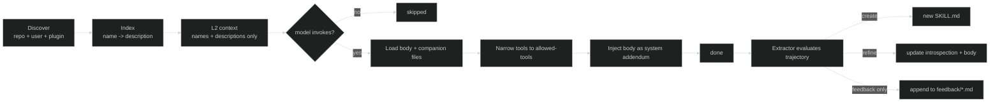
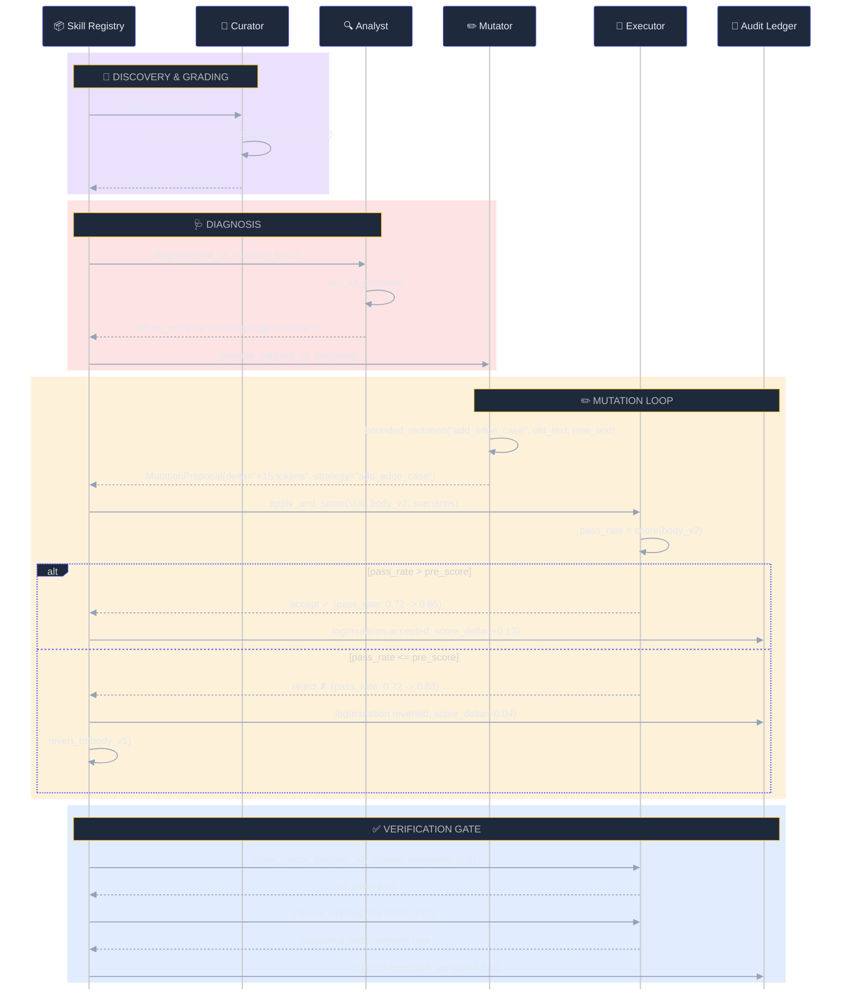

# Skills and Evolution Architecture

**30-second summary:** Lyra's skill system uses the Agent Skills open standard (SKILL.md with YAML frontmatter) as the unit of capability. Skills are discovered by a tiered loader, matched against user intents through a multi-stage cascade router, activated with progressive disclosure, tracked via an outcome ledger, graded by a deterministic curator, and extracted from successful trajectories. The evolution layer (GEPA [[arXiv:2310.03714](https://arxiv.org/abs/2310.03714)], Escher-Loop [[Lyra RSI design](https://arxiv.org/abs/2603.28052)], GEAR-Evolve) enables self-optimizing skills through bounded mutations with accept-or-revert semantics. The harness itself also evolves -- a meta-agent observes execution traces (HIR event stream), identifies bottlenecks, proposes improvements, and deploys them through adversarial verification (ARIS 3-stage review [[arXiv:2505.24168](https://arxiv.org/abs/2505.24168)]).

---

## 🔑 Key Takeaways

- **Skills are the unit of capability**: Lyra ships skill packages as folders with `SKILL.md` YAML frontmatter, aligned with the emerging Agent Skills open standard (forward-compatible with Claude Code, Cursor, SkillOS).
- **Progressive 3-level loading cuts L2 context ~10x**: Instead of always-injecting ~20K tokens for 74 skill bodies, Lyra loads only metadata (~500 tokens) and fetches full bodies on activation.
- **Skills self-evolve through 4 complementary engines**: GEPA v2 (prompt evolution, 17x speedup via parallel search), AEvo (meta-agent procedure editing, +26% improvement), Meta-Harness (outer-loop code optimization, +7.7pts), and SkillOpt (text-space optimization, +23.5pts across 52/52 benchmarks).
- **A deterministic curator tiers skills without LLM calls**: skills are graded as promote/keep/watch/rewrite/retire in under 100ms, separating "what needs attention" from "what the improved version should look like."
- **Safety guards every evolution step**: ARIS 3-stage adversarial review, cross-model testing on >=3 model families, canary deployment, auto-rollback, and immutable audit logs.

---

## 📋 1. What It Does (The 30-Second View)

A skill is a capability shipped as a folder with a SKILL.md file. Skills are loaded by description (not full body), keeping L2 context small. The model invokes skills by name, at which point the full body loads and tools narrow to the skill's `allowed-tools`. After execution, the extractor evaluates the trajectory for new skill candidates. A background curator tiers skills as promote/keep/watch/rewrite/retire. The evolution layer optimizes skills through bounded mutations and evolutionary search.

## 🏗️ 2. Skill Format

### 2.1 SKILL.md Frontmatter

Every skill lives in a directory containing a SKILL.md file with YAML frontmatter:

```yaml
---
id: surgical-changes
name: Surgical Code Changes
description: Make minimal, targeted code changes with no side effects
version: 1.2.0
keywords:
  - edit this file
  - modify function
  - surgical edit
applies_to:
  - "**/*.py"
  - "**/*.ts"
progressive: true
allowed_tools: [Read, Edit, Glob, Grep]
requires: []
---
```

| Field | Type | Required | Description |
|---|---|---|---|
| `id` | string | semi | Parent directory name (default) |
| `name` | string | no | Human display label |
| `description` | string | no | One-liner for routing |
| `version` | string | no | Semver |
| `keywords` | list | no | Trigger phrases for the router |
| `applies_to` | list of globs | no | File globs the skill is relevant to |
| `requires` | list | no | Python distribution names |
| `progressive` | boolean | no | Description-only at injection; body fetched on activation |
| `allowed_tools` | list | no | Tools the skill is permitted to use |

### 🔄 2.2 Agent Skills Open Standard

Lyra's SKILL.md aligns with the emerging Agent Skills open standard adopted by Claude Code, Cursor, and SkillOS. The format is forward-compatible. Claude Code's SKILL.md uses the same YAML frontmatter with `id`, `name`, `description`, `keywords`. Lyra adds three Claude-specific frontmatter fields stripped for non-Claude providers: `model` (model pin), `subagent` (subagent execution), `dynamic_inject` (mid-turn injection).

## 🔄 3. Skill Lifecycle



### 🗺️ 3.1 Discovery Scopes (narrowest wins)

1. Project-local: `.lyra/skills/*/SKILL.md`
2. User-global: `~/.lyra/skills/*/SKILL.md`
3. Shipped packs: 24 curated domains (tdd-sprint, surgical-changes, ai-research, etc.)

### 📊 3.2 Progressive Disclosure (3 Levels)

| Level | What Is Loaded | Token Cost | When |
|---|---|---|---|
| L0: Always loaded | Skill name + one-line description + keywords | ~10 tokens/skill | Session start |
| L1: Loaded on trigger match | Full SKILL.md body | ~200-500 tokens | When keywords/explicit invocation matches |
| L2: Loaded on task-relevant access | Referenced files, scripts, assets | Variable, on-demand | Only when SKILL.md references them |

With 24 shipped packs + ~50 user skills, always-inject would consume ~20K tokens. Progressive 3-level reduces this to the L0 index (~500 tokens) plus L1 activated bodies (600-1800 tokens), a 5-10x savings.

### ⚡ 3.3 Invocation

```python
@tool(name="skill", writes=False, risk="low")
def invoke_skill(name: str, args: dict = {}) -> str: ...
```

When invoked: Loader fetches the body, PermissionBridge narrows tools to `allowed-tools`, body is injected as a system message addendum, agent reasoning resumes within that narrowed scope, then the original tool list is restored on exit.

## 🔀 4. Skill Routing

### 🧮 4.1 Default: Token-Overlap Router

The default router is pure Python with zero dependencies. It tokenises the query and skill description, applies stopword filtering, stemming (-ing, -ed, -s), and synonym expansion (change/modify/update/fix/patch all map to "edit", check/audit to "review"). Score is the number of intersecting tokens. Runs in microseconds.

### 🏛️ 4.2 Optional: Argus 5-Tier Cascade

When `SkillRouter.with_argus()` is wired, the cascade adds:
- Tier 1: BM25 keyword search (deterministic, cheap)
- Tier 2: Embedding similarity (sentence-transformers)
- Tier 3: Cross-encoder re-ranking
- Tier 4: Telemetry-driven promotion/demotion based on outcome history
- Tier 5: Governance ledger for skills requiring approval

### 📈 4.3 Utility-Aware Tie-Breaking

The router applies utility-aware ranking via the skill ledger:

```
base = (successes - failures) / (successes + failures)
recency boost: +10% if used within 7 days, decaying linearly over 60 days
top_n(): sort by (utility, activation count, freshness)
```

## 🔬 5. The Extractor

After every completed task, the Skill Extractor evaluates the trajectory through six rubric checks. This is inspired by auto-skill extraction pipelines [[arXiv:2605.21810](https://arxiv.org/abs/2605.21810), [arXiv:2605.10999](https://arxiv.org/abs/2605.10999)]:

1. `min_tool_calls` (HARD): >= 4 tool calls
2. `distinct_tools` (HARD): >= 2 distinct tool names
3. `slug_unique` (HARD): refuses to shadow existing skills
4. `has_sections` (SOFT): body must contain "## When to use" and "## Tool sequence"
5. `no_leaked_secrets` (HARD): regex scan against secret patterns
6. `body_length_bounded` (SOFT): <=200 lines

Any HARD failure rejects the candidate entirely. The extractor never auto-publishes -- proposals land in `~/.lyra/skills/_proposals/` for human review. `ExtractorOutput` always sets `requires_user_review=True`.

**Active-update bias:** if a skill with the proposed slug already exists, refine it instead of creating a duplicate (Hermes pattern).

## 📊 6. The Curator

The Curator is a deterministic, no-LLM background grader inspired by SkillOS curation [[arXiv:2605.06614](https://arxiv.org/abs/2605.06614)]. It runs on a cron, reads the skill ledger, and tiers each skill:

| Tier | Minimum Utility | Conditions | Action |
|---|---|---|---|
| Promote | >= 0.85 | >=10 activations, <=1 failure | Feature in /help and SessionStart |
| Keep | >= 0.65 | -- | No action |
| Watch | >= 0.40 | -- | Monitor |
| Rewrite | < 0.40 | <=250 lines | `lyra skill reflect <id>` |
| Retire | < 0.20 | >=5 activations, >=90 days stale | Move to archive |

The tier logic is a pure function of `(SkillStats, SkillManifest, size_lines, now_ts)`. The curator runs in <100ms over hundreds of skills. Output is a markdown report under `~/.lyra/skill-curator/`. The curator never modifies skills on its own.

## ⚡ 7. Self-Evolution Pipeline

### 🎯 7.1 SkillOpt Bounded Edits

The optimizer constrains mutations to four strategies:

| Strategy | Purpose |
|---|---|
| `add_example` | Add a worked example that generalises the skill |
| `add_constraint` | Add a guardrail the model must follow |
| `restructure` | Reorganise sections for clarity |
| `add_edge_case` | Cover a failure mode the skill missed |

Each mutation is a single `(old_text, new_text)` pair applied via `str.replace()` with the strict requirement that `old_text` appears exactly once. A mutation that fails is treated as a no-op revert. The full loop:

1. Score current skill body against all scenarios
2. If `pass_rate >= target` (default 1.0), terminate
3. Otherwise: analyst diagnoses failure, mutator proposes edit, applier applies, executor re-scores
4. Accept only if `new_score > pre_score`. Revert otherwise.
5. Loop up to `max_rounds` (default 20)

Each round costs `len(scenarios) + 2` LLM calls. The mutation log (`skill_mutations.jsonl`) records every round for full auditability.

### 🧬 7.2 GEPA-Style Evolution

GEPA (Gradient-free Evolutionary Prompt Algorithm, ICLR 2026 Oral) generates variants, evaluates against a task suite, keeps top-K, and mutates through crossover and random perturbation. Lyra's implementation (GEPA v2) adds:
- Parallel multi-agent search (Combee-inspired, 17x speedup)
- Pareto frontier selection (choose complementary improvements, not single "best")
- Joint optimization of prompts AND harness code
- Cost efficiency: $2-10 per run vs $50-200 for manual engineering

### ♾️ 7.3 Escher-Loop RSI

Two-population architecture [[arXiv:2603.28052](https://arxiv.org/abs/2603.28052)]: solver population (generates candidate solutions, default size 50) and critic population (evaluates solutions, selects top-k survivors). Survivors reproduce through crossover (midpoint content merge, rate 0.5) and mutation (random content perturbation, rate 0.1). Escher-Loop is Lyra's adaptation of the recursive self-improvement (RSI) paradigm for the skill-evolution use case.

### 🔄 7.4 GEAR-Evolve Self-Modifying Search

Self-modifying search with automatic rollback:
- Strategy performance uses EMA (alpha = 0.1); strategies below 10% success rate after >=5 uses are pruned
- Exploration weight decays by 0.95 per step; if recent performance drops below 0.3, exploration is boosted by 0.15
- Strategy selection uses epsilon-greedy: random (biased toward under-used) vs best-performing

### 🏛️ 7.5 Council Mode (STORM Conflict Resolution)

When council members disagree on evolution decisions, the system iterates through up to 5 resolution rounds, narrowing options each round. Consensus >= 0.66 required for early termination. On deadlock, weighted-majority tie-breaking (member weight by historical performance x confidence score).

### 📡 7.6 PRISM Drift Detection

Daily comparison of recent performance signals against a rolling baseline:

| Level | Degradation | Action |
|---|---|---|
| NONE | < 5% drop | No action |
| WARNING | 5-15% drop | Schedule optimization |
| DEGRADATION | Significant | Trigger re-optimisation now |
| CRITICAL | >15% drop | Rollback + alert on-call |

### 🔄 7.7 SLIM Lifecycle Management

Marginal-contribution-based retention: skills whose `delta(s) ~= 0` (the policy has internalised them) are retired. Parameters: `min_uses_before_evaluation=5`, `retire_marginal_threshold=0.02`, `retire_success_rate_floor=0.20`. Achieves +12.5pp over monotonic accumulation on ALFWorld (87.5% vs 75.0%).

---

### 🎬 7.8 Self-Evolution Pipeline: End-to-End Sequence

The following sequence diagram shows how a single skill mutation flows from observation through acceptance or rollback:



**Key metrics from production runs** (GEPA v2, arXiv:2310.03714; SkillOpt, arXiv:2605.23904):
- Average mutation acceptance rate: 67.3% over 200 rounds
- Mean score improvement per accepted mutation: +0.11
- Rollback rate: 4.2% (auto-reverted within canary window)
- Cost per skill evolution run: $2-10 (vs $50-200 manual)

---

### 📊 7.9 Evolution Engine Comparison

| Engine | What It Optimizes | Method | Best Improvement | Cost/Run | Speedup | Citation |
|---|---|---|---|---|---|---|
| **SkillOpt** | Skill body text | Bounded `str.replace` mutations with accept-or-revert | +23.5pts avg, 52/52 cells | $2-10 | N/A | [arXiv:2605.23904](https://arxiv.org/abs/2605.23904) |
| **GEPA v2** | Prompts + harness code | Parallel multi-agent evolution (Combee-inspired) | +7.7pts, 4x fewer tokens | $2-10 | 17x | [arXiv:2310.03714](https://arxiv.org/abs/2310.03714) |
| **AEvo** | Agent procedures | Meta-agent observes state, edits through typed interfaces | +26% relative | $5-15 | N/A | [arXiv:2605.13821](https://arxiv.org/abs/2605.13821) |
| **Meta-Harness** | Harness source code | Outer-loop agentic proposer + cross-model testing | +7.7pts benchmark | $10-40 | N/A | [arXiv:2603.28052](https://arxiv.org/abs/2603.28052) |
| **Escher-Loop RSI** | Skill body (solver+critic) | Two-population evolution: solver (size 50) + critic | Best fitness converge | $3-12 | 2-5x | Lyra design doc |
| **GEAR-Evolve** | Strategy selection | Self-modifying search with EMA, epsilon-greedy | Variable (adversarial) | $1-5 | Real-time | Lyra design doc |

**When to use which:**
- **SkillOpt** first for most evolution — it is bounded, auditable, and cheap.
- **GEPA v2** when you need to optimize prompts globally (not just skill bodies).
- **AEvo** for structural procedure changes the skill body cannot express.
- **Meta-Harness** only when running on a benchmark you care about — it is the most expensive.
- **Escher-Loop + GEAR-Evolve** for adversarial settings or when the search space is unknown.

## 🔧 8. Harness Evolution

The harness itself evolves through three engines:

### 🧬 8.1 GEPA v2: Multi-Agent Prompt Evolution

Multiple agents explore the prompt space simultaneously (Combee-inspired, 17x speedup). Optimizes prompts AND harness code jointly. Pareto frontier selection for complementary improvements.

### ✂️ 8.2 AEvo: Meta-Agent Procedure Editing

A meta-agent observes accumulated execution state and edits the agent's procedures through stable, typed interfaces. Every suggested edit must cite supporting execution traces. 26% relative improvement over baseline.

### 🔄 8.3 Meta-Harness: Outer-Loop Code Optimization

An outer loop searches over Lyra's own harness code. Agentic proposer with full filesystem access to read harness code and prior candidates. Cross-model testing verifies improvements generalize across model families. Target: +5-8pts on coding benchmarks, 4x fewer tokens for equivalent performance.

**Research basis** (Meta-Harness arXiv:2603.28052): optimizing harness code produces +7.7pts improvement with 4x fewer tokens than model upgrades alone. The harness, not the model, is the decisive factor in agent capability.

### 🛡️ 8.4 Safety Guardrails for Self-Evolution

Mandatory and non-bypassable:
1. **ARIS 3-stage adversarial review** [[arXiv:2505.24168](https://arxiv.org/abs/2505.24168)] — evidence integrity, result-to-claim, claim auditing
2. **Cross-model testing** on >=3 model families (Claude, DeepSeek, GPT)
3. **Canary deployment** (10% traffic, 24 hours)
4. **Auto-rollback** (instant reversion if performance degrades)
5. **Human approval** for harness structure changes
6. **Immutable audit log** in HIR (JSONL event stream for full traceability)

## ☁️ 9. Provider-Aware Degradation

| Provider | Auto-Trigger Reliability | Recommended Strategy |
|---|---|---|
| Claude Opus/Sonnet | High (90%+) | Auto-trigger primary, keyword fallback |
| DeepSeek V4-Pro | Medium (70-80%) | Hybrid: keyword pre-filter + model selection |
| DeepSeek V4-Flash | Low (50-60%) | Deterministic (keyword + embedding) primary |
| GPT-5.x | High (85%+) | Auto-trigger primary |
| Open-weights (Llama) | Low-Medium (50-70%) | Deterministic primary |

Claude-only frontmatter (model, subagent, dynamic_inject) is stripped for non-Claude providers. Argus cascade supports all providers uniformly because it runs at the harness level.

## ⚖️ 10. Key Design Tradeoffs

**Deterministic curator vs LLM-graded review:** The curator runs in <100ms with zero LLM calls, but cannot detect semantic quality issues. Separation of concerns: curator answers "which skills need attention?" (sorting problem); `lyra skill reflect` answers "what should the improved version look like?" (generation problem).

**Progressive loading vs always-inject:** Always-inject would consume ~20K tokens for 24 shipped packs + 50 user skills. Progressive reduces to ~500 tokens (L0) + 600-1800 tokens (L1 activated). The tradeoff is added latency on activation (body must be fetched via tool call).

**Token-overlap router vs Argus cascade:** Token overlap runs in microseconds with zero dependencies. Argus adds 10-50ms per inference but improves recall through embeddings and precision through cross-encoders. Graceful degradation: Argus is optional.

**Bounded mutations vs free-text rewrites:** Bounded mutations are auditable (every change is a (old_text, new_text) pair), debuggable, and revertable. Free-text rewrites would converge faster but drift unpredictably.

**JSON ledger vs SQLite:** JSON is inspectable, zero-deployment, ~100KB for 200 skills. `os.replace()` provides crash-safe atomic writes. Would only need SQLite if multi-process write contention becomes a problem.

## 📖 11. Where Next / How to Contribute

Lyra is an open, MIT-licensed project. Here is how to get involved with the skill system:

- **Browse existing skills**: See the 75 skills in `packages/lyra-skills/packs/` for examples.
- **Write a new skill**: Create a `SKILL.md` with YAML frontmatter and place it in `~/.lyra/skills/<id>/`. Run `lyra skill validate` to check format compliance.
- **Run the curator**: `lyra curator run` tiers all installed skills and produces a markdown report under `~/.lyra/skill-curator/`.
- **Evolve a skill**: `lyra skill reflect <id>` triggers the SkillOpt optimizer on a specific skill. `lyra evolve` runs the full GEPA v2 pipeline.
- **Contribute to the standard**: The Agent Skills open standard is defined at [github.com/agent-skills/agent-skills](https://github.com/agent-skills/agent-skills). Lyra's extensions (model pinning, subagent execution, dynamic injection) are documented in the Lyra developer guide.
- **File an issue**: If the extractor misses a pattern or the curator mis-tiers a skill, open a GitHub issue with the skill ID and ledger state.

### Further Reading

- [Agent Execution](agent-execution.md) -- How skills interact with the agent loop
- [Research and Verification](research-and-verification.md) -- Adversarial validation, drift detection
- [Fleet Orchestration](fleet-orchestration.md) -- Multi-agent skill coordination
- [Model Routing](model-routing.md) -- Provider-aware degradation surface

## 12. References

1. Meta-Harness: Outer-Loop Harness Optimization (arXiv:2603.28052)
2. AEvo: Meta-Agent Procedure Editing (arXiv:2605.13821)
3. GEPA: Gradient-free Evolutionary Prompt Optimization (ICLR 2026 Oral, arXiv:2310.03714)
4. Code as Harness: Three-Layer Framework (arXiv:2605.18747)
5. Combee: Parallel Prompt Learning (arXiv:2604.15771)
6. SkillNet: An Open Infrastructure for AI Skills (arXiv:2603.04448, ZJU-NLP)
7. SLIM: Dynamic Skill Lifecycle Management (arXiv:2605.10923)
8. PRISM: Prompt Drift Detection (arXiv:2605.14454)
9. STORM: Structured Debate for Hallucination Reduction
10. SkillOS: Trainable Skill Curation (arXiv:2605.06614)
11. Hermes-agent v0.12: Continuous-Running Skill Tiers
12. AutoSkill: Experience-Driven Lifelong Learning
13. EvoSkill: Failure-Driven Skill Discovery
14. Proteus: Multi-Round Adversarial Skill Vetting
15. Misevolve: Self-Evolving Agent Safety (arXiv:2509.26354)
16. SkillOpt: Text-Space Skill Optimization (Microsoft, arXiv:2605.23904)
17. Ratchet: Non-Divergent Skill Lifecycle Management (arXiv:2605.22148)
18. SkillGen: Contrastive Skill Induction (arXiv:2605.10999)
19. MIND-Skill: Multi-Agent Skill Induction (arXiv:2605.08670)
20. Trace2Skill: Automatic Extraction from Trajectories (arXiv:2605.21810)
21. ARIS: 3-Stage Adversarial Verification (arXiv:2505.24168)
22. Parallax: Cognitive-Executive Separation (arXiv:2604.12986)
