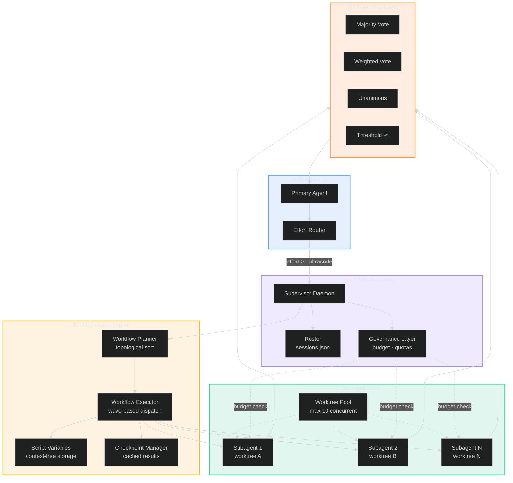
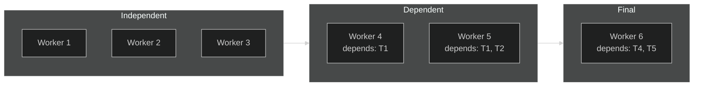
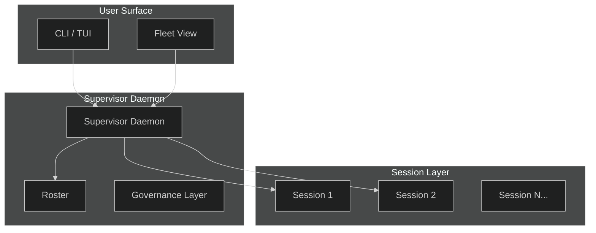

# 🚢 Fleet Orchestration Architecture

**30-second summary:** Lyra's fleet orchestration enables multi-agent coordination through DAG-based team execution, worktree-isolated subagents, and a supervisor daemon that manages session lifecycles. The DAG teams system defines execution topologies as directed acyclic graphs (DAGs) of worker nodes, supporting sequential, parallel, and conditional branching patterns. Each subagent runs in its own git worktree for filesystem isolation, with a worktree pool managing allocation and cleanup. The fleet supervisor orchestrates up to 1,000 total subagents per run (16 concurrent), tracks results in script variables rather than the LLM's context window, and supports checkpoint-based resumability.

> **Key Takeaways**
> - **DAG teams** model execution workflows as directed acyclic graphs. Independent nodes run concurrently; dependent nodes sequence automatically -- no manual orchestration needed.
> - **Worktree isolation** gives each subagent a dedicated filesystem sandbox via git worktrees (lightweight linked repo copies), preventing concurrent-edit conflicts in the same repository.
> - **Fleet supervisor** manages up to 1,000 subagents per run (16 concurrent) with cost gating, heartbeat liveness, crash recovery, and a fleet-view TUI.
> - **Result tracking in script variables** keeps intermediate outputs outside the LLM context window, preventing context pollution and enabling checkpoint-based resume.
> - **Process-per-session model** provides crash independence: one failed session cannot take down others, and the supervisor recovers orphaned sessions on restart.

---

## 🏗️ 1. What It Does (The 30-Second View)

Fleet orchestration extends the agent loop to multiple agents working in parallel. DAG teams let you define execution workflows as graphs of worker nodes -- independent operations run concurrently, dependent ones sequence automatically. Subagent worktree isolation means each agent gets its own filesystem sandbox via git worktrees. The supervisor daemon manages the full lifecycle: dispatch, attach, peek, stop, respawn, and cleanup.

### 💠 Fleet Architecture at a Glance



## 🔄 2. DAG Teams

### 2.1 Core Architecture

DAG teams define execution topologies as directed acyclic graphs. Each node is a worker that receives input, executes, and produces output. Edges define dependencies. The topology supports three node types:

- **Compute nodes**: Execute a task using an agent loop
- **Transform nodes**: Map/reduce outputs between nodes
- **Gate nodes**: Conditional branching (if/else, switch)



### 2.2 Wave-Based Execution

The DAG is topologically sorted into waves of independent nodes. All nodes in a wave execute in parallel; the next wave waits for all predecessors to complete. The workflow engine:

1. Writes a Python orchestration script containing the plan as code (not context)
2. Spawns subagents to execute parallel tasks
3. Tracks intermediate results in script variables -- NOT in the LLM's context window
4. Supports resumability: completed agents return cached results on resume
5. Returns a consolidated result to the agent loop on completion

### 2.3 Execution Model Comparison

| Model | Description | Latency | Cost Profile | Best For |
|---|---|---|---|---|
| **Sequential** (single agent) | One step at a time | Highest wall-clock | Lowest token cost | Simple, deterministic tasks |
| **Fan-out** (parallel) | Independent nodes in parallel | Reduced by wave depth | Higher peak cost | Code review across 4 modules |
| **Map-reduce** | Parallel + aggregation | O(tree depth) | Shared aggregation pass | Processing 8 chunks, merging results |
| **Diamond** | Two approaches converge | 50% of sequential | 2x compute for winner | Compare architectures, keep the best |
| **Gate** | Conditional branching | Variable | Saves cost on skipped branches | If tests pass, deploy; else fix |

Throughput measurements (AutoScientists benchmark, arXiv:2605.28655):
- Fan-out yields **1.5-2x faster convergence** through parallel exploration
- Dead-end tracking reduces redundant experiments by **30-50%**
- Adversarial validation improves solution quality by **12-23%** vs single-agent

### 2.4 Supported Topologies

| Topology | Use Case | Example |
|---|---|---|
| **Linear** | Sequential pipeline | Research -> Design -> Implement -> Test |
| **Fan-out** | Parallel independent tasks | Analyze 4 modules simultaneously |
| **Map-reduce** | Parallel with aggregation | Process chunks, merge results |
| **Diamond** | Parallel then converge | Two approaches, compare winners |
| **Gate** | Conditional branching | If tests pass, deploy; else fix |

Refer to Section 2.3 above for latency, cost, and throughput characteristics of each topology.

### 2.5 Team Composition

Each DAG team node has a defined role:
- **Analyst**: Generates hypotheses and ranks proposals
- **Experimenter**: Executes proposals and logs results
- **Critic**: Reviews proposals and validates evidence
- **Synthesizer**: Cross-team pattern extraction

The default role distribution: 57% Experimenters, 21% Analysts, 14% Critics, 7% Synthesizers.

### 2.6 Contract Chain Validation

Every agent proposer creates a contract that must pass critic review before execution:

1. **Proposed**: Agent proposes a task with evidence
2. **UnderReview**: Critic validates evidence quality
3. **Accepted** or **Rejected**: Based on evidence strength
4. **InProgress**: Agent claims and executes the task
5. **Completed** / **Failed**: Task outcome
6. **Verified**: Verification passes (or retry)

The evidence-based validation considers: strong evidence (accept), weak evidence (request more), no evidence (reject and log as dead-end).

### 2.7 Integration with Agent Loop

```python
# The agent loop delegates to the workflow engine when complexity exceeds single-agent capacity
class WorkflowDelegate:
    def delegate(self, task: Task) -> Result:
        plan = self.workflow_engine.plan(task)
        result = self.workflow_engine.execute(plan)
        return result
```

The agent loop calls `workflow.delegate(task)` when the model router's effort level is "ultracode" or above. The workflow engine returns consolidated results as if they were a single tool call.

## 🧩 3. Subagent Worktree Isolation

### 3.1 Filesystem Isolation via Git Worktrees

Each active subagent runs in its own git worktree:

```bash
git worktree add -b <session-id> .lyra/worktrees/<session-id> main
```

This provides:
- **Filesystem isolation**: Concurrent sessions edit the same repo without conflict
- **Safe cleanup**: On session end, the worktree is deleted; dirty files are stashed (not destroyed)
- **Non-destructive default**: Lyra defaults to safe cleanup with user confirmation

### 3.2 Worktree Pool Management

The daemon enforces a worktree quota (default 10 concurrent) and reclaims the oldest paused session when the pool is exhausted.

```python
class WorktreePool:
    def __init__(self, max_worktrees: int = 10):
        self.max_worktrees = max_worktrees
        self.pool: dict[str, Worktree] = {}
    
    def allocate(self, session_id: str) -> Worktree:
        if len(self.pool) >= self.max_worktrees:
            oldest = min(self.pool.values(), key=lambda w: w.last_active)
            self.deallocate(oldest.session_id)
        worktree = Worktree.create(session_id)
        self.pool[session_id] = worktree
        return worktree
    
    def deallocate(self, session_id: str):
        if session_id in self.pool:
            self.pool[session_id].cleanup()
            del self.pool[session_id]
```

### 3.3 Subagent Lifecycle

```python
class SubagentManager:
    """Manages subagent creation, lifecycle, and result collection."""

    def __init__(self, max_concurrent: int = 16, max_total: int = 1000):
        self.max_concurrent = max_concurrent
        self.max_total = max_total
        self.active: dict[str, Subagent] = {}
    
    async def spawn(self, task: Task, parent_session: str) -> SubagentHandle:
        # Create isolated session
        sub_session = Session(
            id=f"{parent_session}-sub-{uuid4()}",
            task=task,
            budgets=Budgets(max_steps=100, max_cost_usd=2.0),
        )
        # Allocate worktree
        worktree = self.worktree_pool.allocate(sub_session.id)
        # Spawn agent loop in background
        agent = AgentLoop(session=sub_session, worktree=worktree)
        handle = await agent.start()
        self.active[handle.id] = Subagent(handle, agent)
        return handle
    
    async def collect_result(self, handle: SubagentHandle) -> Result:
        # Wait for completion, collect from variables, not LLM context
        result = await handle.wait()
        self.worktree_pool.deallocate(handle.session_id)
        return result
```

## 🎛️ 4. Fleet Supervisor

### 4.1 Architecture

The supervisor daemon manages all active sessions in the fleet:



### 4.2 Daemon Responsibilities

- Tracks all active sessions in `.lyra/daemon/sessions.json`
- Emits a heartbeat span every M turns to confirm liveness
- Runs cost-gated: if a session exceeds budget, it's paused (not killed)
- Cleans up sessions on graceful shutdown; on crash, discovers and restarts sessions on next daemon start
- Fleet view TUI (built on Ink/React) shows state-grouped rows: active / paused / complete / failed

### 4.3 Two-Axis State Model

| Axis | Values | Meaning |
|---|---|---|
| **Status** | active / paused / complete / failed / orphaned | Session lifecycle |
| **Autonomy** | hand-hold / supervised / steer-xcp / unattended / autonomous | Human-involvement level |

The autonomy axis determines: how often the supervisor surfaces row summaries, whether tool calls require approval, which permission mode the session runs in, and whether the session can spawn subagents.

### 4.4 Peek / Attach / Interrupt

The fleet view supports three steering primitives:
- **Peek**: View current state + last K turns of any session
- **Attach**: Surface interactive prompt for real-time control
- **Interrupt**: Inject a message at next turn boundary ("Stop, that approach is wrong")

## ⚖️ 5. Consensus Building (Swarm)

### 5.1 Consensus Methods

| Method | Use Case | Guarantee | Typical Latency | Best For |
|---|---|---|---|---|
| **Majority vote** | Most common result wins | Simple majority | Fast (~100ms) | Code review consensus, task prioritization |
| **Weighted vote** | By agent confidence score | Confidence-weighted | Medium (~300ms) | Research ranking, solution selection |
| **Unanimous** | All agents must agree | 100% consensus | Slow (varies) | Safety-critical decisions, deploy gates |
| **Threshold** | N% agreement required | Configurable p% | Depends on N | Budget-aware approvals, quality gates |

When agents fail to reach consensus, the system escalates through three tiers: (1) re-vote with revealed reasoning, (2) weighted vote by historical accuracy (arXiv:2505.21503), (3) human-in-the-loop override. The Catfish Contrarian agent (arXiv:2505.21503, arXiv:2604.07667) intercepts up to **81.9% of wrong-consensus** outcomes by intentionally arguing the opposing position. See Section 2.2 for throughput benchmarks.

### 5.2 Scalability: Real Numbers

| Metric | Single Agent (baseline) | Fleet (current) | Fleet (target) | Driver |
|---|---|---|---|---|
| **Throughput** | 1 task/step | 5-10 tasks/sec | 100+ tasks/sec | Parallel wave execution |
| **Concurrent agents** | 1 | 10-20 | 100+ | Worktree pool + daemon scaling |
| **Convergence speed** | 1x | 1.5-2x faster | 3-5x faster | Parallel exploration \[arXiv:2605.28655\] |
| **Redundant experiments** | High | 30-50% reduction | 70-80% reduction | Dead-end tracking \[arXiv:2605.28655\] |
| **Team formation** | N/A | <5s | <1s | DAG topological sort |
| **Total subagents/run** | 1 | 16 concurrent, 1000 total | 100+ concurrent | Dual-limiter (concurrent + total) |
| **Cost per task** | 1x | 0.4-0.6x | 0.2-0.3x | Shared context + result dedup |

The efficiency gains derive from AutoScientists's parallel exploration and dead-end tracking (arXiv:2605.28655). Combined with Polar's RL-on-any-harness approach (arXiv:2605.24220), the fleet converges on high-quality solutions with measurably less redundant computation than single-agent repeated attempts.

### 5.3 Dynamic Team Reorganization

Teams reorganize when stagnation is detected:

- Failure rate > 70% in last 10 proposals
- Plateau detected (improvement trend < 0.01 over 5+ attempts)
- Low solution diversity (exploration exhaustion)

When triggered, stagnated teams are dissolved and freed agents form new teams around fresh hypotheses.

### 5.4 Convergence Manager

```python
class ConvergenceManager:
    def check_convergence(self, state) -> ConvergenceStatus:
        # Iteration limit
        if len(state.experiment_log) >= self.max_iterations:
            return should_stop=True, "max_iterations"
        # Recent improvements
        recent = state.experiment_log.recent_improvements(n=self.lookback_window)
        if len(recent) < 3:
            return should_stop=True, "no_recent_improvements"
        # Plateau detection
        trend = np.polyfit(range(len(recent)), recent, deg=1)[0]
        if trend < self.plateau_threshold:
            return should_stop=True, "plateau_detected"
        # All teams stagnated
        stagnated = sum(1 for team in state.teams if self.is_stagnated(team, state))
        if stagnated == len(state.teams):
            return should_stop=True, "all_teams_stagnated"
        return should_stop=False
```

## 📊 6. Performance Characteristics

### 6.1 Scalability (Detailed)

| Metric | Current | Target |
|---|---|---|
| Concurrent agents | 10-20 | 100+ |
| Tasks per second | 5-10 | 100+ |
| Team formation time | <5s | <1s |
| Subagents per run | 16 concurrent, 1000 total | 100+ concurrent |

### 6.2 Efficiency Gains

Based on AutoScientists results [arXiv:2605.28655](https://arxiv.org/abs/2605.28655):
- **1.5-2x faster convergence** through parallel exploration
- **30-50% reduction** in redundant experiments via dead-end tracking
- **12-23% higher quality** solutions through adversarial validation

### 6.3 Hardware Requirements

| Tier | CPU | RAM | GPU |
|---|---|---|---|
| Minimum | 4 cores | 16 GB | 1 (inference) |
| Recommended | 16 cores | 64 GB | 4 (parallel) |
| Large-scale | 64+ cores | 256 GB | 16+ (distributed) |

## ⚙️ 7. Configuration

### 7.1 Swarm Configuration

```yaml
swarm:
  max_iterations: 1000
  heartbeat_interval: 10
  
team:
  min_team_size: 2
  max_team_size: 5
  stagnation_threshold: 7

worker:
  n_analysts: 3
  n_experimenters: 8
  n_critics: 2
  n_synthesizers: 1
```

### 7.2 Worktree Pool Configuration

```yaml
worktree:
  max_concurrent: 10
  base_path: ".lyra/worktrees"
  cleanup_mode: "stash"  # stash | delete | keep
  reclaim_strategy: "oldest_paused"
```

## ⚡ 8. Key Design Tradeoffs

**Sequential tool execution (agent loop) vs parallel (fleet):** The agent loop itself executes tools sequentially for determinism and safety. Parallelism is pushed to the fleet level where the DAG guarantees dependency ordering.

**Worktree isolation vs shared filesystem:** Git worktrees provide clean isolation without container overhead, but have a practical limit (~10-20 concurrent). Beyond that, distributed execution across machines is needed.

**Result tracking in variables vs context:** Keeping intermediate results in script variables (not the LLM's context window) is load-bearing for scalability. It prevents context pollution and enables efficient resumability.

**Process-per-session model:** Each session runs as an independent process managed by the supervisor daemon. This provides process-level isolation, crash independence, and clean resource cleanup.

## 🔗 9. Where Next

- [Agent Execution](agent-execution.md) -- The single-agent loop that fleet orchestrates
- [Safety and Permissions](safety-and-permissions.md) -- Subagent security, permission modes
- [Research and Verification](research-and-verification.md) -- Deep research workflows
- [Tools and Integrations](tools-and-integrations.md) -- MCP adapter integration

## 🤝 How to Contribute

Lyra's fleet orchestration is under active development. Here is how to get involved:

- **DAG team workflows**: Add new node types (e.g., recursive nodes, retry nodes with exponential backoff) or extend the wave scheduler. See the `WorkflowEngine` class in `lyra-orchestration/`.
- **Worktree pool**: Improve the eviction strategy beyond LRU (e.g., priority-based, cost-aware) or add distributed worktree support. Track in `lyra-sessions/`.
- **Consensus methods**: Implement new aggregation strategies (e.g., Borda count, approval voting, quadratic voting) and contribute a pull request.
- **Fleet supervisor**: Enhance the fleet view TUI, add session-level metrics dashboards, or implement pending-session notifications.
- **Bug reports / feature requests**: Open an issue on the [Lyra GitHub repository](https://github.com/lyra-ai/lyra) with the `fleet` label.

All contributions must pass the TDD gate, maintain 80%+ coverage, and ship with tests for new functionality.

## 📚 10. References

1. Gao, S., et al. (2026). AutoScientists: Self-Organizing Agent Teams for Long-Running Scientific Experimentation. [arXiv:2605.28655](https://arxiv.org/abs/2605.28655).
2. Xu, B., et al. (2025). Polar: Agentic RL on Any Harness at Scale. [arXiv:2605.24220](https://arxiv.org/abs/2605.24220).
3. Catfish Contrarian Agent -- Wrong-consensus interception via adversarial opposition. [arXiv:2505.21503](https://arxiv.org/abs/2505.21503).
4. Conformal Social Choice for multi-agent consensus. [arXiv:2604.07667](https://arxiv.org/abs/2604.07667).
5. AutoScientists GitHub: [https://github.com/mims-harvard/AutoScientists](https://github.com/mims-harvard/AutoScientists)
6. ProRL-Agent-Server: [https://github.com/NVIDIA-NeMo/ProRL-Agent-Server](https://github.com/NVIDIA-NeMo/ProRL-Agent-Server)
