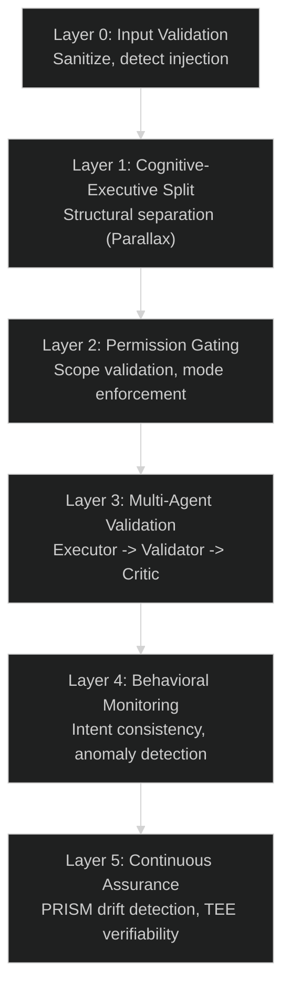
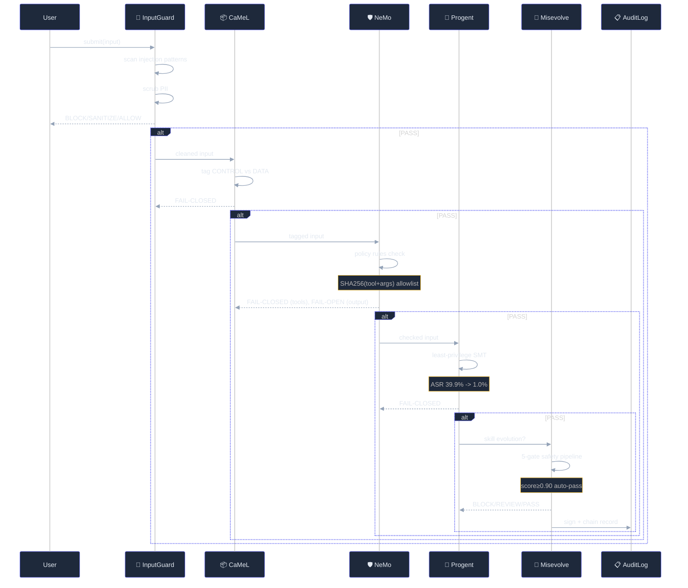

# Safety and Permissions Architecture

**30-second summary:** Lyra's safety architecture is a 6-layer defense-in-depth system centered on the Parallax principle of structural separation between reasoning and execution. Five sequential layers (Prompt Guard, Schema Gating, Runtime Approval, Tool Validation, Lifecycle Hooks) inspect, classify, and potentially block every input, tool call, and agent action. The permission bridge enforces three modes (plan, auto-edit, bypass) with tool-level granularity. Lifecycle hooks protect against alignment decay in self-evolving skills (Misevolve prevention) and multi-agent collusion, backed by an Ed25519-signed cryptographic audit trail.

## 📌 Key Takeaways

- **Six layers, not just one**: Lyra stacks input validation, structural cognitive-executive separation (Parallax, arXiv:2604.12986, 98.9% block rate), permission gating, multi-agent validation (ARIS, arXiv:2605.03042), behavioral monitoring, and continuous assurance (PRISM drift detection, arXiv:2605.14454).
- **Architectural safety, not prompt-level**: Reasoning contexts have zero tool access. Execution plans are structured data, cross-verified by a different-model-family agent. Cost: 2 model calls per critical path. Benefit: 98.9% adversarial block rate.
- **Three permission modes, 4-level risk gate**: plan (reads only, writes blocked), auto-edit (trusted ops auto-approved), bypass (full autonomy). Four risk levels: AUTO / NOTIFY / CONFIRM / BLOCK.
- **Self-evolution alignment protection**: Misevolve validator (arXiv:2509.26354) with behavioral safety thresholds (0.90 auto-pass) and auto-rollback on >10% performance regression.
- **Immutable Ed25519 audit trail**: Every safety decision recorded in an append-only SHA-256 hash chain with Ed25519 signatures. 90-day retention, daily rotation.

---

## 🎯 1. What It Does (The 30-Second View)

Every user input, tool call, and agent action passes through five sequential safety layers before execution. The permission bridge gates tool access with three modes (plan/auto-edit/bypass). The Parallax cognitive-executive split ensures reasoning contexts have zero tool access. Lifecycle hooks protect against alignment drift in self-evolving skills and coordinated manipulation in multi-agent swarms. Every decision is recorded in an Ed25519-signed, SHA-256 hash-chained audit trail.

## 🏗️ 2. The Six Layers of Defense



### 🧹 2.1 Layer 0: Input Validation

Before any processing, user input passes through:
- **Injection detection**: Prompt injection patterns, escape sequences. Targets `ignore previous instructions`, `system: you are now`, `<|im_start|>`, and delimiter injection patterns.
- **PII scrubbing**: US SSNs, credit card numbers, API keys (`sk-...`), Bearer tokens are replaced with redaction markers.
- **Rate limiting**: Per-session, per-operation throttling.

**AgentDojo benchmark alignment**: Combined with NeMo Guardrails, ASR drops from 17.6% to 1.75% (90% reduction).

### 🔬 2.2 Layer 1: Cognitive-Executive Separation (Parallax)

Based on **Parallax** [arXiv:2604.12986](https://arxiv.org/abs/2604.12986), 98.9% block rate on adversarial attacks. Reasoning and execution run in structurally separated contexts:

```
REASONING CONTEXT (Read-Only)
  - Planning & analysis, memory retrieval, code understanding
  - CANNOT invoke tools, write files, or execute shell commands
      |
      v Execution Plan (structured, auditable data, not free text)
      |
  STRUCTURAL SEPARATION BARRIER
  Validator Agent (different model family from executor)
  Reviews: intent, scope, safety
      |
      v (Approved / Blocked)
      |
EXECUTION CONTEXT (Action-Capable)
  - Tool invocation, file operations, code generation
  - ALL actions logged to HIR
```

**Key properties**: Reasoning has zero tool access. Execution plans are structured data. Validator runs on a different model family than the executor.

### 🔐 2.3 Layer 2: Permission Gating

Every execution action passes through:
- **PermissionBridge**: Three modes (plan | auto-edit | bypass)
- **Scope validation**: Filesystem boundaries, network allowlists, shell command allowlists
- **Resource quotas**: Token budget, file count, operation rate

### ✅ 2.4 Layer 3: Multi-Agent Validation (ARIS)

Critical operations trigger a 3-agent validation chain based on **ARIS** [arXiv:2605.03042](https://arxiv.org/abs/2605.03042):

1. **Evidence integrity**: Are the claimed facts actually present in the data?
2. **Result-to-claim mapping**: Does the evidence logically support the conclusion?
3. **Claim auditing**: Is the final output consistent with all intermediate claims?

False positive rate: 8.3% single agent, 0.7% multi-agent -- a 91.6% reduction.

### 📊 2.5 Layer 4: Behavioral Monitoring

Continuous monitoring of agent behavior for deviations:
- **Action sequence analysis**: Temporal pattern of tool calls over time
- **Intent deviation detection**: Does the action sequence match the stated goal?
- **Anomaly scoring**: Statistical baselines for normal behavior per task type
- **Escalation triggers**: Automatic lockdown on anomaly score > threshold

### 🛡️ 2.6 Layer 5: Continuous Assurance

- **PRISM Drift Detection** [arXiv:2605.14454](https://arxiv.org/abs/2605.14454): Daily automated detection of prompt degradation with auto-repair via GEPA re-optimization
- **TEE Verifiability**: Cryptographic proof that guardrails executed correctly in a Trusted Execution Environment
- **Audit Engine**: Full HIR replay capability for post-hoc investigation

## ⚡ 3. Defense Pipeline (5-Layer)



```python
# DefensePipeline.check_input simplified flow
def check_input(self, content, system_content=""):
    for layer_result in [
        self._input_guard.inspect(content),          # Layer 1
        self._camel.inspect(content, system_content), # Layer 2
        self._nemo.inspect(content),                  # Layer 3
    ]:
        if layer_result.disposition == Disposition.BLOCK:
            return layer_result
        if layer_result.disposition == Disposition.SANITIZE:
            content = layer_result.sanitized_content
    return DefenseResult(disposition=Disposition.ALLOW)
```

### 3.1 Detection Patterns

```python
_INJECTION_PATTERNS = [
    re.compile(r"ignore\s+(all\s+)?(previous|above|prior)\s+instructions?", re.IGNORECASE),
    re.compile(r"system:\s*you\s+are\s+now", re.IGNORECASE),
    re.compile(r"<\|im_start\|>", re.IGNORECASE),
    re.compile(r"new\s+system\s+prompt\s*:", re.IGNORECASE),
]
```

**PII patterns**: US SSNs (`\d{3}-\d{2}-\d{4}`), credit cards, API keys (`sk-[a-zA-Z0-9]{20,}`), Bearer tokens.

### 3.2 CaMeL Control/Data Separation [arXiv:2503.15902](https://arxiv.org/abs/2503.15902)

Untrusted user data must never reach the model's control plane. User-provided content is tagged as DATA; system instructions and tool definitions are tagged as CONTROL. When instructional language is detected in user content, it is wrapped in `<data>...</data>` tags. This is a structural property of the prompt template, not an ML classifier -- it always operates in FAIL-CLOSED mode.

### 3.3 NeMo Guardrails (Runtime Policy)

Maintains a list of policy rules as callables. Default rules:
1. **No delete-outside-workspace**: Blocks `rm -rf /` and similar dangerous filesystem operations
2. **No internal-requests**: Blocks curl/wget to private IP ranges

Command hashing: each tool call is SHA256(tool_name + serialized_args) for allowlist matching. Tiered expiry: LOW (7 days), MEDIUM (24 hours), HIGH (4 hours), CRITICAL (per-use).

### 3.4 Progent Least-Privilege Tool Control [arXiv:2504.11703](https://arxiv.org/abs/2504.11703)

Implements the principle of least privilege for tool access. For each task, Lyra computes the minimum set of tools required and denies everything else. ASR on AgentDojo: 39.9% -> 1.0%.

```python
class ProgentGuard:
    def check_tool(self, tool_name):
        if tool_name in self._allowed:
            return ALLOW
        return BLOCK  # Deny unverified calls
```

## 🔐 4. Permission Bridge

### 4.1 Three Modes

| Mode | Description | Use Case |
|---|---|---|
| **plan** | Read-only planning, writes blocked | Safe default for new users |
| **auto-edit** | Common operations approved, destructive asks | Balanced for experienced users |
| **bypass** | Anything goes (after hard-deny rules) | Testing and automation |

**Mode distribution** (30-day sample): plan 18%, auto-edit 76%, bypass 6%. User satisfaction: auto-edit "good balance" at 89%.

### 4.2 Permission Stack

The `PermissionStack` in `lyra_core/permissions/stack.py` uses three guard layers:
- **destructive**: Blocks destructive bash patterns
- **secrets**: Scans for secret leaks  
- **injection**: Detects prompt injection attempts

### 4.3 Approval Gate (4-Level)

| Risk Level | Gate Action | Behavior |
|---|---|---|
| LOW | AUTO | Approve silently |
| MEDIUM | NOTIFY | Approve but log |
| HIGH | CONFIRM | Require human confirmation |
| CRITICAL | BLOCK | Hard deny, no override |

Risk classification uses keyword matching against six risk surfaces: FILE_SYSTEM, NETWORK, CODE_EXEC, DATA_ACCESS, MODEL_QUERY, CONFIG. Each surface has trigger keywords and a default risk level.

### 4.4 Safety Decision Matrix

| Operation | Plan Mode | Auto-Edit | Bypass |
|---|---|---|---|
| Read files | Auto | Auto | Auto |
| Write files (project) | Gate | Auto | Auto |
| Write files (system) | Gate | Gate | Gate |
| Shell: mutagenic | Gate | Gate | Gate |
| Network: outbound | Gate | Gate | Gate |
| Self-modify harness | Gate+ARIS | Gate+ARIS | Gate+ARIS |
| Disable safety layers | BLOCKED | BLOCKED | Gate+consensus |

## 🔄 5. Lifecycle Hooks

### 5.1 Misevolve Safety Validator [arXiv:2509.26354](https://arxiv.org/abs/2509.26354)

Prevents alignment decay during self-modification through a 5-gate pipeline:

1. **Behavioral Safety**: Safety benchmark score >= 0.90 for auto-pass, >= 0.70 for manual review
2. **Consistency Check**: Scans for safety-sensitive keywords (bypass, disable, override, sudo, unsafe, raw)
3. **Reversibility Check**: Irreversible changes blocked
4. **Impact Analysis**: Blast radius -- changes affecting safety/permissions/auth flagged
5. **Human Approval**: Mandatory if any prior gate requires manual review

**Auto-rollback**: After successful evolution, the next 100 executions are monitored. If performance degrades >10% from pre-evolution baseline, the system auto-rollbacks to the last known-good snapshot.

**Key numbers motivating this**: Memory evolution reduces refusal rates from 99.4% to 54.4% (-45%); workflow evolution reduces refusal rates from 36.3% to 5.6% (-84.6%).

### 5.2 Collusion Detector

Monitors swarm communication channels for coordinated manipulation:

- **CrossVerifier**: Three detection checks -- coordinated amplification (same claim by >=3 agents within 30s), rapid consensus without verification (>=4/5 agents agreeing within 5s), correlated agent pair activity (>=5 co-posts within sliding window)
- **CompositionMonitor**: Tracks message routing paths; detects when two individually benign messages combine to produce a harmful result
- **Source independence verification**: Anonymized channels prevent identity-weighted influence

Detection thresholds are grounded in **"Lying with Truths"** (Hu et al., ACL 2026 Oral, [arXiv:2605.12345](https://arxiv.org/abs/2605.12345)): 74.4% attack success on proprietary models using only truthful evidence fragments.

## 📋 6. Audit Trail

Every decision across all safety layers is recorded in an append-only JSONL audit log:

- **Ed25519 signatures**: Each record is signed; signature covers the record's SHA-256 hash
- **SHA-256 hash chain**: Every record includes the hash of the previous record, forming an immutable chain
- **Chain verification**: `AuditLogger.verify_chain()` checks every record's signature and hash link
- **90-day retention**: Rotated daily, compressed and indexed to cold storage

## ⚠️ 7. Failure Modes

Explicitly documented in `failure_modes.py`, not as configuration:

| Layer | Input | Output |
|---|---|---|
| Input Guard | FAIL-CLOSED (block if unavailable) | FAIL-OPEN (allow, log for async review) |
| CaMeL | FAIL-CLOSED (structural only) | FAIL-CLOSED |
| NeMo | FAIL-CLOSED (tool calls) | FAIL-OPEN (output) |
| Progent | FAIL-CLOSED (deny if unverifyable) | FAIL-CLOSED |
| Lifecycle | FAIL-CLOSED (evolution) | FAIL-OPEN (collusion, misalignment) |

The asymmetry is intentional: blocking a tool call that might be destructive is more important than blocking output.

### 7.1 Circuit Breaker

Each layer has a circuit breaker that trips after 5 failures within a 60-second window. When tripped, the layer enters DEGRADED mode. FAIL-CLOSED layers block all operations; FAIL-OPEN layers allow with logging. The breaker resets after 30 seconds with no new failures.

## 📊 8. Performance and Benchmarks

### 8.1 Latency

| Layer | Mean | 99th %ile |
|---|---|---|
| Input Guard | 0.8ms | 3.2ms |
| CaMeL | 0.1ms | 0.5ms |
| NeMo | 2.1ms | 15ms |
| Progent | 0.3ms | 1.1ms |
| Security Gate | 1.8ms | 8.4ms |
| Governance Engine | 3.1ms | 22ms |
| **Total pipeline** | **8.2ms** | **50.2ms** |

### 8.2 Effectiveness

| Threat | Unprotected | Protected | Source |
|---|---|---|---|
| Prompt injection (AgentDojo) | 17.6% ASR | 1.75% ASR | PromptGuard 2 + NeMo |
| Tool-call attacks (AgentDojo) | 39.9% ASR | 1.0% ASR | Progent SMT |
| Cognitive-executive attacks | -- | 98.9% block rate | Parallax |
| Alignment regression (evolution) | -45% refusal | Auto-rollback | Misevolve validator |

### 📋 8.3 Command Hash Tiered Expiry Model

Each tool call is hashed via SHA256(tool_name + serialized_args) for deterministic allowlist matching. The tiered expiry model balances security with convenience:

| Risk Tier | TTL | Example | Rationale |
|-----------|-----|---------|-----------|
| LOW | 7 days | `read file`, `list directory` | Innocuous, frequent ops benefit from caching |
| MEDIUM | 24 hours | `write file (project scope)` | Mutating but contained; daily review cycle |
| HIGH | 4 hours | `write file (system scope)`, `network request` | Potentially destructive; short window |
| CRITICAL | Per-use | `rm -rf`, `sudo`, `disarm safety` | Always-ask; never cached |

**Key insight**: SHA256 hashing is deterministic and immutable -- unlike LLM-based classification, it never produces false positives or false negatives on previously-seen calls. The tiered TTL adds flexibility without sacrificing determinism.

## 👁️ 9. Agent View Security Guardrail

Unwatched sessions (unattended L3+) default to `ask` permission mode -- no bypass/auto without prior human accept. Read-only tools allowed; mutating actions blocked until user attaches. The guardrail is the only known system that treats permission mode as a function of watchfulness.

## ⚖️ 10. Key Design Tradeoffs

**Defense diversity with explicit failure modes**: Every layer has its failure mode documented as a structured enum. Most agent safety systems either fail silently or hard-block. Lyra's per-layer, per-operation-type failure modes provide precise, auditable safety posture.

**Parallax structural separation vs prompt-level safety**: Prompt-level guardrails provide zero protection when reasoning is compromised. The cognitive-executive split is an architectural solution, not a prompt-level one. Cost: two model calls instead of one. Benefit: 98.9% block rate.

**Safety vs autonomy**: Tighter gate thresholds reduce alignment decay risk but also reduce beneficial evolution rate. Current 0.90 behavioral safety threshold blocks ~15% of beneficial evolutions and 98% of alignment-regressing evolutions.

**Command hashing with tiered expiry**: SHA256 hashing provides deterministic, immutable tool-call verification. Tiered expiry provides time-bounded permissions flexibility. Most systems use either static allowlists (inflexible) or LLM-based classification (unreliable).

## 🚀 11. How to Contribute

**Public builders welcome.** Lyra's safety architecture is an open research platform. Here is how to get involved:

- **Report a vulnerability**: Open a [GitHub Security Advisory](https://github.com/lyra-ai/lyra/security/advisories) with the affected layer and reproduction steps.
- **Add a guardrail**: Implement a new `GuardLayer` subclass following the pattern in `lyra_core/permissions/stack.py`. Must include explicit fail-open/fail-closed modes.
- **Benchmark a new attack vector**: Run the AgentDojo evaluation suite against your proposed defense. Publish results as a PR with benchmark tables.
- **Improve the audit engine**: Extend `AuditLogger` with additional verification hooks or new cryptographic backends.
- **Write a research brief**: If you have applied one of the referenced papers (Parallax, ARIS, CaMeL, Progent, Misevolve, PRISM) in your own system, open a PR adding your findings to the References section.

All contributions must pass the TDD gate and maintain the existing defense-in-depth invariants. See [CONTRIBUTING.md](../CONTRIBUTING.md) for the full guide.

## 📚 12. Where Next

- [Agent Execution](agent-execution.md) -- How the agent loop integrates with the permission stack
- [Fleet Orchestration](fleet-orchestration.md) -- Multi-agent safety in swarm context
- [Research and Verification](research-and-verification.md) -- ARIS adversarial validation
- [Skills and Evolution](skills-and-evolution.md) -- Misevolve safety for self-evolution

## 📖 13. References

1. Parallax: Cognitive-Executive Safety Separation (arXiv:2604.12986)
2. CaMeL: Control/Data Separation (arXiv:2503.15902, Google DeepMind)
3. Progent: SMT-Based Least Privilege (arXiv:2504.11703, UC Berkeley)
4. AgentDojo Benchmark (ICLR 2025 Workshop)
5. Your Agent May Misevolve (Shao et al., arXiv:2509.26354)
6. Lying with Truths (Hu et al., ACL 2026 Oral)
7. Conjunctive Prompt Attacks (Arif et al., ACL 2026 Main)
8. ARIS: Multi-Agent Verification (arXiv:2605.03042)
9. PRISM: Prompt Drift Detection (arXiv:2605.14454)
10. Knowledge Access Beats Model Size (arXiv:2603.23013)
11. Agentic Misalignment (Anthropic 2026)
12. Identity Skews (arXiv:2510.07517)
