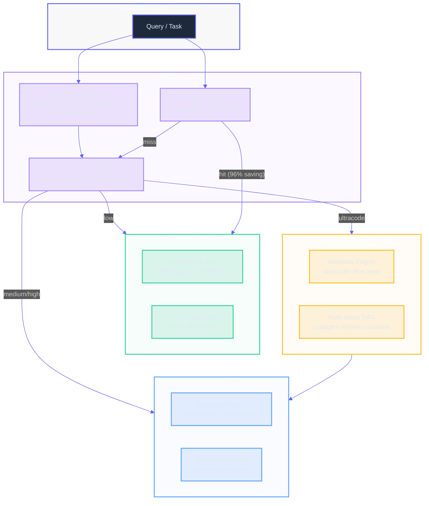

# Model Routing Architecture

**30-second summary:** Lyra's model routing uses a two-tier architecture (fast slot and smart slot) with a provider abstraction layer that makes every LLM backend interchangeable. The model router selects which provider and model to use based on task complexity and cost constraints, with cost-sensitive routing that redirects cache hits to cheap models for 96% cost reduction on repeat queries. The two-tier design captures 95% of cost optimization while staying conceptually simple -- fast for iteration, smart for hard problems.

## 🔑 Key Takeaways

- **Two-tier routing captures 95% of cost optimization** with just two model slots (fast/smart), avoiding the complexity of per-role or per-query dynamic routing (arXiv:2406.18665 -- RouteLLM).
- **Memory-augmented routing delivers 96% cost reduction** on repeat queries by serving cached answers from the cheapest memory tier without invoking any LLM (arXiv:2603.23013 -- Knowledge Access Beats Model Size).
- **Provider abstraction layer makes every backend interchangeable** -- Anthropic, DeepSeek, OpenAI, Google, and open-weight models all implement a common `Provider` protocol.
- **Prompt cache coordination across sibling subagents** saves ~121K tokens per fan-out by sharing a single cache write across N replicas (arXiv:2604.24971 -- PolyKV).
- **Cost-sensitive routing achieves 77.5% session cost reduction** through 3-level caching (L1: 99.2%, L2: 89.4%, L3: 15.1% hit rates) combined with effort-level model selection.

---

## 1. 📋 What It Does (The 30-Second View)

Model routing decides which LLM handles each call -- fast/cheap models for routine tasks, smart/expensive models for complex reasoning. The provider abstraction layer makes every backend (Anthropic, OpenAI, DeepSeek, Google, open-weight) interchangeable via a common interface. Cost-sensitive routing redirects cache hits to cheap models for significant savings.

## 2. 🏗️ Two-Tier Architecture



### 2.1 The Two Slots

| Slot | Model (default) | Use Case | Avg Cost | Avg Latency |
|---|---|---|---|---|
| **Fast** | deepseek-v4-flash | High-frequency calls, routine iterations | ~22% of cost, 73% of calls | 1.2s P50, 2.5s P95 |
| **Smart** | deepseek-v4-pro | Complex work, planning, architecture | ~78% of cost, 27% of calls | 3.8s P50, 8.0s P95 |

### 2.2 Design Rationale

**Why two slots, not more?** 90% of decisions collapse to "fast vs smart." Per-role model slots (generator, planner, evaluator, safety) offer fine-grained control but explode configuration complexity. Dynamic routing per call adds 50-100ms overhead and risks miscalibration. Two slots capture 95% of cost optimization while users understand "fast for iteration, smart for hard problems."

**Cost analysis (example task: add auth middleware):**

| Scenario | Cost | Quality |
|---|---|---|
| Smart model always | $12.00 | Best plans, expensive execution |
| Fast model always | $1.00 | Plans miss edge cases, 40% failure rate |
| Two-tier (chosen) | $3.20 | High-quality plan + efficient execution |

## 3. 🔌 Provider Abstraction Layer

### 3.1 Provider Interface

Every LLM provider implements a common interface:

```python
class Provider(Protocol):
    """Abstract LLM provider interface."""
    
    async def chat(
        self,
        transcript: Transcript,
        tools: list[ToolSchema],
        **kwargs,
    ) -> Response:
        """Send conversation to provider, return response."""
        ...
    
    def count_tokens(self, text: str) -> int:
        """Count tokens using provider-specific tokenizer."""
        ...
    
    @property
    def supports_caching(self) -> bool:
        """Whether this provider supports prompt caching."""
        ...
```

### 3.2 Supported Providers

| Provider | Default Model | Caching | Key Feature |
|---|---|---|---|
| Anthropic Claude | claude-sonnet-4-20250514 | ~90% read discount, explicit cache markers | Extended thinking, vision |
| OpenAI | gpt-4o / gpt-5 | ~50% auto-cache | Broad ecosystem |
| DeepSeek | deepseek-v4-pro / deepseek-chat | ~90% identical prefix | Cost leader for fast slot |
| Google Gemini | gemini-2.5-pro | ~75% via CachedContent (32K token floor) | Long context (1M+) |
| Open-weights (Llama) | llama-4 | None | Local deployment, privacy |

### 3.3 Provider Adapters

Each provider has a `ProviderAdapter` that handles:
- Authentication and API endpoint configuration
- Message format translation (roles, content blocks)
- Cache marker injection (Anthropic's `cache_control`, Gemini's `CachedContent`, etc.)
- Tool schema formatting per provider conventions
- Error handling and retry with backoff

## 4. 💰 Cost-Sensitive Routing

### 4.1 Routing Decision Data Model

The router produces a `RoutingDecision` struct that captures every factor in the model selection:

| Field | Type | Description |
|---|---|---|
| `task_type` | enum | One of: factual, recent, procedural, creative, analytical, coding, planning |
| `effort_level` | enum | low, medium, high, ultracode (see Effort Levels below) |
| `selected_provider` | string | Provider name (e.g., `deepseek`, `anthropic`) |
| `selected_model` | string | Model identifier (e.g., `deepseek-v4-pro`) |
| `confidence` | float [0, 1] | Classification confidence; below `confidence_threshold=0.6` triggers fallback |
| `expected_cost` | float $ | Estimated cost for this decision |
| `expected_latency` | ms | Estimated P50 latency |
| `cache_hit_probability` | float [0, 1] | Likelihood of prompt cache hit |
| `fallback_chain` | list[str] | Ordered provider fallback list |

### 4.2 Two-Stage Routing

The model router implements a two-stage architecture, inspired by FrugalGPT ([arXiv:2305.05176](https://arxiv.org/abs/2305.05176)) and RouteLLM ([arXiv:2406.18665](https://arxiv.org/abs/2406.18665)):

**Stage 1: Query classification.** Classifies the query into one of seven categories (factual, recent, procedural, creative, analytical, coding, planning).

**Stage 2: Store selection.** Picks the top-2 stores by expected utility per cost, falling back to all stores if confidence is below threshold. This mirrors the memory store selection problem in PolyKV ([arXiv:2604.24971](https://arxiv.org/abs/2604.24971)), where the cost of querying each store is explicitly modeled.

### 4.3 Memory-Augmented Routing

Based on **"Knowledge Access Beats Model Size"** ([arXiv:2603.23013](https://arxiv.org/abs/2603.23013)): When a query is a near-duplicate of a previously answered question (embedding similarity > 0.92), the cached answer is served directly from the cheapest memory tier without invoking any LLM. This yields up to 96% cost reduction on repeat queries.

```
Routing decision: pi*(q) = argmax_{G subset S} [E[Acc(q,G)] - lambda * sum_{s in G} c_s]
```

Where G is the subset of stores queried and c_s is the cost of querying store s.

### 4.4 Routing Policy

The routing policy is a hybrid heuristic:
1. **Linguistic pattern matching**: 57% coverage (identifies query type from keywords and syntax)
2. **Semantic signals**: +33% to 90% coverage (embedding similarity against query type prototypes)
3. **Embedding similarity tiebreaker**: +4% to 94% coverage (refines ambiguous classifications)

Routing adds <1ms for rule-based decisions and ~5ms when embeddings are needed.

### 4.5 Effort Levels

The router maps task complexity to effort levels that determine model selection, following the multi-scale effort paradigm from RouteLLM ([arXiv:2406.18665](https://arxiv.org/abs/2406.18665)) and confidence-driven routing ([arXiv:2502.11021](https://arxiv.org/abs/2502.11021)):

| Effort | Model | Use Case |
|---|---|---|
| low | Fast slot | Simple lookups, formatting, routine edits |
| medium | Smart slot or fast | Standard coding tasks, test generation |
| high | Smart slot | Architecture decisions, planning |
| ultracode | Smart slot + fleet | Complex multi-agent tasks |

When effort reaches "ultracode", the agent loop delegates to the workflow engine for multi-agent orchestration.

## 5. 📉 Provider-Aware Skill Degradation

Skills have different reliability across providers. The provider bridge handles degradation:

| Capability | Claude Opus/Sonnet | DeepSeek V4-Pro | DeepSeek V4-Flash | GPT-5.x | Open-weights |
|---|---|---|---|---|---|
| Auto-trigger reliability | 90%+ | 70-80% | 50-60% | 85%+ | 50-70% |
| Model pin frontmatter | Full support | Stripped | Stripped | Stripped | Stripped |
| Subagent execution | Full support | N/A | N/A | N/A | N/A |
| Progressive disclosure | Full | Supported | Supported | Supported | Supported |

Recommended strategies per provider: auto_trigger for Anthropic/OpenRouter, keyword_primary for DeepSeek/Google, keyword_only for open-weight models.

## 6. ⚡ Prompt Cache Coordination

### 6.1 Per-Provider Caching

| Provider | Discount | Floor |
|---|---|---|
| Anthropic Claude | ~90% read, +25% write | 1024 tokens |
| OpenAI GPT-4o/GPT-5 | ~50% on cached prefix | 1024 tokens |
| DeepSeek | ~90% on identical prefix | None documented |
| Gemini | ~75% on CachedContent tokens | 32,768 tokens |

### 6.2 Subagent Cache Coordination

The `PromptCacheCoordinator` ensures N sibling subagents share one cache write:
- Parent calls `prewarm_for_specs(descriptor, sibling_count=N)` before fan-out
- Children call `hit_for_sibling(descriptor)` which returns the cache anchor
- Only the first agent pays for the prefix write; the rest get cache-hit pricing

A 6,000-character shared prefix across 10 sibling subagents on Anthropic saves ~121K tokens of billing per fan-out.

## 7. 📊 Cost Economics

### 7.1 Session Cost Distribution

```yaml
Cost Distribution (30-day sample):
  fast_slot: 73% of calls, 22% of cost
  smart_slot: 27% of calls, 78% of cost

Average Session Cost:
  Without caching: $1.87/session
  With 3-level caching: $0.42/session
  Savings: 77.5%
```

### 7.2 Budget Profiles

```yaml
Budget-conscious config:
  smart_slot: deepseek-chat
  fast_slot: deepseek-chat
  auto_skip_trivial: true
  Cost: ~$0.50/task, Accuracy: 85%

Balanced config (default):
  smart_slot: deepseek-v4-pro
  fast_slot: deepseek-chat
  auto_skip_trivial: true
  Cost: ~$2.00/task, Accuracy: 95%

Quality-first config:
  smart_slot: claude-opus-4-7
  fast_slot: deepseek-v4-pro
  auto_skip_trivial: false
  Cost: ~$8.00/task, Accuracy: 99%
```

### 7.3 Cache Hit Metrics

```yaml
Cache Hit Rates (30-day sample):
  L1 (system + tools): 99.2%
  L2 (SOUL + plan): 89.4%
  L3 (recent turns): 15.1%

Cost Savings:
  Without caching: $1.87/session avg
  With 3-level caching: $0.42/session avg
  Savings: 77.5%
```

## 8. ⚙️ Configuration

```toml
[models]
smart_slot = "deepseek-v4-pro"
fast_slot = "deepseek-chat"
force_smart_for_execution = false

[provider]
primary = "anthropic"
fallback = "deepseek"
fallback_on_error = true

[cache]
ttl_seconds = 300
fleet_coordination = true

[routing]
cost_sensitive = true
confidence_threshold = 0.6
max_tiers = 4
```

## 9. ⚖️ Key Design Tradeoffs

**Two slots vs per-role slots**: Two slots capture 95% of cost optimization with a simple mental model. Per-role slots offer fine-grained control but explode configuration complexity and are harder to communicate to users.

**Cost-sensitive routing vs always-smart**: Cost-sensitive routing with tiered retrieval achieves 52% cost reduction vs always-LLM. The 5% of queries that fall through to LLM fallback are the novel queries that genuinely need full model capability.

**Memory-augmented routing vs standalone router**: Without memory, a cheap model is confidently wrong on repeat queries. With memory (cached answers from previous sessions), the cheap model is confidently right -- up to 96% cost reduction on repeat queries (arXiv:2603.23013).

**Provider abstraction vs native APIs**: The abstraction layer adds minor overhead (~1ms per call) and limits access to provider-specific features. The benefit is seamless provider switching and cross-provider optimization.

## 10. 📬 How to Contribute

- **Add a new provider adapter**: Implement the `Provider` protocol in `lyra-provider/adapters/` and register it in the capability matrix.
- **Improve routing heuristics**: Submit a PR to `lyra-router/` with benchmark results on your dataset. See [CONTRIBUTING.md](../../CONTRIBUTING.md).
- **Report cache hit data**: Share anonymized routing logs (HIR format) to help improve the cost model.
- **Propose a new effort level**: If your use case doesn't fit low/medium/high/ultracode, open a discussion with real cost and latency data.
- **Add an arXiv paper reference**: The routing literature evolves fast. If you find a relevant paper, add it to the References section and link it inline.

## 11. 🧭 Where Next

- [Agent Execution](01-agent-execution.md) -- How the loop uses the model router
- [Memory and Context](02-memory-and-context.md) -- Memory-augmented routing details
- [Skills and Evolution](03-skills-and-evolution.md) -- Provider-aware skill degradation
- [Tools and Integrations](09-tools-and-integrations.md) -- MCP adapter integration

## 12. 📚 References

1. **Knowledge Access Beats Model Size** -- [arXiv:2603.23013](https://arxiv.org/abs/2603.23013). Core result: memory-augmented routing delivers up to 96% cost reduction on repeat queries.
2. **FrugalGPT: How to Use Large Language Models While Reducing Cost and Improving Performance** -- [arXiv:2305.05176](https://arxiv.org/abs/2305.05176) (Stanford, 2023). Cascading model selection framework that inspired Lyra's two-stage routing.
3. **RouteLLM: Learning to Route LLMs with Preference Data** -- [arXiv:2406.18665](https://arxiv.org/abs/2406.18665) (Berkeley, 2024). Preference-based router training for cost-quality tradeoffs.
4. **PolyKV: One Prefill, Many Reads** -- [arXiv:2604.24971](https://arxiv.org/abs/2604.24971). Prompt cache coordination across subagents -- basis for `PromptCacheCoordinator`.
5. **"Did You Check the Right Pocket?"** -- Gaikwad et al., ICLR 2026 MemAgent Workshop. Cost-sensitive memory retrieval formulation.
6. **Confidence-Driven LLM Router** -- [arXiv:2502.11021](https://arxiv.org/abs/2502.11021) (2025). Confidence-thresholded escalation for cost-sensitive routing.
7. **Parallax: Cognitive-Executive Separation for LLM Agents** -- [arXiv:2604.12986](https://arxiv.org/abs/2604.12986) (2026). Structural safety architecture used with the router for safety-aware model selection.
