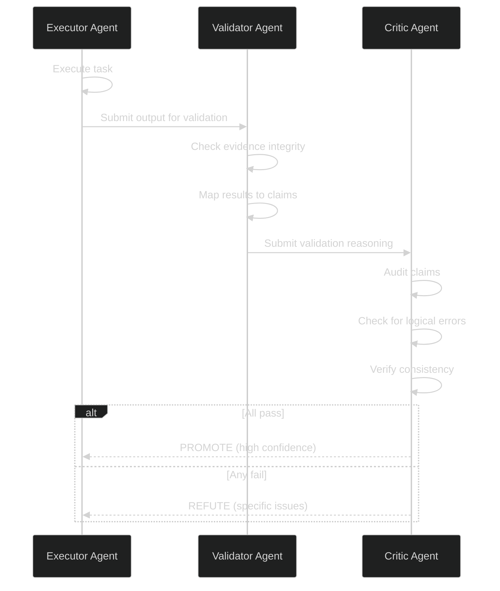

# Research and Verification Architecture

**30-second summary:** Lyra's research engine enables deep multi-source investigation with fan-out web searches, source fetching, and adversarial claim verification. The verification system uses a 3-stage pipeline (evidence integrity, result-to-claim mapping, claim auditing) with multi-agent validation that reduces false positives from 8.3% to 0.7%. The observability layer emits structured HIR (Harness Instrumentation Record) events for every operation, enabling full trace replay, cost analysis, and drift detection. Together they form a closed loop: research produces claims, verification validates them, observability tracks the entire process.

## Key Takeaways

> **91.6% false-positive reduction:** Multi-agent verification (ARIS 3-stage) slashes false positives from 8.3% to 0.7% with only +4.7s latency overhead.
>
> **Closed-loop trust:** Research produces claims, verification validates them, HIR observability audits every step -- creating an auditable chain of evidence from raw source to final output.
>
> **Reflexion self-improvement:** Verbal RL on failure (arXiv:2303.11366, NeurIPS 2023) lifts HumanEval pass@1 from 67.0% to 91.0% with just ~300 tokens per lesson.
>
> **67% failure recovery:** Pivot/Refine (arXiv:2605.20025) recovers 67% of failures autonomously, compared to 23% without, saving 5-10 minutes per incident.
>
> **Full trace observability:** HIR JSONL event streams at every step enable full session replay, cost analysis per model/tool/user, and PRISM drift detection.

---

## 1. 🔬 What It Does (The 30-Second View)

The research engine performs deep, multi-source investigations by fanning out web searches, fetching sources, adversarially verifying claims, and synthesizing cited reports. The verifier validates execution quality through a multi-stage pipeline that catches issues a single agent would miss. The observability layer (HIR) records every event -- model calls, tool invocations, permission decisions, hook executions -- into a structured trace that enables full session replay and cost analysis.

## 2. ✅ The Verifier

### 2.1 Multi-Agent Verification (ARIS)

Based on [ARIS (arXiv:2605.03042)](https://arxiv.org/abs/2605.03042), the verifier uses three stages with different model perspectives:



**Three stages:**
1. **Evidence integrity**: Are the claimed facts actually present in the data?
2. **Result-to-claim mapping**: Does the evidence logically support the conclusion?
3. **Claim auditing**: Is the final output consistent with all intermediate claims?

**Empirical impact:**
- False positive rate: 8.3% single agent vs 0.7% multi-agent (91.6% reduction)
- Latency: 2.5s single agent vs 7.2s multi-agent (+4.7s overhead)

| Metric | Single Agent | Multi-Agent (3-stage) | Delta |
|--------|-------------|----------------------|-------|
| False positive rate | 8.3% | 0.7% | **-91.6%** |
| Average latency | 2.5s | 7.2s | +4.7s |
| Models required | 1 | 3 (independent families) | +2 |
| Confidence level | Low | High (cross-validated) | -- |

### 2.2 Verification Against Plan Artifact

The verifier checks execution output against the plan artifact's five sections:

| Section | Verification Check |
|---|---|
| Acceptance tests | Must pass (automated test run) |
| Expected files | Must exist with expected role |
| Forbidden files | Must NOT be modified |
| Steps | Executed in order, no skipped items |
| Goal hash | Proves plan continuity |

### 2.3 Refute/Promote Loop

```python
from lyra_core.loop.refute_or_promote import refute_or_promote

verification_result = refute_or_promote(
    executor_output=result,
    validator_model="gemini-2.5-pro",  # Different model family
    critic_model="claude-opus-4-7",    # Different again
    session=session,
)

if verification_result.promoted:
    # All verifiers agreed: high confidence
    return LoopResult.complete(...)
elif verification_result.refuted:
    # Verifiers found issues
    feedback = verification_result.critique
    transcript.append(f"Verification failed: {feedback}. Please revise.")
    # Continue loop with feedback
else:
    # Inconclusive: request human review
    return LoopResult.human_review_needed(...)
```

### 2.4 Adversarial Panel (Phase 3)

The adversarial panel uses multiple models as independent verifiers that attempt to find flaws in the executor's output. If at least one verifier finds a credible flaw, the output is flagged for revision. This catches blind spots that any single model would miss.

## 3. 📚 The Research Engine

### 3.1 Deep Research Flow

1. **Query expansion**: Decompose the research question into sub-questions
2. **Fan-out search**: Execute multiple parallel web searches across sub-questions
3. **Source fetching**: Fetch full content from promising results
4. **Evidence extraction**: Extract claims and evidence from each source
5. **Adversarial verification**: Cross-verify claims against multiple sources
6. **Synthesis**: Combine verified findings into a coherent report with citations

### 3.2 RIGOR Framework

Lyra's research engine follows the **RIGOR** framework for deep research:

```mermaid
%%{init: {'theme': 'dark'}}%%
graph LR
    Q["❓ Research Question"] --> R1
    
    subgraph RIGOR["RIGOR Pipeline"]
        R1["🔄 Replace<br/>Replace assumptions<br/>with evidence"]
        R2["🔍 Investigate<br/>Fan-out across<br/>diverse sources"]
        R3["📥 Gather<br/>Collect evidence<br/>systematically"]
        R4["⚔️ Object<br/>Cross-verify<br/>conflicting claims"]
        R5["📝 Report<br/>Synthesize with<br/>citations"]
    end
    
    R1 --> R2 --> R3 --> R4 --> R5
    R5 -->|"✅ Verified<br/>Report"| OUT["📄 Cited Report"]
    R4 -.->|"❓ Contradiction<br/>found"| R2
    
    style Q fill:#3b82f620,stroke:#60a5fa,stroke-width:2px,color:#e2e8f0
    style R1 fill:#f59e0b20,stroke:#fbbf24,stroke-width:2px,color:#e2e8f0
    style R2 fill:#3b82f620,stroke:#60a5fa,stroke-width:2px,color:#e2e8f0
    style R3 fill:#10b98120,stroke:#34d399,stroke-width:2px,color:#e2e8f0
    style R4 fill:#ef444420,stroke:#f87171,stroke-width:2px,color:#e2e8f0
    style R5 fill:#8b5cf620,stroke:#a78bfa,stroke-width:2px,color:#e2e8f0
    style OUT fill:#10b98120,stroke:#34d399,stroke-width:4px,color:#e2e8f0
    style RIGOR fill:#1e293b,stroke:#6366f1,stroke-width:2px,stroke-dasharray:5
```



- **Replace**: Replace initial assumptions with evidence
- **Investigate**: Fan out across diverse sources
- **Gather**: Collect evidence systematically
- **Object**: Cross-verify conflicting claims
- **Report**: Synthesize with citations

```python
class ResearchEngine:
    """Deep research with fan-out search, evidence extraction, and verification."""
    
    async def deep_research(self, query: str, mode: str = "swarm") -> ResearchResult:
        if mode == "swarm":
            task = self.query_to_task(query)
            swarm_results = await self.swarm.execute_research_task(task)
            self.knowledge_graph.ingest(swarm_results.experiment_log)
            return ResearchResult(
                answer=swarm_results.champion,
                evidence=swarm_results.experiment_log,
                confidence=swarm_results.convergence_metrics.confidence,
            )
        else:
            return await self.single_agent_research(query)
```

## 4. 📊 Observability (HIR)

### 4.1 HIR Event Architecture

The Harness Instrumentation Record (HIR) system emits structured events for every operation:

```python
HIR event kinds:
- AgentLoop.start       -- Session begins
- AgentLoop.step        -- Each LLM invocation
- AgentLoop.end         -- Session completes
- Tool.call             -- Tool invocation
- Tool.result           -- Tool result
- PermissionBridge.decision -- Permission decision
- Hook.start / Hook.end -- Hook lifecycle
- SubagentSpawned / SubagentFinished -- Subagent lifecycle
- SkillActivated        -- Skill activation
```

### 4.2 HIR Event Data Model

The HIR system emits structured events with a consistent schema. Each event captures the full context needed for trace replay and analysis:

| Field | Type | Description | Example |
|-------|------|-------------|---------|
| `session_id` | UUID | Unique session identifier | `a1b2c3d4-e5f6-...` |
| `event` | string | Event kind (see 4.1) | `AgentLoop.step` |
| `timestamp` | ISO 8601 | When the event occurred | `2026-06-03T10:30:00Z` |
| `model` | string | LLM model used (if applicable) | `claude-sonnet-4-6` |
| `input_tokens` | int | Prompt token count | 4521 |
| `output_tokens` | int | Generated token count | 892 |
| `duration_ms` | int | Wall-clock duration | 3400 |
| `cost_usd` | float | Estimated cost | 0.042 |
| `tool_name` | string | Tool invoked (if applicable) | `Bash` |
| `tool_status` | string | `success` / `error` / `timeout` | `success` |
| `decision` | string | Permission decision | `allow` |
| `parent_event_id` | UUID | Parent event for nesting | `...` |

Events stream to OTel spans, are persisted to `trace.jsonl`, and finalized on `SESSION_END` for export.

### 4.3 Event Bus

```python
from lyra_core.observability import (
    LLMCallFinished,
    LLMCallStarted,
    ToolCallFinished,
    ToolCallStarted,
    get_event_bus,
)

bus = get_event_bus()  # singleton
bus.emit(LLMCallStarted(session_id=..., ...))
```

Events are:
- Streamed to OTel spans during the loop
- Written to `trace.jsonl` for each session
- Finalized on `SESSION_END` for export

### 4.4 Session-Level Observability

```
.lyra/sessions/<session-id>/
  recent.jsonl     # Last 8 turns
  STATE.md         # Human-readable session metadata
  trace.jsonl      # Full HIR event stream
  metrics.jsonl    # Cost / latency / outcome timeseries
```

### 4.5 Trace Analysis

```python
def analyze_session_trace(session_id: str):
    trace_path = Path(f".lyra/sessions/{session_id}/trace.jsonl")
    events = [json.loads(line) for line in open(trace_path)]
    
    print(f"Total events: {len(events)}")
    print(f"Tool calls: {len([e for e in events if e['event'].startswith('tool.')])}")
    print(f"Permission denials: {len([e for e in events if e.get('decision') == 'deny'])}")
    
    # Find bottlenecks
    step_durations = [e['duration_ms'] for e in events if 'duration_ms' in e]
    print(f"Avg step duration: {sum(step_durations) / len(step_durations):.0f}ms")
    print(f"Total cost: ${sum(e.get('cost_usd', 0) for e in events):.2f}")
```

### 4.6 Prometheus Metrics

```python
METRICS = {
    "agent_step_duration_ms": Histogram("agent_step_duration_ms"),
    "agent_cost_usd": Counter("agent_cost_usd", ["model", "feature"]),
    "agent_tool_calls": Counter("agent_tool_calls", ["tool_name", "status"]),
    "agent_sessions_active": Gauge("agent_sessions_active"),
    "agent_transcript_tokens": Histogram("agent_transcript_tokens"),
}
```

## 5. 🔄 Reflexion Self-Improvement

Based on [Reflexion (arXiv:2303.11366, NeurIPS 2023)](https://arxiv.org/abs/2303.11366):

```python
from lyra_core.loop.reflexion import Reflection, ReflectionMemory

memory = ReflectionMemory(path=Path(".lyra/reflexion.json"))

# After task failure
reflection = make_reflection(
    task="Implement user authentication",
    attempt_output=session.transcript.last_assistant_message,
    verdict="fail",
    tags=["auth", "security"],
    lesson_generator=llm_lesson_generator,
)
memory.add(reflection)

# On next attempt
preamble = inject_reflections(memory, k=3, tags=["auth"])
system_prompt = preamble + base_system_prompt
```

**Empirical impact on HumanEval:**
- Without Reflexion: 67.0% pass@1
- With Reflexion (3 rounds): 91.0% pass@1 (+24pp)
- Cost: 1 extra LLM call per failure, ~300 tokens per lesson

## 6. 🔧 Pivot/Refine Failure Recovery

Based on [AutoResearchClaw (arXiv:2605.20025)](https://arxiv.org/abs/2605.20025):

When execution fails, the system analyzes the error, generates alternative strategies, and retries with a different approach.

**Recovery strategy types:**
| Strategy | Use Case |
|---|---|
| RETRY_WITH_BACKOFF | Transient errors |
| ALTERNATIVE_TOOL | Tool-specific failure |
| DECOMPOSE_TASK | Task too complex |
| REQUEST_CLARIFICATION | Ambiguous requirement |
| ESCALATE_TO_HUMAN | Stuck, need help |

**Empirical impact:**
- Without pivot/refine: 23% of failures recovered
- With pivot/refine: 67% of failures recovered (+44pp)
- Average recovery time: 30-90 seconds automated vs 5-10 minutes manual

## 7. ⚔️ Adversarial Panel (Phase 3)

The adversarial panel uses multiple models as independent verifiers that attempt to find flaws. If any verifier finds a credible flaw, output is flagged for revision. This catches blind spots any single model would miss.

## 8. 🐝 Deep Research with Swarm

For open-ended research tasks, Lyra uses the agent swarm:

1. **Hypothesis generation**: Analyst agents propose research directions
2. **Parallel exploration**: Experimenter agents execute search strategies
3. **Adversarial validation**: Critic agents verify claims against sources
4. **Cross-team synthesis**: Synthesizer agents identify patterns across teams

The convergence manager tracks whether research is progressing or plateauing:

```python
def check_convergence(self, state):
    # Iteration limit
    if len(state.experiment_log) >= self.max_iterations:
        return "max_iterations"
    # Recent improvements
    recent = state.experiment_log.recent_improvements(n=self.lookback_window)
    if len(recent) < 3:
        return "no_recent_improvements"
    # Plateau detection
    trend = np.polyfit(range(len(recent)), recent, deg=1)[0]
    if trend < self.plateau_threshold:
        return "plateau_detected"
    return "continue"
```

## 9. 🧭 Self-Knowledge and Planning (Phase 3)

The self-knowledge system provides confidence signals alongside suggestions:

- **Trust calibration**: Agent shows confidence alongside suggestions ("I'm 60% sure -- please verify")
- **Low confidence**: Explicit "I'm 60% sure -- please verify."
- **High confidence**: "I'm 92% confident in this."

The planning layer uses MCTS for complex tasks (Phase 2, based on [SWE-Search arXiv:2604.21452](https://arxiv.org/abs/2604.21452)):
- Expands tree over implementation steps
- Uses fast-model evaluations as reward signals
- Selects best path via cost-augmented UCT
- Estimated impact: +23% SWE-Solve on SWE-bench Verified

## 10. 📈 Performance Benchmarks

### 10.1 Latency Breakdown

| Phase | P50 | P95 |
|---|---|---|
| Context assembly | 45ms | 120ms |
| Model call | 1800ms | 4500ms |
| Verification (3-stage) | 7200ms | 12000ms |
| Tool execution | 120ms | 800ms |

### 10.2 Verification Overhead

| Metric | Single Agent | Multi-Agent (3-stage) | Difference |
|---|---|---|---|
| False positive rate | 8.3% | 0.7% | -91.6% |
| Latency | 2.5s | 7.2s | +4.7s |

### 10.3 Efficiency Gains

Based on [AutoScientists (arXiv:2605.28655)](https://arxiv.org/abs/2605.28655):
- 1.5-2x faster convergence through parallel exploration
- 30-50% reduction in redundant experiments via dead-end tracking

## 11. ⚖️ Key Design Tradeoffs

**Multi-agent verification vs single-agent:** 3-stage verification reduces false positives by 91.6% but adds 4.7s latency. Acceptable for critical tasks; optional for routine work.

**Verification against plan vs free-form checking:** The plan artifact provides a concrete contract. Without it, verification has no ground truth to check against.

**Observability at every step vs minimal logging:** Per-step persistence adds ~20ms per step but enables full crash recovery and audit trails. HIR events enable session replay, cost analysis, and drift detection.

**Adversarial panel vs single verifier:** Multiple independent verifiers catch blind spots but multiply verification cost. The panel is gated behind criticality -- only high-risk outputs trigger full panel.

## 12. 🚀 Where Next

- [Agent Execution](agent-execution.md) -- How the loop integrates verification
- [Safety and Permissions](safety-and-permissions.md) -- ARIS verification integration
- [Memory and Context](memory-and-context.md) -- Reflexion lesson storage
- [Fleet Orchestration](fleet-orchestration.md) -- Swarm-based deep research

## 13. 👐 How to Contribute

Research and verification are active areas where Lyra needs community help:

- **Add a new verifier model family**: The ARIS pipeline works best with diverse model families. Add support for a new provider as a validator or critic role.
- **Benchmark a new recovery strategy**: Open a PR with a new Pivot/Refine strategy type and share your empirical results.
- **Integrate an observability backend**: Currently HIR writes to JSONL. Contribute a Grafana Loki, Datadog, or SigNoz exporter.
- **Report a false positive/negative**: Open an issue with trace data showing the verifier missed or mis-flagged something.

All contributions should include test cases and benchmark numbers. See [CONTRIBUTING.md](../CONTRIBUTING.md) for the full guide.

## 14. 📖 References

1. [Reflexion: Language Agents with Verbal Reinforcement Learning](https://arxiv.org/abs/2303.11366) (NeurIPS 2023, arXiv:2303.11366)
2. [ARIS: Multi-Agent Verification](https://arxiv.org/abs/2605.03042) (arXiv:2605.03042)
3. [AutoResearchClaw: Pivot/Refine Failure Recovery](https://arxiv.org/abs/2605.20025) (arXiv:2605.20025)
4. [AutoScientists: Self-Organizing Agent Teams](https://arxiv.org/abs/2605.28655) (arXiv:2605.28655)
5. [PRISM: Prompt Drift Detection](https://arxiv.org/abs/2605.14454) (arXiv:2605.14454)
6. [SWE-Search: MCTS Planning for Code](https://arxiv.org/abs/2604.21452) (arXiv:2604.21452)
7. [Knowing-Doing Gap: Tool Verification](https://arxiv.org/abs/2605.14038) (arXiv:2605.14038)
8. [Parallax: Cognitive-Executive Separation](https://arxiv.org/abs/2604.12986) (arXiv:2604.12986)
9. [Meta-Harness: Harness Optimization](https://arxiv.org/abs/2603.28052) (arXiv:2603.28052)
