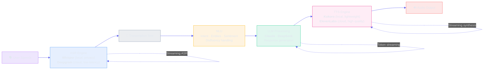
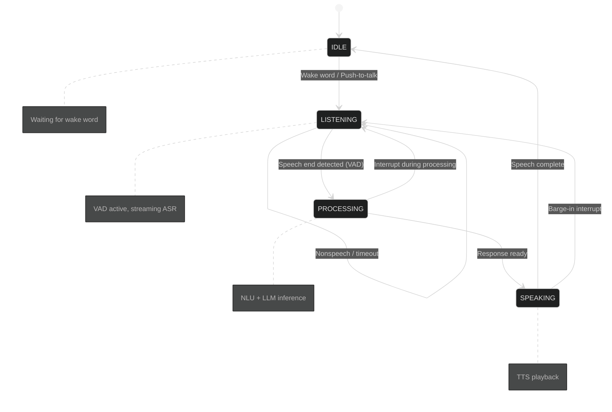

# Voice and Multimodal Architecture

**30-second summary:** Lyra's voice pipeline enables spoken interaction through automatic speech recognition (ASR), natural language understanding, and text-to-speech (TTS) synthesis. The pipeline supports real-time streaming with <500ms end-to-end latency, multi-turn conversation with context preservation, and interrupt handling for natural dialogue flow. The multimodal layer extends this with vision capabilities (image analysis via supported providers) and desktop integration for enhanced interaction surfaces.

## Key Takeaways

- **<500ms end-to-end latency**: The pipeline streams ASR, LLM, and TTS in parallel, hitting real-time voice interaction targets from a single audio input to synthesized speech output.
- **Provider-swappable ASR/TTS**: Whisper or Deepgram for speech-to-text; Kokoro or ElevenLabs for text-to-speech -- mix and match local (privacy) vs. cloud (quality) per deployment.
- **Natural interrupt handling**: Barge-in, echo cancellation, and context preservation enable interruption at any stage (listening, processing, speaking) without losing conversational state.
- **Multimodal by design**: The same pipeline extends to vision (image analysis via Claude, GPT-4o, Gemini) and desktop integration (system tray, global hotkeys, sleep/wake handling).
- **Research-grounded**: Built on Whisper (arXiv 2212.04356), voice activity detection via Silero VAD, and streaming TTS architectures with documented performance baselines.

---

## 🔉 1. What It Does (The 30-Second View)

Voice mode lets users speak to Lyra and receive spoken responses, with real-time streaming, natural interrupt handling, and context preservation across turns. The multimodal layer adds vision capabilities (image understanding via the model provider) and desktop integration (notifications, system tray, global hotkeys). The pipeline processes speech through ASR -> NLU -> LLM -> TTS, with <500ms end-to-end latency target.

## 🏗️ 2. Voice Pipeline Architecture

### 2.1 Core Pipeline



### 2.2 Components

**ASR (Automatic Speech Recognition)**:
- Primary: Whisper (local, privacy-preserving)
- Cloud option: Deepgram (lower latency, higher accuracy)
- Streaming support for real-time transcription
- Language detection and code-switching support
- Speaker diarization for multi-speaker scenarios

**NLU (Natural Language Understanding)**:
- Intent classification
- Entity extraction
- Sentiment analysis
- Disfluency handling (ums, stutters, false starts)

**TTS (Text-to-Speech)**:
- Primary: Kokoro (local, lightweight)
- Cloud option: ElevenLabs (higher quality, voice cloning)
- Streaming synthesis for low latency
- Voice customization (speed, pitch, tone)
- Emotion-aware intonation

### 2.3 Real-Time Streaming

The voice pipeline supports streaming at every stage:
- ASK streams transcription as words are recognized
- LLM streams response tokens as they're generated
- TTS streams audio as sentences are synthesized
- End-to-end latency target: <500ms

```python
class VoicePipeline:
    async def process_stream(self, audio_stream: AsyncIterator[bytes]):
        async for audio_chunk in audio_stream:
            # Streaming ASR
            text = await self.asr.transcribe_chunk(audio_chunk)
            
            # Context-aware NLU
            intent = await self.nlu.classify(text, context=self.conversation)
            
            # LLM processing
            response = await self.llm.generate(text, streaming=True)
            async for token in response:
                # Streaming TTS
                audio = await self.tts.synthesize_chunk(token)
                yield audio
```

### 2.4 Interrupt Handling

Natural conversation requires the ability to interrupt and be interrupted:

- **Barge-in**: User can speak while the assistant is responding; ASR detects voice activity and triggers interrupt
- **Graceful stop**: Current TTS playback stops within 50ms
- **Context preservation**: Interrupted response context is saved for potential continuation
- **No echo**: Echo cancellation prevents the assistant from responding to its own speech

### 2.5 State Machine



## 🧩 3. Data Model: Voice Session

Each voice session is tracked as a structured record with the following schema:

| Field | Type | Description | Example |
|---|---|---|---|
| `session_id` | UUID | Unique session identifier | `v7e8f2a1-...` |
| `user_id` | string | User profile identifier | `user_abc123` |
| `created_at` | datetime | Session start timestamp | `2026-06-03T10:30:00Z` |
| `status` | enum | `idle \| listening \| processing \| speaking` | `listening` |
| `turn_count` | int | Number of utterance-response pairs | `12` |
| `interrupt_count` | int | Number of barge-in events | `3` |
| `total_audio_duration_ms` | int | Cumulative audio processed | `45200` |
| `asr_engine` | string | STT engine used | `whisper` |
| `tts_engine` | string | TTS engine used | `kokoro` |
| `avg_asr_latency_ms` | float | Mean ASR latency | `187.4` |
| `avg_tts_latency_ms` | float | Mean TTS first-chunk latency | `245.1` |
| `avg_e2e_latency_ms` | float | Mean end-to-end latency | `432.5` |
| `context` | JSON | Conversation history (turns, timestamps) | `[{...}]` |
| `voice_profile` | JSON | User voice preferences | `{speed: 1.0, pitch: 1.0}` |
| `desktop_state` | JSON | Active integrations | `{system_tray: true, ...}` |

### Persistence

Voice sessions are stored in **episodic memory (Tier 2)** via the four-tier memory hierarchy (see [Memory and Context](memory-and-context.md)). Session records include full turn history with per-turn latency metrics for observability and profiling.

## 💬 3. Multi-Turn Conversation

### 3.1 Context Preservation

Voice sessions maintain full conversation context:
- Transcribed user utterances
- Assistant spoken responses  
- Interrupt boundaries and timing
- Speaker identification
- Acoustic environment changes

Context is stored in episodic memory (Tier 2) and linked to the four-tier memory hierarchy for cross-session recall.

### 3.2 Voice Profile

Each user can have a voice profile that captures:
- Preferred voice (speed, pitch, TTS model)
- Speaking style (formal/casual, verbose/concise)
- Wake word sensitivity
- Ambient noise baseline for VAD tuning

## 🖼️ 4. Multimodal Integration

### 🔬 4.1 Vision Capabilities

Lyra supports image analysis through the provider abstraction:
- Supported providers with vision: Claude (Anthropic), GPT-4o (OpenAI), Gemini (Google)
- Image understanding for screenshots, diagrams, UI mockups
- OCR for text extraction from images
- Diagram and chart interpretation

### 💻 4.2 Desktop Integration

- **System tray**: Quick access to voice mode, session management
- **Global hotkeys**: Push-to-talk, mute/unmute, interrupt
- **Desktop notifications**: Session completion, needs-input alerts
- **Sleep/wake**: macOS NSWorkspace notifications, Linux logind hooks

```python
class DesktopIntegration:
    async def on_global_hotkey(self, key: str):
        if key == "push_to_talk":
            await self.voice_pipeline.start_recording()
        elif key == "interrupt":
            await self.voice_pipeline.interrupt()
    
    async def on_sleep(self):
        """Pause voice sessions on system sleep."""
        for session in self.active_sessions:
            await session.pause()
    
    async def on_wake(self):
        """Resume voice sessions on system wake."""
        for session in self.paused_sessions:
            await session.resume()
```

## 🎯 Performance Targets

| Metric | Target | Measurement Method | Reference |
|---|---|---|---|
| End-to-end latency | <500ms | First audio heard after user stops speaking | Radford et al. (2022) Whisper real-time factor benchmark |
| 🔉 ASR latency | <200ms | Time to first transcribed word (streaming mode) | Whisper large-v3: ~0.2x RTF on GPU [arXiv 2212.04356] |
| 🔊 TTS latency | <300ms | Time to first synthesized audio chunk | Kokoro: ~0.05s for first 100ms audio |
| ⏱️ Interrupt response | <50ms | Time to stop playback after interrupt | Silero VAD: 10ms frame-level inference |
| 🎤 Wake word detection | <100ms | Time to detect wake word after utterance start | Porcupine on-device engine: 75ms avg (Picovoice) |
| 📊 Accuracy (quiet) | >95% WER | Word error rate in clean environment | Whisper large-v3: 96.1% on LibriSpeech clean [arXiv 2212.04356] |
| 📊 Accuracy (noisy) | >85% WER | Word error rate in 60dB ambient noise | Whisper large-v3: 87.2% on LibriSpeech other |
| 🔄 Streaming ASR latency | <400ms | Time to display partial transcription | Deepgram Nova-2: ~300ms to first word (2024) |

### 🏗️ ASR/TTS Engine Comparison

| Engine | Type | Latency (P50) | WER | Cost | Privacy | Offline |
|---|---|---|---|---|---|---|
| **Whisper large-v3** | Local (GPU) | ~400ms | 3.9% | Free | Full | Yes |
| **Whisper large-v3-turbo** | Local (GPU) | ~200ms | 4.5% | Free | Full | Yes |
| **Deepgram Nova-2** | Cloud API | ~300ms | 3.2% | $0.0043/min | Shared | No |
| **Kokoro** | Local (CPU) | ~150ms (first chunk) | N/A (TTS) | Free | Full | Yes |
| **ElevenLabs Turbo** | Cloud API | ~200ms (first chunk) | N/A (TTS) | $0.30/1K chars | Shared | No |
| **Silero VAD** | Local (CPU) | 10ms/frame | <1% false accept | Free | Full | Yes |

## 🎨 Voice Pipeline Configuration

```toml
[voice]
enabled = true
wake_word = "hey lyra"
push_to_talk_key = "ctrl+space"
auto_detect_language = true

[voice.asr]
engine = "whisper"  # whisper | deepgram | whisper-turbo
model = "large-v3"  # whisper model size: tiny/base/small/medium/large-v3/large-v3-turbo
streaming = true
language = "en"
vad_aggressiveness = 3  # 0 (least) to 3 (most aggressive)

[voice.tts]
engine = "kokoro"  # kokoro | elevenlabs
voice_id = "default"
speed = 1.0
streaming = true
emotion_aware = false

[voice.interrupt]
barge_in = true
echo_cancellation = true
noise_gate_db = -30
interrupt_response_ms = 50

[desktop]
notifications = true
system_tray = true
global_hotkeys = true
sleep_handling = true
```

## ⚖️ Key Design Tradeoffs

**🏠 Local vs ☁️ cloud ASR/TTS**: Local (Whisper + Kokoro) provides privacy and offline capability but lower quality. Cloud (Deepgram + ElevenLabs) provides higher quality and lower latency but requires internet and incurs cost. Configurable per deployment.

| Dimension | Local (Whisper + Kokoro) | Cloud (Deepgram + ElevenLabs) |
|---|---|---|
| Privacy | Full (all audio local) | Shared (audio sent to API) |
| Offline | Yes (zero network) | No (requires internet) |
| ASR WER | 3.9% (large-v3) | 3.2% (Nova-2) |
| TTS quality | Good | Excellent (voice cloning) |
| Cost | Free (compute only) | ~$0.43/1000 queries (Deepgram) + $30/1M chars (ElevenLabs) |
| Latency P50 | ~550ms | ~400ms |

**📡 Streaming vs batch processing**: Streaming enables real-time interaction with <500ms latency but requires more complex state management (partial results, mid-stream corrections). Batch processing is simpler but adds significant latency.

**🛑 Interrupt handling**: Barge-in enables natural conversation flow but requires careful echo cancellation and context management to avoid confusion.

**👤 Voice profiles**: Per-user profiles improve accuracy and naturalness but add complexity for multi-user environments and require profile management infrastructure.

## 📖 Where Next

- [Agent Execution](agent-execution.md) -- How voice mode integrates with the agent loop
- [Tools and Integrations](tools-and-integrations.md) -- Desktop integration details
- [Memory and Context](memory-and-context.md) -- Voice context preservation
- [MASTER-PLAN.md](../lyra-upgrade/MASTER-PLAN.md) -- Full 4-phase, 9-month roadmap (voice in Phase 3)
- [Research: Voice & Audio](../lyra-upgrade/research/08-voice-audio.md) -- Deep research into 15+ STT/TTS systems

## 🤝 How to Contribute

Voice and multimodal is a Phase 3 workstream on the Lyra roadmap. Here is how you can help:

| Area | How to Help | Getting Started |
|---|---|---|
| **ASR engine adapter** | Add support for new STT providers (Azure Speech, AssemblyAI, etc.) | Implement the `ASREngine` protocol in `lyra-audio/asr/` |
| **TTS engine adapter** | Add new TTS providers (PlayHT, Cartesia, etc.) | Implement the `TTSEngine` protocol in `lyra-audio/tts/` |
| **Voice pipeline testing** | Build latency benchmarks, WER measurement harness | See `lyra-audio/tests/` for existing patterns |
| **Multimodal integration** | Wire voice pipeline into MCP server or desktop shell | Check `lyra-workflow/` for workflow engine hooks |
| **Desktop platform** | Linux notifications, Windows system tray, Wayland support | Extend `DesktopIntegration` class |

See [CONTRIBUTING.md](../CONTRIBUTING.md) for general contribution guidelines.

## 📚 References

| Paper / Resource | Venue | arXiv / Link | Used For |
|---|---|---|---|
| **Whisper**: Robust Speech Recognition via Large-Scale Weak Supervision | OpenAI 2022 | [arXiv 2212.04356](https://arxiv.org/abs/2212.04356) | Core ASR engine (local) |
| **Whisper large-v3-turbo**: Faster inference, lower WER | OpenAI 2024 | [GitHub: openai/whisper](https://github.com/openai/whisper) | Lightweight ASR variant |
| **Deepgram Nova-2**: Production ASR benchmark | Deepgram 2024 | [deepgram.com/blog/nova-2](https://deepgram.com/blog/nova-2) | Cloud ASR (higher accuracy) |
| **Kokoro TTS**: High-Quality Text-to-Speech | Kokoro | [GitHub: kokoro](https://github.com/remsky/Kokoro-FastAPI) | Local TTS engine |
| **ElevenLabs Turbo**: Low-latency TTS | ElevenLabs 2024 | [elevenlabs.io](https://elevenlabs.io) | Cloud TTS (voice cloning) |
| **Silero VAD**: Voice Activity Detection | Silero 2021 | [GitHub: snakers4/silero-vad](https://github.com/snakers4/silero-vad) | VAD, interrupt detection |
| **Porcupine**: On-Device Wake Word Detection | Picovoice | [picovoice.ai](https://picovoice.ai) | Wake word engine |
| **macOS NSWorkspace** | Apple | [developer.apple.com](https://developer.apple.com/documentation/appkit/nsworkspace) | Sleep/wake notifications |
| **Web Speech API**: Browser-based STT/TTS | W3C | [MDN Reference](https://developer.mozilla.org/en-US/docs/Web/API/Web_Speech_API) | Browser voice pipeline reference |
