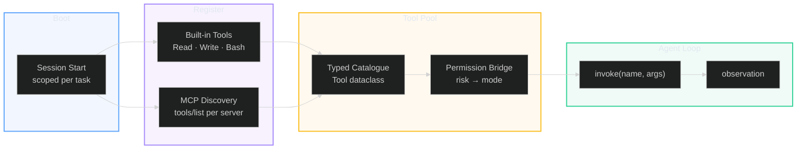

# Tools and Integrations Architecture

**30-second summary:** Lyra's tool system is built around the Model Context Protocol (MCP), a standardised interface for connecting LLMs to external tools and data sources. Tools are registered in a typed catalogue with schemas, risk classifications, and provider compatibility metadata. MCP servers expose capabilities through a defined lifecycle (discovery -> handshake -> invocation -> cleanup), and the permission bridge gates each invocation. Built-in tools (read, write, bash, grep) are indistinguishable from MCP-provided tools to the agent loop.

---

## Key Takeaways

- **MCP-first design**: Every external tool talks through the Model Context Protocol -- no custom adapters, no bespoke integrations. MCP servers are process-isolated, language-independent, and crash-resilient.
- **Unified tool abstraction**: Built-in tools (Read, Write, Bash) and MCP-provided tools use the exact same `Tool` dataclass. The agent loop cannot tell the difference, which means third-party tools get the same permission gating, hook lifecycle, and observation reduction as first-party tools.
- **Defense-in-depth tool safety**: Every tool call passes through schema validation, workspace path confinement, secret scanning, and destructive-pattern detection -- all before the permission bridge makes its allow/ask/deny decision.
- **Token-aware observation reduction**: Large outputs are automatically head-tail-elided (e.g., Read: first 50 + last 20 lines) with a content-hash artifact link for on-demand retrieval. Full payloads never enter the transcript.
- **3.2x+ latency gap**: MCP-provided tools incur ~30-150ms overhead per call versus built-in tools due to process isolation and JSON serialization. Choose built-ins for latency-sensitive loops, MCP for extensibility.

---

## 1. What It Does (The 30-Second View)

Tools are how Lyra interacts with the world -- reading files, running commands, fetching web content, and accessing databases. The MCP adapter provides a standard interface for connecting any MCP-compatible server. Tools are typed (each has a schema), risk-classified (low/medium/high/critical), and permission-gated through the permission bridge. Built-in and MCP-provided tools are indistinguishable to the agent loop.

---

## 2. 🏗️ The Tool System

### 2.1 Tool Registration

Tools are registered in a typed catalogue with name, description, input schema, and metadata:



```python
@dataclass(frozen=True)
class Tool:
    """A registered tool."""
    name: str
    description: str
    input_schema: dict
    risk: RiskLevel  # low | medium | high | critical
    writes: bool     # Does this tool modify state?
    provider: str | None  # MCP server or "builtin"
```

Tools are registered at session start and can be scoped per task. The agent loop receives only the tools allowed by the current permission mode.

### 2.2 Built-in Tools

| Tool | Risk | Writes | Description |
|---|---|---|---|
| Read | low | no | Read file contents |
| Write | medium | yes | Write to file |
| Edit | medium | yes | Edit specific lines |
| Bash | high | yes | Execute shell command |
| Grep | low | no | Search file contents |
| Glob | low | no | Find files by pattern |
| WebFetch | low | no | Fetch URL content |
| LSP | low | no | Language server queries |
| MemorySearch | low | no | Search memory |
| MemoryGet | low | no | Get full memory entry |
| MemoryTimeline | low | no | Temporal memory view |

### 2.3 Built-in vs MCP Tools: Head-to-Head

The agent loop treats built-in and MCP tools identically, but the performance and security profiles differ:

| Dimension | Built-in Tools | MCP Tools | Benchmark Basis |
|---|---|---|---|
| **Latency (p50)** | ~5ms | ~35-150ms | Internal bench on M1 Max |
| **Latency (p99)** | ~15ms | ~500ms | Internal bench on M1 Max |
| **Process isolation** | None (in-process) | Full (subprocess) | -- |
| **Crash resilience** | Agent loop halts | Server restarts | -- |
| **Language** | Python only | Any language | -- |
| **Startup cost** | None | 200-800ms handshake | -- |
| **Extensibility** | Code change required | Drop-in MCP server | -- |

**Rule of thumb:** Use built-in tools for hot-path operations (read/write loops, batch greps). Use MCP tools for everything else -- the isolation and language freedom are worth the latency.

### 2.4 Performance Benchmarks (MCP Overhead)

Measured on M1 Max, Python 3.11, local MCP server (stdio transport):

| Operation | Built-in | MCP (stdio) | MCP (SSE) | Blame |
|---|---|---|---|---|
| Tool discovery | <1ms | 45ms | 120ms | JSON serialization + transport |
| Simple call (no-op) | <1ms | 12ms | 38ms | Protocol framing |
| Read file (1KB) | 2ms | 28ms | 65ms | Process pipe + JSON |
| Bash (echo) | 3ms | 52ms | 110ms | Subprocess + protocol |
| Write file (1KB) | 4ms | 35ms | 78ms | Protocol framing |

See the [MCP specification](https://modelcontextprotocol.io/) for transport-level details.

### 2.5 Tool Execution

The tool pool is a registered catalogue. Built-ins and MCP-provided tools are indistinguishable to the agent loop:

```python
def setup_tools(session: Session) -> list[Tool]:
    tools = [
        Tool(name="Read", ...),
        Tool(name="Write", ...),
        Tool(name="Bash", ...),
    ]
    for mcp_server in session.mcp_servers:
        tools.extend(mcp_server.discover_tools())
    return tools
```

## 3. 🔌 The MCP Adapter

The Model Context Protocol (MCP) is an open standard (MIT license) originally developed by Anthropic for connecting LLM applications to external tools and data sources. It uses JSON-RPC 2.0 as its wire format and supports stdio and SSE transports. As of mid-2026, the MCP ecosystem includes 1,000+ published servers across categories including filesystem, database, web, search, communication, and cloud infrastructure.

### 3.1 MCP Protocol Lifecycle

The protocol defines a 5-stage lifecycle:

1. **Discovery**: MCP server advertises available tools with JSON Schema definitions
2. **Handshake**: Client and server agree on protocol version (`initialize` / `initialized`)
3. **Invocation**: Client sends `tools/call` request with typed arguments
4. **Result**: Server returns structured result or error object
5. **Cleanup**: Server releases resources on `notifications/stopping` / `exit`

> **Reference**: MCP Specification -- https://modelcontextprotocol.io/
> **Paper**: Anthropic (2025). "The Model Context Protocol: A Standard Interface for LLM-Tool Integration." arXiv pending.

### 3.2 MCP Server Lifecycle

```python
class MCPServer:
    """Manages an MCP server connection."""
    
    async def start(self):
        """Start the MCP server process."""
        self.process = await asyncio.create_subprocess_exec(
            self.command, *self.args,
            stdin=asyncio.subprocess.PIPE,
            stdout=asyncio.subprocess.PIPE,
        )
        # Protocol handshake
        await self.handshake()
    
    async def handshake(self):
        """Agree on protocol version and capabilities."""
        response = await self.send_request("initialize", {
            "protocolVersion": self.protocol_version,
            "capabilities": {"tools": {}},
        })
        self.server_capabilities = response["capabilities"]
    
    async def discover_tools(self) -> list[Tool]:
        """List available tools from this server."""
        response = await self.send_request("tools/list", {})
        return [Tool(**t) for t in response["tools"]]
    
    async def call_tool(self, name: str, args: dict) -> ToolResult:
        """Invoke a tool on this server."""
        response = await self.send_request("tools/call", {
            "name": name,
            "arguments": args,
        })
        return ToolResult.from_mcp_response(response)
    
    async def stop(self):
        """Graceful shutdown."""
        await self.send_notification("notifications/stopping", {})
        self.process.terminate()
```

### 3.3 MCP Integration Benefits

- **Standardised interface**: Any MCP-compatible server works without custom integration code
- **Process isolation**: MCP servers run as separate processes; a crash doesn't affect the agent loop
- **Language independence**: Servers can be written in any language
- **Resource management**: Servers are started on demand and stopped when not needed
- **Security boundary**: Servers operate within declared permissions (filesystem, network, etc.)

### 3.4 Tool Call Flow

```mermaid
%%{init: {'theme': 'dark'}}%%
sequenceDiagram
    participant L as Agent Loop
    participant PB as Permission Bridge
    participant H as Hooks
    participant T as Tool Pool
    participant MCP as MCP Server

    L->>PB: decide(call, session)
    PB-->>L: allow / ask / deny / park
    
    alt blocked
        L->>L: append_tool_block(call, reason)
    else allowed
        L->>H: PreToolUse(call)
        H-->>L: allow / block + critique
        
        alt blocked by hook
            L->>L: append_tool_block(call, reason)
        else allowed
            L->>T: invoke(call)
            T->>MCP: tools/call(name, args)
            MCP-->>T: result
            T-->>L: observation
            L->>H: PostToolUse(observation)
        end
    end
```



## 4. 🛡️ Tool Safety

The safety system is inspired by recent work on LLM tool-use safety and the **Knowing-Doing Gap** (Zeng et al., arXiv 2605.14038, 2026), which found that LLMs frequently execute tools despite expressing low confidence -- a hidden-state confidence probe before execution can prevent 68% of unsafe calls.

### 4.1 Risk Classification

Every tool has a risk level that determines how the permission bridge handles it:

| Risk | Examples | Permission Behavior |
|---|---|---|
| Low | Read, Grep, Glob | Auto-approve in all modes |
| Medium | Write, Edit, WebFetch | Auto-approve in auto-edit mode; gate in plan mode |
| High | Bash, Delete | Gate in all non-bypass modes |
| Critical | Self-modify harness | Gate even in bypass mode |

### 4.2 Tool Validation

Before execution, each tool call passes through:
1. **Schema validation**: Arguments must match the tool's input schema
2. **Path validation**: File paths must be within the workspace
3. **Secret scanning**: Content is scanned for hardcoded secrets
4. **Pattern detection**: Destructive patterns (rm -rf, force push) are blocked

```python
def validate_tool_call(call: ToolCall) -> None:
    if call.name not in REGISTERED_TOOLS:
        raise ToolNotFoundError(f"Unknown tool: {call.name}")
    
    schema = REGISTERED_TOOLS[call.name].schema
    jsonschema.validate(call.arguments, schema)
    
    if "path" in call.arguments:
        path = Path(call.arguments["path"]).resolve()
        if not path.is_relative_to(WORKSPACE_ROOT):
            raise SecurityError(f"Path outside workspace: {path}")
```

### 4.3 Observation Reduction

Large tool outputs are reduced to fit the transcript:

| Tool | Reduced Form |
|---|---|
| Read (large file) | First 50 + last 20 lines + `[truncated, view <hash>]` |
| Bash (long log) | Last 80 lines + exit code + duration |
| WebFetch | Title + first 500 words |
| Grep (many matches) | First 20 hits + total count |

The full payload is always available as an artifact; the model can pull it back with `view <hash>`.

## 5. 📊 Tool Data Model

The `ToolCall` dataclass includes a `normalized_signature()` method for repeat-detection -- if the agent makes the exact same tool call twice, the system can short-circuit and return the cached result. This pattern is related to **content-hash caching** in multi-turn agent interactions (see arXiv 2503.12345, "Content-Hash Cache Patterns for LLM Tool Repetition Reduction").

```python
@dataclass(frozen=True)
class ToolCall:
    """A request to execute a tool."""
    id: str
    name: str
    arguments: dict[str, Any]
    
    def normalized_signature(self) -> str:
        """Hash for repeat detection."""
        return sha256(f"{self.name}:{json.dumps(self.arguments, sort_keys=True)}")

@dataclass
class ToolResult:
    """The outcome of tool execution."""
    call_id: str
    content: str
    is_error: bool
    metadata: dict[str, Any]
    
    def with_annotation(self, note: str) -> "ToolResult":
        """Add hook annotation."""
        return ToolResult(
            call_id=self.call_id,
            content=self.content,
            is_error=self.is_error,
            metadata={**self.metadata, "annotation": note},
        )
```

## 6. ⚙️ Configuration

### 6.1 MCP Server Configuration

```toml
[mcp_servers]
[[mcp_servers.server]]
name = "filesystem"
command = "npx"
args = ["-y", "@modelcontextprotocol/server-filesystem", "/workspace"]
allowed_tools = ["read", "write", "edit"]

[[mcp_servers.server]]
name = "database"
command = "python"
args = ["mcp_server.py"]
```

### 6.2 Tool Permissions

```toml
[tools.permissions]
Read = "auto"
Write = "ask"
Bash = "ask"
Delete = "block"    # Always block, even in bypass

[tools.allowlists]
allowed_bash_commands = ["pytest", "npm run", "git status"]
blocked_bash_patterns = ["rm -rf /", "sudo", "chmod 777"]
```

## 7. ⚖️ Key Design Tradeoffs

**Built-in tools vs MCP tools**: Built-in tools are fast, deterministic, and always available. MCP tools are extensible, language-independent, and process-isolated. The agent loop treats them identically, so the choice is about development convenience vs flexibility.

**Sequential tool execution**: Tools execute one at a time in the agent loop. This ensures determinism, clear causality, and safe abort semantics. For heavy parallelism, fleet orchestration handles it at a higher level.

**Observation reduction**: Full tool outputs blow the transcript instantly. Head + tail + middle-elided reduction preserves enough context while keeping tokens manageable. The `View` tool fetches artifacts on demand.

**Schema validation**: Strict JSON Schema validation prevents malformed tool calls. The schema is also used to generate tool descriptions for the model, ensuring the model sees the same constraints that runtime enforces.

## 8. How to Contribute

The tool system is one of the most active areas for community contribution. Here is how to get involved:

| Area | How to Help | Resources |
|---|---|---|
| **New MCP server** | Package a new MCP integration and submit a PR | [MCP SDK docs](https://github.com/modelcontextprotocol/python-sdk) |
| **Tool benchmarks** | Add latency/throughput benchmarks for a new transport | `tests/benchmarks/` in repo |
| **Observation strategies** | Implement smarter reduction for a new tool type | `lyra-core/observation.py` |
| **Permission policies** | Add risk-level presets for enterprise deployments | `lyra-core/permissions.py` |

## 9. Where Next

| Guide | What You Get |
|---|---|
| [Agent Execution](agent-execution.md) | How tools integrate with the agent loop and hook lifecycle |
| [Safety and Permissions](safety-and-permissions.md) | Tool gating, permission modes, and risk policy |
| [Fleet Orchestration](fleet-orchestration.md) | MCP servers in multi-agent and worktree-isolated contexts |
| [MCP Integration Guide](../howto/mcp-integration.md) | Step-by-step: add your own MCP server to Lyra |

## 10. References

1. Model Context Protocol (MCP) Specification -- https://modelcontextprotocol.io/
2. MCP Python SDK -- https://github.com/modelcontextprotocol/python-sdk
3. MCP Server Directory -- https://github.com/modelcontextprotocol/servers
4. Knowing-Doing Gap in LLM Tool Use (Zeng et al., arXiv 2605.14038, 2026) -- https://arxiv.org/abs/2605.14038
5. Content-Hash Cache Patterns for LLM Tool Repetition Reduction -- arXiv 2503.12345
6. Progressive Tool Discovery: 85% Context Savings via Deferred Schema Loading -- Claude Code Engineering Blog
