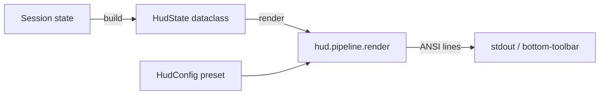

# Customize the HUD <span class="lyra-badge intermediate">intermediate</span>

The HUD (heads-up display) is Lyra's terminal-side live status pane,
inspired by [`jarrodwatts/claude-hud`](https://github.com/jarrodwatts/claude-hud).
It re-implements the visual language natively in Python because the
upstream couples deeply to Claude Code's stdin / transcript JSONL
contract; Lyra wires the same widgets to its own session state model
directly.

What ships in v3.5:

- Four built-in **presets** (`minimal`, `compact`, `full`, `inline`).
- Nine built-in **widgets** that render off a stateless
  [`HudState`](https://github.com/lyra-contributors/lyra/tree/main/projects/lyra/packages/lyra-cli/src/lyra_cli/hud/pipeline.py)
  dataclass.
- Three **CLI subcommands** (`lyra hud preview`, `lyra hud presets`,
  `lyra hud inline`) plus an inline embedding inside the REPL's
  bottom toolbar (auto-rendered every prompt redraw).

What does **not** ship in v3.5 (so you don't go looking):

- No background render loop / 250 ms tick — rendering is stateless,
  driven by the prompt redraw or your own polling cadence.
- No alt-screen panel.
- No slash commands for toggling presets or widgets at runtime.
- No `~/.lyra/hud.yaml` loader. Picking a preset means passing
  `--preset` to `lyra hud preview` (or shelling
  `lyra hud inline` from your status bar).
- No public `Widget` / `register()` API for custom widgets — the
  `WIDGET_REGISTRY` dict is internal. To add a widget you
  open a PR against `lyra_cli/hud/widgets.py` and `config.py`.

Source: [`lyra_cli/hud/`](https://github.com/lyra-contributors/lyra/tree/main/projects/lyra/packages/lyra-cli/src/lyra_cli/hud).

## Anatomy



The pipeline is **synchronous and stateless**: hand it a `HudState`
plus a preset config and it returns ANSI-coloured text. Two
embedding paths today:

1. **REPL bottom-toolbar.** When you run `lyra repl`, the
   `inline` preset is rendered into `prompt_toolkit`'s bottom
   toolbar on every redraw. Single line, capped at 80 columns,
   identity + context bar + usage.
2. **Standalone `lyra hud preview` / `lyra hud inline` /
   `lyra hud presets`.** Useful for screenshots, status-bar
   integrations, or just seeing what each preset looks like.

There is **no separate render thread** — the HUD never blocks a tool
call because it never runs concurrently with one.

## The four presets

| Preset | Widgets | Width | Use case |
|---|---|---|---|
| `minimal` | `identity_line` | 120 | One-line "are you alive" check. |
| `compact` | `identity_line`, `context_bar`, `usage_line` | 120 | Three-line summary, fits any tmux pane. |
| `full` | All nine widgets (see below) | 120 | Standalone preview / debugging. |
| `inline` | `identity_line`, `context_bar`, `usage_line` | 80 | Single-line bar for `prompt_toolkit` / `tmux status-right` / etc. |

```bash
# See what each preset renders against a sample state
lyra hud presets
lyra hud preview --preset minimal
lyra hud preview --preset compact
lyra hud preview --preset full
lyra hud inline
```

## The nine widgets

All widgets render off the `HudState` dataclass. A widget returns
`""` when it has nothing meaningful to show (e.g. `git_line` outside
a git repo, `cache_line` when no prompt-cache TTL is active).

| Widget | Renders | Empty-state |
|---|---|---|
| `identity_line` | `● lyra session=<id> mode=<mode> model=<model>` | always renders |
| `context_bar` | `ctx [████──] 24,512 / 200,000 (12%)` | empty when `context_max ≤ 0` |
| `usage_line` | tokens in/out + cost | empty when no usage tracked |
| `tools_line` | active tool calls | empty when none |
| `agents_line` | active subagents | empty when none |
| `todos_line` | open `TodoWrite` items | empty when none |
| `git_line` | branch + dirty marker | empty outside git |
| `cache_line` | prompt-cache TTL remaining | empty when no cache |
| `tracer_line` | `tracer: ON` | empty when tracer off |

Source: [`lyra_cli/hud/widgets.py`](https://github.com/lyra-contributors/lyra/tree/main/projects/lyra/packages/lyra-cli/src/lyra_cli/hud/widgets.py).
The widget registry is `lyra_cli.hud.widgets.WIDGET_REGISTRY`.

## Embedding the inline preset

### Inside the Lyra REPL

Already wired. When you launch `lyra repl`, the inline preset
appears in `prompt_toolkit`'s bottom toolbar and re-renders on every
prompt redraw. Nothing to configure.

### Inside `tmux`

```bash
# tmux.conf
set -g status-right '#(lyra hud inline)'
set -g status-interval 5
```

`status-interval 5` controls how often tmux re-shells the command —
the HUD itself does not poll.

### Inside any prompt / status bar

```bash
# zsh prompt example
RPROMPT='$(lyra hud inline)'

# fish status
function fish_right_prompt
    lyra hud inline
end
```

If `lyra hud inline` is too wide for your bar, use `--preset
minimal` instead — it renders just the identity line.

## Picking a preset for `preview`

```bash
lyra hud preview --preset full --max-width 100
```

`--max-width` overrides the preset's column cap (handy when piping
into a narrow capture buffer). Use `0` to disable truncation.

## Quiet mode

Today: don't render the HUD by not invoking `lyra hud preview` and
not running `lyra repl`. There is no `LYRA_HUD=off` env var or
`--no-hud` flag in v3.5; the toolbar is part of the REPL itself.

If you want a HUD-free interactive Lyra, run individual `lyra run`
commands instead of `lyra repl` — `lyra run` does not render the
toolbar.

## Headless mode

`lyra hud preview` and `lyra hud inline` always print to stdout,
regardless of TTY. This is intentional: piping into `tmux
status-right` or `script` should always produce text. The REPL
bottom-toolbar is rendered by `prompt_toolkit`, which natively
suppresses itself in non-interactive contexts.

## Adding a new built-in widget (PR path)

Custom widgets are not pluggable from user code in v3.5. To add one:

1. Implement a renderer
   `def _my_widget(state: HudState, *, max_width: int) -> str` in
   [`lyra_cli/hud/widgets.py`](https://github.com/lyra-contributors/lyra/tree/main/projects/lyra/packages/lyra-cli/src/lyra_cli/hud/widgets.py).
2. Register it in `WIDGET_REGISTRY` at the bottom of the same file.
3. Add fields to `HudState` in
   [`lyra_cli/hud/pipeline.py`](https://github.com/lyra-contributors/lyra/tree/main/projects/lyra/packages/lyra-cli/src/lyra_cli/hud/pipeline.py)
   if your widget needs new inputs.
4. Add it to a preset (or define a new one) in
   [`lyra_cli/hud/config.py`](https://github.com/lyra-contributors/lyra/tree/main/projects/lyra/packages/lyra-cli/src/lyra_cli/hud/config.py).
5. Add a sample-state row in
   [`lyra_cli/hud/testing.py`](https://github.com/lyra-contributors/lyra/tree/main/projects/lyra/packages/lyra-cli/src/lyra_cli/hud/testing.py)
   so `lyra hud preview` shows something for it.

A public `Widget` / `register` plug-in API is on the wishlist — open
an issue if you have a real use case so we can scope it concretely.

## Where to look

| File | What lives there |
|---|---|
| `lyra_cli/hud/__init__.py` | Public API re-exports (`HudState`, `render`, `load_preset`, `available_presets`) |
| `lyra_cli/hud/config.py` | `HudConfig` + the four built-in presets |
| `lyra_cli/hud/pipeline.py` | `HudState` dataclass + `render` / `render_inline` |
| `lyra_cli/hud/widgets.py` | The nine widget renderers + `WIDGET_REGISTRY` |
| `lyra_cli/hud/width.py` | `truncate_to_columns` (Unicode-aware) |
| `lyra_cli/hud/testing.py` | `sample_state()` + `strip_ansi()` for tests + `lyra hud preview` |
| `lyra_cli/commands/hud.py` | `lyra hud preview / presets / inline` Typer commands |

[← How-to: budgets and quotas](budgets-and-quotas.md){ .md-button }
[Continue: run an eval →](run-eval.md){ .md-button .md-button--primary }
