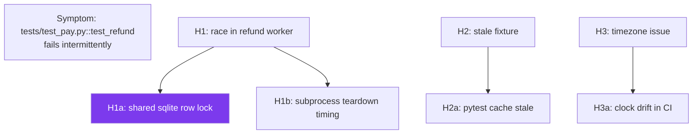

# Debug systematically <span class="lyra-badge intermediate">intermediate</span>

Systematic debugging — the **hypothesis-test discipline** — is no
longer a dedicated mode in Lyra. It's a **skill** you invoke from any
mode, plus a recommended pattern for two of the four modes:

- In `auto_mode`, the router will detect debugging-shaped prompts
  (errors, "why is X failing?", "investigate") and route them to
  `ask_before_edits` so each diagnostic write/edit pauses for your
  approval.
- In `ask_before_edits`, you get the same per-write confirmation
  posture, with the systematic-debugging skill loaded explicitly via
  `/skill load systematic-debugging`.

The shipped skill scaffolds the `Hypothesis-Test` pattern (see also
[Four Modes](../start/four-modes.md)). It is the antidote to "the
agent confidently rewrote the wrong file because it pattern-matched
on the symptom."

!!! note "Why no dedicated debug mode in v3.6?"
    Pre-v3.6 Lyra had a fourth behavioural mode called `debug` whose
    only job was to load the hypothesis-test scaffold. v3.6
    consolidated it: a debug-flavoured prompt under `auto_mode`
    routes to `ask_before_edits` (which is the right permission
    posture for risky bisecting and probe writes), and the
    hypothesis-test scaffold itself is a regular skill. This
    eliminated a redundant mode without losing the discipline.

    Typing `/mode debug` still works — it remaps to `auto_mode` with
    a one-line "renamed in v3.6" notice so old muscle memory doesn't
    hit a dead end.

## Enter the debugging surface

Two equivalent ways:

```
❯ /mode auto_mode
✓ mode → auto_mode

❯ tests/test_pay.py::test_refund fails about 1 in 5 runs in CI…
[auto_mode → ask_before_edits] [H1] Hypothesis: race in the refund worker…
```

```
❯ /mode ask_before_edits
✓ mode → ask_before_edits · permission posture → strict

❯ /skill load systematic-debugging
✓ loaded skill: systematic-debugging

❯ tests/test_pay.py::test_refund fails about 1 in 5 runs in CI…
[H1] Hypothesis: race in the refund worker…
```

Or pass at startup:

```bash
lyra --mode auto_mode    # router-driven; debug-shaped prompts get strict posture
lyra --mode ask_before_edits  # explicit; you load the skill yourself
```

## The hypothesis tree

The systematic-debugging skill tracks hypotheses as a tree the model
maintains explicitly. Each turn, the model:

1. States the **current hypothesis** under investigation.
2. Proposes the **smallest experiment** that would falsify it.
3. Executes the experiment (read logs, write a probe test, bisect).
4. Reports the result and updates the tree:
   - **Falsified** → mark; pop to the next sibling.
   - **Supported** → narrow into a child hypothesis.
   - **Confirmed** → only now propose a fix.



The current hypothesis is highlighted; the rest is the search frontier.

## A worked example

```
❯ /mode auto_mode

❯ tests/test_pay.py::test_refund fails about 1 in 5 runs.
  No code change. CI is green most of the time but flaky.

[auto_mode → ask_before_edits]
[H1] Hypothesis: race in the refund worker (multiprocessing)
     Experiment: run the test 50 times locally with -x and full log capture;
                 if it never fails locally, the race is environment-specific.

→ about to call: bash(pytest tests/test_pay.py::test_refund --count=50 -x -s)
  Confirm? [y/N] y

  ✓ 50/50 passed locally

[H1] Falsified locally — but the test is flaky in CI, not locally.
     Pivot: H3 (env-specific) is now top.

[H3] Hypothesis: timezone issue (CI runs on UTC, dev on local)
     Experiment: read tests/test_pay.py::test_refund — does it use naive datetimes?

→ about to call: read(tests/test_pay.py)
  Confirm? [y/N] y

  ✓ found: `assert refund.processed_at.date() == date.today()`

[H3] Supported. Narrowing to H3a:
     Hypothesis: `date.today()` is local-tz, `processed_at` is UTC,
                 so on UTC days that haven't started in local tz the
                 dates differ.
     Experiment: read src/pay/refund.py for processed_at construction.

→ about to call: read(src/pay/refund.py)
  Confirm? [y/N] y

  ✓ found: `processed_at = datetime.utcnow()`

[H3a] Confirmed.

  Root cause: assertion compares a UTC date to a local-tz date.

  Proposed fix:
     change `date.today()` → `datetime.utcnow().date()` in tests/test_pay.py
  → about to call: edit(tests/test_pay.py, …)
  Confirm? [y/N] y

  ✓ done · running test 50× to verify
  ✓ 50/50 pass · root cause proven and fixed.
```

The model didn't try to "fix" the worker on the first guess. It
walked the hypothesis tree until the cause was proven, then proposed
the minimal fix — and `ask_before_edits` made each probe a deliberate
step you approved.

## Debug-friendly tools

The base tool surface plus three observability-focused additions
unlocked when the systematic-debugging skill is loaded:

| Tool | What it does |
|---|---|
| `read_logs(path, since, level)` | Read structured logs filtered by level/time |
| `bisect(good_ref, bad_ref, command)` | Auto-bisect a regression with a check command |
| `time_travel_replay(span_id)` | Replay a recorded HIR span to inspect inputs/outputs |
| `print_inserter(file, line, expr)` | Insert a debug print, **automatically removed at session end** |

`print_inserter` is the killer tool: temporary instrumentation that
**cleans up after itself** at session end, so a frantic debugging
session doesn't leave 40 stray `print` statements behind.

## Replay a recorded trace

If you have a HIR trace from a past failing run, time-travel through
it without re-calling the LLM:

```
❯ time_travel_replay span_id=agent.run/sess-20260420-9c8d
  ↪ replay loaded · 47 spans · cost=$0.12 · 11 tool calls
  ↪ stepped to: pre.tool.use(write src/pay/worker.py) at step 3
  ↪ inputs: …
  ↪ outputs: …
```

The replay walks the recorded span tree and surfaces inputs/outputs
so you can inspect *what the agent actually saw* at each step.
Source:
[`lyra_core/observability/hir/replay.py`](https://github.com/lyra-contributors/lyra/tree/main/packages/lyra-core/src/lyra_core/observability/hir/replay.py).

## Tips that make debugging shine

- **Lead with the symptom**, not your guess. The model is better at
  generating hypotheses than at confirming yours.
- **Mention what you've already tried**. The model won't re-run a
  falsified hypothesis if you tell it.
- **Let it propose the experiment** before approving — the experiment
  design is half the value.
- **Don't switch back to `edit_automatically` until the root cause is
  named.** Systematic debugging is supposed to feel slow; that's the
  point.
- **Use `auto_mode` if you don't want to think about modes.** A prompt
  like "investigate why X is broken" routes to `ask_before_edits`
  automatically; the router prepends `[auto_mode → ask_before_edits]`
  so you can see the choice.

[← Turn on the TDD gate](tdd-gate.md){ .md-button }
[Continue to Architecture →](../architecture/index.md){ .md-button .md-button--primary }
