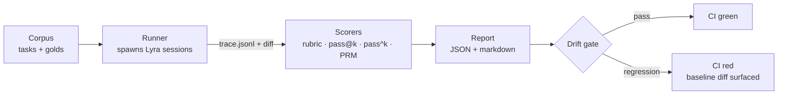

# Run an eval <span class="lyra-badge intermediate">intermediate</span>

`lyra-evals` is the package that scores Lyra trajectories against
corpora. It ships rubrics, scorers, drift gates, and pass@k
plumbing, and it's the same code path Lyra's own CI uses to detect
regressions.

Source: [`lyra_evals/`](https://github.com/lyra-contributors/lyra/tree/main/packages/lyra-evals) ·
[`lyra_core/eval/`](https://github.com/lyra-contributors/lyra/tree/main/packages/lyra-core/src/lyra_core/eval).

## The pieces



Four moving parts:

| Piece | Source |
|---|---|
| **Corpus** | `tasks/<id>/{prompt.md,plan.md,golden_diff.patch,acceptance_tests.txt}` |
| **Runner** | `lyra_evals/runner/spawn.py` — runs Lyra against each task |
| **Scorers** | [`lyra_core/eval/`](https://github.com/lyra-contributors/lyra/tree/main/packages/lyra-core/src/lyra_core/eval) — `passk.py`, `prm.py`, `drift_gate.py`; rubrics under [`lyra_core/eval/rubrics/`](https://github.com/lyra-contributors/lyra/tree/main/packages/lyra-core/src/lyra_core/eval/rubrics) |
| **Drift gate** | `lyra_core/eval/drift_gate.py` — compare to baseline |

## Quick start: run a built-in suite

```bash
# List available suites
lyra evals list

# Run the smoke suite (handful of tasks; ~3 min)
lyra evals run smoke

# Run the full coding-tasks corpus
lyra evals run coding --parallel 4
```

Output:

```text
suite=coding   tasks=24   parallel=4

  task                         pass  cost   notes
  ───────────────────────────  ────  ─────  ─────────────────────────────
  add-dark-mode-toggle         ✓     0.12   diff matches gold (94% similarity)
  fix-leaky-streaming-buffer   ✓     0.34   diff differs but tests pass
  refactor-router-to-segments  ✗     1.20   3/5 tests pass; subjective fail
  …

summary
  pass@1                      19 / 24   = 79%
  pass@1 (objective only)     22 / 24   = 92%
  mean cost / task            $0.31
  drift-gate                  PASS
```

## Build your own suite

A task is a directory:

```
my_suite/tasks/add-export-csv/
├── prompt.md                # the user-facing instruction
├── plan.md                  # (optional) approved plan to start from
├── acceptance_tests.txt     # newline-separated pytest IDs
├── golden_diff.patch        # (optional) reference solution
└── meta.yaml                # difficulty, tags, baseline cost
```

Then:

```bash
lyra evals run --suite ./my_suite --parallel 8
```

For each task, the runner:

1. Spins up a fresh repo state (git clean + checkout baseline ref)
2. Runs `lyra run "$(cat prompt.md)"` (or `lyra plan run plan.md` if a plan is given)
3. Captures `trace.jsonl`, `diff.patch`, `acceptance_tests` results
4. Hands artefacts to scorers

## Scorers

### Rubric

Source: [`lyra_core/eval/rubrics/`](https://github.com/lyra-contributors/lyra/tree/main/packages/lyra-core/src/lyra_core/eval/rubrics).

A different-family LLM judges the diff against the prompt + acceptance
tests. Same rubric as the [verifier subjective phase](../concepts/verifier.md#phase-2--subjective-different-family-judge):
correctness, style, simplicity, testability, plan-fidelity.

### Pass@k

Source: [`lyra_core/eval/passk.py`](https://github.com/lyra-contributors/lyra/tree/main/packages/lyra-core/src/lyra_core/eval/passk.py).

Standard unbiased estimator from
[Codex paper](https://arxiv.org/abs/2107.03374), eq. 1:

\[
\text{pass@}k = \mathbb{E}\left[1 - \binom{n - c}{k} / \binom{n}{k}\right]
\]

where `n` is total samples per task, `c` is the number that passed.

```python
from lyra_core.eval.passk import pass_at_k

ratio = pass_at_k(n_samples=10, n_correct=4, k=1)   # 0.40
ratio = pass_at_k(n_samples=10, n_correct=4, k=5)   # ~0.83
```

Run with `--samples 10 --k 1,5` to get a true pass@k vector.

### Drift gate

Source: [`lyra_core/eval/drift_gate.py`](https://github.com/lyra-contributors/lyra/tree/main/packages/lyra-core/src/lyra_core/eval/drift_gate.py).

Compares this run's metrics to a baseline (`baseline.json`):

```yaml title="my_suite/baseline.json"
pass_at_1: 0.79
pass_at_5: 0.92
mean_cost_usd: 0.31
```

Tolerances:

```yaml
[drift_gate]
pass_at_1_floor       = 0.05      # max regression before fail
mean_cost_ceiling_pct = 0.20      # 20% cost increase = fail
```

The gate is the **CI integration point** — `lyra evals run … --strict`
exits 1 on regression with a markdown diff in stderr.

## Process Reward Model

Source: [`lyra_core/eval/prm.py`](https://github.com/lyra-contributors/lyra/tree/main/packages/lyra-core/src/lyra_core/eval/prm.py).

For long horizons, end-of-task pass/fail is too coarse to A/B
configs. The PRM scorer integrates the per-step reward signal from
the verifier and reports a **trajectory quality** number that detects
"slow drift" earlier than pass@1 does.

## Recipes

### Comparing two configs

```bash
LYRA_CONFIG=configs/A.toml lyra evals run coding --report-json a.json
LYRA_CONFIG=configs/B.toml lyra evals run coding --report-json b.json
lyra evals diff a.json b.json
```

### Running a single task locally for debugging

```bash
lyra evals run coding --task add-export-csv --keep-session
# inspect:
ls .lyra/sessions/$(ls -t .lyra/sessions/ | head -1)/
```

### CI: regression gate

```yaml title=".github/workflows/lyra-evals.yml"
- name: Lyra evals
  run: |
    lyra evals run smoke \
      --baseline tests/eval-baseline.json \
      --strict
```

## Where to look

| File | What lives there |
|---|---|
| `lyra_evals/runner/spawn.py` | Per-task runner |
| `lyra_core/eval/rubrics/` | LLM judge rubric definitions |
| `lyra_evals/adapters/` | Public-benchmark adapters (τ-bench, Terminal-Bench-2, SWE-bench-Pro, LoCoEval) |
| `lyra_core/eval/passk.py` | Pass@k + pass^k |
| `lyra_core/eval/drift_gate.py` | Baseline diff + strict mode |
| `lyra_core/eval/prm.py` | Trajectory PRM |

[← How-to: customize the HUD](customize-hud.md){ .md-button }
[Continue: cron skill →](cron-skill.md){ .md-button .md-button--primary }
