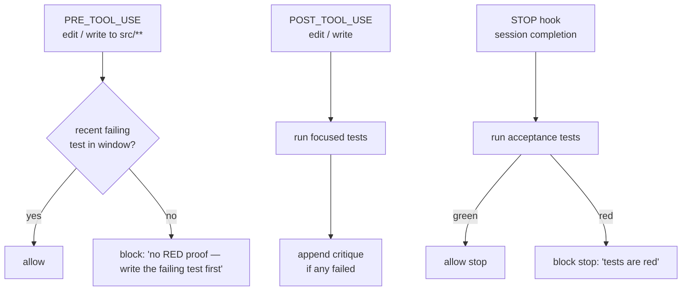

# Turn on the TDD gate <span class="lyra-badge intermediate">intermediate</span>

The TDD gate is Lyra's flagship discipline plugin: **deterministic
Python**, not prompt language, that enforces test-first development.
It ships **off by default** so Lyra behaves like a normal coding
agent. Flip it on when you want it.

## Enable

In a session:

```
❯ /tdd-gate on
✓ TDD gate enabled · permission mode → red
```

Or via config:

```toml title="~/.lyra/config.toml"
[tdd]
enabled = true
default_phase = "red"
```

Or per-invocation:

```bash
lyra --tdd-gate on
```

## What the gate actually does

The gate is three hook handlers wired to three lifecycle events:



| Event | Handler | What it enforces |
|---|---|---|
| `PRE_TOOL_USE(edit|write)` for `src/**` | RED-proof check | A failing test for the about-to-change behaviour exists in the recent window |
| `POST_TOOL_USE(edit|write)` | Focused test run | The relevant tests pass after the edit; otherwise critique |
| `STOP` | Acceptance tests | Full acceptance suite passes; coverage delta ≥ 0 |

When the plugin is **off**, the same hooks are registered but
short-circuit immediately. `/review` reports the gate as
`off (opt-in)` instead of as a verifier failure.

## The four TDD permission modes

The gate works hand-in-hand with four TDD-aware
[permission modes](../concepts/permission-bridge.md#the-eight-permission-modes):

| Mode | What's writable |
|---|---|
| `red` | Tests only |
| `green` | Tests + the minimal src changes to make them pass |
| `refactor` | src changes guarded by coverage delta ≥ 0 |
| `acceptEdits` | Anything, with risk classification |

The plugin **transitions you between modes** automatically:

- `red` → `green` after a failing test exists and is acknowledged
- `green` → `refactor` after the focused tests pass
- `refactor` → `red` after `/cycle`

## A typical RED → GREEN → REFACTOR cycle

```
❯ /tdd-gate on
✓ enabled · mode=red

❯ Add a function `slugify(text: str) -> str` to src/text.py.

🛑 PRE_TOOL_USE(write src/text.py) blocked by tdd-gate:
   "no RED proof — write the failing test first"

❯ Sorry — start by adding tests/test_text.py with a failing test for slugify.

✓ POST_TOOL_USE(write tests/test_text.py)
   ↪ pytest tests/test_text.py::test_slugify_strips_accents → 1 failed
   ↪ phase: red → green

❯ Now implement slugify.

✓ POST_TOOL_USE(write src/text.py)
   ↪ pytest tests/test_text.py::test_slugify_strips_accents → passed
   ↪ phase: green → refactor

❯ /cycle
✓ phase: refactor → red
```

You can drive each transition manually with `/red`, `/green`,
`/refactor`, `/cycle`.

## Tuning what the gate watches

```toml title=".lyra/tdd.toml"
[tdd]
src_globs   = ["src/**", "lib/**"]
test_globs  = ["tests/**", "**/*_test.py", "**/*_spec.ts"]
window_steps = 12      # RED-proof recency window (steps in the loop)

[tdd.runner]
command = "pytest -x"
focused_arg_flag = "-k"
timeout_s = 60

[tdd.coverage]
required = true
threshold_delta = 0.0  # require coverage to not regress
```

## Bypass for one turn

Sometimes you legitimately need to do a non-TDD edit (rename, format,
docs). For one turn:

```
❯ /tdd-gate bypass-once "rename internal helper, no behaviour change"
```

This bypasses the RED-proof check for the next single tool call and
records the bypass reason in the trace. Bypasses are visible to
`/review`.

## Verify it's running

```
❯ /review tdd-gate

  hook                         | status
  -----------------------------+------------------
  tdd-gate.pre_tool_use        | armed (mode=red)
  tdd-gate.post_tool_use       | armed (focused)
  tdd-gate.stop                | armed (acceptance + coverage)
  tdd-gate.pre_tool_use(bash)  | armed (test-disable patterns)
```

## Disable

```
❯ /tdd-gate off
✓ TDD gate disabled · permission mode → default
```

The hooks stay registered but short-circuit. To unregister them
entirely:

```toml
[tdd]
enabled = false
```

[← Configure providers](configure-providers.md){ .md-button }
[Debug systematically →](debug-mode.md){ .md-button .md-button--primary }
