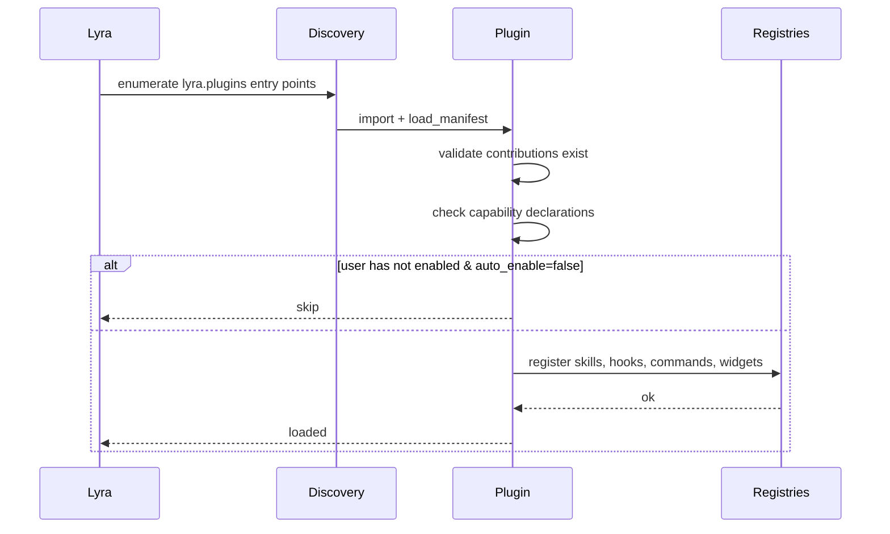

# Write a plugin <span class="lyra-badge advanced">advanced</span>

A Lyra plugin is the **installable unit of harness customisation**.
Where individual skills, hooks, and slash commands live as files
under `~/.lyra/`, a plugin packages them as a regular Python
distribution that anyone can `pip install lyra-plugin-yourname`.

Plugins can ship:

- Skills (`skills/<name>/SKILL.md`)
- Hooks (Python or YAML)
- Slash commands (Python `CommandSpec`)
- MCP server configs
- HUD widgets
- Permission policies
- Evaluation rubrics
- New tools (with caveats — see Safety)

Source: [`lyra_core/plugins/`](https://github.com/lyra-contributors/lyra/tree/main/packages/lyra-core/src/lyra_core/plugins).

## Anatomy of a plugin

```
lyra-plugin-acme/
├── pyproject.toml
├── README.md
├── lyra_plugin_acme/
│   ├── __init__.py
│   ├── manifest.yaml             # the plugin contract
│   ├── skills/
│   │   └── acme-deploy/
│   │       └── SKILL.md
│   ├── hooks/
│   │   └── acme_redactor.py
│   ├── commands/
│   │   └── acme.py               # /acme slash command
│   ├── widgets/
│   │   └── acme_status.py        # HUD widget
│   ├── mcp/
│   │   └── acme_mcp.json         # MCP server registration
│   └── policies/
│       └── acme_default.yaml
└── tests/
```

Two load-bearing files: `pyproject.toml` (entry point) and
`manifest.yaml` (what's inside).

## `pyproject.toml`

```toml
[project]
name = "lyra-plugin-acme"
version = "0.1.0"
dependencies = ["lyra-core>=3.0,<4"]

[project.entry-points."lyra.plugins"]
acme = "lyra_plugin_acme:plugin"
```

The entry point is how Lyra discovers your plugin. On `lyra` start,
it iterates `lyra.plugins` entry points and loads each.

## `manifest.yaml`

```yaml
name: acme
version: 0.1.0
description: Acme Inc. deploy + redaction add-ons.
homepage: https://github.com/acme/lyra-plugin-acme
license: Apache-2.0

# What this plugin contributes (everything is optional)
skills:
  - acme-deploy
hooks:
  - acme_redactor          # resolves to lyra_plugin_acme/hooks/acme_redactor.py
commands:
  - acme.cli               # resolves to lyra_plugin_acme/commands/acme.py
widgets:
  - acme_status
mcp_servers:
  - acme_mcp.json
policies:
  - acme_default

# Capability declaration — used for "what does this plugin need?"
capabilities:
  network: true
  file_write: true          # outside the plugin install dir
  spawn_processes: false
  side_effecting_tools: false   # i.e. doesn't ship new tools

# Discovery and load
load_order: 100             # lower = earlier
auto_enable: false          # require user opt-in via /plugin enable acme
```

Capability flags are **honest declarations** — Lyra checks them at
load time and surfaces them when the user runs `/plugin info acme`.

## The plugin entry point

```python title="lyra_plugin_acme/__init__.py"
"""Acme plugin for Lyra."""
from lyra_core.plugins import Plugin, manifest_path

plugin = Plugin.from_manifest(manifest_path(__file__))
```

That's the whole entry point. `Plugin.from_manifest` reads the YAML,
resolves all the contributions, validates they exist, and registers
them. Lyra calls into it on startup.

## Lifecycle



A plugin can also expose **lifecycle hooks** at the plugin level:

```python
from lyra_core.plugins import Plugin

plugin = Plugin.from_manifest(__file__)

@plugin.on_load
def setup(ctx):
    ctx.logger.info("acme plugin loaded")

@plugin.on_session_start
def per_session(ctx):
    ctx.session.tags.add("acme")
```

These run once per process / once per session respectively, never
during a model call.

## Enabling and disabling

```bash
pip install lyra-plugin-acme
lyra plugin list
lyra plugin info acme               # shows manifest + capabilities
lyra plugin enable acme             # opt-in if auto_enable=false
lyra plugin disable acme
```

Disabled plugins are **not loaded** — all their contributions vanish
from the registries.

## Trust model

Lyra is permissive about loading plugins (anything pip-installed +
listed in entry points) but **conservative about activation**:

| If the plugin… | Then… |
|---|---|
| Ships only skills + YAML hooks | Loads automatically; skills run sandboxed |
| Ships Python hooks | Loads, but hooks gated by `auto_enable` flag |
| Declares `side_effecting_tools: true` | Requires explicit `/plugin enable` even if `auto_enable: true` |
| Capability check fails (declared `network: false` but uses `urllib`) | Refuses to load; logs warning |

This means a hostile package can't silently inject a destructive
tool — but it can ship a skill that is opt-in via the skill loader.
Same trust posture as installing any other Python package.

## Distribution

Two recommended channels:

1. **PyPI** — `pip install lyra-plugin-foo`. Standard.
2. **Git URL** — `pip install git+https://github.com/you/lyra-plugin-foo`.
   For private or experimental plugins.

A third option exists for repo-local plugins:

```
your-repo/.lyra/plugins/local-acme/
├── manifest.yaml
└── …
```

These are loaded automatically when the session is in this repo,
without needing pip install. Use for project-specific extensions
that don't make sense to publish.

## Versioning and compatibility

Plugins should pin to a `lyra-core` major version:

```toml
dependencies = ["lyra-core>=3.0,<4"]
```

Lyra emits a deprecation warning if a plugin uses an API removed in
the current major; the plugin still loads. Hard breakages produce a
load failure, not a crash.

## Authoring tips

- **Start small.** A plugin that ships one good skill is more useful
  than a plugin that ships ten mediocre ones.
- **Test with `lyra plugin test acme`.** This loads the plugin in
  isolation and runs its `tests/` directory against the manifest.
- **Document the capability declaration.** `network: true` should
  be paired with a README section explaining why.
- **Ship a `policies/<name>.yaml`** if your plugin assumes a
  specific permission posture — users can opt in via
  `/permissions policy acme_default`.

## Where to look

| File | What lives there |
|---|---|
| `lyra_core/plugins/manifest.py` | Manifest schema + loader |
| `lyra_core/plugins/discovery.py` | Entry-point discovery |
| `lyra_core/plugins/registry.py` | Active plugin registry |
| `lyra_core/plugins/runtime.py` | Per-plugin lifecycle (on_load, on_session_start, …) |
| `lyra_cli/commands/plugin.py` | `lyra plugin …` CLI |

[← How-to: cron skill](cron-skill.md){ .md-button }
[How-to index →](index.md){ .md-button .md-button--primary }
