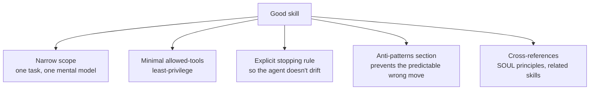

# Write a skill <span class="lyra-badge intermediate">intermediate</span>

A skill is a folder with a `SKILL.md` file. The frontmatter is the
contract; the body is the instructions. Lyra loads the description
into L2 context and the body only when the model decides to invoke.

See the [Skills concept page](../concepts/skills.md) for the full
mental model.

## The 5-minute version

```bash
mkdir -p .lyra/skills/changelog-bump
cat > .lyra/skills/changelog-bump/SKILL.md <<'EOF'
---
name: changelog-bump
description: |
  Use when the user asks to bump the version + add a CHANGELOG entry
  for a release. Inspects pyproject.toml, finds the current version,
  proposes the next bump kind (patch/minor/major), and writes the
  CHANGELOG entry from the current branch's commit messages.
allowed-tools: [read, edit, bash]
languages: [python]
version: 1.0.0
---

# Steps

1. Read `pyproject.toml`; extract the current version.
2. Ask the user which bump kind to apply (patch / minor / major).
3. Compute the next version (semver).
4. Edit `pyproject.toml` with the new version.
5. Run `git log --oneline $(git describe --tags --abbrev=0)..HEAD` to
   collect the changes.
6. Prepend a new section to `CHANGELOG.md` titled `## [<version>] - <ISO date>`
   followed by a bulleted list of the commits.
7. Show the diff. Stop. Do not commit; let the user review and commit.

## Anti-patterns
- Do not run `git tag` — the user does that manually after review.
- Do not edit anything outside `pyproject.toml` and `CHANGELOG.md`.
EOF
```

That's it. Open a session and try:

> Bump the version and update the changelog.

The router will match the prompt to your skill's `description`,
invoke it, and the agent will follow the steps under the narrowed
`allowed-tools` of `[read, edit, bash]`.

## What makes a good skill



## The frontmatter contract

| Field | Required | Notes |
|---|---|---|
| `name` | yes | Stable identifier; used in `/skill <name>` |
| `description` | yes | What the **router** matches; write it as if for a teammate |
| `allowed-tools` | yes | Subset of the global tool surface; least-privilege wins |
| `version` | optional | Semver; bump on body changes |
| `languages` | optional | Helps the router prefer your skill in matching repos |
| `companion_files` | optional | Other files in the skill folder loaded with the body |
| `disable-model-invocation` | optional | If `true`, only `/skill <name>` invocation works |
| `introspection` | auto | Curator writes here; do not hand-edit |

## Where to put it

| Scope | Location | Use when |
|---|---|---|
| **Repo** | `.lyra/skills/<name>/SKILL.md` | Project-specific |
| **User** | `~/.lyra/skills/<name>/SKILL.md` | Personal across projects |
| **Plugin** | `lyra_plugins/<plugin>/<name>/SKILL.md` | Sharing via package |

Narrower scopes win on collisions, so a repo-scoped skill overrides a
user-scoped one with the same `name`.

## Test it deterministically

Use `lyra skill smoke <name>` to verify the skill loads, parses, and
its `allowed-tools` resolve:

```bash
$ lyra skill smoke changelog-bump
[ok] frontmatter parse
[ok] required fields present
[ok] allowed-tools all resolvable
[ok] body has at least 3 numbered steps
[ok] anti-patterns section present
[ok] no leaked secrets in body
```

The same checks the [skill curator](../concepts/skills.md#the-curator)
runs on a schedule, but on demand.

## Mind the curator

Once a skill is in scope, the [curator](../concepts/skills.md#the-curator)
will start grading it the next time it runs. To keep your skill in
the `keep` or `promote` tier:

- Use it (or let users use it) — activations matter
- Make it succeed — the utility score is `(s − f) / (s + f)`
- Don't let it go stale — recent activity earns a recency boost

## When a skill stops being a skill

If you find yourself writing detailed Python inside SKILL.md steps,
extract that Python into a **tool** instead. Skills are for
*procedure-shaped knowledge*; tools are for *typed actions*. Confusing
the two is the most common skill-design mistake.

[← Add an MCP server](add-mcp-server.md){ .md-button }
[Write a slash command →](write-slash-command.md){ .md-button .md-button--primary }
