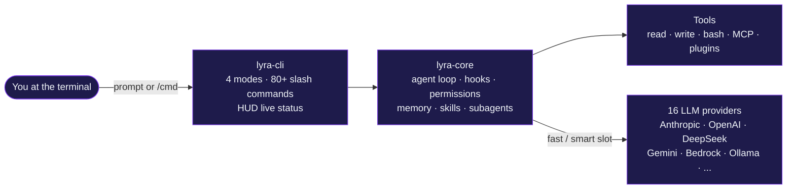

# <span class="lyra-hero-word">Lyra</span> — a CLI-native coding agent you can read

**L**ightweight **Y**ielding **R**easoning **A**gent. Lyra is an open-source
harness that combines the best ideas from
[Claude Code](https://docs.anthropic.com/claude/docs/claude-code),
OpenClaw, Hermes Agent, and SemaClaw into a single install-and-use CLI you
can pipe into your terminal — and an embeddable Python kernel you can read.

```bash
pip install lyra
lyra
```

That is the entire onboarding. The first prompt is a real session.

---

## What's actually in the box



- **CLI-native.** Type `lyra`, get a session. Tab-complete every slash
  command. Live HUD shows model, cost, tools, and git status.
- **Four modes.** `edit_automatically` (act, edits land), `ask_before_edits`
  (act, but confirm each write), `plan_mode` (design, read-only), `auto_mode`
  (router that picks one of the other three per turn). The system prompt and
  the permission posture change with the
  mode.
- **Hooks, not prompts.** Discipline (TDD gate, secret redaction, safety
  monitor) lives in deterministic Python code that runs on lifecycle events
  — not in fragile prompt language the model can talk its way out of.
- **Skills, not megaprompts.** Capability is shipped as `SKILL.md` files
  loaded by description, not by stuffing prose into the system prompt. A
  background curator grades them; an extractor proposes new ones from
  successful trajectories.
- **Subagents in git worktrees.** Parallel work happens in isolated
  worktrees on a session branch, merged back via fast-forward or 3-way
  merge.
- **You can read it.** 5 packages, ~2,200 tests green, every public class
  is one screen tall.

---

## Two front doors

Before picking a reader track below, the two highest-leverage starting
pages are:

| If your first question is… | Start at… |
|---|---|
| **"What does Lyra actually do?"** (every shipped feature, with where it lives + maturity) | [Features catalogue](features.md) |
| **"How do I do X?"** (15 task-driven recipes — TDD, debug, parallel attempts, run on a budget, eval, embed, …) | [Use cases](use-cases.md) |

Both link out to the deeper concept / how-to / reference pages, so
you can stop at either tier and still have a coherent picture.

---

## Pick your reader track

This site is laid out **basic → advanced**. You don't have to read it in
order, but if you do, each tier earns the next one.

<div class="lyra-tracks" markdown>

<div class="lyra-track" markdown>
### I just want to **use** Lyra
1. [Install](start/install.md)
2. [First session](start/first-session.md)
3. [The four modes](start/four-modes.md)
4. [Slash commands tour](start/slash-commands.md)

Then jump straight to [How-To](howto/index.md).
</div>

<div class="lyra-track" markdown>
### I want to **extend** Lyra
1. [The agent loop](concepts/agent-loop.md)
2. [Tools and hooks](concepts/tools-and-hooks.md)
3. [Skills](concepts/skills.md)
4. [Write a skill](howto/write-skill.md) /
   [Add an MCP server](howto/add-mcp-server.md)
</div>

<div class="lyra-track" markdown>
### I want to **understand** Lyra
1. [Architecture overview](architecture/index.md)
2. [Ten commitments](architecture/commitments.md)
3. [System topology](architecture/topology.md)
4. [The 14 building blocks](reference/blocks-index.md)
</div>

<div class="lyra-track" markdown>
### I'm here for the **research**
1. [CALM evaluation](research/calm-evaluation.md)
2. [Memento-Skills](research/memento-skills.md)
3. [Diversity collapse](research/diversity-collapse-analysis.md)
4. [Phase J synthesis](research-synthesis-phase-j.md)
</div>

</div>

---

## Why another coding agent?

Lyra exists because the existing harnesses each get one thing very right
and several things visibly wrong.

| Harness | What it nails | What Lyra changes |
|---|---|---|
| Claude Code | Polished UX, polite refusals | Open source; readable kernel; pluggable models |
| OpenClaw | Self-sovereign, hookable | Opinionated TDD plugin; better skill loop |
| Hermes Agent | Lifecycle hooks, tool registry | Adds a permission bridge and verifiable plans |
| SemaClaw | DAG teams, parked nodes | Productionized, persisted, replayable |

Lyra commits to **ten things** ([read the
commitments](architecture/commitments.md)) that the others compromise on:
plan-mode default-on, permission bridge as a runtime primitive, hooks-not-
prompts for discipline, never-compacted SOUL.md, post-task skill
extraction, subagents in worktrees, replayable traces, bounded cost,
cross-session continuity, and an opinionated single-binary CLI.

---

## Status

- **Version:** v3.5 "Phase O — Harness Refactoring"
- **Tests:** ~2,200 green across 5 packages (`lyra-cli`, `lyra-core`,
  `lyra-mcp`, `lyra-skills`, `lyra-evals`)
- **License:** [MIT](https://github.com/lyra-contributors/lyra/blob/main/LICENSE)
- **Python:** 3.11+
- **Status:** active development; public beta

!!! tip "Stuck?"
    Every page on this site links to the canonical source markdown. If
    something feels under-explained, the source is the ground truth — and
    a great place to send a PR. See
    [CONTRIBUTING.md](https://github.com/lyra-contributors/lyra/blob/main/CONTRIBUTING.md).

[Start with installation →](start/install.md){ .md-button .md-button--primary }
[Read the architecture →](architecture/index.md){ .md-button }
