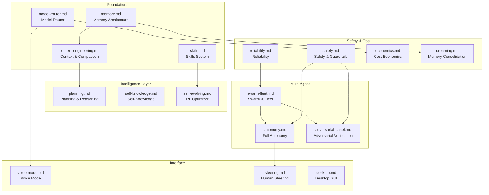

# Lyra Innovation Docs

> Paper-style documentation for each breakthrough module. One doc per module: Abstract, Introduction, Related Work, Method, Debate, Conclusion.

## Topic Map

## Status

| Doc | Module | Status | Plan |
|-----|--------|--------|------|
| [memory.md](memory.md) | Memory Architecture | ✅ implemented | [02-memory.md](../lyra-upgrade/plans/02-memory.md) |
| [context-engineering.md](context-engineering.md) | Context & Compaction | ✅ implemented | [03-context-compaction.md](../lyra-upgrade/plans/03-context-compaction.md) |
| [skills.md](skills.md) | Skills System | ✅ implemented | [04-skills.md](../lyra-upgrade/plans/04-skills.md) |
| [model-router.md](model-router.md) | Model Router | ✅ implemented | [05-model-router.md](../lyra-upgrade/plans/05-model-router.md) |
| [swarm-fleet.md](swarm-fleet.md) | Swarm & Fleet | ✅ implemented | [13-swarm-fleet.md](../lyra-upgrade/plans/13-swarm-fleet.md) |
| [autonomy.md](autonomy.md) | Full Autonomy | ✅ implemented | [14-autonomy.md](../lyra-upgrade/plans/14-autonomy.md) |
| [deep-research.md](deep-research.md) | Deep Research | ✅ implemented | [15-deep-research.md](../lyra-upgrade/plans/15-deep-research.md) |
| [adversarial-panel.md](adversarial-panel.md) | Adversarial Panel | ✅ implemented | [25-adversarial-panel.md](../lyra-upgrade/plans/25-adversarial-panel.md) |
| [voice-mode.md](voice-mode.md) | Voice Mode | ✅ implemented | [18-voice-mode.md](../lyra-upgrade/plans/18-voice-mode.md) |
| [safety.md](safety.md) | Safety & Guardrails | ✅ implemented | [17-safety.md](../lyra-upgrade/plans/17-safety.md) |
| [dreaming.md](dreaming.md) | Memory Consolidation | ✅ implemented | [24-dreaming.md](../lyra-upgrade/plans/24-dreaming.md) |
| [self-knowledge.md](self-knowledge.md) | Self-Knowledge | ✅ implemented | [19-self-knowledge.md](../lyra-upgrade/plans/19-self-knowledge.md) |
| [planning.md](planning.md) | Planning Layer | ✅ implemented | [20-planning.md](../lyra-upgrade/plans/20-planning.md) |
| [economics.md](economics.md) | Cost Economics | ✅ implemented | [21-economics.md](../lyra-upgrade/plans/21-economics.md) |
| [steering.md](steering.md) | Human Steering | ✅ implemented | [22-steering.md](../lyra-upgrade/plans/22-steering.md) |
| [reliability.md](reliability.md) | Reliability | ✅ implemented | [16-reliability.md](../lyra-upgrade/plans/16-reliability.md) |
| [self-evolving.md](self-evolving.md) | RL Optimizer | ✅ implemented | [27-rl-optimizer.md](../lyra-upgrade/plans/27-rl-optimizer.md) |
| [harness-engineering.md](harness-engineering.md) | Harness Engineering | ✅ implemented | [26-harness-engineering.md](../lyra-upgrade/plans/26-harness-engineering.md) |
| [desktop.md](desktop.md) | Desktop GUI | 🟡 stub | [28-desktop.md](../lyra-upgrade/plans/28-desktop.md) |
| [rmux.md](rmux.md) | Terminal Layer | ✅ implemented | [51-rmux.md](../lyra-upgrade/plans/51-rmux.md) |

## Reading Order

1. **Start here**: [memory.md](memory.md) — the foundation everything builds on
2. **How Lyra thinks**: [context-engineering.md](context-engineering.md) → [planning.md](planning.md)
3. **How Lyra learns**: [skills.md](skills.md) → [self-evolving.md](self-evolving.md) → [dreaming.md](dreaming.md)
4. **How Lyra scales**: [swarm-fleet.md](swarm-fleet.md) → [autonomy.md](autonomy.md) → [adversarial-panel.md](adversarial-panel.md)
5. **How Lyra stays safe**: [safety.md](safety.md) → [reliability.md](reliability.md) → [self-knowledge.md](self-knowledge.md)
6. **How you interact**: [voice-mode.md](voice-mode.md) → [steering.md](steering.md) → [desktop.md](desktop.md)
7. **What it costs**: [model-router.md](model-router.md) → [economics.md](economics.md)

## Template

Every doc follows the same structure:
- **Abstract** (150-250 words)
- **Introduction** (problem + intuition callout + contribution list)
- **Related Work** (comparison table, cited from notes/)
- **Method** (code-grounded, ≥1 Mermaid diagram + ≥1 table)
- **Debate** (trade-off table from DEBATE_LEDGER.md)
- **Conclusion** (real measurements, limitations, future work)
