# Lyra Innovation Docs

> Paper-style documentation for each breakthrough module. One doc per module: Abstract, Introduction, Related Work, Method, Debate, Conclusion.

These documents serve as the canonical reference for Lyra's architecture decisions. Every doc follows the same structure: an Abstract summarizing the contribution, an Introduction with an intuition callout, a Related Work section grounded in cited papers and books, a Method section anchored to real code paths, a Debate section recording the trade-offs and rejected alternatives, and a Conclusion with honest limitations and future work. The goal is to capture *why* Lyra is built the way it is -- not just what it does.

## Topic Map

The innovation docs are organized into six topical clusters. Arrows show primary dependencies -- reading a doc's dependencies first will give you the full picture.

```mermaid
%%{init: {'theme': 'base', 'themeVariables': {
  'primaryColor': '#7c3aed',
  'primaryTextColor': '#e2e8f0',
  'primaryBorderColor': '#a78bfa',
  'lineColor': '#818cf8',
  'secondaryColor': '#1e293b',
  'tertiaryColor': '#0f172a',
  'background': '#0d0d1a',
  'mainBkg': '#1e293b',
  'nodeBorder': '#6366f1',
  'clusterBkg': '#111827',
  'clusterBorder': '#4f46e5',
  'titleColor': '#c084fc',
  'edgeLabelBackground': '#1e293b',
  'nodeTextColor': '#e2e8f0',
  'fontSize': '14px'
}}}%%
graph TD
    subgraph Foundation["Foundation"]
        MEM["Memory 3-Tier + Dream Engine"]
        CTX["Context Engineering<br/>Workspace Report + Compaction"]
        SKL["Skills Registry + Executor"]
        RTR["Model Router<br/>Static + Learned"]
    end

    subgraph Execution["Execution & Tools"]
        TOOL["Tools<br/>Registry + Sandbox"]
        MCP["MCP Protocol<br/>Client + Server"]
        PLUG["Plugins<br/>Protocol + Gateway"]
        HOOK["Hooks<br/>Lifecycle Events"]
        CMD["Commands<br/>Slash Dispatcher"]
    end

    subgraph Safety["Safety & Governance"]
        SAFE["Safety 5-Layer<br/>Defense Pipeline"]
        PERM["Permissions<br/>Access Control"]
        RELI["Reliability<br/>Retry + CB + Ckpt"]
        HARN["Harness Engineering<br/>Governance Framework"]
    end

    subgraph Intelligence["Intelligence"]
        PLAN["Planning<br/>Reflexion + MCTS"]
        DEEP["Deep Research<br/>5-Phase Pipeline"]
        DREAM["Dreaming<br/>Idle Consolidation"]
        ADV["Adversarial Panel<br/>Multi-Agent Debate"]
        SKNOW["Self-Knowledge<br/>Introspection"]
        RLEVO["RL Optimizer<br/>Gene Evolution"]
    end

    subgraph MultiAgent["Multi-Agent & Orchestration"]
        SWRM["Swarm Fleet<br/>Supervisor + Worktree"]
        AUTO["Autonomy<br/>Loop + Recovery"]
        SES["Sessions<br/>DB Persistence"]
        ING["Ingestion<br/>Doc Pipeline"]
        AMESH["AgentsMesh<br/>P2P Networking"]
        RMX["RMUX<br/>Terminal Mux"]
    end

    subgraph Interface["Interface & UX"]
        UI["UI/UX<br/>Themes + Keybinding"]
        STEE["Steering<br/>Human-in-Loop"]
        DESK["Desktop<br/>Electron Shell"]
        VOICE["Voice Mode<br/>STT-LLM-TTS"]
    end

    subgraph Economics["Economics"]
        ECON["Economics<br/>Budget + Routing"]
    end

    MEM --> CTX
    MEM --> DREAM
    CTX --> PLAN
    SKL --> RLEVO
    RTR --> ECON
    RTR --> VOICE
    SWRM --> AUTO
    SWRM --> STEE
    SAFE --> AUTO
    RELI --> SWRM
    HOOK --> SAFE
    HOOK --> PERM
    PERM --> SAFE
    TOOL --> MCP
    MCP --> PLUG
    SES --> SWRM
    UI --> DESK
    UI --> STEE
    SWRM --> ADV
    DEEP --> ADV
    SES --> ING
    HARN --> SAFE
    HARN --> RELI
    SWRM --> AMESH
    SWRM --> RMX
    CMD --> UI
    ECON --> RTR
    SKNOW --> PLAN
```

## Status

All innovation docs describe modules at **Partially implemented** status. The core foundations (memory, skills, model router, hooks, tools) have the most mature codebases; the breakthrough layers (agentsmesh, self-evolving, voice, rmux) exist as working stubs or scaffolded architecture with the headline features deferred.

| Topic | Status | Doc | Plan | Priority |
|-------|--------|-----|------|----------|
| Memory Architecture | Partially implemented | [memory.md](memory.md) | [02-memory.md](../lyra-upgrade/plans/02-memory.md) | P0 |
| Context Engineering | Partially implemented | [context-engineering.md](context-engineering.md) | [03-context-compaction.md](../lyra-upgrade/plans/03-context-compaction.md) | P0 |
| Skills System | Partially implemented | [skills.md](skills.md) | [04-skills.md](../lyra-upgrade/plans/04-skills.md) | P0 |
| Model Router | Partially implemented | [model-router.md](model-router.md) | [05-model-router.md](../lyra-upgrade/plans/05-model-router.md) | P0 |
| Tools | Partially implemented | [tools.md](tools.md) | [06-tools.md](../lyra-upgrade/plans/06-tools.md) | P0 |
| Hooks | Partially implemented | [hooks.md](hooks.md) | [10-hooks.md](../lyra-upgrade/plans/10-hooks.md) | P0 |
| Sessions | Partially implemented | [sessions.md](sessions.md) | [11-sessions.md](../lyra-upgrade/plans/11-sessions.md) | P0 |
| Safety & Guardrails | Partially implemented | [safety.md](safety.md) | [17-safety.md](../lyra-upgrade/plans/17-safety.md) | P1 |
| Permissions | Partially implemented | [permissions.md](permissions.md) | [12-permissions.md](../lyra-upgrade/plans/12-permissions.md) | P1 |
| Reliability | Partially implemented | [reliability.md](reliability.md) | [16-reliability.md](../lyra-upgrade/plans/16-reliability.md) | P1 |
| Swarm Fleet | Partially implemented | [swarm-fleet.md](swarm-fleet.md) | [13-swarm-fleet.md](../lyra-upgrade/plans/13-swarm-fleet.md) | P1 |
| Autonomy | Partially implemented | [autonomy.md](autonomy.md) | [14-autonomy.md](../lyra-upgrade/plans/14-autonomy.md) | P1 |
| UI/UX | Partially implemented | [ui-ux.md](ui-ux.md) | [01-ui-ux.md](../lyra-upgrade/plans/01-ui-ux.md) | P1 |
| Economics | Partially implemented | [economics.md](economics.md) | [21-economics.md](../lyra-upgrade/plans/21-economics.md) | P1 |
| Planning | Partially implemented | [planning.md](planning.md) | [20-planning.md](../lyra-upgrade/plans/20-planning.md) | P1 |
| Steering | Partially implemented | [steering.md](steering.md) | [22-steering.md](../lyra-upgrade/plans/22-steering.md) | P1 |
| Commands | Partially implemented | [commands.md](commands.md) | [09-commands.md](../lyra-upgrade/plans/09-commands.md) | P1 |
| MCP | Partially implemented | [mcp.md](mcp.md) | [08-mcp.md](../lyra-upgrade/plans/08-mcp.md) | P1 |
| Plugins | Partially implemented | [plugins.md](plugins.md) | [07-plugins.md](../lyra-upgrade/plans/07-plugins.md) | P1 |
| Dreaming | Partially implemented | [dreaming.md](dreaming.md) | [24-dreaming.md](../lyra-upgrade/plans/24-dreaming.md) | P2 |
| Deep Research | Partially implemented | [deep-research.md](deep-research.md) | [15-deep-research.md](../lyra-upgrade/plans/15-deep-research.md) | P2 |
| Adversarial Panel | Partially implemented | [adversarial-panel.md](adversarial-panel.md) | [25-adversarial-panel.md](../lyra-upgrade/plans/25-adversarial-panel.md) | P2 |
| Self-Knowledge | Partially implemented | [self-knowledge.md](self-knowledge.md) | [19-self-knowledge.md](../lyra-upgrade/plans/19-self-knowledge.md) | P2 |
| RL Optimizer | Partially implemented | [self-evolving.md](self-evolving.md) | [27-rl-optimizer.md](../lyra-upgrade/plans/27-rl-optimizer.md) | P2 |
| Harness Engineering | Partially implemented | [harness-engineering.md](harness-engineering.md) | [26-harness-engineering.md](../lyra-upgrade/plans/26-harness-engineering.md) | P2 |
| Desktop | Partially implemented | [desktop.md](desktop.md) | [28-desktop.md](../lyra-upgrade/plans/28-desktop.md) | P2 |
| Voice Mode | Partially implemented | [voice-mode.md](voice-mode.md) | [18-voice-mode.md](../lyra-upgrade/plans/18-voice-mode.md) | P2 |
| Ingestion | Partially implemented | [ingestion.md](ingestion.md) | [23-ingestion.md](../lyra-upgrade/plans/23-ingestion.md) | P2 |
| RMUX | Partially implemented | [rmux.md](rmux.md) | [51-rmux.md](../lyra-upgrade/plans/51-rmux.md) | P3 |
| AgentsMesh | Partially implemented | [agentsmesh.md](agentsmesh.md) | [52-agentsmesh.md](../lyra-upgrade/plans/52-agentsmesh.md) | P3 |

### Priority key

- **P0** -- Foundation: the core abstractions every other module depends on. These must ship first.
- **P1** -- Important: safety, orchestration, and user-interaction modules that deliver production value.
- **P2** -- Advanced: consolidation, verification, and specialized interfaces built on the P0/P1 foundation.
- **P3** -- Stretch: distributed networking and terminal infrastructure deferred to v2.

## Suggested Reading Order

Start with the foundation, then follow the dependency chain for your area of interest.

### Core path (read everything)

1. **[memory.md](memory.md)** -- The 3-tier memory architecture, field-theoretic consolidation, and dream engine. Everything in Lyra reads and writes memory.
2. **[context-engineering.md](context-engineering.md)** -- WorkspaceReport M_t, compaction strategies, headroom bridge, and ANX 3EX protocol. How Lyra keeps the context window bounded.
3. **[skills.md](skills.md)** -- The skill registry, parser, dependency graph, and executor. How Lyra loads and chains reusable instructions.
4. **[model-router.md](model-router.md)** -- The provider abstraction, static three-tier router, and memory-augmented routing. How Lyra chooses which model to call.
5. **[hooks.md](hooks.md)** -- The lifecycle event system. How safety, permissions, and observability intercept the agent loop.
6. **[tools.md](tools.md)** -- The tool registry, executor, sandbox, and built-in tools. How Lyra gives agents safe access to the outside world.
7. **[sessions.md](sessions.md)** -- SQLite-backed persistence and replay. How sessions survive crashes and enable checkpointing.

### Safety path (after Core)

8. **[safety.md](safety.md)** -- The 5-layer defense pipeline and evolution guardrail. How every tool call is scanned, gated, and monitored.
9. **[permissions.md](permissions.md)** -- The deny-first permission manager and scope system. How tool access is controlled per session.
10. **[reliability.md](reliability.md)** -- Retry with jitter, circuit breaker, and checkpoint-based recovery. How Lyra handles failures gracefully.
11. **[harness-engineering.md](harness-engineering.md)** -- The attestation system, SABER mutation gate, and eval harness. Meta-discipline of the governance architecture.

### Multi-agent path (after Core + Safety)

12. **[swarm-fleet.md](swarm-fleet.md)** -- The supervisor daemon, worktree isolation, orchestrator-worker pattern, and agent registry. How Lyra runs many sessions in parallel.
13. **[autonomy.md](autonomy.md)** -- The autonomy loop and escalating crash recovery. How sessions run unattended.
14. **[steering.md](steering.md)** -- The SteerPanel, ApprovalGate, and InterruptHandler. How humans guide agents by exception.
15. **[adversarial-panel.md](adversarial-panel.md)** -- The 5-lens verification panel and identity anonymizer. How outputs are debated before acceptance.
16. **[dreaming.md](dreaming.md)** -- Idle-time consolidation, field-theoretic memory, and the DreamBank. How memory stays clean and connected.

### Intelligence path (after Core)

17. **[planning.md](planning.md)** -- The ReflexionLoop with lesson extraction. How Lyra learns from experience and plans ahead.
18. **[deep-research.md](deep-research.md)** -- The 5-phase research pipeline and Karpathy-style auto-research loop. How Lyra conducts multi-source research.
19. **[self-knowledge.md](self-knowledge.md)** -- The IntrospectionEngine for capability awareness. How Lyra knows what it knows.
20. **[self-evolving.md](self-evolving.md)** -- The GEPA gradient-free evolution loop and misevolution guardrails. How Lyra improves its own skills.
21. **[economics.md](economics.md)** -- The BudgetController, tier router, and effort manager. How Lyra tracks and optimizes costs.

### Interface path (after Core)

22. **[ui-ux.md](ui-ux.md)** -- The theme system, keybinding manager, status bar, fleet view, and rendering pipeline. How the terminal interface works.
23. **[commands.md](commands.md)** -- The slash command dispatcher and built-in commands. How `/model`, `/help`, and custom commands route.
24. **[desktop.md](desktop.md)** -- The Electron GUI shell, chat view, fleet view, and skills hub. How Lyra works outside the terminal.
25. **[voice-mode.md](voice-mode.md)** -- The cascaded STT-LLM-TTS pipeline and full-duplex state machine. How Lyra listens and speaks.
26. **[rmux.md](rmux.md)** -- The terminal multiplexer data model and stub integration. How sessions survive terminal detachment.

### Infrastructure path (after Multi-agent)

27. **[plugins.md](plugins.md)** -- The Plugin protocol, PluginManager, MCP gateway, and Wasla bridge. How Lyra is extended.
28. **[mcp.md](mcp.md)** -- The stdio transport, enterprise gateway, security scanner, and server-side tools. How Lyra consumes and exposes MCP tools.
29. **[agentsmesh.md](agentsmesh.md)** -- The bridge stub for peer-to-peer agent networking. How agents discover each other (v2).
30. **[ingestion.md](ingestion.md)** -- The document pipeline, chunker, and embedding protocols. How Lyra processes knowledge base documents.

## Cross-References

### Back to main

- [Lyra Project README](../../README.md) -- Project overview, setup, and usage.

### Related doc sets

- [Lyra Upgrade Plans](../lyra-upgrade/README.md) -- Detailed workstream plans for each module. Every innovation doc links to its corresponding plan file.
- [Lyra Upgrade Findings](../lyra-upgrade/findings.md) -- Cross-cutting research findings and evidence synthesis that informed the architecture.
- [Source Ledger](../lyra-upgrade/source-ledger.md) -- Complete bibliography of every paper, book, and web source cited across all innovation docs.
- [Architecture Debate](../lyra-upgrade/ARCHITECTURE-DEBATE.md) -- Record of the major architectural debates and their resolutions.
- [Master Plan](../lyra-upgrade/MASTER-PLAN.md) -- The overall upgrade roadmap and milestone tracking.
- [Progress](../lyra-upgrade/PROGRESS.md) -- Current implementation progress across all workstreams.

### Key source directories

- `src/lyra/memory/` -- Memory, dreaming, field-theoretic memory
- `src/lyra/context/` -- Context engineering, compaction, headroom
- `src/lyra/skills/` -- Skills registry, parser, executor
- `src/lyra/routing/` -- Model router, learned router, memory-augmented router, provider adapters
- `src/lyra/hooks/` -- Hook engine, registry, built-in handlers
- `src/lyra/tools/` -- Tool registry, executor, sandbox, built-in tools
- `src/lyra/sessions/` -- Session manager, replay
- `src/lyra/safety/` -- Safety pipeline, evolution guard, mutation gate
- `src/lyra/permissions/` -- Permission manager, scope manager
- `src/lyra/reliability/` -- Retry, circuit breaker, checkpoint manager
- `src/lyra/attestor/` -- Claim attestation system
- `src/lyra/verification/` -- Adversarial panel, anonymizer, eval harness
- `src/lyra/supervisor/` -- Supervisor daemon, session store
- `src/lyra/worktree/` -- Worktree manager, lyrainclude
- `src/lyra/orchestrator/` -- Orchestrator agent, worker pool
- `src/lyra/agents/` -- Agent base class, specialist agents, unified registry
- `src/lyra/steering/` -- Steer panel, approval gate, interrupt handler
- `src/lyra/autonomy/` -- Autonomy loop, crash recovery
- `src/lyra/commands/` -- Command dispatcher, built-in commands
- `src/lyra/plugins/` -- Plugin manager, MCP gateway, Wasla bridge
- `src/lyra/mcp/` -- MCP transport, gateway, security scanner
- `src/lyra/economics/` -- Budget controller, provider cost records
- `src/lyra/effort/` -- Effort manager, level mapping
- `src/lyra/research/` -- Deep research pipeline, auto-research loop
- `src/lyra/self_knowledge/` -- Introspection engine
- `src/lyra/rl_optimizer/` -- GEPA optimizer, evolution guard, harness tree
- `src/lyra/voice/` -- Voice pipeline, duplex handler, STT/TTS, bilingual
- `src/lyra/ingestion/` -- Document pipeline, chunker
- `src/lyra/desktop/` -- Desktop config, window management stubs
- `src/lyra/rmux/` -- RMUX integration stub
- `src/lyra/agents_mesh/` -- AgentsMesh bridge stub
- `src/ui/` -- Terminal UI (Ink), Desktop UI (Electron), transport gateway
