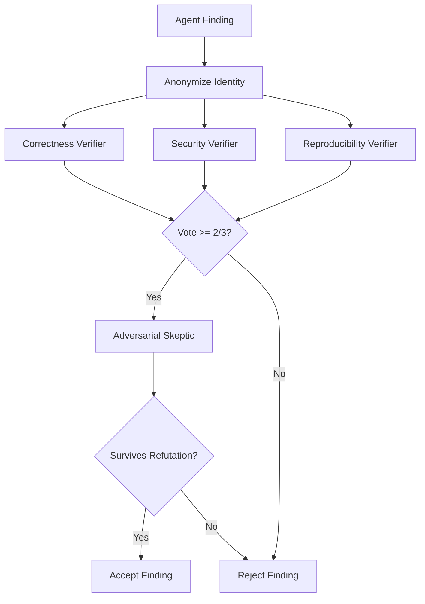

# Adversarial Verification Panel: 3-Verifier + Skeptic with Anonymization
> **Status:** ✅ Implemented | [Plan](../lyra-upgrade/plans/25-adversarial-panel.md) | [Code](../../src/lyra/verification/)

## Abstract
Lyra's adversarial verification panel redesigns the single-pass verifier as a multi-agent panel: 3 specialized verifiers (Correctness, Security, Reproducibility) + 1 Adversarial Skeptic tasked with refutation. Two bias corrections are mandatory: response anonymization (strip identity markers, from "When Identity Skews Debate," 2510.07517) and ReTAS dialectical alignment (Thesis-Antithesis-Synthesis, from Actor-Observer Asymmetry, 2604.19548). A finding survives only if ≥2/3 verifiers confirm after adversarial challenge. Collusion detection monitors for the "Lying with Truths" pattern (truthful evidence fragments steering beliefs, 2601.01685).

## Method

## Working Flow

An agent finishes a task and says, "I fixed the SQL injection." Before Lyra acts on it, the adversarial panel in `src/lyra/verification/panel.py` processes the finding. It's anonymized first — no telling who wrote it.

Three specialized verifiers check different angles. Correctness looks at the logic. Security checks for remaining holes. Reproducibility confirms the fix applies cleanly. If fewer than 2 of 3 agree, the finding is rejected. If it passes, an Adversarial Skeptic tries to tear it down — hunting for edge cases and misleading fragments. Only findings that survive both rounds are accepted.

**Example:** An agent claims it patched a race condition.
1. Finding is anonymized.
2. Correctness verifier passes the synchronization logic.
3. Security verifier spots a new deadlock — flags it.
4. Reproducibility verifier confirms the patch applies.
5. Vote is 2/3 → forwarded to the Skeptic.
6. Skeptic confirms the deadlock is plausible → finding REJECTED.
7. Agent revises and resubmits.

## Conclusion
Implemented: 3-verifier panel, Skeptic role, anonymization, voting threshold. Core: `src/lyra/verification/panel.py`. Future: collusion detection automation, dynamic panel sizing based on finding criticality.
