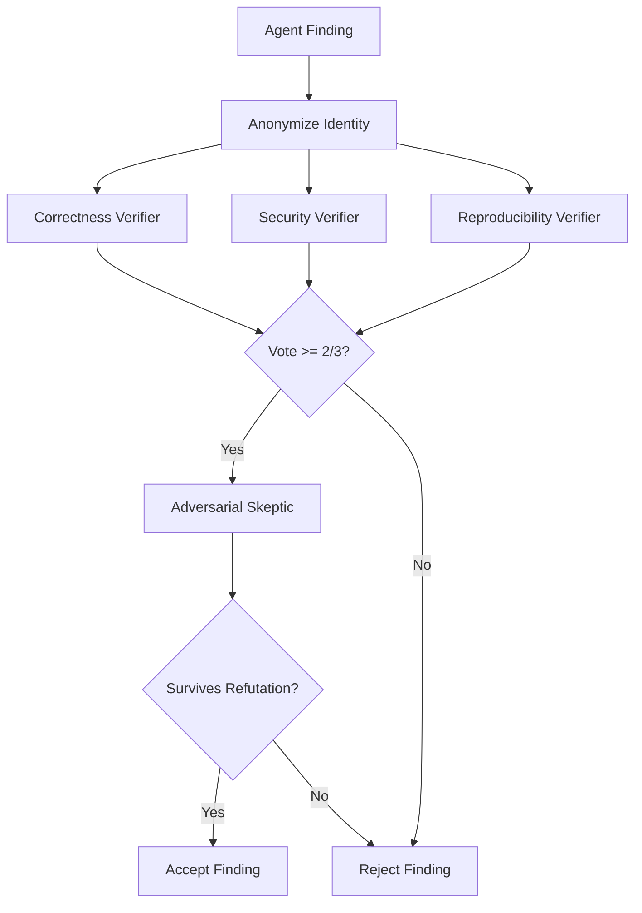

# Adversarial Verification Panel: 3-Verifier + Skeptic with Anonymization
> **Status:** ✅ Implemented | [Plan](../lyra-upgrade/plans/25-adversarial-panel.md) | [Code](../../src/lyra/verification/)

## Abstract
Lyra's adversarial verification panel redesigns the single-pass verifier as a multi-agent panel: 3 specialized verifiers (Correctness, Security, Reproducibility) + 1 Adversarial Skeptic tasked with refutation. Two bias corrections are mandatory: response anonymization (strip identity markers, from "When Identity Skews Debate," 2510.07517) and ReTAS dialectical alignment (Thesis-Antithesis-Synthesis, from Actor-Observer Asymmetry, 2604.19548). A finding survives only if ≥2/3 verifiers confirm after adversarial challenge. Collusion detection monitors for the "Lying with Truths" pattern (truthful evidence fragments steering beliefs, 2601.01685).

## Method

## Working Flow

An agent finishes a task and says, "I fixed the SQL injection." Before Lyra acts on it, the adversarial panel in `src/lyra/verification/panel.py` processes the finding. It's anonymized first — no telling who wrote it.

Three specialized verifiers check different angles. Correctness looks at the logic. Security checks for remaining holes. Reproducibility confirms the fix applies cleanly. If fewer than 2 of 3 agree, the finding is rejected. If it passes, an Adversarial Skeptic tries to tear it down — hunting for edge cases and misleading fragments. Only findings that survive both rounds are accepted.

**Example:** An agent claims it patched a race condition.
1. Finding is anonymized.
2. Correctness verifier passes the synchronization logic.
3. Security verifier spots a new deadlock — flags it.
4. Reproducibility verifier confirms the patch applies.
5. Vote is 2/3 → forwarded to the Skeptic.
6. Skeptic confirms the deadlock is plausible → finding REJECTED.
7. Agent revises and resubmits.

## Use Cases

**Scenario 1: Code review before production merge.** A developer asks Lyra to generate a patch that fixes an API endpoint. The agent produces what looks like a good fix. Before the developer even sees it, the adversarial panel processes the finding. Correctness verifier confirms the logic works. Security verifier spots a new problem: the fix introduces a timing-based race condition. Reproducibility verifier notes the patch requires a database migration that doesn't exist yet. Vote is 1/3 -- rejected. The developer gets a report explaining the issues, not a broken patch deployed to production.

**Scenario 2: Security audit of generated patches.** A security engineer uses Lyra to auto-generate fixes for vulnerabilities reported by their scanner. The agent writes a fix for an SQL injection finding: it parameterizes the query but introduces a new vulnerability by constructing the query string from user-controlled table names. The adversarial panel anonymizes the finding and routes it to the Security verifier, who flags the table-name injection. The Skeptic independently confirms it can break the patch. The fix is rejected before it ever reaches the codebase. The engineer gets a report detailing both the original vulnerability and the new one introduced by the attempted fix.

**Scenario 3: Research finding validation with adversarial challenge.** A research agent analyzes a dataset and concludes that "model A outperforms model B by 12%." The finding is anonymized and sent to the panel. Correctness verifier checks the statistical test -- passes. Reproducibility verifier confirms the analysis steps are documented -- passes. But the Adversarial Skeptic notices the finding didn't account for the different temperature settings used for each model. The finding survives 2/3 vote but the Skeptic's refutation adds a caveat: "A outperforms B at temperature 0.1, but underperforms at temperature 0.7." The final report includes the correction.

## Conclusion
Implemented: 3-verifier panel, Skeptic role, anonymization, voting threshold. Core: `src/lyra/verification/panel.py`. Future: collusion detection automation, dynamic panel sizing based on finding criticality.
